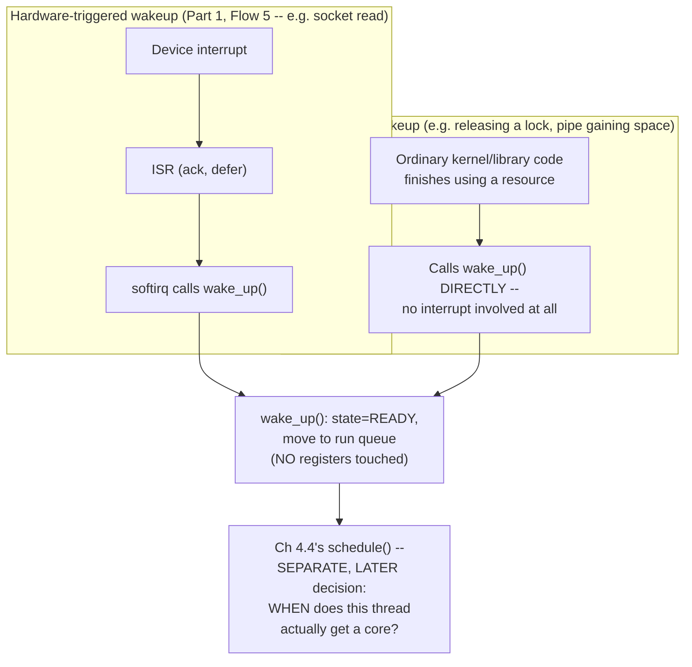

# PART 4 — Blocking I/O

## Chapter 4.5 — Wakeup

### 🧠 One-Sentence Mental Model
> "Waking up" is the exact three-decision sequence Part 1's Flow 5 already traced in full — hardware runs the ISR unconditionally, software (softirq) calls `wake_up()` to move a thread from BLOCKED to READY, and the scheduler separately, later, decides WHEN that ready thread actually gets a core — and this chapter's only job is to confirm that generic blocking (Chapters 4.1-4.4) uses this identical sequence, regardless of what specifically triggered it.

### 🧒 Explain Like I'm Five
Being told "you're allowed back in the game now" is not the same as actually being back in the game — there's a real gap between "someone opened the door for you" and "you're the one actually playing right now." Waking a thread up is exactly the first part: it makes the thread *eligible* again. Whether it starts running THIS instant or has to wait a little depends on who else is also waiting to play.

### 🌍 Real-World Analogy
A restaurant host crossing your name off the waitlist and calling "table's ready" is not the same as you actually sitting down and being served — you still have to walk over, and if the host is mid-conversation with someone else, there's a real (if usually brief) delay. "Ready" and "seated" are genuinely different moments, made by different people (the host who calls you vs. you walking over), exactly mirroring `wake_up()` (softirq) vs. `schedule()` actually restoring your context.

### ❓ The Problem
Chapters 4.1-4.4 built up "a thread blocks, and it's later woken." This chapter asks precisely: woken by WHAT, mechanically, and is "woken" the same as "running again"?

### 🔥 Why This Problem Matters
Confusing "woken" with "running" leads directly to wrong assumptions about latency — the gap between an event occurring and your thread's next line of code actually executing can be measurably non-zero under load, and knowing exactly where that gap lives (scheduler queuing delay, Chapter 2.8, not the wakeup call itself) is essential for reasoning about tail latency (a concept fully developed in Part 23).

### 🕰 Historical Context
This is not new machinery — it's the exact mechanism first fully traced in Part 1's Flow 5 (interrupt → APIC → IDT → ISR → softirq → `wake_up()` → scheduler → resume) for a hardware-triggered case (a NIC/SSD interrupt), and reused, unchanged, for every other kind of wakeup event covered since: a pipe gaining buffer space (Chapter 3.7), a lock being released, a timer firing. The wait-queue/`wake_up()` API was deliberately designed once, generically, precisely so every subsystem in the kernel could reuse it rather than inventing its own blocking primitive.

### 💡 The Naive Solution
Assume "the interrupt wakes the thread directly" — i.e., collapse the whole chain into one imagined atomic event.

### ❌ Why the Naive Solution Fails
It hides the real, separately-schedulable delay between "eligible" and "running," which is exactly the delay real latency-sensitive systems (Part 21-22) spend enormous engineering effort minimizing — you cannot optimize a gap you don't know exists.

### ✅ The Better Solution
Keep the three decisions strictly separate, exactly as Part 1 first laid them out, and recognize that EVERY blocking wakeup in this course — hardware-triggered or not — follows this same shape.

### 🧠 Core Concept
> **`wake_up(wait_queue)` does exactly one thing: for each thread on that specific wait queue, flip its `task_struct.state` to `TASK_RUNNING` (or `TASK_READY`, depending on terminology) and move it from the wait queue onto the scheduler's run queue. It does NOT touch registers, and it does NOT itself run the thread — that is `schedule()`'s separate, later job (Chapter 4.4).**

### 📐 Deep Technical Explanation

**The generic, non-hardware-triggered case (a mutex or pipe, unlike Part 1's device-driven example):**

```c
// e.g. releasing a lock that another thread is blocked waiting for
void release_lock(struct lock* l) {
    l->held = false;
    wake_up(&l->wait_queue);     // <-- ordinary kernel/library code,
                                   //     called from WHATEVER thread just
                                   //     finished using the resource --
                                   //     no interrupt, no ISR, no softirq
                                   //     needed at all for this case
}

void wake_up(wait_queue_head_t* wq) {
    for (task in wq->waiters) {
        task->state = TASK_RUNNING;     // eligible now
        remove_from(wq);
        add_to(scheduler_run_queue);    // Ch 2.8's structure
    }
    // notice: NO registers touched, NO thread actually run here
}
```



**How to read this diagram:** both paths converge on the exact same `wake_up()` function and the exact same "READY, not yet running" outcome — the only difference is *what calls* `wake_up()`: a hardware interrupt chain (when a device is involved) or ordinary software (when the resource is purely in-kernel, like a lock or a pipe with newly-freed buffer space, Chapter 3.7). This is the concrete confirmation that Part 1's mechanism is genuinely general-purpose, not device-specific.

**The measurable gap, made concrete:**

```cpp
#include <thread>
#include <chrono>
#include <mutex>
#include <condition_variable>
#include <iostream>

int main() {
    std::mutex m;
    std::condition_variable cv;
    bool ready = false;
    std::chrono::steady_clock::time_point wake_call_time, resumed_time;

    std::thread waiter([&] {
        std::unique_lock<std::mutex> lock(m);
        cv.wait(lock, [&]{ return ready; });
        resumed_time = std::chrono::steady_clock::now();   // this line runs AFTER schedule()
    });

    std::this_thread::sleep_for(std::chrono::milliseconds(50));
    {
        std::lock_guard<std::mutex> lock(m);
        ready = true;
        wake_call_time = std::chrono::steady_clock::now();  // this is roughly the wake_up() moment
    }
    cv.notify_all();
    waiter.join();

    auto gap = std::chrono::duration<double, std::micro>(resumed_time - wake_call_time).count();
    std::cout << "wake -> actually-running gap: " << gap << " microseconds\n";
}
```

**Predict before running:** will this gap typically be exactly 0 microseconds, or measurably positive?

<details><summary>Click to reveal the answer</summary>

Measurably positive — typically a few microseconds to tens of microseconds under normal conditions (higher under CPU contention), because `wake_up()` only makes the thread READY; the scheduler still has to actually context-switch to it, which takes real, nonzero time (Chapter 2.7's context-switch cost). This is the exact, measurable proof of this chapter's core distinction: "woken" and "running" are different moments.
</details>

### ❌ Common Misconceptions
- ❌ **"wake_up() runs the thread."** — It only makes the thread eligible (`TASK_RUNNING`, moved to the run queue); actually running it is `schedule()`'s separate job, at its own next scheduling point.
- ❌ **"Only interrupts can wake a thread."** — Ordinary kernel or userspace code (releasing a lock, a pipe write freeing buffer space) calls `wake_up()` directly, with zero hardware interrupt involved.
- ❌ **"The wake-to-running gap is always negligible."** — Under load (many runnable threads competing, or all cores busy with higher-priority work), this gap can grow significantly — this is precisely why real-time scheduling classes (Chapter 2.8) exist for latency-critical work.
- ❌ **"wake_up() touches the woken thread's registers."** — It never does; registers are only touched at the two OTHER points: when originally blocking (saved) and when schedule() actually resumes the thread (restored).

### 🧙 Wizard Insight
When investigating a mysterious tail-latency spike in a system that "shouldn't" be slow, the wake-to-running gap from this chapter is one of the first places a wizard looks — a healthy `wake_up()` call is essentially instantaneous, so a real, measurable delay almost always means the *scheduler* side (Chapter 4.4) is the bottleneck: too many runnable threads competing for too few cores, or a lower-priority thread stuck waiting behind higher-priority work. Distinguishing "the event I'm waiting for was slow to occur" from "I was ready quickly but the scheduler was slow to actually run me" requires exactly the precision this chapter insists on.

### 🧠 Quiz
**Q1.** Does wake_up() run the thread it wakes?
<details><summary>Answer</summary>No -- it only flips the thread's state to READY/RUNNING and moves it to the run queue; actually giving it a CPU core is schedule()'s separate, later decision.</details>

**Q2.** Can a thread be woken without any hardware interrupt being involved?
<details><summary>Answer</summary>Yes -- ordinary software (releasing a lock, a pipe consumer freeing buffer space) can call wake_up() directly, with no interrupt, ISR, or softirq anywhere in the picture.</details>

**Q3.** Why might the gap between "woken" and "actually running again" grow under load?
<details><summary>Answer</summary>Because schedule()'s decision of WHEN to run a ready thread depends on real scheduling policy -- how many other runnable threads are competing, their priorities, and core availability -- all of which get worse under load, independent of how quickly wake_up() itself executed.</details>

### 📌 Short Notes (Quick Reference)
- wake_up() = flip state to READY + move to run queue. It does NOT touch registers and does NOT run the thread.
- Two paths call it: hardware-triggered (interrupt → ISR → softirq → wake_up(), Part 1 Flow 5) and pure-software (lock release, pipe space freed) — same function, same outcome either way.
- "Woken" ≠ "running" — schedule() decides WHEN a ready thread actually gets a core, a separate, measurable, sometimes-nontrivial delay.
- This wake-to-running gap is where real scheduling policy (priority, fairness, core load) lives — and where real-time scheduling classes (Ch 2.8) earn their keep.
- The gap is measurable and is a key place to look when debugging unexplained tail latency (Part 23 preview).

### 🔗 What This Connects To Next
**Previous:** Part 4, Chapter 4.4 — Scheduler Interaction
**Current:** Part 4, Chapter 4.5 — Wakeup
**Next:** Part 4, Chapter 4.6 — Blocking File I/O (the first fully concrete, real-code application of everything Chapters 4.1-4.5 just built)
