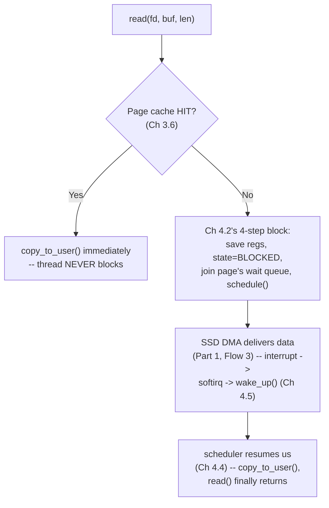

# PART 4 — Blocking I/O

## Chapter 4.6 — Blocking File I/O

### 🧠 One-Sentence Mental Model
> A blocking `read()`/`write()` on a regular file is Part 1's Flow 3/4 and Part 3's Chapter 3.6 wearing Chapter 4.2's exact four-step mechanism as its implementation whenever the requested data isn't already sitting in the page cache — this chapter is the first PROJECT chapter, turning all of that into real, running C++.

### 🧒 Explain Like I'm Five
When you ask a librarian for a book, if it's already on the front desk (page cache, Chapter 3.6), you get it instantly. If it's in the basement, you sit down and wait — you don't wander off, you don't repeatedly ask "is it ready yet," you just wait until it's handed to you. That's exactly what a blocking file `read()` does from your program's point of view.

### 🌍 Real-World Analogy
Handing your car to a valet and standing right there until they bring it back — you've committed your full attention (the thread) to this one pending task, and you'll know the instant it's done because that's the only thing you're doing.

### ❓ The Problem
So far, Chapters 4.1-4.5 explained the GENERIC blocking mechanism entirely in the abstract. This chapter asks: what does it look like as actual, compilable C++ against actual files, and what can you genuinely observe about its behavior?

### 🔥 Why This Problem Matters
File I/O is the single most common place engineers first encounter blocking behavior, and it's also the place where the "does this actually block, or does it return instantly from cache?" question (Chapter 3.6, page cache) has real, measurable consequences for benchmark design (Part 23) — a file-read benchmark that never evicts the page cache is silently measuring RAM speed, not disk speed.

### 🕰 Historical Context
The plain `read()`/`write()` syscalls used here are essentially unchanged since early Unix — this is the same interface used in the 1970s, deliberately kept small and uniform (Chapter 3.5's VFS philosophy) so that decades of subsequent kernel internals (page cache, NVMe, `io_uring`) could evolve underneath it without breaking a single line of application code written against it.

### 💡 The Naive Solution
Just call `read()`/`write()` directly, exactly as documented, and trust the kernel to block correctly when needed.

### ❌ Why the Naive Solution Fails
It doesn't fail for correctness — blocking file I/O is entirely correct and appropriate for single-file, single-threaded work. It "fails" only in the sense Chapter 4.1 already flagged: if your program needs to do this concurrently for MANY files/connections at once, one blocking call per operation means one thread tied up per operation (Chapters 4.8-4.9 make this concrete and costly).

### ✅ The Better Solution (for THIS chapter's scope)
For a single sequential task, blocking file I/O IS the better solution — simple, correct, cheap. This chapter's C++ project demonstrates exactly that, plus how to deliberately observe the cache-hit vs. cache-miss distinction.

### 🧠 Core Concept
> **`read()`/`write()` on a regular file dispatch through the file's `file_operations` (Chapter 3.4) to the regular-file implementation, which checks the page cache first (Chapter 3.6); on a hit, it returns essentially immediately with zero blocking; on a miss, it executes the full four-step blocking sequence from Chapter 4.2, is woken via Chapter 4.5's mechanism once the SSD's DMA engine (Part 1) delivers the data, and only then returns.**

### 📐 Deep Technical Explanation



### 🔌 Syscalls / APIs — Syntax First

Before the project code, here is exactly what each call means, argument by argument — read this section BEFORE the code below, not after.

```c
int open(const char *pathname, int flags, ... /* mode_t mode */);
```
- **pathname** — the file path, absolute or relative to the process's current working directory.
- **flags** — a bitwise-OR'd set of constants that controls how the file is opened. The three you MUST pick exactly one of:
  - `O_RDONLY` — open for reading only (what this chapter's reader uses).
  - `O_WRONLY` — open for writing only.
  - `O_RDWR` — open for both.

  Additional flags you OR in on top of one of the three above:
  - `O_CREAT` — create the file if it doesn't exist (requires the third `mode` argument, e.g. `0644`, the Unix permission bits for the new file).
  - `O_TRUNC` — if the file exists, truncate it to zero length on open (common with `O_WRONLY`).
  - `O_APPEND` — every write() atomically seeks to the end of the file first — this is what makes multiple processes safely append to a shared log file without corrupting each other's writes.
  - `O_NONBLOCK` — return immediately instead of blocking if the open itself would block (relevant for FIFOs/devices; largely irrelevant for regular files) — this is Part 5's flag, previewed here because it's the same `open()` call.
- **Return value** — a new file descriptor (Chapter 3.1) on success, or `-1` with `errno` set on failure (e.g., `ENOENT` if the path doesn't exist and `O_CREAT` wasn't given).

```c
ssize_t read(int fd, void *buf, size_t count);
ssize_t write(int fd, const void *buf, size_t count);
```
- **fd** — the file descriptor from `open()`.
- **buf** — a pointer to a buffer YOU own and allocated — the kernel copies bytes into it (`read`) or out of it (`write`); it never allocates this buffer for you.
- **count** — the MAXIMUM number of bytes to transfer, not a guarantee — both calls may transfer FEWER bytes than requested (a "short read/write") even without an error; this is why the project code below loops.
- **Return value** — the number of bytes actually transferred (`0` from `read()` means end-of-file — not an error), or `-1` with `errno` set on failure.

```c
int close(int fd);
```
- Releases this process's fd table entry (Chapter 3.2) and decrements the underlying `struct file`'s reference count (Chapter 3.10) — the file is only truly closed once every fd pointing to it, in every process, has been closed.

**Project: a blocking file reader, timing cache-cold vs. cache-warm reads.**

```cpp
// blocking_file_reader.cpp
// Compile:  g++ -O2 -std=c++20 blocking_file_reader.cpp -o blocking_file_reader
// Run:      ./blocking_file_reader /path/to/a/large_file.bin

#include <fcntl.h>
#include <unistd.h>
#include <sys/stat.h>
#include <chrono>
#include <cstdio>
#include <vector>
#include <cstdlib>

using Clock = std::chrono::steady_clock;

double read_whole_file_ms(const char* path) {
    int fd = open(path, O_RDONLY);
    if (fd < 0) { perror("open"); exit(1); }

    struct stat st;
    fstat(fd, &st);
    std::vector<char> buf(1 << 20);   // 1MB chunks

    auto start = Clock::now();
    ssize_t n;
    size_t total = 0;
    while ((n = read(fd, buf.data(), buf.size())) > 0) {
        total += n;                     // "using" the data so the read isn't optimized away
    }
    auto elapsed = Clock::now() - start;
    close(fd);

    return std::chrono::duration<double, std::milli>(elapsed).count();
}

int main(int argc, char** argv) {
    if (argc < 2) { fprintf(stderr, "usage: %s <file>\n", argv[0]); return 1; }

    // FIRST read: likely a page-cache MISS if the file hasn't been touched
    // recently (or the cache was dropped) -- this is where Ch 4.2's blocking
    // mechanism actually engages, waiting on the SSD's DMA delivery.
    double first = read_whole_file_ms(argv[1]);
    printf("First read  (cold-ish): %.3f ms\n", first);

    // SECOND read of the SAME file: the data is now sitting in the page
    // cache (Ch 3.6) -- read() dispatches through the SAME code path, but
    // takes the cache-HIT branch every time -- no blocking at all.
    double second = read_whole_file_ms(argv[1]);
    printf("Second read (warm):     %.3f ms\n", second);

    printf("Speedup: %.1fx\n", first / second);
    return 0;
}
```

**Predict before running:** on a multi-hundred-MB file, roughly how large a speedup do you expect between the first and second read?

<details><summary>Click to reveal the answer</summary>

Commonly anywhere from 5x to 50x+ depending on storage type (spinning disk shows the largest gap; NVMe SSD a smaller but still very real one) — directly reflecting Chapter 0.2's latency table: SSD/disk access is 100x-10,000,000x slower than a RAM (page cache) hit. If you run this immediately after writing the file yourself, the FIRST read may already be a cache hit (the write left it cached) — try `sync; echo 3 | sudo tee /proc/sys/vm/drop_caches` between runs (on a system you're allowed to do this on) to force a genuine cold read and see the full effect. This is a live illustration of Chapter 0.2's numbers, not a fixed benchmark — always measure your own hardware (Part 22-23's rule).
</details>

**Why this thread's CPU usage is ~0% during a cold read:** exactly Chapter 4.3's mechanism — while blocked waiting on the SSD, this thread is entirely absent from the run queue; you can watch this directly with `top`/`htop` on a deliberately slow (e.g., network-mounted) file during a large cold read, and see the process show near-0% CPU despite clearly "doing work."

### ❌ Common Misconceptions
- ❌ **"read() on a file always hits the disk."** — Only on a page-cache miss (Chapter 3.6); a second read of recently-accessed data is essentially a RAM operation with no blocking at all.
- ❌ **"A slow file read means the CPU is busy."** — The opposite is typically true — a blocked-on-disk thread shows near-0% CPU (Chapter 4.3); high CPU during file I/O usually points to something else (decompression, checksumming, excessive small reads).
- ❌ **"Benchmarking file read speed by reading the same file twice measures disk speed."** — It measures page-cache (RAM) speed the second time — a classic benchmarking mistake this chapter's project deliberately demonstrates rather than falls into.
- ❌ **"Bigger read() buffer sizes always help."** — Beyond a certain size (often a few hundred KB to a few MB, hardware-dependent) the marginal benefit flattens — always measure (Part 22-23), never assume.

### 🧙 Wizard Insight
The "read it twice, compare timings" trick used in this chapter's experiment is one of the single most useful, low-effort diagnostic techniques in all of file-I/O performance work — it isolates whether a slow read is genuinely storage-bound or an artifact of cold caches, in about five lines of code, before reaching for any heavier profiling tool (Part 22's `strace`/`perf`).

### 🧠 Quiz
**Q1.** Why can the same read() call sometimes block for milliseconds and sometimes return in nanoseconds?
<details><summary>Answer</summary>Because whether it blocks depends entirely on whether the requested data is already in the page cache (Ch 3.6) -- a cache hit skips the blocking mechanism entirely, while a cache miss engages Ch 4.2's full four-step block/wait/wake sequence.</details>

**Q2.** What would you expect a process's CPU usage to look like (in top/htop) while it's blocked on a large cold file read from a slow device?
<details><summary>Answer</summary>Near 0% CPU -- the thread is absent from the run queue (Ch 4.3) for the duration of the block, regardless of how long the underlying I/O takes.</details>

**Q3.** Why is "read a file twice and compare timings" a meaningful experiment rather than a trivial one?
<details><summary>Answer</summary>Because it directly, empirically separates disk-speed-bound behavior (first read, cache miss) from RAM-speed-bound behavior (second read, cache hit) -- turning Chapter 0.2's abstract latency numbers into something measured on your own machine.</details>

### 📌 Short Notes (Quick Reference)
- Blocking file read() = Ch 3.6's page-cache check first; HIT returns instantly, MISS engages Ch 4.2's full block/wait/wake mechanism.
- A blocked-on-disk thread shows ~0% CPU (Ch 4.3) — slow I/O is not the same as busy CPU.
- Reading the same file twice in a row is a simple, real way to observe cache-cold vs. cache-warm timing directly.
- This is the first fully concrete C++ project chapter — everything from here through 4.9 builds toward real client/server code.
- Buffer size and I/O pattern (sequential vs. random) matter far more than raw "is it blocking or not" for real file-I/O performance — always measure (Part 22-23).

### 🔗 What This Connects To Next
**Previous:** Part 4, Chapter 4.5 — Wakeup
**Current:** Part 4, Chapter 4.6 — Blocking File I/O
**Next:** Part 4, Chapter 4.7 — Blocking Socket I/O (the SAME mechanism, applied to `accept()`/`recv()`/`send()` — the foundation for every server chapter in this course going forward)
