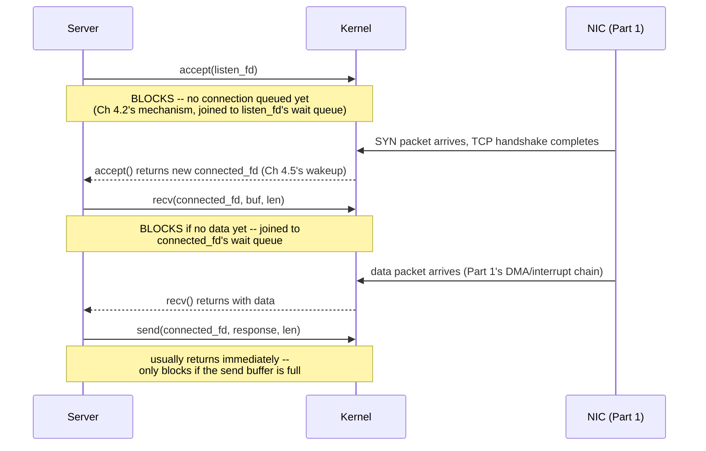

# PART 4 — Blocking I/O

## Chapter 4.7 — Blocking Socket I/O

### 🧠 One-Sentence Mental Model
> Blocking `accept()`/`recv()`/`send()` on a socket run the exact same four-step block/wait/wake mechanism as file I/O (Chapters 4.2, 4.6), just dispatched through the SOCKET `file_operations` implementation (Chapter 3.8) instead of the regular-file one — and this chapter's project is the single-threaded blocking TCP echo server every later chapter in this course (through Part 14) will keep rebuilding with progressively better concurrency strategies.

### 🧒 Explain Like I'm Five
`accept()` is like standing at a door waiting for the next customer to walk in — you don't do anything else until someone arrives. `recv()` is like waiting for that customer to actually say something once they're at your counter. Both are pure waiting, exactly like waiting for a book from the library basement (Chapter 4.6) — just waiting for a person instead of a disk.

### 🌍 Real-World Analogy
A single toll booth operator: they wait for a car to pull up (`accept()`), then wait for the driver to hand over payment (`recv()`), hand back change (`send()`), and only then are free to look for the next car. One operator, one car at a time, zero multitasking — this IS a legitimate design (Chapter 4.1) for low traffic, and it's exactly what this chapter's server does.

### ❓ The Problem
Chapter 4.6 grounded the abstract blocking mechanism in file I/O. This chapter does the same for the networking case that every server chapter for the rest of this course builds on: what does a real, minimal, correct blocking TCP server look like, and precisely where does it block?

### 🔥 Why This Problem Matters
Every socket API you'll use in Parts 5-14 (`select`, `epoll`, `io_uring`) is a variation on managing MULTIPLE instances of these exact same three calls (`accept`/`recv`/`send`) without needing one whole thread per connection. You cannot appreciate what those mechanisms buy you without first having this single-threaded baseline clearly in hand.

### 🕰 Historical Context
The Berkeley sockets API (`socket()`, `bind()`, `listen()`, `accept()`, `connect()`, `send()`, `recv()`) was introduced in 4.2BSD Unix in 1983, deliberately designed to look and feel like ordinary file descriptors (Part 3's "everything is a file" philosophy) so that existing blocking-I/O intuition (and even generic tools like `read()`/`write()`) would transfer directly to network programming with minimal new concepts.

### 💡 The Naive Solution
Write the simplest possible server: `accept()` one connection, fully serve it with blocking `recv()`/`send()` calls, `close()` it, then loop back to `accept()` the next one.

### ❌ Why the Naive Solution Fails
It's not "wrong" — it's the correct starting point — but it can only ever serve ONE client at a time; a second client that connects while the first is still being served simply waits in the kernel's connection backlog queue until the first is done, however long that takes (Chapters 4.8-4.9 fix exactly this).

### ✅ The Better Solution (this chapter's honest scope)
Build the single-connection-at-a-time server correctly and completely first — it's the necessary foundation, and it IS the right answer for genuinely low-concurrency use cases (Chapter 4.1's principle, applied).

### 🧠 Core Concept
> **`accept()` blocks until a new connection arrives in the listening socket's queue; `recv()` blocks until bytes arrive on that specific connected socket (or the peer closes it); `send()` usually does NOT block unless the kernel's send buffer is full (Chapter 3.8's backpressure). All three, when they do block, use the identical mechanism traced since Chapter 4.2 — only the specific wait queue and wakeup trigger (Part 1's NIC/DMA/interrupt chain, Chapter 3.8) differ from the file case.**

### 📐 Deep Technical Explanation



### 🔌 Syscalls / APIs — Syntax First

Every socket function used below, explained argument-by-argument BEFORE the code — this is the section to read first every time you hit an unfamiliar call in this course from here on.

```c
int socket(int domain, int type, int protocol);
```
- **domain** — which address family / protocol family to use:
  - `AF_INET` — IPv4 (what this chapter uses).
  - `AF_INET6` — IPv6.
  - `AF_UNIX` (a.k.a. `AF_LOCAL`) — a Unix domain socket, addressed by a filesystem path instead of an IP+port, used for local-machine-only IPC (faster than loopback TCP, no network stack involved at all).
- **type** — the communication style:
  - `SOCK_STREAM` — a reliable, ordered, connection-oriented byte stream (TCP over `AF_INET`) — what this chapter uses.
  - `SOCK_DGRAM` — unreliable, unordered, connectionless messages (UDP over `AF_INET`) — Part 9 covers this.
- **protocol** — almost always `0`, meaning "the default protocol for this domain+type combination" (TCP for `AF_INET`+`SOCK_STREAM`); you'd only set this explicitly for unusual cases.
- **Return value** — a new file descriptor (Chapter 3.1) whose `file_operations` (Chapter 3.4) dispatch to the socket/network-stack implementation — or `-1` on error.

```c
int setsockopt(int fd, int level, int optname, const void *optval, socklen_t optlen);
```
Configures a behavior on an already-created socket. `level` is almost always `SOL_SOCKET` for the options below (some options, like TCP-specific ones, use `IPPROTO_TCP` instead). Common `optname` values worth knowing now:
- `SO_REUSEADDR` — allows `bind()` to succeed on a port that's in the brief `TIME_WAIT` state from a just-restarted server (Part 9 explains `TIME_WAIT` fully) — without this, restarting a server quickly often fails with `EADDRINUSE`. This chapter's code sets this one.
- `SO_REUSEPORT` — allows MULTIPLE independent sockets to bind the SAME port, with the kernel load-balancing incoming connections across them — a common technique for multi-process servers to each run their own `accept()` loop without a shared listening socket (relevant again in Part 21).
- `SO_KEEPALIVE` — makes the kernel periodically probe an idle connection to detect a peer that silently vanished (network partition, crashed machine) rather than waiting forever.
- `SO_RCVBUF` / `SO_SNDBUF` — explicitly set the kernel's receive/send buffer size for this socket (Chapter 3.8's backpressure buffers) — larger buffers can improve throughput on high-latency links at the cost of memory (Part 21 quantifies this trade-off).

```c
struct sockaddr_in addr{};
addr.sin_family = AF_INET;        // must match the domain passed to socket()
addr.sin_addr.s_addr = INADDR_ANY; // "listen on every local network interface"
addr.sin_port = htons(port);       // htons() converts to network BYTE ORDER (big-endian) --
                                    // required because network protocols standardize on
                                    // big-endian regardless of the CPU's own native order
```
`htons()` ("host to network short") and its counterpart `ntohs()` exist because different CPU architectures store multi-byte integers in different byte orders (Part 1 territory) — network protocols fix ONE order (big-endian) so machines with different native orders can still communicate; forgetting this conversion is a classic bug that silently binds to the wrong port.

```c
int bind(int fd, const struct sockaddr *addr, socklen_t addrlen);
int listen(int fd, int backlog);
int accept(int fd, struct sockaddr *addr, socklen_t *addrlen);
```
- **bind()** — assigns a local address (IP + port) to the socket. Must happen before `listen()`.
- **listen()**'s **backlog** — the maximum number of FULLY-established connections the kernel will queue up, waiting for your process to `accept()` them, before it starts refusing new ones — this is exactly the queue Chapter 4.7's experiment showed a second client sitting in while the server was busy with the first.
- **accept()**'s `addr`/`addrlen` (often passed as `nullptr`/`nullptr` when you don't need it) — if non-null, filled in with the CONNECTING CLIENT's address, letting you log or filter by remote IP.
- **accept()**'s return value — a BRAND NEW file descriptor representing this one connection, distinct from the listening `fd` — the listening socket keeps listening for more connections; each accepted connection gets its own fd and, in this chapter, is handled entirely through that new fd.

```c
ssize_t recv(int fd, void *buf, size_t len, int flags);
ssize_t send(int fd, const void *buf, size_t len, int flags);
```
Behave like `read()`/`write()` (Chapter 4.6) but with a socket-specific `flags` argument — `0` for ordinary behavior (used throughout this chapter's code), or OR'd combinations of:
- `MSG_DONTWAIT` — make just THIS ONE call nonblocking, without changing the socket's overall mode — a lightweight preview of Part 5's `O_NONBLOCK`.
- `MSG_WAITALL` (recv only) — don't return until the FULL requested length has arrived (or an error/EOF occurs) — turns off the "short read" possibility for this one call.
- `MSG_PEEK` (recv only) — look at incoming data WITHOUT removing it from the socket's receive buffer — a later `recv()` will see the same bytes again.
- `MSG_NOSIGNAL` (send only, Linux) — suppress the `SIGPIPE` signal that would otherwise be raised if you `send()` to a connection the peer has already closed; you get an `EPIPE` error instead, which is far easier to handle correctly in a multi-connection server.

**Project: a minimal, correct, single-threaded blocking TCP echo server.**

```cpp
// blocking_echo_server.cpp
// Compile: g++ -O2 -std=c++20 blocking_echo_server.cpp -o blocking_echo_server
// Run:     ./blocking_echo_server 9000
// Test:    nc 127.0.0.1 9000   (type something, see it echoed back)

#include <sys/socket.h>
#include <netinet/in.h>
#include <unistd.h>
#include <cstring>
#include <cstdio>
#include <cstdlib>
#include <errno.h>

int main(int argc, char** argv) {
    int port = argc > 1 ? atoi(argv[1]) : 9000;

    int listen_fd = socket(AF_INET, SOCK_STREAM, 0);
    int opt = 1;
    setsockopt(listen_fd, SOL_SOCKET, SO_REUSEADDR, &opt, sizeof(opt));

    sockaddr_in addr{};
    addr.sin_family = AF_INET;
    addr.sin_addr.s_addr = INADDR_ANY;
    addr.sin_port = htons(port);

    if (bind(listen_fd, (sockaddr*)&addr, sizeof(addr)) < 0) { perror("bind"); return 1; }
    if (listen(listen_fd, /*backlog=*/16) < 0) { perror("listen"); return 1; }

    printf("Blocking echo server listening on port %d (one client at a time)\n", port);

    while (true) {
        // BLOCKS HERE until a client connects (Ch 4.2's mechanism,
        // joined to listen_fd's wait queue) -- this thread does
        // ABSOLUTELY NOTHING ELSE while waiting.
        int client_fd = accept(listen_fd, nullptr, nullptr);
        if (client_fd < 0) { perror("accept"); continue; }
        printf("Client connected (fd=%d)\n", client_fd);

        char buf[4096];
        ssize_t n;
        // BLOCKS HERE on each iteration until data arrives, or the
        // peer closes (recv returns 0), or an error occurs (<0).
        while ((n = recv(client_fd, buf, sizeof(buf), 0)) > 0) {
            // handle a partial write -- send() is not guaranteed to
            // write everything in one call, even though it usually does
            // for small payloads (Ch 4's "code quality" requirement)
            ssize_t sent_total = 0;
            while (sent_total < n) {
                ssize_t s = send(client_fd, buf + sent_total, n - sent_total, 0);
                if (s < 0) {
                    if (errno == EINTR) continue;   // interrupted, retry
                    perror("send");
                    goto client_done;
                }
                sent_total += s;
            }
        }
        if (n < 0) perror("recv");
    client_done:
        printf("Client disconnected (fd=%d)\n", client_fd);
        close(client_fd);
        // loop back to accept() -- ANOTHER client that connected
        // while we were busy with this one has been sitting in the
        // kernel's backlog queue this whole time (Ch 4.8 fixes this)
    }
}
```

**Predict before running:** open TWO separate `nc` connections to this server at roughly the same time. What happens to the second connection while the first client is still connected but silent (not sending anything)?

<details><summary>Click to reveal the answer</summary>

The second `nc` process will connect successfully at the TCP level (the OS's listen backlog accepts the connection into its queue), but the server's `accept()` call won't return for it until the FIRST client disconnects — because the server thread is entirely tied up inside the blocking `recv()` loop for client 1. The second client can type and hit enter, but will receive no echo until the first client goes away. This is the exact, concrete failure mode Chapter 4.1 named abstractly — visible here with nothing more than two terminal windows.
</details>

### ❌ Common Misconceptions
- ❌ **"accept() and recv() block for the same reason."** — They block on different wait queues for different events: `accept()` waits for a new completed TCP handshake; `recv()` waits for data (or closure) on an already-established connection.
- ❌ **"send() never blocks."** — It usually returns fast because the kernel buffers the data, but if that buffer is full (a slow or stalled receiver, Chapter 3.8's backpressure), `send()` blocks too, using the identical mechanism.
- ❌ **"A successful send() means the client received the data."** — It only means the KERNEL accepted the bytes into its own send buffer (Chapter 3.8) — actual delivery and receipt are separate, unconfirmed-at-this-layer events.
- ❌ **"recv() returning 0 is an error."** — It's the normal, correct signal that the peer has cleanly closed their side of the connection — a negative return value (checked via `errno`) is the actual error case.
- ❌ **"This server is 'wrong' because it only handles one client at a time."** — It's CORRECT for its stated scope; Chapter 4.1's principle applies directly — the "problem" only exists once you need real concurrency, which Chapters 4.8-4.9 address head-on.

### 🧙 Wizard Insight
This exact server — `accept()`, then a blocking `recv()`/`send()` loop, then `close()`, then loop — is the literal ancestor of every network server architecture covered for the rest of this course. Every later mechanism (threads, `select`, `epoll`, `io_uring`) is answering exactly one question about THIS code: "how do I stop the second client from waiting behind the first one?" Internalizing this server completely, including exactly where and why each call blocks, is what makes every subsequent chapter's added complexity feel motivated rather than arbitrary.

### 🧠 Quiz
**Q1.** What specific event does a blocking accept() wait for, versus what a blocking recv() waits for?
<details><summary>Answer</summary>accept() waits for a new, fully-completed incoming TCP connection to appear in the listening socket's queue; recv() waits for data to arrive (or the peer to close) on an already-established, specific connected socket.</details>

**Q2.** Does a successful send() guarantee the peer has received the data?
<details><summary>Answer</summary>No -- it only guarantees the kernel accepted the bytes into its own send buffer; actual network delivery and the peer's receipt are separate, unconfirmed events at this layer (TCP's own acknowledgment machinery, Part 9, handles delivery confirmation internally, but the application-level send() call doesn't expose it).</details>

**Q3.** Why can send() block even though it usually doesn't?
<details><summary>Answer</summary>Because it only returns without blocking as long as the kernel's send buffer has room; if the receiver is slow or stalled and the buffer fills up (Ch 3.8's backpressure), send() blocks using the identical Ch 4.2 mechanism as any other blocking call.</details>

### 📌 Short Notes (Quick Reference)
- accept()/recv()/send() block using the IDENTICAL Ch 4.2 mechanism as file I/O — only the specific wait queue and wakeup trigger differ.
- accept() waits for a new completed connection; recv() waits for data/closure on an established one; send() usually returns fast but CAN block if the send buffer is full.
- recv() returning 0 = clean peer closure (normal); negative return = real error (check errno).
- A successful send() only confirms kernel acceptance, never peer receipt.
- This single-threaded server is CORRECT for low concurrency and is the direct ancestor/baseline for every later server chapter (threads, select, epoll, io_uring) in this course.

### 🔗 What This Connects To Next
**Previous:** Part 4, Chapter 4.6 — Blocking File I/O
**Current:** Part 4, Chapter 4.7 — Blocking Socket I/O
**Next:** Part 4, Chapter 4.8 — Thread-per-connection (the first REAL fix for the "second client waits behind the first" problem just demonstrated)
