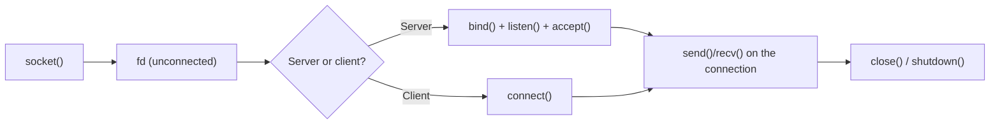
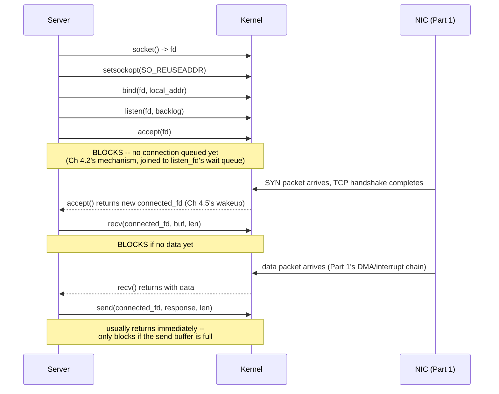

# PART 4 — Blocking I/O

## Chapter 4.7 — Blocking Socket I/O

> This chapter is written so you never need to look anything else up for socket programming basics. It's long on purpose — read it once, slowly, top to bottom, and you'll have the entire mental model plus every syscall you need for the rest of this course.

### 🧠 One-Sentence Mental Model
> Blocking `accept()`/`recv()`/`send()` on a socket run the exact same four-step block/wait/wake mechanism as file I/O (Chapters 4.2, 4.6), just dispatched through the SOCKET `file_operations` implementation (Chapter 3.8) instead of the regular-file one — and this chapter's project is the single-threaded blocking TCP echo server every later chapter in this course (through Part 14) will keep rebuilding with progressively better concurrency strategies.

### 🧒 Explain Like I'm Five
`accept()` is like standing at a door waiting for the next customer to walk in — you don't do anything else until someone arrives. `recv()` is like waiting for that customer to actually say something once they're at your counter. Both are pure waiting, exactly like waiting for a book from the library basement (Chapter 4.6) — just waiting for a person instead of a disk.

### 🌍 Real-World Analogy
A single toll booth operator: they wait for a car to pull up (`accept()`), then wait for the driver to hand over payment (`recv()`), hand back change (`send()`), and only then are free to look for the next car. One operator, one car at a time, zero multitasking — this IS a legitimate design (Chapter 4.1) for low traffic, and it's exactly what this chapter's server does.

### ❓ The Problem
Chapter 4.6 grounded the abstract blocking mechanism in file I/O. This chapter does the same for the networking case that every server chapter for the rest of this course builds on: what does a real, minimal, correct blocking TCP server (and client!) look like, and precisely where does it block?

### 🔥 Why This Problem Matters
Every socket API you'll use in Parts 5-14 (`select`, `epoll`, `io_uring`) is a variation on managing MULTIPLE instances of these exact same three calls (`accept`/`recv`/`send`) without needing one whole thread per connection. You cannot appreciate what those mechanisms buy you without first having this single-threaded baseline clearly in hand.

### 🕰 Historical Context
The Berkeley sockets API (`socket()`, `bind()`, `listen()`, `accept()`, `connect()`, `send()`, `recv()`) was introduced in 4.2BSD Unix in 1983, deliberately designed to look and feel like ordinary file descriptors (Part 3's "everything is a file" philosophy) so that existing blocking-I/O intuition (and even generic tools like `read()`/`write()`) would transfer directly to network programming with minimal new concepts.

### 💡 The Naive Solution
Write the simplest possible server: `accept()` one connection, fully serve it with blocking `recv()`/`send()` calls, `close()` it, then loop back to `accept()` the next one.

### ❌ Why the Naive Solution Fails
It's not "wrong" — it's the correct starting point — but it can only ever serve ONE client at a time; a second client that connects while the first is still being served simply waits in the kernel's connection backlog queue until the first is done, however long that takes (Chapters 4.8-4.9 fix exactly this).

### ✅ The Better Solution (this chapter's honest scope)
Build the single-connection-at-a-time server correctly and completely first — it's the necessary foundation, and it IS the right answer for genuinely low-concurrency use cases (Chapter 4.1's principle, applied).

### 🧠 Core Concept
> **`accept()` blocks until a new connection arrives in the listening socket's queue; `recv()` blocks until bytes arrive on that specific connected socket (or the peer closes it); `send()` usually does NOT block unless the kernel's send buffer is full (Chapter 3.8's backpressure). All three, when they do block, use the identical mechanism traced since Chapter 4.2 — only the specific wait queue and wakeup trigger (Part 1's NIC/DMA/interrupt chain, Chapter 3.8) differ from the file case.**

---

## 🔌 Socket Programming — The Complete Reference

Everything below is self-contained. Read it once, in order — every later part of this course (select, poll, epoll, TCP/IP, HTTP, io_uring) reuses these exact same calls and structures without re-explaining them.

### 1. What a socket actually IS (recap + new detail)

A socket is a file descriptor (Chapter 3.1) whose `file_operations` table (Chapter 3.4) dispatches to the kernel's network stack instead of a filesystem. Creating one with `socket()` does NOT connect you to anything yet — it just allocates the kernel object and hands you an fd, exactly like `open()` allocates a `struct file` without necessarily touching a device yet.



### 2. `socket()` — every argument, every common value

```c
int socket(int domain, int type, int protocol);
```

**`domain`** — which address family:

| Constant | Meaning | When to use it |
|---|---|---|
| `AF_INET` | IPv4 | The overwhelming default for internet/LAN servers |
| `AF_INET6` | IPv6 | Modern dual-stack servers; can also accept IPv4 via mapped addresses |
| `AF_UNIX` (= `AF_LOCAL`) | Local machine only, addressed by a filesystem path | IPC between processes on the SAME machine — no network stack at all, faster than loopback TCP (Chapter 4.9's isolation discussion, Section 10 below) |

**`type`** — the communication style:

| Constant | Meaning |
|---|---|
| `SOCK_STREAM` | Reliable, ordered, connection-oriented byte STREAM — TCP, when paired with `AF_INET`. This chapter's entire focus. |
| `SOCK_DGRAM` | Unreliable, unordered, connectionless MESSAGES — UDP, when paired with `AF_INET`. Covered briefly in Section 8; full depth in Part 9. |
| `SOCK_RAW` | Direct access to IP-layer packets, bypassing TCP/UDP — needs root, used by tools like `ping`; out of scope for this course's application-level focus. |

**`protocol`** — almost always `0` ("pick the default for this domain+type combo," which resolves to TCP for `AF_INET`+`SOCK_STREAM`, UDP for `AF_INET`+`SOCK_DGRAM`). You'd only ever set this explicitly for unusual protocols.

**Return value:** a new fd on success; `-1` and `errno` set on failure (e.g. `EMFILE` — this process has hit its open-fd limit, `EPROTONOSUPPORT` — invalid domain/type/protocol combination).

### 3. The address structures — `sockaddr` and its family

Every socket function that takes an address uses a generic pointer type, `struct sockaddr*`, but you almost never construct one directly — you construct the SPECIFIC structure for your address family and cast it. This is a deliberate C-era polymorphism trick, worth understanding once so it never confuses you again:

```c
struct sockaddr {
    sa_family_t sa_family;   // AF_INET, AF_INET6, AF_UNIX...
    char        sa_data[14]; // opaque, family-specific bytes
};

// what you ACTUALLY fill in for IPv4:
struct sockaddr_in {
    sa_family_t    sin_family;   // AF_INET
    in_port_t      sin_port;     // port, in NETWORK byte order (Section 4)
    struct in_addr sin_addr;     // the 32-bit IPv4 address
};

// for IPv6:
struct sockaddr_in6 {
    sa_family_t     sin6_family;  // AF_INET6
    in_port_t       sin6_port;
    struct in6_addr sin6_addr;    // 128-bit IPv6 address
    // + scope/flow fields, rarely touched directly
};

// for AF_UNIX:
struct sockaddr_un {
    sa_family_t sun_family;         // AF_UNIX
    char        sun_path[108];      // a filesystem path, e.g. "/tmp/mysocket"
};
```

You fill in the SPECIFIC struct (`sockaddr_in`, say), then pass `(struct sockaddr*)&addr` to `bind()`/`connect()`/`accept()` — the function reads `sa_family` first to know which concrete layout the rest of the bytes actually have. This is why every one of these calls also takes a `socklen_t` length argument — the generic pointer alone doesn't tell the kernel how many bytes are actually valid to read.

`struct sockaddr_storage` is a fixed-size structure large enough to hold ANY address type — useful when writing code that doesn't know in advance whether it'll get an IPv4 or IPv6 peer (e.g., the output of `accept()` when the listening socket is dual-stack).

### 4. Byte order — `htons`, `htonl`, `ntohs`, `ntohl`

Different CPU architectures store multi-byte integers with the bytes in different orders (Part 1 territory: **little-endian** x86 stores the least-significant byte first; some other architectures are **big-endian**, most-significant byte first). Network protocols had to pick ONE fixed order so any two machines can talk regardless of their own native order — they chose big-endian, historically called **"network byte order."**

```c
addr.sin_port = htons(8080);        // "host to network, SHORT (16-bit)" -- for ports
addr.sin_addr.s_addr = htonl(ip32); // "host to network, LONG (32-bit)" -- for raw IPv4 addresses
uint16_t port = ntohs(addr.sin_port);  // the reverse, when READING a received value
```

On a little-endian machine (essentially all consumer x86/ARM today), `htons(8080)` genuinely swaps the two bytes; on a (rare) big-endian machine it's a no-op — the function is defined to always do the right thing regardless, which is why you must ALWAYS call it rather than assuming your machine's order matches the network's. Forgetting this is a classic bug: your server silently binds to the byte-swapped port number instead of the one you intended.

### 5. Turning text IP addresses into structures — `inet_pton`, `inet_ntop`, and the special constants

```c
struct in_addr ip;
inet_pton(AF_INET, "192.168.1.10", &ip);   // text -> binary ("presentation TO network")

char text[INET_ADDRSTRLEN];
inet_ntop(AF_INET, &ip, text, sizeof(text)); // binary -> text ("network TO presentation")
```

Two special IPv4 constants you'll use constantly:
- **`INADDR_ANY`** (`0.0.0.0`) — "bind to ALL of this machine's network interfaces" (Ethernet, WiFi, loopback, all of them) — what this chapter's server uses, since it doesn't care which interface a client arrives on.
- **`INADDR_LOOPBACK`** (`127.0.0.1`) — the loopback interface, reachable only from THIS machine — useful for local-only testing/services.

### 6. The modern, portable way to resolve addresses — `getaddrinfo()`

Hardcoding `AF_INET` and manually filling `sockaddr_in` (as this chapter's example code does, for teaching clarity) works, but real-world production code almost always uses `getaddrinfo()` instead, because it transparently handles IPv4 vs. IPv6, DNS hostname resolution, and service-name-to-port lookup (`"http"` → `80`) all in one call:

```c
struct addrinfo hints{}, *result;
hints.ai_family   = AF_UNSPEC;    // AF_UNSPEC = "give me IPv4 OR IPv6, whichever works"
hints.ai_socktype = SOCK_STREAM;
hints.ai_flags    = AI_PASSIVE;   // "I'm a server; fill in INADDR_ANY-equivalent for me"

int rc = getaddrinfo(nullptr, "8080", &hints, &result);
if (rc != 0) { fprintf(stderr, "getaddrinfo: %s\n", gai_strerror(rc)); exit(1); }

// result is a LINKED LIST of candidate addresses (a hostname can resolve
// to multiple IPs) -- try each until one works:
int fd = -1;
for (struct addrinfo* p = result; p != nullptr; p = p->ai_next) {
    fd = socket(p->ai_family, p->ai_socktype, p->ai_protocol);
    if (fd < 0) continue;
    if (bind(fd, p->ai_addr, p->ai_addrlen) == 0) break;   // success
    close(fd); fd = -1;
}
freeaddrinfo(result);   // ALWAYS free the list once you're done with it
```
This chapter's project code uses the simpler, manual `sockaddr_in` approach specifically so every field is visible and explained — but know that `getaddrinfo()` is what you reach for once you need real portability (Part 9 uses it more).

### 7. The full server-side call sequence, with every error code that matters



```c
int socket(int domain, int type, int protocol);
```
Covered fully in Section 2.

```c
int setsockopt(int fd, int level, int optname, const void *optval, socklen_t optlen);
```
`level` is almost always `SOL_SOCKET` for these (a few, like `TCP_NODELAY` below, use `IPPROTO_TCP` instead):

| `optname` | What it does | Why you'd set it |
|---|---|---|
| `SO_REUSEADDR` | Lets `bind()` succeed on a port still in the brief `TIME_WAIT` state (Section 10) after a just-restarted server | Without it, quickly restarting a server often fails with `EADDRINUSE` — this chapter's code sets this one |
| `SO_REUSEPORT` | Lets MULTIPLE independent sockets bind the SAME port, kernel load-balances connections across them | Multi-process servers, each running its own `accept()` loop, no shared listening socket needed (Part 21) |
| `SO_KEEPALIVE` | Kernel periodically probes an idle connection | Detect a peer that silently vanished (crash, network partition) rather than waiting forever |
| `SO_RCVBUF` / `SO_SNDBUF` | Explicitly set the kernel receive/send buffer size | Tune throughput on high-latency links (Chapter 3.8's backpressure buffers; Part 21 quantifies the trade-off) |
| `TCP_NODELAY` (level `IPPROTO_TCP`) | Disables **Nagle's algorithm** — a default TCP behavior that batches small writes together for a few milliseconds before sending, to reduce packet overhead | Set this when you need every small message sent IMMEDIATELY (e.g., an interactive protocol) — trades a small amount of network efficiency for lower latency |

```c
int bind(int fd, const struct sockaddr *addr, socklen_t addrlen);
```
Assigns a local address (IP + port) to the socket. Common failure: `EADDRINUSE` — something is already bound to this exact IP+port combination (see `SO_REUSEADDR` above for the common "just restarted my server" case of this).

```c
int listen(int fd, int backlog);
```
Marks the socket as passive (will `accept()` connections, will never `connect()` out). **`backlog`** is the maximum number of FULLY-established connections the kernel will queue, waiting for your process to call `accept()`, before it starts refusing new ones — exactly the queue Chapter 4.7's earlier experiment showed a second client sitting in while the server was busy with the first. (Technically, modern Linux actually maintains TWO internal queues — an incomplete-handshake SYN queue and a completed-handshake accept queue — `backlog` sizes the second one; Part 9 covers the handshake itself in full.)

```c
int accept(int fd, struct sockaddr *addr, socklen_t *addrlen);
```
Pulls the next fully-established connection off the accept queue. `addr`/`addrlen` (often `nullptr`/`nullptr` when you don't need it) are filled in with the CONNECTING CLIENT's address if non-null — useful for logging or IP-based filtering. **Return value:** a BRAND NEW file descriptor for this one connection — the original listening `fd` is untouched and keeps listening for more.

```c
ssize_t recv(int fd, void *buf, size_t len, int flags);
ssize_t send(int fd, const void *buf, size_t len, int flags);
```
Behave like `read()`/`write()` (Chapter 4.6) with an extra `flags` argument — `0` for ordinary behavior, or OR'd combinations of:

| Flag | Effect |
|---|---|
| `MSG_DONTWAIT` | Make just THIS ONE call nonblocking, without changing the socket's overall mode — a lightweight preview of Part 5's `O_NONBLOCK` |
| `MSG_WAITALL` (recv only) | Don't return until the FULL requested length has arrived (or error/EOF) — disables "short read" for this one call |
| `MSG_PEEK` (recv only) | Look at incoming data WITHOUT removing it from the receive buffer — a later `recv()` sees the same bytes again |
| `MSG_NOSIGNAL` (send only, Linux) | Suppress `SIGPIPE` (Section 12) on send-to-a-closed-peer; get `EPIPE` instead |

### 8. Project: the complete single-threaded blocking TCP echo server

Everything in Sections 1-7 was building toward this one program. It uses every call just explained, in the exact order of the sequence diagram above, and is the literal object every later Part 4/5 chapter keeps rebuilding.

```cpp
// blocking_echo_server.cpp
// Compile: g++ -O2 -std=c++20 blocking_echo_server.cpp -o blocking_echo_server
// Run:     ./blocking_echo_server 9000

#include <sys/socket.h>
#include <netinet/in.h>
#include <netinet/tcp.h>   // TCP_NODELAY
#include <arpa/inet.h>
#include <unistd.h>
#include <cstdio>
#include <cstring>
#include <cstdlib>
#include <csignal>

int main(int argc, char** argv) {
    if (argc < 2) { fprintf(stderr, "usage: %s <port>\n", argv[0]); return 1; }
    uint16_t port = (uint16_t)atoi(argv[1]);

    signal(SIGPIPE, SIG_IGN);   // Section 11: don't die if a client vanishes mid-send()

    // --- socket(): Section 2 ---
    int listen_fd = socket(AF_INET, SOCK_STREAM, 0);
    if (listen_fd < 0) { perror("socket"); return 1; }

    // --- setsockopt(): Section 7's table ---
    int yes = 1;
    setsockopt(listen_fd, SOL_SOCKET, SO_REUSEADDR, &yes, sizeof(yes));

    // --- bind(): Section 3's sockaddr_in + Section 4's htons() + Section 5's INADDR_ANY ---
    sockaddr_in addr{};
    addr.sin_family = AF_INET;
    addr.sin_port = htons(port);
    addr.sin_addr.s_addr = htonl(INADDR_ANY);   // listen on every local interface
    if (bind(listen_fd, (sockaddr*)&addr, sizeof(addr)) < 0) {
        perror("bind");   // EADDRINUSE is the common one here (Section 7)
        return 1;
    }

    // --- listen(): Section 7 ---
    const int BACKLOG = 16;
    if (listen(listen_fd, BACKLOG) < 0) { perror("listen"); return 1; }
    printf("Listening on port %d (one client at a time -- try connecting twice!)\n", port);

    while (true) {
        // --- accept(): BLOCKS here until a client connects (Ch 4.2's mechanism) ---
        sockaddr_in client_addr{};
        socklen_t client_len = sizeof(client_addr);
        int client_fd = accept(listen_fd, (sockaddr*)&client_addr, &client_len);
        if (client_fd < 0) { perror("accept"); continue; }

        char ip_str[INET_ADDRSTRLEN];
        inet_ntop(AF_INET, &client_addr.sin_addr, ip_str, sizeof(ip_str));  // Section 5
        printf("Client connected: %s:%d\n", ip_str, ntohs(client_addr.sin_port));

        // --- echo loop: recv() BLOCKS for data, send() echoes it straight back ---
        char buf[4096];
        while (true) {
            ssize_t n = recv(client_fd, buf, sizeof(buf), 0);
            if (n < 0) { perror("recv"); break; }
            if (n == 0) { printf("Client disconnected (clean close)\n"); break; }  // not an error!

            ssize_t sent_total = 0;
            while (sent_total < n) {
                ssize_t s = send(client_fd, buf + sent_total, n - sent_total, 0);
                if (s < 0) { perror("send"); goto next_client; }
                sent_total += s;
            }
        }
        next_client:
        close(client_fd);   // release THIS connection; listen_fd keeps listening (Section 7)
    }
    return 0;
}
```

**Predict before running:** start the server, then open TWO terminals and run `nc 127.0.0.1 9000` in each, roughly at the same time. What happens to the second `nc`?
<details><summary>Click to reveal the answer</summary>
The second `nc` connects at the TCP/kernel level instantly — the handshake completes and the connection sits in the listening socket's accept queue (Section 7's `backlog`) — but the SERVER's `accept()` call doesn't return a second time until it finishes serving the first client entirely (its inner echo loop only exits when that client disconnects). The second client can type, but gets no echo back until the first one hangs up. This is the exact limitation Chapters 4.8-4.9 fix.
</details>

### 9. Client-side: `connect()`, and a complete matching client program

Everything above was server-side. The client side is actually SIMPLER — no `bind()`/`listen()`/`accept()` needed (the kernel auto-assigns a local port via an implicit bind inside `connect()`):

```c
int connect(int fd, const struct sockaddr *addr, socklen_t addrlen);
```
Initiates the TCP three-way handshake (SYN → SYN-ACK → ACK, full detail in Part 9) to the given remote address. **This call BLOCKS** (Chapter 4.2's mechanism again) until the handshake completes or fails. Common failures:
- `ECONNREFUSED` — nothing is listening on that port at that address (no process has it bound + listening).
- `ETIMEDOUT` — no response at all within the OS's connection timeout (firewall silently dropping packets, or the host is unreachable).
- `ENETUNREACH` / `EHOSTUNREACH` — routing-level failure, no path to that network/host at all.

**Project: a complete, matching TCP client** (test the server above with this instead of `nc`, to see explicit error handling):

```cpp
// blocking_echo_client.cpp
// Compile: g++ -O2 -std=c++20 blocking_echo_client.cpp -o blocking_echo_client
// Run:     ./blocking_echo_client 127.0.0.1 9000

#include <sys/socket.h>
#include <netinet/in.h>
#include <arpa/inet.h>
#include <unistd.h>
#include <cstdio>
#include <cstring>
#include <cstdlib>

int main(int argc, char** argv) {
    if (argc < 3) { fprintf(stderr, "usage: %s <ip> <port>\n", argv[0]); return 1; }

    int fd = socket(AF_INET, SOCK_STREAM, 0);
    if (fd < 0) { perror("socket"); return 1; }

    sockaddr_in server_addr{};
    server_addr.sin_family = AF_INET;
    server_addr.sin_port = htons(atoi(argv[2]));           // Section 4: byte order matters
    if (inet_pton(AF_INET, argv[1], &server_addr.sin_addr) != 1) {  // Section 5
        fprintf(stderr, "invalid IP address: %s\n", argv[1]);
        return 1;
    }

    if (connect(fd, (sockaddr*)&server_addr, sizeof(server_addr)) < 0) {
        perror("connect");   // e.g. "Connection refused" if nothing's listening
        return 1;
    }
    printf("Connected. Type a message and press Enter (Ctrl-D to quit).\n");

    char line[4096];
    while (fgets(line, sizeof(line), stdin)) {
        size_t len = strlen(line);
        ssize_t sent_total = 0;
        while ((size_t)sent_total < len) {
            ssize_t s = send(fd, line + sent_total, len - sent_total, 0);
            if (s < 0) { perror("send"); close(fd); return 1; }
            sent_total += s;
        }

        char buf[4096];
        ssize_t n = recv(fd, buf, sizeof(buf), 0);   // BLOCKS here until the echo arrives
        if (n <= 0) { printf("Server closed the connection.\n"); break; }
        fwrite(buf, 1, n, stdout);
    }
    close(fd);
    return 0;
}
```

**Predict before running:** what happens if you run this client WITHOUT starting the server first?
<details><summary>Click to reveal the answer</summary>
`connect()` returns `-1` immediately (or after a short delay) with `errno == ECONNREFUSED`, because the OS on the target machine actively rejects the connection attempt (a TCP RST packet) when nothing is listening on that port — you do NOT get a generic "timeout," which only happens when there's no response at all (a firewall silently dropping packets, or an unreachable host).
</details>

### 10. Unix domain sockets — the local-only alternative, in brief

```cpp
int fd = socket(AF_UNIX, SOCK_STREAM, 0);
sockaddr_un addr{};
addr.sun_family = AF_UNIX;
strncpy(addr.sun_path, "/tmp/my_service.sock", sizeof(addr.sun_path) - 1);
bind(fd, (sockaddr*)&addr, sizeof(addr));
// listen()/accept()/recv()/send() all work IDENTICALLY from here --
// same file_operations dispatch pattern (Ch 3.4), different transport underneath
```
No network stack, no IP, no port numbers, no TCP handshake — just a named endpoint in the filesystem, restricted to processes on this one machine. Faster than looping traffic through the TCP/IP stack over `127.0.0.1`, and access can be controlled with ordinary filesystem permissions on the socket path. Common in local IPC: database client libraries (`postgres`, `mysql`), container runtimes (`docker.sock`), and this course's own Chapter 3.7-3.8 territory made concrete.

### 11. `close()` vs. `shutdown()`, and TCP's `TIME_WAIT`

```c
int close(int fd);
int shutdown(int fd, int how);   // how = SHUT_RD, SHUT_WR, or SHUT_RDWR
```
`close()` releases YOUR fd (Chapter 3.10's refcounting) — if other fds (from `dup()`/`fork()`) still reference the same underlying connection, it stays open for them. `shutdown()` is more surgical: it can close just the WRITE half (`SHUT_WR`, telling the peer "I'm done sending, but I'll still read your replies" — useful for a clean half-duplex wind-down) or just the READ half, independent of any fd-sharing concerns, and independent of `close()`.

After a connection closes, the side that initiated the close typically lingers briefly in a `TIME_WAIT` state (commonly tens of seconds) before the OS fully releases that port — this is why quickly-restarted servers can hit `EADDRINUSE` on `bind()`, and exactly why `SO_REUSEADDR` (Section 7's table) exists. Part 9 covers the full TCP state machine and why `TIME_WAIT` specifically must exist (to catch and discard any old, delayed packets from the just-closed connection before that port number is reused).

### 12. `SIGPIPE` — the signal that surprises almost everyone once

If you `send()` to a connection whose peer has already closed their end, the default behavior is for your process to receive a `SIGPIPE` signal — whose DEFAULT action is to terminate your process immediately, with no error return from `send()` at all. This surprises nearly every socket programmer exactly once. Two fixes:
- Pass `MSG_NOSIGNAL` to `send()` (Linux-specific, Section 7's flag table) — get a normal `EPIPE` error return instead.
- Or, globally, `signal(SIGPIPE, SIG_IGN)` once at program startup (same `SIG_IGN` pattern as Chapter 4.9's `SIGCHLD` handling) — every `send()` in the whole process now fails with `EPIPE` instead of killing you.

### 13. UDP in one paragraph, for contrast (full depth: Part 9)

`socket(AF_INET, SOCK_DGRAM, 0)` gives you a CONNECTIONLESS socket — no `listen()`/`accept()`, no handshake; you `sendto(fd, data, len, 0, &dest_addr, addrlen)` a self-contained message directly to a destination, and `recvfrom(fd, buf, len, 0, &src_addr, &addrlen)` to receive one along with WHO sent it. No delivery guarantee, no ordering guarantee, no automatic retransmission — the application must handle loss/reordering itself if it cares. Used where low latency matters more than reliability (DNS queries, live video/audio, game state updates) — Part 9 covers the real trade-offs.

### 14. Quick debugging toolkit (so you can SEE what your code is doing)

```bash
ss -tlnp            # list all listening TCP sockets, with the owning process
netstat -tlnp       # older equivalent of the above
nc 127.0.0.1 9000    # a generic TCP client, for quick manual testing
telnet 127.0.0.1 9000  # similar, older tool
strace -e trace=network ./your_server   # see every socket syscall your program makes, live
```

---

### ❌ Common Misconceptions
- ❌ **"accept() and recv() block for the same reason."** — They block on different wait queues for different events: `accept()` waits for a new completed TCP handshake; `recv()` waits for data (or closure) on an already-established connection.
- ❌ **"send() never blocks."** — It usually returns fast because the kernel buffers the data, but if that buffer is full (a slow or stalled receiver, Chapter 3.8's backpressure), `send()` blocks too, using the identical mechanism.
- ❌ **"A successful send() means the client received the data."** — It only means the KERNEL accepted the bytes into its own send buffer (Chapter 3.8) — actual delivery and receipt are separate, unconfirmed events at this layer.
- ❌ **"recv() returning 0 is an error."** — It's the normal, correct signal that the peer has cleanly closed their side of the connection — a negative return value (checked via `errno`) is the actual error case.
- ❌ **"close() always fully terminates a connection immediately."** — If other fds (from fork()/dup()) reference the same connection, it stays open until ALL of them close it (Chapter 3.10); also, TCP's own `TIME_WAIT` linger (Section 11) can outlive your `close()` call at the OS level.
- ❌ **"A send() failure due to SIGPIPE returns an error you can check."** — By default it doesn't return at all — it terminates your process via a signal, unless you've disabled that behavior (Section 12).
- ❌ **"This server is 'wrong' because it only handles one client at a time."** — It's CORRECT for its stated scope; Chapter 4.1's principle applies directly — the "problem" only exists once you need real concurrency, which Chapters 4.8-4.9 address head-on.

### 🧙 Wizard Insight
This exact server — `accept()`, then a blocking `recv()`/`send()` loop, then `close()`, then loop — is the literal ancestor of every network server architecture covered for the rest of this course. Every later mechanism (threads, `select`, `epoll`, `io_uring`) is answering exactly one question about THIS code: "how do I stop the second client from waiting behind the first one?" Internalizing this server completely, including exactly where and why each call blocks, is what makes every subsequent chapter's added complexity feel motivated rather than arbitrary.

### 🧠 Quiz
**Q1.** What specific event does a blocking accept() wait for, versus what a blocking recv() waits for?
<details><summary>Answer</summary>accept() waits for a new, fully-completed incoming TCP connection to appear in the listening socket's accept queue; recv() waits for data to arrive (or the peer to close) on an already-established, specific connected socket.</details>

**Q2.** Why must you call htons() on a port number before putting it in a sockaddr_in, even on a little-endian machine?
<details><summary>Answer</summary>Because network protocols standardize on big-endian byte order regardless of any given machine's native order; htons() is defined to always produce the correct network-order value, so calling it unconditionally (rather than only "when needed") is what makes the code portable and correct on every architecture.</details>

**Q3.** Your send() call succeeds and returns the full byte count. Does this guarantee the peer application has read the data?
<details><summary>Answer</summary>No -- it only guarantees the kernel accepted the bytes into its own send buffer on your machine; the data may still be in flight, sitting in the peer's kernel receive buffer unread, or (rarely) lost and awaiting TCP retransmission -- actual application-level receipt is never confirmed at the send() layer.</details>

**Q4.** Why does connect() sometimes fail instantly with ECONNREFUSED but other times take much longer to fail with ETIMEDOUT?
<details><summary>Answer</summary>ECONNREFUSED means the target machine actively responded with a TCP RST because nothing is listening on that port -- a fast, definite answer. ETIMEDOUT means no response was received at all within the OS's timeout window, typically because a firewall is silently dropping packets or the host is unreachable -- there's no RST to short-circuit the wait.</details>

### 📌 Short Notes (Quick Reference)
- accept()/recv()/send() block using the IDENTICAL Ch 4.2 mechanism as file I/O — only the specific wait queue and wakeup trigger differ.
- socket(domain, type, protocol): AF_INET/AF_INET6/AF_UNIX × SOCK_STREAM/SOCK_DGRAM; protocol is almost always 0.
- Address structs: fill the specific one (sockaddr_in, sockaddr_un...), cast to `sockaddr*` when calling — sa_family tells the kernel which concrete layout follows.
- Always htons()/htonl() multi-byte values going into a sockaddr — network byte order is big-endian, always, regardless of your CPU.
- Server sequence: socket → setsockopt(SO_REUSEADDR) → bind → listen(backlog) → accept (loop) → recv/send → close.
- Client sequence: socket → connect → send/recv → close. connect() itself blocks through the TCP handshake.
- recv()==0 is clean peer closure (normal); negative = real error (check errno). A successful send() only confirms kernel acceptance, never peer receipt.
- SIGPIPE kills your process by default on send-to-closed-peer — use MSG_NOSIGNAL or `signal(SIGPIPE, SIG_IGN)`.
- TIME_WAIT after close() is why SO_REUSEADDR exists for quickly-restarted servers.
- Unix domain sockets (AF_UNIX) = same API, no network stack, local-machine-only, addressed by a filesystem path.
- Debug with `ss -tlnp`, `nc`, and `strace -e trace=network`.

### 🔗 What This Connects To Next
**Previous:** Part 4, Chapter 4.6 — Blocking File I/O
**Current:** Part 4, Chapter 4.7 — Blocking Socket I/O
**Next:** Part 4, Chapter 4.8 — Thread-per-Connection (the first REAL fix for the "second client waits behind the first" problem just demonstrated)
