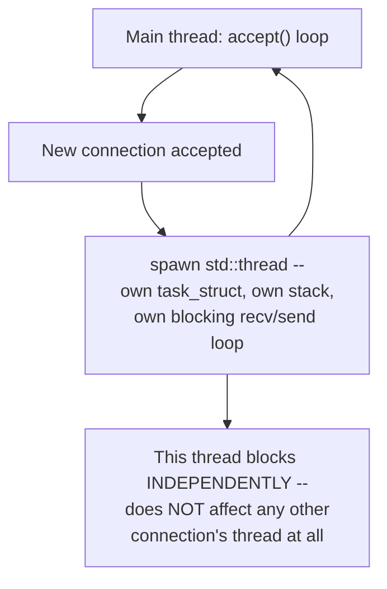

# PART 4 — Blocking I/O

## Chapter 4.8 — Thread-per-Connection

### 🧠 One-Sentence Mental Model
> Spawning a new thread for each accepted connection lets every client block independently in its OWN thread's `recv()`/`send()` calls, so no client waits behind another — a real, correct fix for Chapter 4.7's problem, whose cost is exactly Chapter 4.1's warning made concrete: one real OS thread, with real stack memory and real scheduling weight, per simultaneous connection.

### 🧒 Explain Like I'm Five
Instead of one toll booth operator serving cars one at a time (Chapter 4.7), open a new booth — with a new, dedicated operator — for every car that arrives. Now cars don't wait behind each other at all. But you need as many operators as cars on the road at once, and operators (like threads) aren't free to hire.

### 🌍 Real-World Analogy
A restaurant that assigns one dedicated waiter to each table for their entire visit, rather than one waiter serving tables strictly in sequence — much better for customers, but the restaurant now needs roughly as many waiters as occupied tables, and waiters (like threads) cost real wages (real stack memory, real scheduling overhead) whether they're actively taking an order or just standing by a quiet table.

### ❓ The Problem
Chapter 4.7's server made the second client wait behind the first. This chapter's fix: give each connection its own thread, so each can block independently without affecting any other.

### 🔥 Why This Problem Matters
Thread-per-connection was, for a long time, THE standard production server architecture (early Apache's "prefork"/"worker" MPMs, countless internal services) — understanding exactly how well it works and exactly where it breaks down is essential grounding before Parts 5-8 introduce fundamentally different concurrency models that trade this approach's simplicity for higher scalability.

### 🕰 Historical Context
As real multi-core, cheaply-threadable Unix systems matured through the 1990s-2000s, thread-per-connection became the dominant, easy-to-reason-about server pattern — it maps naturally onto blocking I/O (no new concepts needed beyond "spawn a thread"), and for the connection counts of that era (dozens to low thousands), it worked well. The "C10K problem" (serving 10,000 concurrent connections) — a term coined around 1999 — is literally the moment engineers began documenting exactly where this pattern starts to break, directly motivating Part 5 onward.

### 💡 The Naive Solution
`accept()` in a loop; for each accepted connection, spawn a `std::thread` that runs the exact same blocking `recv()`/`send()` loop from Chapter 4.7, independently, per client.

### ❌ Why the Naive Solution (Eventually) Fails
Each thread costs: a fixed virtual stack allocation (often 1-8MB, though only touched pages cost real RAM, Chapter 2.3's demand paging), a `task_struct` (Chapter 2.1), and real scheduler bookkeeping (Chapter 2.8) — completely independent of whether that connection is actively sending data or sitting idle. At 10,000+ simultaneous idle-ish connections (a common real workload — think chat apps, long-polling clients), you'd need 10,000+ threads, and Chapter 2.7's cross-thread context-switch cost, multiplied across that many threads competing for a handful of CPU cores, becomes a real, measurable bottleneck well before any single connection's I/O is the limiting factor.

### ✅ The Better Solution (Preview)
Reduce the FIXED cost per connection below "one whole OS thread" — either with a bounded thread pool (a partial mitigation, still ultimately limited), or with the nonblocking + multiplexing models of Parts 5-8, or with `io_uring`'s completion model (Part 14). This chapter is not solving that yet — it's earning the motivation by building and measuring the thing being replaced.

### 🧠 Core Concept
> **Thread-per-connection is functionally correct and simple, and its cost model is precisely: N simultaneous connections require N threads, each carrying a fixed memory footprint and a real, nonzero scheduling weight — regardless of how many of those N connections are actually doing anything at any given moment.**

### 📐 Deep Technical Explanation



### 🔌 Syscalls / APIs — Syntax First

```cpp
std::thread t(function, arg1, arg2, ...);
t.detach();
t.join();
```
- **Constructing a `std::thread`** immediately starts a new OS thread (under the hood, on Linux, a `clone(CLONE_VM | CLONE_FILES | ...)` call — Chapter 2.2's exact mechanism) running `function(arg1, arg2, ...)` — the arguments are copied (or moved) into the new thread's own storage, so it's safe even though the calling thread's stack may go out of scope first.
- **`.detach()`** — tells the runtime "I will never call `.join()` on this thread; clean up its resources automatically when it finishes." A detached thread's `std::thread` object no longer represents it — you lose the ability to wait for it or know when it's done. This chapter's server detaches every connection's thread because the main loop only cares about `accept()`-ing the next connection, never about waiting for a specific client to finish.
- **`.join()`** (the alternative, not used in this chapter's server) — blocks the CALLING thread (using this exact chapter's own block/wait/wake mechanism!) until the target thread finishes, then cleans up. Forgetting to either `.join()` or `.detach()` a `std::thread` before it's destroyed calls `std::terminate()` — a common beginner crash.
- **Underlying syscall**, for context: `std::thread`'s constructor on Linux ultimately calls `clone()` with flags that share the address space, file descriptor table, and signal handlers with the parent (Chapter 2.2) — this is the C++ standard library's portable wrapper around the exact mechanism Chapter 2.2 named.

```cpp
setsockopt(listen_fd, SOL_SOCKET, SO_REUSEADDR, &opt, sizeof(opt));
```
Same call as Chapter 4.7 — repeated here because every server in this course reuses it; see 4.7's syntax section for the full option list.

**Project: a thread-per-connection TCP echo server.**

```cpp
// thread_per_connection_server.cpp
// Compile: g++ -O2 -std=c++20 -pthread thread_per_connection_server.cpp -o tpc_server

#include <sys/socket.h>
#include <netinet/in.h>
#include <unistd.h>
#include <thread>
#include <cstdio>
#include <cstring>
#include <cstdlib>
#include <errno.h>

void handle_client(int client_fd) {
    char buf[4096];
    ssize_t n;
    // EXACTLY Ch 4.7's per-client loop -- unchanged. The only difference
    // from Ch 4.7 is that THIS loop now runs in its OWN thread, so it
    // blocking here has zero effect on any other connection.
    while ((n = recv(client_fd, buf, sizeof(buf), 0)) > 0) {
        ssize_t sent_total = 0;
        while (sent_total < n) {
            ssize_t s = send(client_fd, buf + sent_total, n - sent_total, 0);
            if (s < 0) { if (errno == EINTR) continue; perror("send"); goto done; }
            sent_total += s;
        }
    }
done:
    close(client_fd);
}

int main(int argc, char** argv) {
    int port = argc > 1 ? atoi(argv[1]) : 9000;
    int listen_fd = socket(AF_INET, SOCK_STREAM, 0);
    int opt = 1;
    setsockopt(listen_fd, SOL_SOCKET, SO_REUSEADDR, &opt, sizeof(opt));

    sockaddr_in addr{};
    addr.sin_family = AF_INET;
    addr.sin_addr.s_addr = INADDR_ANY;
    addr.sin_port = htons(port);
    bind(listen_fd, (sockaddr*)&addr, sizeof(addr));
    listen(listen_fd, 128);

    printf("Thread-per-connection server on port %d\n", port);

    while (true) {
        int client_fd = accept(listen_fd, nullptr, nullptr);   // still blocks here (Ch 4.7)
        if (client_fd < 0) { perror("accept"); continue; }

        // spawn independently, detach -- each connection now has its
        // OWN thread, OWN task_struct, OWN blocking loop
        std::thread(handle_client, client_fd).detach();
    }
}
```

**Why `detach()` here, and its real cost implication:** each detached thread cleans up its own resources on exit — simple, but it means you have NO built-in limit on how many threads can exist simultaneously; a connection flood directly becomes a thread flood. Production thread-per-connection systems almost always cap this with a bounded thread POOL rather than truly unbounded spawning — a partial mitigation worth naming even though it's out of this chapter's minimal-example scope.

**Benchmark table — illustrative shape, NOT universal numbers (Part 22-23's rule: always measure your own hardware/kernel/workload):**

| Concurrent connections | Approx. threads needed | Typical behavior |
|---|---|---|
| 10 | 10 | Negligible overhead — thread-per-connection is simply the right tool here |
| 1,000 | 1,000 | Noticeable memory footprint (GBs of virtual stack space, less real RAM via demand paging); scheduling still generally fine on modern multi-core hardware |
| 10,000 | 10,000 | Real, measurable context-switch overhead (Ch 2.7) begins competing meaningfully with actual I/O work; the classic "C10K" territory |
| 100,000+ | 100,000+ | Commonly impractical on typical hardware — kernel scheduling overhead and memory pressure dominate; this is precisely the regime Parts 6-14 exist for |

**Predict before running (real experiment):** write a small load-testing script that opens N simultaneous mostly-idle connections to this server (e.g., using `nc` in a loop, or a simple C++/Python client) and measure `ps`/`top` memory usage and `perf stat`'s context-switch count (Part 22 tooling) as N grows from 10 to 1,000 to 10,000. What shape do you expect the memory and context-switch curves to take?

<details><summary>Click to reveal the answer</summary>

Expect roughly LINEAR growth in both memory footprint and context-switch counts as N grows — this is the direct, measurable signature of the "N connections need N threads" cost model this chapter names. Compare this to Part 8's epoll-based server handling the same N with a small, FIXED number of threads — that later benchmark's flat curve is the concrete payoff of everything Parts 5-8 build.
</details>

### ❌ Common Misconceptions
- ❌ **"Thread-per-connection doesn't scale at all."** — It scales fine into the low thousands on modern hardware; "doesn't scale" specifically means "doesn't scale to tens/hundreds of thousands of connections," a much narrower and more accurate claim.
- ❌ **"More threads always means more parallelism."** — Beyond the number of CPU cores, additional threads mostly just add scheduling and context-switch overhead (Ch 2.7) rather than genuine additional parallel work — I/O-blocked threads don't need a core at all while blocked (Ch 4.3).
- ❌ **"Thread stacks always consume their full allocated size in RAM."** — Virtual stack size (often 1-8MB) is reserved address space; actual physical RAM is only committed for pages genuinely touched (demand paging, Ch 2.3) — a mostly-idle thread's real memory footprint is much smaller than its nominal stack size.
- ❌ **"detach() is always fine for production code."** — Unbounded thread creation under connection floods is a real resource-exhaustion risk (Part 28's security preview) — production systems typically bound this with a worker pool.

### 🧙 Wizard Insight
The C10K problem wasn't solved by making threads cheaper — it was solved by recognizing that a THREAD was never the right unit of "waiting for one connection" in the first place; the right unit turned out to be a much smaller, kernel-managed registration (an `epoll` interest entry, Part 8, or an `io_uring` submission, Part 14) that costs almost nothing while idle. Thread-per-connection's failure mode, precisely diagnosed here, is the single clearest motivating example for why that later, seemingly more complex machinery is worth learning at all.

### 🧠 Quiz
**Q1.** Does thread-per-connection fix Chapter 4.7's "second client waits behind the first" problem?
<details><summary>Answer</summary>Yes -- each connection blocks independently in its own thread, so one connection's blocking recv()/send() calls have zero effect on any other connection's thread.</details>

**Q2.** What is the precise cost model of thread-per-connection?
<details><summary>Answer</summary>N simultaneous connections require N threads, each with a fixed memory footprint (mostly virtual until touched, Ch 2.3) and real, nonzero scheduling weight (Ch 2.7's context-switch cost), regardless of how many of those N connections are actually active at any given moment.</details>

**Q3.** Why doesn't a mostly-idle thread's nominal stack size (e.g., 8MB) mean it consumes 8MB of real RAM?
<details><summary>Answer</summary>Because stack space is allocated as virtual address space and only becomes real, physical RAM through demand paging (Ch 2.3) when pages within it are actually touched -- an idle thread that's used little of its stack has a much smaller real memory footprint than its nominal size.</details>

### 📌 Short Notes (Quick Reference)
- Thread-per-connection: spawn one thread per accepted connection, each running Ch 4.7's independent blocking recv()/send() loop.
- Correctly fixes the "clients wait behind each other" problem — genuinely good, standard architecture for low-to-moderate concurrency (10s-1000s).
- Cost model: N connections need N threads — fixed memory + real scheduling overhead per thread, active or idle.
- Breaks down around the classic "C10K" territory (thousands to tens of thousands of connections) — context-switch and memory overhead start dominating.
- Unbounded thread spawning (e.g., via detach()) is a real resource-exhaustion risk in production — bounded thread pools are the common mitigation, though still ultimately limited by the same cost model.

### 🔗 What This Connects To Next
**Previous:** Part 4, Chapter 4.7 — Blocking Socket I/O
**Current:** Part 4, Chapter 4.8 — Thread-per-Connection
**Next:** Part 4, Chapter 4.9 — Process-per-Connection (the same idea, one level heavier — swap threads for whole processes, and see exactly what additional cost that adds and what isolation it buys)
