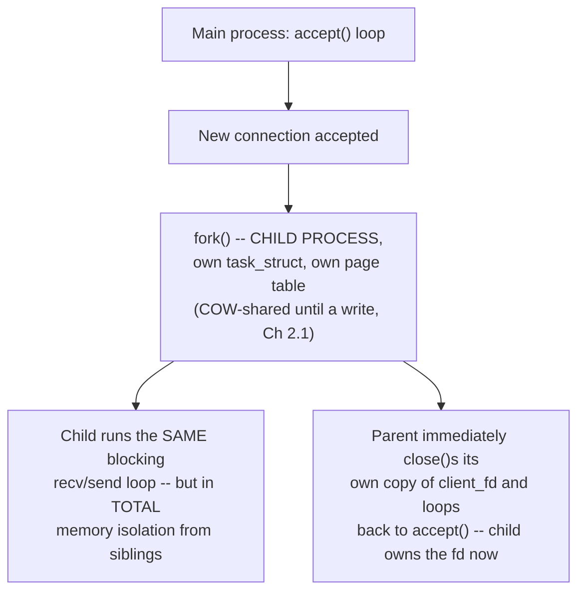

# PART 4 — Blocking I/O

## Chapter 4.9 — Process-per-Connection

### 🧠 One-Sentence Mental Model
> `fork()` a whole new process per connection instead of just a thread (Chapter 4.8), trading Chapter 2.1's Copy-on-Write address-space duplication cost and zero shared memory by default for genuine fault isolation — one crashing connection-handler process cannot corrupt any other connection's memory, a guarantee thread-per-connection never gave you.

### 🧒 Explain Like I'm Five
Instead of hiring more waiters who all share the same kitchen (threads sharing one process's memory, Chapter 2.2), open entirely separate mini-restaurants, one per customer, each with its OWN kitchen. If one mini-restaurant catches fire, it doesn't burn down any of the others — but building a whole new kitchen (a whole new process) per customer costs a lot more than just hiring another waiter.

### 🌍 Real-World Analogy
Assigning each hospital patient their own operating room and full surgical team, versus one shared operating room with different surgeons rotating through — the per-patient version is dramatically safer (nothing that goes wrong in one room can affect another), but it multiplies fixed setup cost (Chapter 2.1's fork()/COW mechanism) per patient rather than sharing it.

### ❓ The Problem
Chapter 4.8's threads all share ONE process's address space (Chapter 2.2) — a memory-corruption bug or crash in handling one connection can, in principle, affect every other connection in that same process. This chapter asks: what if each connection got its OWN, fully isolated process instead?

### 🔥 Why This Problem Matters
Process-per-connection (or process-per-request) is not a historical curiosity — it's the architecture behind real, still-in-production systems: classic Apache's "prefork" MPM, CGI-based web serving, and countless privilege-separated designs (e.g., OpenSSH's per-connection child processes) that deliberately choose isolation over raw efficiency because a single compromised or crashed connection handler must not be able to touch any other connection's data.

### 🕰 Historical Context
Process-per-connection predates thread-per-connection in Unix server history — early Unix had genuinely heavyweight, non-shared threading support (or none at all), so `fork()` was, for a long time, THE only way to get a new independent execution context, well before POSIX threads (`pthread_create`) standardized lightweight, shared-memory concurrency in the 1990s. Some of that era's architecture choices (Apache's prefork model) persisted specifically because the isolation guarantee proved valuable enough to keep, even once threads became available.

### 💡 The Naive Solution
`accept()` in a loop; for each accepted connection, `fork()` a child process that runs the exact same blocking `recv()`/`send()` loop from Chapter 4.7, entirely independently.

### ❌ Why the Naive Solution (Eventually) Fails
Every one of Chapter 4.8's scaling limits still applies, generally MORE severely: `fork()` (even with Copy-on-Write, Chapter 2.1, avoiding an immediate full memory copy) still duplicates the entire `task_struct` and page-table structure, and a full process context switch (Chapter 2.7) is more expensive than a same-process thread switch — reloading `CR3`, flushing the TLB (unless PCID tags it). At the same connection counts where thread-per-connection starts strained, process-per-connection strains sooner and harder.

### ✅ The Better Solution (this chapter's honest trade-off framing)
Process-per-connection isn't "worse" in an absolute sense — it's a different point on the isolation-vs-efficiency trade-off than Chapter 4.8's threads. Choose it specifically when isolation (security boundary, fault containment) matters more than raw connection-count scalability; choose threads or the nonblocking models (Parts 5-14) when scalability matters more and the handler code can be trusted not to corrupt shared state.

### 🧠 Core Concept
> **Process-per-connection provides real memory isolation — a crash or memory corruption bug in one connection's handler process cannot touch any other connection's memory, because they have entirely separate address spaces (Chapter 2.3) — at the cost of a heavier per-connection setup (`fork()`'s COW-duplicated page tables) and a more expensive context switch (Chapter 2.7's cross-process cost) than the thread-per-connection model.**

### 📐 Deep Technical Explanation



### 🔌 Syscalls / APIs — Syntax First

```c
pid_t fork(void);
```
- Creates a new process that is (initially) an exact Copy-on-Write duplicate of the calling process (Chapter 2.1) — same code, same variable values, same open file descriptors (sharing the underlying `struct file`s, Chapter 3.2), but a completely separate address space and `task_struct` going forward.
- **Return value is the KEY to using it correctly** — `fork()` returns TWICE, once in each process, with a different value each time:
  - Returns `0` — you're in the CHILD process.
  - Returns a positive number (the child's PID) — you're in the PARENT process, and that number is the child's process ID.
  - Returns `-1` — the fork failed (e.g., resource limits) and no child was created; check `errno`.
- This is why the project code below branches on `pid == 0` for the child's logic and `pid > 0` for the parent's — the SAME compiled binary, running as two separate processes from this line onward, takes two different paths through the exact same source code.

```c
void (*signal(int signum, void (*handler)(int)))(int);   // real signature, rarely written out
signal(SIGCHLD, SIG_IGN);
```
- Registers a handler for a signal (Chapter 3.9's SIGINT mechanism is the same underlying facility). `SIGCHLD` is delivered to a parent process whenever one of its children terminates.
- **`SIG_IGN`** is a special handler value meaning "ignore this signal" — but for `SIGCHLD` specifically, ignoring it has a useful side effect on Linux: the kernel automatically reaps (cleans up) the finished child immediately, rather than leaving it as a "zombie" process (a finished process whose exit status hasn't been collected by its parent yet, Chapter 2.1's process-lifecycle bookkeeping) until someone calls `wait()`/`waitpid()` on it.
- The alternative, more explicit approach (not used in this minimal example) is installing a real `SIGCHLD` handler that calls `waitpid(-1, nullptr, WNOHANG)` in a loop to reap children without blocking.

```c
void exit(int status);
```
Terminates the CALLING PROCESS ONLY (unlike `return` from `main()` in a threaded context, which only ends that one thread) — flushes C library buffers, runs registered `atexit()` handlers, then the process's resources (memory, fds) are released and its exit status becomes available to a `wait()`/`waitpid()` call (or, here, auto-reaped due to `SIG_IGN` above).

**Project: a process-per-connection TCP echo server.**

```cpp
// process_per_connection_server.cpp
// Compile: g++ -O2 -std=c++20 process_per_connection_server.cpp -o ppc_server

#include <sys/socket.h>
#include <netinet/in.h>
#include <unistd.h>
#include <sys/wait.h>
#include <signal.h>
#include <cstdio>
#include <cstring>
#include <cstdlib>
#include <errno.h>

void handle_client(int client_fd) {
    char buf[4096];
    ssize_t n;
    while ((n = recv(client_fd, buf, sizeof(buf), 0)) > 0) {
        ssize_t sent_total = 0;
        while (sent_total < n) {
            ssize_t s = send(client_fd, buf + sent_total, n - sent_total, 0);
            if (s < 0) { if (errno == EINTR) continue; perror("send"); return; }
            sent_total += s;
        }
    }
}

int main(int argc, char** argv) {
    int port = argc > 1 ? atoi(argv[1]) : 9000;

    // reap finished children automatically -- otherwise they become
    // zombies (Ch 2.1's process-lifecycle bookkeeping) until reaped
    signal(SIGCHLD, SIG_IGN);

    int listen_fd = socket(AF_INET, SOCK_STREAM, 0);
    int opt = 1;
    setsockopt(listen_fd, SOL_SOCKET, SO_REUSEADDR, &opt, sizeof(opt));

    sockaddr_in addr{};
    addr.sin_family = AF_INET;
    addr.sin_addr.s_addr = INADDR_ANY;
    addr.sin_port = htons(port);
    bind(listen_fd, (sockaddr*)&addr, sizeof(addr));
    listen(listen_fd, 128);

    printf("Process-per-connection server on port %d\n", port);

    while (true) {
        int client_fd = accept(listen_fd, nullptr, nullptr);
        if (client_fd < 0) { perror("accept"); continue; }

        pid_t pid = fork();          // Ch 2.1's COW duplication happens HERE
        if (pid == 0) {
            // CHILD: has its OWN copy of the fd table (Ch 3.2's fork()
            // semantics) but the SAME underlying open file description
            // for client_fd -- doesn't matter here since only this
            // child will use it.
            close(listen_fd);          // child doesn't need the listening socket
            handle_client(client_fd);
            close(client_fd);
            exit(0);                   // COW pages this child touched are
                                        // now discarded -- never affected the parent
        } else if (pid > 0) {
            // PARENT: doesn't need this connection's fd anymore --
            // the child owns it (refcounted, Ch 3.10 -- the file stays
            // open as long as the child's copy is)
            close(client_fd);
        } else {
            perror("fork");
            close(client_fd);
        }
    }
}
```

**Why the isolation guarantee is real, not just theoretical:** if `handle_client()` had a buffer-overflow bug that corrupted heap memory, in the THREAD version (Chapter 4.8) that corruption happens in memory SHARED with every other connection's thread — a genuine, exploitable cross-connection vulnerability. In THIS process version, that same corrupted memory is private to one process's own address space (Chapter 2.3); when that process exits (even by crashing), the corrupted pages are simply reclaimed, and every other connection's process is provably untouched. This is precisely why isolation-sensitive designs (privilege separation, e.g., in OpenSSH) still choose this model today.

**Benchmark comparison — thread-per-connection vs. process-per-connection, illustrative shape (always measure your own hardware, Part 22-23's rule):**

| Metric | Thread-per-connection (Ch 4.8) | Process-per-connection (this chapter) |
|---|---|---|
| Setup cost per connection | Lower (shared address space, no page-table duplication) | Higher (fork()'s COW page-table setup, even without an immediate full copy) |
| Context-switch cost between connections | Lower (same-process switch, Ch 2.7) | Higher (cross-process switch: CR3 reload, possible TLB flush) |
| Memory isolation | None — a bug in one connection's handling can corrupt any other connection's memory | Strong — a crash or corruption is contained to that one process |
| Typical max practical concurrency | Low thousands | Generally lower than thread-per-connection at the same hardware, due to heavier per-connection cost |
| When it's the right choice | Trusted handler code, scalability matters more than isolation | Untrusted/risky handler code, or isolation/security boundary matters more than raw scale |

### ❌ Common Misconceptions
- ❌ **"fork() always copies the entire process's memory immediately."** — Copy-on-Write (Chapter 2.1) means only page TABLES are duplicated upfront; actual memory pages are shared (read-only) until either process writes to one, at which point only THAT page is copied.
- ❌ **"Process-per-connection is strictly obsolete."** — It remains the correct choice specifically when isolation/security boundaries matter more than maximum connection-count scalability — it's a trade-off, not a strictly worse option.
- ❌ **"Threads and processes cost the same to create."** — Thread creation shares the existing address space (Chapter 2.2); process creation via fork() sets up an entirely new (COW-shared, but structurally separate) page table — a genuinely heavier operation.
- ❌ **"A crashing thread in a thread-per-connection server only affects its own connection."** — Because threads share one address space, memory corruption from one thread's bug CAN affect other threads/connections in that same process — this is the exact risk process-per-connection eliminates.

### 🧙 Wizard Insight
The thread-vs-process choice for per-connection concurrency is really a narrower instance of a much more general systems-engineering trade-off that recurs throughout this entire course: shared state is cheaper but riskier; isolated state is safer but costlier. Every later mechanism you'll learn — from `epoll`'s single-threaded event loop (maximal sharing, Part 8) to sandboxed, privilege-separated worker processes (Part 28) — sits somewhere on this exact same spectrum, and naming which end a given design sits on is often the fastest way to predict its failure modes before you've even read its code.

### 🧠 Quiz
**Q1.** What does process-per-connection guarantee that thread-per-connection does not?
<details><summary>Answer</summary>Memory isolation -- a crash or memory-corruption bug in one connection's handler process cannot affect any other connection's process, because each has an entirely separate address space; threads sharing one process's memory have no such guarantee.</details>

**Q2.** Why is fork() generally more expensive per-connection than spawning a thread?
<details><summary>Answer</summary>fork() sets up an entirely new (COW-shared, but structurally distinct) page table and task_struct for the child, and subsequent context switches between processes are more expensive (CR3 reload, possible TLB flush, Ch 2.7) than same-process thread switches -- more setup and per-switch cost than sharing one process's existing address space.</details>

**Q3.** Is process-per-connection ever the objectively correct choice today, or is it purely historical?
<details><summary>Answer</summary>It remains objectively correct when isolation/security boundaries matter more than raw scalability -- e.g., privilege-separated designs like OpenSSH's per-connection child processes -- it's a genuine trade-off point, not an obsolete pattern.</details>

### 📌 Short Notes (Quick Reference)
- Process-per-connection: fork() a new process per connection, running the same blocking recv()/send() loop, but in a fully separate address space.
- Buys real memory isolation — a crash/corruption in one connection's process cannot touch any other connection's memory.
- Costs more per-connection than threads: fork()'s COW page-table setup, plus a heavier cross-process context switch (Ch 2.7).
- Right choice when isolation/security matters more than max scalability (e.g., privilege separation); threads/nonblocking models are right when scalability matters more and handler code is trusted.
- Same C10K-style scaling ceiling as thread-per-connection (Ch 4.8), generally reached sooner due to the heavier per-connection cost.

---

## 🗂 Part 4 — Short Notes (Fast Revision)

- **Blocking (4.1-4.2):** a thread calling a blocking syscall that isn't ready yet gets: registers saved into its task_struct → state set to TASK_INTERRUPTIBLE/UNINTERRUPTIBLE → added to the SPECIFIC resource's wait queue → schedule() runs someone else. All four steps are ordinary kernel code; nothing new versus Parts 1-2, just named precisely.
- **Sleeping (4.3):** a blocked thread is REMOVED from the scheduler's run queue entirely, not present-but-skipped — scheduling-decision cost depends only on runnable thread count, so any number of sleeping threads costs ~0 scheduler time.
- **Scheduler interaction (4.4):** the instant a thread blocks, schedule() picks the next lowest-vruntime runnable thread on that core, or falls back to the real "idle" task (often HLT, but genuine code, always instantly interruptible) if nothing else is runnable.
- **Wakeup (4.5):** wake_up() only flips state to READY and moves the thread to the run queue — it does NOT run the thread. "Woken" and "actually running again" are separate, measurable moments; the gap between them is where real scheduling policy (priority, fairness, load) lives.
- **Blocking file I/O (4.6):** read()/write() check the page cache first (Ch 3.6) — a hit never blocks at all; a miss engages the full 4-step mechanism, woken by the SSD's DMA/interrupt chain (Part 1).
- **Blocking socket I/O (4.7):** accept() waits for a new connection; recv() waits for data/closure; send() usually returns fast but can block if the send buffer is full. A single-threaded server this way makes every OTHER client wait behind whichever one is currently being served.
- **Thread-per-connection (4.8):** fixes the "clients wait behind each other" problem by giving each connection its own thread — correct and simple for low-to-moderate concurrency, but costs one real OS thread (memory + scheduling weight) per simultaneous connection; breaks down around C10K-scale connection counts.
- **Process-per-connection (4.9):** same fix, one level heavier — fork() per connection instead of threading, trading a costlier per-connection setup and context switch for genuine memory isolation between connections; the right choice specifically when isolation/security matters more than raw scale.
- **The throughline:** every mechanism in this Part is completely built from Parts 1-3's existing machinery — nothing new was invented, only assembled and applied concretely to real, running C++ servers. Part 5 begins the FIRST genuinely new idea: not blocking at all.

### 🔗 What This Connects To Next
**Previous:** Part 4, Chapter 4.8 — Thread-per-Connection
**Current:** Part 4, Chapter 4.9 — Process-per-Connection
**Next:** Part 5 — Nonblocking I/O (the first mechanism that isn't just "apply Parts 1-3's blocking machinery somewhere new" — O_NONBLOCK, EAGAIN, and the busy-polling trade-off that motivates select/poll/epoll)
