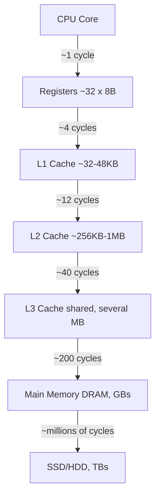

# Welcome to the course: *From Transistors to `malloc()`*

Good — I like this format. Here's how we'll run it, "Chili Tomato" style: every chapter is a **problem → naive attempt → measured pain → fix → measured improvement**. No hand-waving, no "trust me" numbers. You compile, you run, you paste output, we interpret it together, *then* we go deeper. I'll drop mermaid diagrams whenever we're modeling actual hardware/OS behavior, not decoration-boxes.

One-time setup assumption: I'll target **Linux (or WSL) with g++/clang**, since that's where you get clean access to `mmap`, `/proc`, `perf`, and page-fault counters — the real machinery, not an abstraction. If you're on native Windows, tell me and I'll give you the `VirtualAlloc`/ETW equivalents where it matters. Otherwise I'll assume Linux and we move.

---

## The Roadmap

| Part | Title | What you'll be able to *do* after it |
|---|---|---|
| **I** | Physical reality of memory | Explain, with numbers, why "memory is just an array" is a lie, and measure your own machine's cache hierarchy |
| **II** | Address spaces & the MMU | Trace, by hand, how a virtual address becomes a physical one (page tables, TLB) |
| **III** | The OS's view: page faults, `mmap` | Watch real page faults happen on your process via `/proc` and strace |
| **IV** | Build `malloc` from scratch | Implicit free list → explicit free list → segregated fits, each benchmarked against real `malloc` |
| **V** | Arena / bump allocators | Build one, prove it's 10-100x faster than `malloc` for the right workload, know *when* it isn't |
| **VI** | Garbage collection internals | Build a tiny mark-and-sweep on top of your own allocator |
| **VII** | Capstone | A small real system (probably a JSON parser or entity system) rebuilt twice: once malloc-per-object, once arena-based — you benchmark both |

Every part ends with a project and a number. Let's start.

---

## Chapter 1 — Memory is not an array. It's a hierarchy with a price list.

### 1.1 The lie we tell beginners

```cpp
int arr[1000000];
arr[500000] = 42;   // "just accesses memory"
```

This *looks* uniform — every element seems equally "close." It is not. Physically:



The numbers on those arrows are the entire reason systems programming exists as a discipline. Roughly, on a modern desktop CPU:

| Level | Typical size | Latency (cycles) | Latency (ns, @3GHz) |
|---|---|---|---|
| Register | ~32 × 8B | ~1 | ~0.3 |
| L1 cache | 32–48 KB | ~4 | ~1.3 |
| L2 cache | 256KB–1MB | ~12 | ~4 |
| L3 cache | few–tens of MB | ~40 | ~13 |
| DRAM | GBs | ~200 | ~65 |
| SSD | TBs | ~100,000+ | ~30,000+ |

That's a **~150,000x** gap between "in a register" and "on disk." This single table is *why* caches, page tables, TLBs, allocators, and garbage collectors all exist — every one of them is a strategy for keeping your program's data as close to the top of this pyramid as possible.

### 1.2 Why a "cache" instead of just "more RAM"

Caches work because of two properties of real programs, not because engineers are clever:

- **Temporal locality**: if you touch address X now, you'll probably touch it again soon.
- **Spatial locality**: if you touch address X, you'll probably touch X+1, X+2... soon (that's why caches move data in **cache lines**, usually 64 bytes, not single bytes).

This is not folklore — it's measurable. That's your first project.

---

## Project 1: Measure the hierarchy on *your* machine

We're going to write a **pointer-chasing benchmark**. Why pointer chasing and not a simple array sum? Because a simple sequential array sum gets hidden by the CPU's hardware prefetcher — it *predicts* your access pattern and cheats for you. Pointer chasing through a randomized permutation defeats the prefetcher, so the latency you measure is *real* memory latency, not prefetch-assisted throughput.

```cpp
// bench_hierarchy.cpp
#include <cstdio>
#include <cstdint>
#include <cstdlib>
#include <vector>
#include <chrono>
#include <random>
#include <algorithm>

using Clock = std::chrono::high_resolution_clock;

// Build a randomized cyclic permutation over `count` elements.
// Following node[i] -> node[i].next visits every element exactly once,
// in random order, before returning to the start. This defeats
// sequential prefetching.
struct Node { Node* next; };

Node* build_ring(size_t count, std::mt19937_64& rng) {
    std::vector<Node*> nodes(count);
    std::vector<Node> storage(count); // one contiguous allocation
    // We heap-allocate storage separately so it survives the function.
    Node* buf = new Node[count];
    std::vector<uint32_t> order(count);
    for (uint32_t i = 0; i < count; ++i) order[i] = i;
    std::shuffle(order.begin(), order.end(), rng);

    for (size_t i = 0; i < count; ++i) {
        buf[order[i]].next = &buf[order[(i + 1) % count]];
    }
    return &buf[order[0]];
}

int main() {
    std::mt19937_64 rng(12345);

    // Sizes chosen to straddle typical L1/L2/L3/RAM boundaries.
    // Each Node is 8 bytes (one pointer).
    size_t sizes_kb[] = {
        4, 8, 16, 32, 48, 64, 128, 256, 512,
        1024, 2048, 4096, 8192, 16384, 32768, 65536, 131072
    };

    const uint64_t TOTAL_HOPS = 200'000'000ULL; // fixed work per size

    printf("%-12s %-12s %-12s\n", "SizeKB", "ns/access", "note");

    for (size_t kb : sizes_kb) {
        size_t count = (kb * 1024) / sizeof(Node);
        if (count < 2) continue;

        Node* start = build_ring(count, rng);

        // Warm up the pattern once
        Node* p = start;
        for (size_t i = 0; i < count; ++i) p = p->next;

        uint64_t hops = TOTAL_HOPS / (count > 1'000'000 ? 4 : 1); // keep runtime sane at large sizes
        auto t0 = Clock::now();
        for (uint64_t i = 0; i < hops; ++i) {
            p = p->next; // the ONLY memory-dependent operation
        }
        auto t1 = Clock::now();

        double ns = std::chrono::duration<double, std::nano>(t1 - t0).count();
        double ns_per_hop = ns / (double)hops;

        // prevent the optimizer from eliminating the whole loop
        volatile void* sink = p;
        (void)sink;

        printf("%-12zu %-12.2f\n", kb, ns_per_hop);
    }
    return 0;
}
```

**Compile it correctly — this matters:**

```bash
g++ -O2 -std=c++17 bench_hierarchy.cpp -o bench_hierarchy
./bench_hierarchy
```

Do **not** compile with `-O0` — you'll get noise, not signal. `-O2` is required so the loop body is tight and nothing except the pointer chase itself gets measured.

### What you should expect to see (and what to report back)

A step function, not a smooth curve — flat "plateaus" of ns/access, with sharp jumps at your machine's actual L1/L2/L3/RAM boundaries. Something like:

```
SizeKB       ns/access
4            1.1        <- fits in L1
32           1.3        <- still L1
64           4.0        <- jumped into L2
512          4.2
2048         13.5       <- jumped into L3
16384        14.0
65536        65.0       <- jumped into DRAM, out of any cache
```

**Your task:** run it, paste me your actual output table. Then we'll do two things together:

1. Identify *exactly* where your CPU's L1/L2/L3 boundaries are from the jumps (you can cross-check against `cat /proc/cpuinfo` or `lscpu` if on Linux).
2. Use those real numbers as the foundation for **Chapter 2**, where we go from "memory is slow past a boundary" to *why* — the MMU, page tables, and the fact that even a "cache hit" in the diagram above secretly costs you an *address translation* first, every single time, which is a hidden cost we haven't even counted yet.

Go run it. Bring me numbers.
