# Chapter 2, Part 2 — Pointers, Addresses, and Pages
### From "what is a pointer" to "I can tune page size for my own workload"

This document is built in **five tiers**. Each tier assumes only the tier before it —
nothing is assumed from outside this document. Work top to bottom, don't skip.

```
TIER 1: BEGINNER    — what a pointer actually is, physically
TIER 2: INTERMEDIATE — why addresses need translating at all
TIER 3: ADVANCED     — the page table tree, bit-by-bit math
TIER 4: PRO          — page size as a tunable knob, real tradeoffs
TIER 5: LEGEND       — full worked design problem + practice set
```

---

# TIER 1 — BEGINNER

## 1.1 What is a byte, actually?

Before anything else: your computer's memory is a giant strip of **numbered
storage slots**. Each slot holds exactly **8 bits** (1 byte). The "number" of a
slot is its **address**.

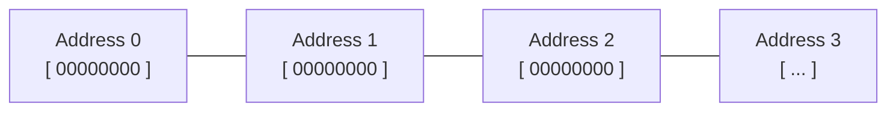

Think of it like a street of houses, all in a perfectly straight line, each
house numbered starting from 0. "Address 4" isn't a *place* in physical
space you can point to — it's a **number**, and something (we'll get to what)
has to turn that number into an actual physical location.

## 1.2 What is a pointer?

```cpp
int x = 42;
int* ptr = &x;
```

`&x` asks: "what is `x`'s address?" — i.e., which numbered slot does `x` live in.
`ptr` is a variable that **stores that number**. That's the entire concept.
A pointer is not magic — it is **a number, stored like any other number**,
that happens to be interpreted as "the address of something."

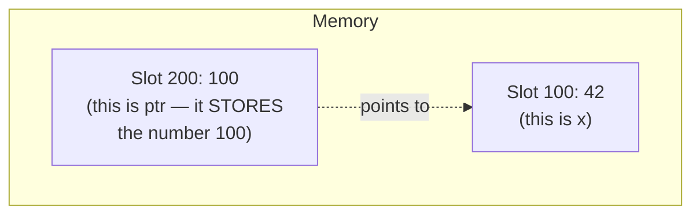

`ptr` itself lives *somewhere* in memory too (slot 200 in this picture),
and its *content* is the number `100` — the address of `x`. That's it.
Nothing more mystical than that.

## 1.3 Why is a pointer exactly 8 bytes?

Your CPU is a **64-bit** machine. That means every "slot" the CPU natively
works with — a register, one arithmetic operation, one pointer — is
**64 bits wide = 8 bytes**, because `64 ÷ 8 = 8`.

This is a **container size**, decided once, when the CPU architecture was
designed. It is fixed for the *whole machine*, forever (until a new
architecture generation is released) — regardless of how much RAM you
actually have installed.

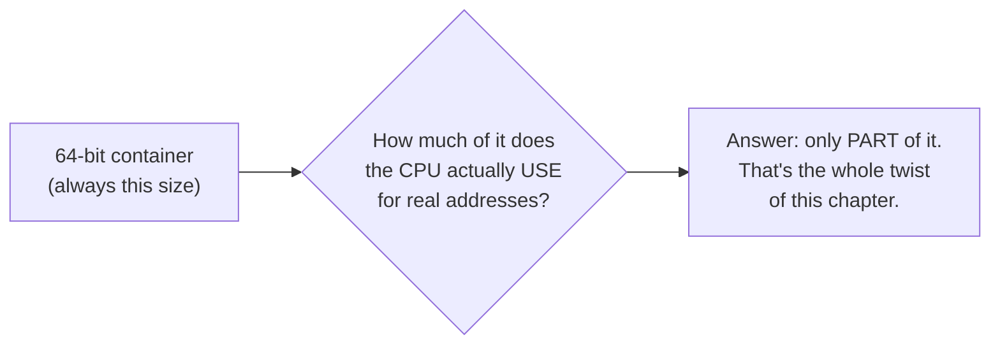

**Analogy:** imagine a moving truck built with exactly 64 numbered parking
spots for boxes. It doesn't matter if today you're only shipping 48 boxes —
the truck still *physically has* 64 spots. The extra 16 spots just sit
empty. That's your pointer: a 64-bit truck, where — as you'll see next —
only 48 spots currently carry real information.

---

# TIER 2 — INTERMEDIATE

## 2.1 The problem: why can't the CPU just use raw addresses directly?

Imagine there was **no translation at all** — the number in your pointer
*is* the literal, physical location in the RAM chip.

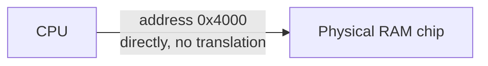

This is simple — and it's *exactly* how tiny embedded chips (washing
machines, microwave controllers) still work today, because they only ever
run **one program**, forever, and know exactly how much memory they have.

But your laptop runs *dozens* of programs "at once" (really, rapidly
switched). Direct addressing breaks immediately:

**Break #1 — Collision.** Two different programs, both compiled assuming
they can freely use address `0x4000` for their own data, get loaded into
the same physical RAM. They'd literally overwrite each other.

**Break #2 — No protection.** A bug in Program A writes to `0x9999`, which
happens to belong to Program B (or the operating system itself). Program A
just corrupted something it had no right to touch. One bug, whole machine
possibly crashes.

**Break #3 — Fragmentation.** As programs start and stop, the OS has to
find *physical* gaps big enough for each new program directly in RAM.
Over time, physical RAM turns into scattered leftover gaps too small to be
useful — even though the *total* free space would be plenty.

## 2.2 The fix: give every program its own private, fictional address space

Instead of programs touching real RAM directly, every running program is
handed its **own complete, private, made-up address space**, starting at 0,
going up to some huge number. A piece of hardware called the **MMU**
translates each fictional address into wherever the real data actually
lives in physical RAM — differently, per program.

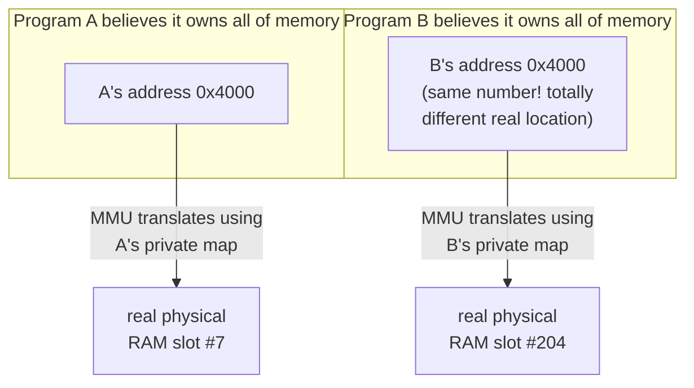

Both programs can use the identical number `0x4000` and never even know the
other program exists, let alone collide with it. This solves all three
breaks from 2.1 at once, with one mechanism.

**Vocabulary, locked in now, used forever after:**

| Term | Meaning |
|---|---|
| **Virtual address** | The fictional number your program uses (what's inside your `ptr` variable) |
| **Physical address** | The real, actual location in the RAM chip |
| **MMU** | Memory Management Unit — hardware that translates virtual → physical, on every single memory access |
| **Page table** | The "map" (data, sitting in RAM) that the MMU consults to do that translation |

## 2.3 Where does 48 bits come from, and why not use all 64?

Your CPU's `lscpu` output said:

```
Address sizes: 39 bits physical, 48 bits virtual
```

Two *different* numbers. Let's understand both, separately, with real math.

**Why not use the full 64-bit container for real addresses?**

```
2^64 bytes = 18,446,744,073,709,551,616 bytes
           ≈ 18.4 exabytes
           ≈ 18,400,000 terabytes
```

No computer on Earth has anywhere close to that much RAM. Building actual
physical wiring, actual comparison circuits, actual page-table-entry bits
to support addressing that much memory — when nobody will use it for
decades — is pure wasted silicon, wasted power, and slower comparisons
(comparing 64 bits takes more transistor-time than comparing 48 bits).

So chip designers made a **deliberate, revisitable choice**: wire up
*enough* bits for the foreseeable future, and leave the rest of the 64-bit
container simply unused (but reserved, so it can be turned on later without
breaking anything — see 3.5).

```
2^32 = 4 GiB       ← old 32-bit computers. Ceiling too low —
                      literally the reason 64-bit computing exists.
2^36 = 64 GiB       ← workable, but tight for growth
2^48 = 256 TiB      ← chosen: huge headroom, cheap enough to build
2^57 = 128 PiB      ← newer CPUs ("5-level paging") for machines
                      that started bumping the 256 TiB ceiling
2^64 = 18.4 EB      ← theoretical absolute max, not built yet
```

**48 bits for virtual, 39 bits for physical — why different?**
Virtual address space is *fictional* — it costs nothing to make it generous
(it's just numbers, not real chips). Physical address space is bounded by
**how much real RAM the CPU's pins can actually address** — 39 bits gives
`2^39 = 512 GiB`, which comfortably covers real installed RAM on this
generation of machine, without over-building the physical wiring.

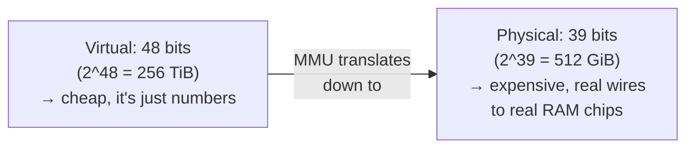

---

# TIER 3 — ADVANCED

## 3.1 Addresses aren't translated byte-by-byte — they're translated in chunks called *pages*

**Why chunks, not individual bytes?** Because of **spatial locality**: if
your program touches byte `0x1000`, it will almost certainly touch
`0x1001`, `0x1002`, etc. very soon after. Bytes right next to each other
almost always belong to the same "thing" (same array, same struct, same
function's local variables).

**Analogy:** imagine writing a directory with one entry *per letter of every
person's name*, instead of one entry per whole *name*. Wildly redundant —
letters next to each other in a name obviously belong together. You'd
instead make one entry per *name* (the natural grouping). Memory does the
same: one translation entry per **page** (a natural grouping of nearby
bytes), not per byte.

On x86-64, the default page size is **4 KiB = 4096 bytes**.

## 3.2 Splitting a virtual address into "which page" and "which byte in that page"

Every virtual address is really **two separate pieces of information** glued
together:

```
Virtual address (48 bits total)

  bit 47                                bit 12  bit 11         bit 0
 ┌───────────────────────────────────────┬───────────────────────┐
 │         Virtual Page Number (VPN)      │   Page Offset (12 bits) │
 │              36 bits                    │                        │
 └───────────────────────────────────────┴───────────────────────┘
       "WHICH page is this?"                "WHICH byte, inside
        → this part gets                     that page, exactly?"
          TRANSLATED                         → this part is copied
                                                across UNCHANGED
```

**Why exactly 12 bits for the offset?** Because the page size is 4096 bytes,
and `2^12 = 4096`. This is a hard rule, not a coincidence:

```
              page size = 2^(number of offset bits)
    number of offset bits = log2(page size)
```

**Fully worked concrete example**, using a real-looking address:

```
Virtual address: 0x00007f3a2c001a34

Step 1 — convert to binary (just the meaningful lower 48 bits):
   0111 1111 0011 1010 0010 1100 0000 0000 0001 1010 0011 0100

Step 2 — split at the 12-bit boundary from the right:
   0111 1111 0011 1010 0010 1100 0000 0000 0001 | 1010 0011 0100
   └──────────── Virtual Page Number ───────────┘ └─── Offset ────┘
              (36 bits — TRANSLATED)                (12 bits = 0xA34
                                                       = decimal 2612,
                                                       UNCHANGED)
```

**The entire translation algorithm, in one sentence:**
> Translate the Virtual Page Number into a Physical Page Number.
> Glue the *same* offset back on, unchanged. Done.

## 3.3 The naive page table (and why it's impossible)

The simplest possible design: one giant flat array, one entry per possible
page number.

```
Virtual address space  = 2^48 bytes
Page size               = 2^12 bytes  (4 KiB)
Number of possible pages = 2^48 / 2^12 = 2^36 pages
Each table entry needs  = 8 bytes (to hold a physical address + flags)

Total flat table size = 2^36 entries × 8 bytes/entry
                       = 2^39 bytes
                       = 512 GiB
```

**512 GiB of table, per single running program**, even for a tiny program
using 2 MB. Totally unworkable. This forces the real design, next.

## 3.4 The real design: a 4-level tree ("only build the branches you actually use")

**Analogy:** instead of one gigantic phone book covering every possible name
on Earth, use a filing cabinet system: first pick a **cabinet** (which
drawer?), then a **drawer** (which folder?), then a **folder** (which
page?), then the **page** itself. If nobody has a name starting with a
certain rare prefix, that whole branch of drawers/folders simply doesn't
get built — you don't pre-print blank folders for names nobody has.

x86-64 splits the 36-bit "which page" portion into **four 9-bit chunks**
(`2^9 = 512` entries per table level):

```
Full 48-bit virtual address, now as FIVE fields:

 47      39 38      30 29      21 20      12 11        0
┌─────────┬──────────┬──────────┬──────────┬────────────┐
│  PML4   │   PDPT    │    PD     │    PT     │   Offset    │
│ (9 bits)│ (9 bits) │ (9 bits) │ (9 bits) │  (12 bits) │
└─────────┴──────────┴──────────┴──────────┴────────────┘
  Level 4    Level 3     Level 2     Level 1
  "which     "which      "which      "which
  cabinet?"  drawer?"    folder?"    page?"
```

A special CPU register called **CR3** holds the physical address of the
*top* of this tree for whichever process is currently running. Every time
the OS switches which program is executing, it swaps the value in CR3 —
**that single swap is how each process instantly gets its own private
address space**, with zero extra hardware needed per-process.

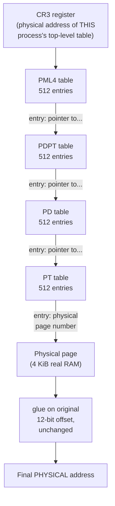

**Why this actually fixes the 512 GiB problem:** if your program never
touches, say, the top half of its address space, **that whole branch of
the tree is never created**. No table exists for memory you never use.
You only pay (in table memory) for branches leading to pages you've
actually touched.

**Concrete example — a program using 10 MB:**

```
10 MB of memory ÷ 4 KiB per page = 2,560 pages needed

Each Level-1 (PT) table holds 512 entries, so:
   2,560 pages ÷ 512 entries/table ≈ 5 PT tables needed

Those 5 small PT tables all hang off (most likely) just
ONE single Level-2 (PD) entry, which hangs off one Level-3
entry, which hangs off one Level-4 entry.

Total table memory needed: a handful of 4 KiB tables
                          = tens of KB, NOT 512 GiB.
```

## 3.5 Sign extension — why the unused upper 16 bits aren't random junk

Your pointer is 64 bits, but only the lowest 48 are "real" (Tier 1.3). The
CPU enforces a strict rule on the other 16, called **canonical form**: bits
48 through 63 must *all exactly copy* bit 47. If they don't, the CPU
refuses the instruction outright (a fault) — it does not silently ignore
or truncate them.

```
 bit 63                    48 47                                    0
┌──────────────────────────┬───────────────────────────────────────┐
│  MUST all equal bit 47    │      Actual usable 48-bit address      │
│  (all 0s, or all 1s)      │      (this is what actually gets       │
│                            │       split and translated)            │
└──────────────────────────┴───────────────────────────────────────┘
```

**Why this specific rule exists:** it cleanly divides the theoretical
64-bit space into two halves without wasting any hardware:

```
0x0000000000000000 .. 0x00007FFFFFFFFFFF   → USER SPACE
                                               (bit 47 = 0 → upper bits all 0)

     [ ...huge gap here — any address landing in it is
       automatically invalid, instant fault, no exceptions... ]

0xFFFF800000000000 .. 0xFFFFFFFFFFFFFFFF   → KERNEL SPACE
                                               (bit 47 = 1 → upper bits all 1)
```

This is also **future-proofing**: when Intel later introduced 5-level
paging (57-bit addresses), any address that was valid under the *old*
48-bit canonical rule is automatically still valid under the *new* rule
too — the check just generalizes to "match bit 56" instead of "match bit
47." Old compiled programs kept working without modification.

---

# TIER 4 — PRO

## 4.1 The cost of walking the tree — and why a cache-for-translations exists

Critical fact: **the page table itself is ordinary data sitting in normal
RAM.** It is not special hardware storage. Reading one page table entry is
itself a full memory access, which can itself be a cache hit or a slow
cache miss.

Walking the complete 4-level tree, worst case, means:

```
1 memory read: fetch the PML4 entry
1 memory read: fetch the PDPT entry
1 memory read: fetch the PD entry
1 memory read: fetch the PT entry
──────────────────────────────────
= 4 EXTRA memory accesses, before your program's actual
  data access even begins
```

So a single `p->next` in the worst case isn't 1 memory access — it's
potentially **5**: four to find out *where* the data physically is, one to
finally read it.

## 4.2 The TLB — caching the *translation*, completely separately from caching the *data*

**Analogy:** if a mail carrier had to walk to the full city directory
building for every single letter, deliveries would be unbearably slow. So
carriers keep a small personal notepad of addresses they've delivered to
*recently* — most deliveries in a given day are repeats or near-repeats, so
the notepad catches most of them, even though it's far too small to
memorize the whole city.

The **TLB (Translation Lookaside Buffer)** is that notepad: a small,
extremely fast, dedicated hardware cache — physically separate from your
L1/L2/L3 *data* caches — that remembers recent Virtual Page Number →
Physical Page Number translations.

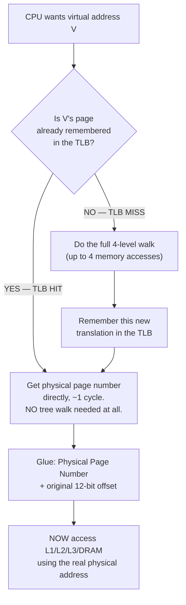

**Two completely independent yes/no questions happen on every single memory
access:**

1. "Do I even know where this virtual address physically lives?" → **TLB**
2. "Is that physical location's data already sitting in a fast cache?" → **L1/L2/L3**

A TLB hit does **not** guarantee a cache hit, and a cache hit is impossible
without first resolving the translation (via TLB hit, or the slower 4-level
walk on a TLB miss). They stack.

## 4.3 TLB reach — the number that connects everything

A TLB is deliberately kept tiny (checked on *every* memory access, so it
must be nearly register-fast) — typically around **64 entries** for data on
a modern core. Since one TLB entry always covers exactly **one page**:

```
TLB reach = (number of TLB entries) × (page size)

With 4 KiB pages:  64 entries × 4 KiB  = 256 KiB reach
```

**Meaning, in plain terms:** if your program's *actively touched* memory
footprint fits within 256 KiB, the TLB can remember all of it, and you get
translation essentially for free (1 cycle, every time). The moment your
footprint exceeds that, some accesses start paying the expensive walk from
4.1.

## 4.4 Page size is a knob — every setting changes 4 things at once

x86-64 supports **4 KiB** (default), **2 MiB** ("huge page"), and **1 GiB**
("giant page"). Changing page size is *not* one isolated change — because
of the locked relationship from Tier 3.2, it ripples through everything.

### Effect 1 — Offset bits, and tree depth

```
offset bits = log2(page size)

4 KiB  page: log2(4,096)         = 12 offset bits  → 36 bits left → 4 tree levels
2 MiB  page: log2(2,097,152)     = 21 offset bits  → 27 bits left → 3 tree levels
1 GiB  page: log2(1,073,741,824) = 30 offset bits  → 18 bits left → 2 tree levels
```

Fewer bits left for the tree = **the tree gets shallower automatically**,
because levels simply get skipped:

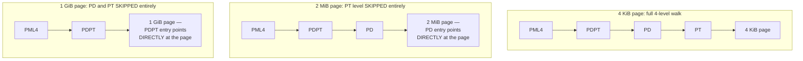

**Consequence:** a huge-page TLB miss costs 3 memory reads to resolve
instead of 4. A giant-page miss costs only 2. Every miss that *does* happen
is cheaper, because there's less tree left to walk.

### Effect 2 — TLB reach

```
TLB reach = TLB entries × page size    (still ~64 entries, same hardware)

4 KiB pages:  64 × 4 KiB  = 256 KiB    reach
2 MiB pages:  64 × 2 MiB  = 128 MiB    reach   ← 512× bigger!
1 GiB pages:  64 × 1 GiB  = 64 GiB     reach   ← 262,144× bigger!
```

**Where does "512×" come from, exactly?**
`2,097,152 bytes ÷ 4,096 bytes = 512`. One single 2 MiB page covers the
exact same virtual range that would have needed **512 separate** 4 KiB
pages — and therefore 512 separate TLB entries — to cover before. One
entry now does the work of 512.

### Effect 3 — Page table memory footprint

```
Task: describe 1 GiB of mapped memory, fully.

With 4 KiB pages:
   1 GiB ÷ 4 KiB = 262,144 pages needed
   262,144 entries × 8 bytes/entry = 2,097,152 bytes = 2 MiB
   of PT-level table space alone

With 2 MiB pages:
   1 GiB ÷ 2 MiB = 512 pages needed
   512 entries × 8 bytes/entry = 4,096 bytes = 4 KiB
   of PD-level table space (PT level doesn't exist — skipped!)

   → 512× LESS page-table memory needed for the exact same
     1 GiB of mapped memory
```

### Effect 4 — Internal fragmentation (the hidden cost)

A page is the **smallest unit the OS can hand out**. If you ask for less
than a full page, the rest of that page is reserved for you but wasted —
nobody else can use it.

```
Example request: a small 10 KB buffer

With 4 KiB pages: needs ceil(10 KB / 4 KB) = 3 pages
                  = 12 KB actually reserved, 2 KB wasted
                  → 20% waste

With 2 MiB pages: needs 1 page (10 KB easily fits inside one 2 MiB page)
                  = 2,097,152 bytes reserved, ~2,087,000 bytes wasted
                  → 99.5% waste!

With 1 GiB pages: needs 1 page
                  = 1,073,741,824 bytes reserved for a 10 KB request
                  → 99.999% waste
```

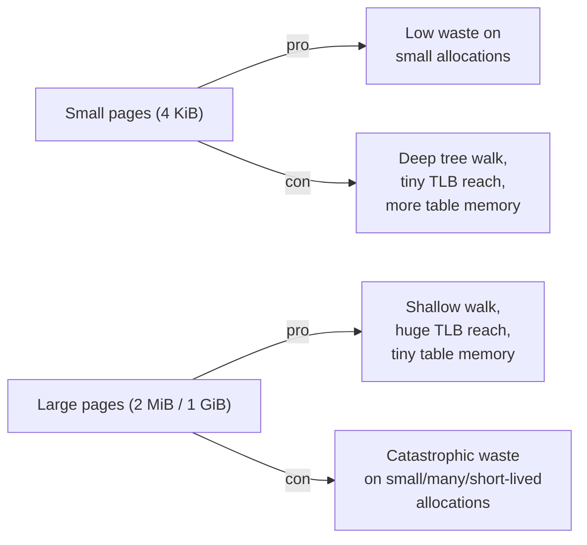

**The rule this produces:** huge pages are a tool for **large, long-lived,
contiguous** allocations (a database buffer pool, a big entity array, a
bump/arena allocator's backing block) — never the default for many small,
short-lived allocations.

## 4.5 The 64-byte cache line — the third natural unit, and how it interacts with everything above

| Unit | Size | Chosen because... |
|---|---|---|
| Pointer / register | 8 bytes | Matches the CPU's native 64-bit word width |
| Cache line | 64 bytes | Matches DRAM burst-transfer efficiency + spatial locality granularity |
| Page (default) | 4 KiB | Matches OS protection granularity + acceptable fragmentation |

**How many of each fit inside the next size up:**

```
Pointers per cache line:  64 bytes ÷ 8 bytes/pointer  = 8 pointers/line
Cache lines per page:     4,096 bytes ÷ 64 bytes/line = 64 lines/page
Pointers per page:        4,096 bytes ÷ 8 bytes/ptr   = 512 pointers/page

Cross-check: 8 pointers/line × 64 lines/page = 512 ✓ consistent
```

**Apply this directly to your own benchmark's struct:**

```cpp
struct Node { Node* next; };   // sizeof(Node) == 8 bytes
```

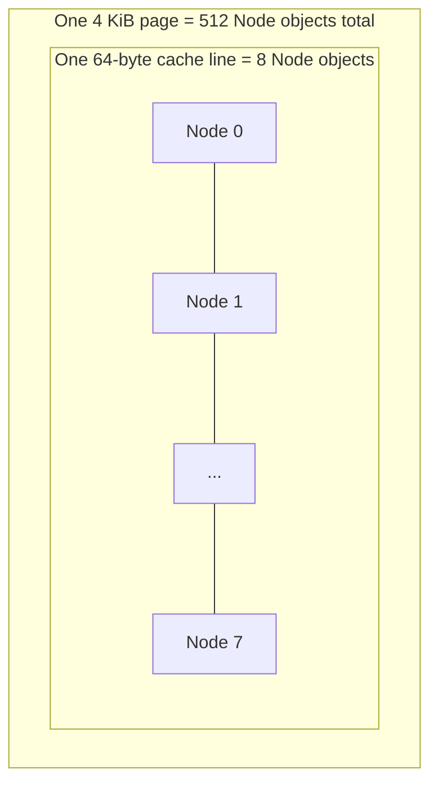

**The insight this produces about your Chapter 1 results:** your
pointer-chase benchmark jumps to a *random* `Node` on every hop — a random
cache line, essentially always different from the one just visited. **Every
single hop is, by construction, a full 64-byte cache-line fetch used for
only 8 bytes (one Node) — 1/8th utilization** — before jumping away and
never returning to the other 7 `Node`s in that line before it's evicted.
This is deliberately the *worst possible* access pattern, chosen precisely
because it isolates pure latency, uncontaminated by any accidental
locality bonus.

**Contrast with a sequential array sum**, where consecutive elements *are*
the next ones touched: the same 64-byte fetch serves 8 consecutive accesses
essentially for free (the other 7 arrive already cached). That is the exact,
countable, non-hand-wavy reason sequential access dramatically outperforms
random pointer chasing at the same data size: **8 accesses per fetch,
instead of 1.**

---

# TIER 5 — LEGEND

## 5.1 The full picture, one diagram, everything from Tiers 1–4 in one journey

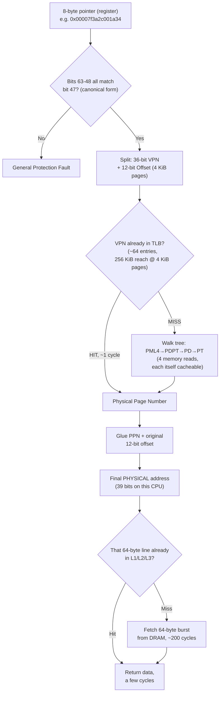

Every single box in this diagram is now a number **you derived**, not a
fact you memorized.

## 5.2 Worked design problem — solve this yourself, then check against the reasoning below

**Scenario:** You're building an arena allocator that will hold **200 MB**
of live game-entity data at once, allocated once at startup, rarely freed,
and accessed extremely frequently (every frame, worst-case pattern for TLB
pressure). Your CPU's dTLB has ~64 entries.

**Question 1 — page count.**
```
4 KiB pages:  200 MB ÷ 4 KiB  = 200 × 1024 × 1024 ÷ 4096 = 51,200 pages
2 MiB pages:  200 MB ÷ 2 MiB  = 200 × 1024 × 1024 ÷ (2×1024×1024) ≈ 97.65
                               → rounds UP to 98 pages (can't have a
                                 fraction of a page — this rounding
                                 IS the internal fragmentation cost)
```

**Question 2 — TLB coverage fraction.**
```
4 KiB pages: TLB reach = 64 × 4 KiB = 256 KiB
   Fraction of 200 MB covered by TLB = 256 KiB ÷ 200 MB
                                      = 262,144 ÷ 209,715,200
                                      ≈ 0.00125 → only about 0.125%
                                        of your working set fits in
                                        TLB reach at once!

2 MiB pages: TLB reach = 64 × 2 MiB = 128 MiB
   Fraction of 200 MB covered by TLB = 128 MB ÷ 200 MB = 0.64
                                      → 64% of your entire working
                                        set fits within TLB reach
```

This is the single most important number in the whole document: **with 4
KiB pages, virtually none of a 200 MB working set stays translation-cached
at once — you are constantly paying tree-walk costs.** With 2 MiB pages,
nearly two-thirds of it does.

**Question 3 — is the fragmentation cost actually a problem here?**
```
4 KiB pages: 51,200 pages needed exactly → 200 MB used, 0 waste
2 MiB pages: 98 pages allocated × 2 MiB = 205.4 MB reserved
             vs. 200 MB actually needed
             → waste = 5.4 MB ÷ 205.4 MB ≈ 2.6% waste
```

**2.6% waste is negligible** for a 200 MB long-lived, single-large-chunk
allocation. Compare this to the earlier 10 KB buffer example, where huge
pages caused ~99.5% waste — the difference is entirely about **allocation
size relative to page size**. Big, few, long-lived allocations: huge pages
win outright. Small, many, short-lived allocations: huge pages are
disastrous.

**Conclusion for this scenario:** 2 MiB huge pages are the correct choice —
64% TLB coverage instead of 0.125%, for a negligible 2.6% memory cost.

## 5.3 The general decision rule (memorize this, it's the whole chapter compressed)

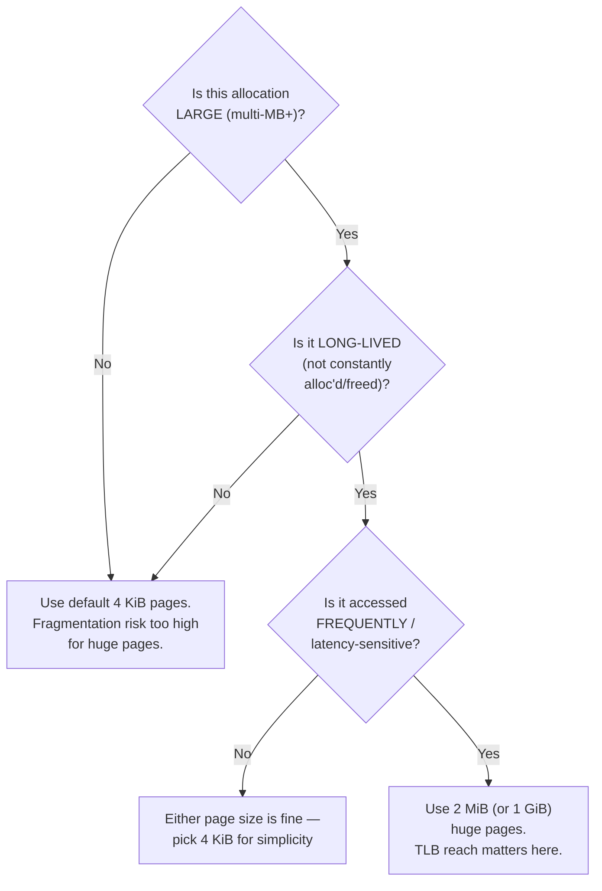

## 5.4 Practice set — work these out fully before moving to the next chapter

1. A workload allocates **8 GB** total, but in **4 KB chunks**, allocated
   and freed constantly (like a general-purpose `malloc` heap under churn).
   Should this use huge pages? Compute the fragmentation risk explicitly to
   justify your answer.

2. A workload allocates **one single 4 GB block** at startup and never
   touches it again until shutdown. Compute TLB coverage fraction at 4 KiB
   vs 2 MiB vs 1 GiB pages. Which page size would you pick, and why does
   going all the way to 1 GiB pages *not* automatically win just because
   the coverage number is biggest?

3. Your own `bench_hierarchy.cpp` `Node` struct is 8 bytes. Redesign it as
   `struct Node { Node* next; char padding[56]; };` so `sizeof(Node) == 64`
   (exactly one cache line). Predict, using the math from 4.5, whether your
   measured ns/hop at each working-set size would go up, down, or stay the
   same compared to your original 8-byte version — and explain *why* using
   the cache-line/page arithmetic, not intuition.

Bring me your answers to all three, with the arithmetic shown, not just
final numbers — that's what proves the understanding transferred, and
it's exactly what we'll build on to start **Chapter 3: page faults**, where
we watch the OS actually create these page-table entries live, the first
time your program touches a freshly allocated page.

---

# CASE STUDY — Why does PostgreSQL use an 8 KB page size?

*(Every part from here on ends with a case study like this — a real,
shipping system, whose engineers had to make the exact tradeoff you just
learned, under real constraints, with real consequences if they got it
wrong.)*

## The critical distinction: PostgreSQL's "page" is a *different* page than the OS's page

First, don't merge two separate concepts that happen to share a name:

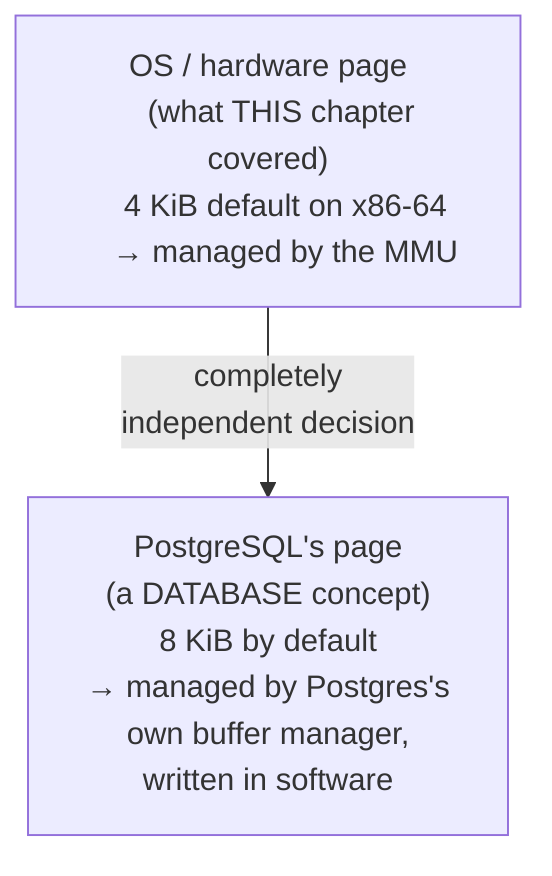

Postgres's 8 KB "page" (they call it a **block**) is Postgres's *own*
unit for organizing data **on disk and in its own internal memory cache**
(the "shared buffers"). It has nothing to do with the CPU's MMU page table
— it's a software-layer decision, made for entirely different reasons than
Tier 4's hardware tradeoffs. But the *reasoning method* — the same
size-vs-fragmentation-vs-overhead arithmetic — applies identically. That's
why this is worth studying right after Tier 4: same shape of problem, one
layer up the stack.

## What Postgres actually stores per page, and why the size can't be tiny

A Postgres page isn't just raw row bytes — it has real internal structure:

```
┌─────────────────────────────────────────────────┐
│ Page Header (24 bytes)                            │
│  - checksum, WAL pointer (crash recovery),        │
│    free-space pointers                             │
├─────────────────────────────────────────────────┤
│ Item Pointers (line pointers) — grows DOWNWARD     │
│  4 bytes each, one per row stored on this page    │
├─────────────────────────────────────────────────┤
│                                                     │
│           free space (shrinks as rows added)       │
│                                                     │
├─────────────────────────────────────────────────┤
│ Actual row data (tuples) — grows UPWARD from       │
│  the bottom of the page                             │
├─────────────────────────────────────────────────┤
│ Special space (used by indexes, e.g. B-tree        │
│  sibling pointers) — size varies by page type      │
└─────────────────────────────────────────────────┘
```

**Compute the overhead ratio at a hypothetical tiny page size — 512 bytes**
(matching old disk sector size, a tempting "natural" choice):

```
Fixed header overhead   = 24 bytes
One item pointer         = 4 bytes
Assume ~10 rows fit on a 512-byte page → 10 × 4 = 40 bytes of pointers

Total overhead = 24 + 40 = 64 bytes
Overhead ratio = 64 / 512 = 12.5% of every page wasted on bookkeeping,
                 before a single byte of actual row data is stored
```

**Same calculation at 8 KB:**

```
Fixed header overhead   = 24 bytes
Assume ~160 rows fit on an 8192-byte page → 160 × 4 = 640 bytes of pointers

Total overhead = 24 + 640 = 664 bytes
Overhead ratio = 664 / 8192 ≈ 8.1%
```

Larger pages amortize the *fixed* per-page header cost over more rows —
this is the exact same "fewer, bigger units = less relative bookkeeping"
principle from Tier 4.4 Effect 3 (page table memory shrinking with bigger
pages), just applied to database block headers instead of page-table
entries.

## Why not go bigger, then — 64 KB, or 1 MB pages?

This is where it inverts, for reasons that map directly onto concepts
you already have:

**Reason 1 — Write amplification (the fragmentation-cost mirror).**
Postgres uses **MVCC**: updating a single row doesn't overwrite it in
place — it writes a *new* version of the row and marks the old one dead.
When Postgres needs to flush a *dirty* page to disk (because even one byte
on it changed), it must write the **entire page**, every time — same
principle as Tier 4.4 Effect 4's internal fragmentation, except here the
"waste" is repeated disk I/O, not unused RAM:

```
Change 1 row (say, 50 bytes actually modified) on an 8 KB page:
   Bytes actually meaningful:  50 bytes
   Bytes physically written to disk: 8,192 bytes
   "Waste" ratio: (8192 - 50) / 8192 ≈ 99.4% of the write is
                  re-writing UNCHANGED bytes, just because they
                  share a page with the 50 that did change

At a hypothetical 1 MB page:
   Bytes physically written to disk: 1,048,576 bytes
   Waste ratio: (1,048,576 - 50) / 1,048,576 ≈ 99.995%
   → dramatically worse write amplification for the exact
     same 50-byte logical change
```

**Reason 2 — Lock/contention granularity.** Postgres takes locks at page
granularity for certain operations. A bigger page means more *unrelated*
rows get bundled under the same lock — two transactions touching two
completely unrelated rows that happen to land on the same giant page can
now block each other, when logically they shouldn't need to. Smaller pages
reduce this "false sharing" at the data layer — directly analogous to
false sharing at the CPU cache-line layer, which you'll meet properly when
we cover multithreading.

**Reason 3 — Matching real storage hardware.** Traditional spinning disks
and SSDs read/write in fixed physical blocks — historically 512 bytes,
now commonly **4 KB** ("Advanced Format" drives) as the underlying
physical sector. Postgres wanted a page size that is a **clean multiple**
of the real hardware sector size, so one logical page write maps cleanly
onto whole physical sectors, with no partial-sector waste:

```
8,192 bytes ÷ 4,096 bytes/sector = 2.0   → exactly 2 whole sectors,
                                            zero remainder, zero waste

If Postgres had picked, say, 6,000 bytes:
   6,000 ÷ 4,096 = 1.46   → needs 2 sectors anyway (can't write a
                             partial sector), but only USES 6,000
                             of the 8,192 bytes actually transferred
                             → wastes 2,192 bytes of I/O bandwidth
                               on every single page write, for no
                               benefit at all
```

## The actual answer: 8 KB is a deliberate midpoint, not an accident

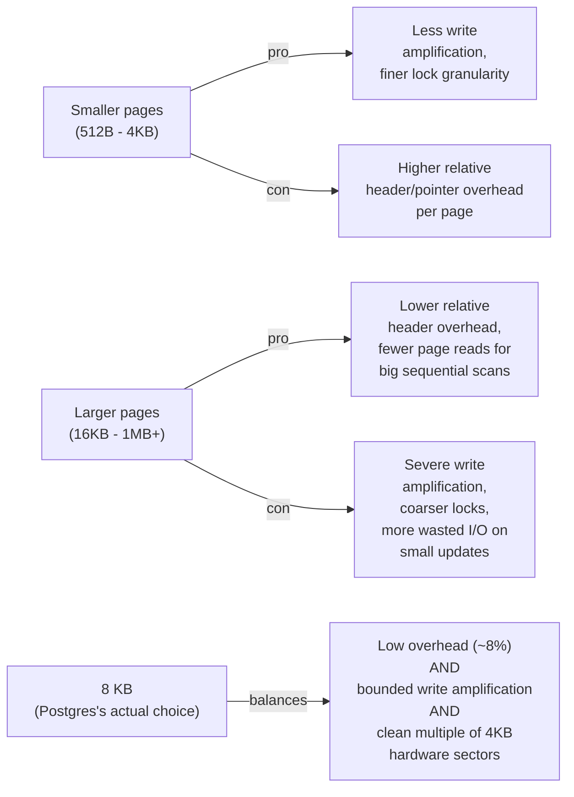

**And crucially — it's configurable, not hardcoded**, because Postgres's
engineers knew this tradeoff has no single universally-correct answer:
`BLCKSZ` is a **compile-time** constant (values from 1 KB to 32 KB are
supported), not something you can change at runtime on an existing
database — because every single page-pointer, every free-space map entry,
and the entire on-disk file format are built assuming a fixed size. This
mirrors the *exact* constraint from Tier 4.4: **the moment you pick a page
size, it locks in a whole cascade of dependent structures** — for the MMU
it was tree depth and TLB reach; for Postgres it's the on-disk file format
itself.

## The transferable lesson (this is *why* we're doing case studies)

Every "why did system X pick size Y" question, at any layer of a real
stack — CPU page size, database block size, filesystem block size, network
packet MTU, cache line size — reduces to the **same four-way tension** you
now have a name and a number for:

1. **Fixed per-unit overhead** (header/bookkeeping bytes, page table entries) → wants **bigger** units
2. **Granularity of waste when only part of a unit changes** (fragmentation, write amplification) → wants **smaller** units
3. **Lookup/indexing cost to find the right unit** (tree depth, TLB reach, seek time) → wants **bigger** units
4. **Contention/locking granularity** (false sharing, page locks) → wants **smaller** units

Every real system's "magic number" is somebody's computed compromise
across exactly these four forces, for their specific workload. You now have
the vocabulary and the arithmetic to reverse-engineer *any* of them
yourself, instead of memorizing them as trivia.
