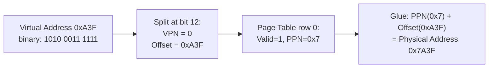
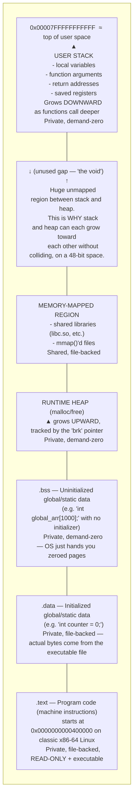
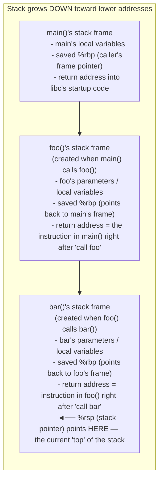

# Virtual Memory — Complete, Visual Notes
### From "what is an address" to tracing `int x = 10;` through real hardware


---

## 0. The one rule to hold in your head the whole time

> **Every single memory access your CPU makes is secretly TWO separate lookups:**
> 1. **Translate** the address (virtual → physical) — this is a *lookup*, not the real data.
> 2. **Fetch** the actual data at that physical address.

Everything below is just "how step 1 works, and what happens when it goes wrong."

**Vocabulary you must never mix up:**

| Term | What it actually is |
|---|---|
| **Address** | A *number* — a label on a box. It is metadata. It tells you *where*. |
| **Data** | The *content* sitting inside the box at that address. It tells you *what*. |
| **Virtual address (VA)** | The fictional address number your program uses (what's inside a pointer variable) |
| **Physical address (PA)** | The real, actual location number in the real DRAM chip |
| **Page table** | A big lookup array (itself just *data*, sitting in normal RAM) that maps VA→PA |
| **PTE (Page Table Entry)** | One row of that array — one page's worth of translation info |

A pointer like `int* ptr` **stores a number** (an address). It is not the data itself.

```cpp
int x = 42;      // x lives at some address, say virtual address 100. Its DATA is 42.
int* ptr = &x;   // ptr is itself stored somewhere too (say address 200).
                 // ptr's DATA is the number 100 (x's address).
```

---

## 1. The basic machine, top-down

Every memory reference is really this loop:


```
① CPU issues a Virtual Address (VA)
② → MMU (Memory Management Unit, on the CPU chip) translates it
④ → Physical Address (PA) goes out to Cache/Memory
⑤ → Data comes back to the CPU
```

Everything from here on is **"what happens inside ① → ④"** — how the MMU turns a VA into a PA.

---

## 2. Physical RAM is a *cache for disk*

Your entire virtual address space (huge — up to `2^48` bytes) does **not** physically exist in RAM (`2^39`–`2^40` bytes, much smaller). RAM holds only the *actively used* slice. The rest lives on disk.

Every chunk of virtual memory — every **virtual page** — is in exactly one of 3 states:


| State | Meaning |
|---|---|
| **Unallocated** | Doesn't exist yet. Touching it → **segmentation fault**. |
| **Cached** | Physically sitting in DRAM right now. Fast. |
| **Uncached** | Exists, but lives only on disk. Touching it → **page fault** (triggers a load). |

**Why treat RAM as a cache instead of just using disk addresses directly?**
Because of the brutal latency gap: SRAM cache ≪ DRAM (~10x slower) ≪ **disk (~10,000x slower than DRAM)**. That extremity is why the design choices below look nothing like a normal CPU cache.

### Why DRAM-as-cache is designed totally differently from L1/L2/L3

| Design choice | Normal CPU cache | DRAM-as-cache-for-disk |
|---|---|---|
| Block ("page") size | 64 bytes | **4 KB – 4 MB** (huge) |
| Associativity | Direct/low set-assoc. | **Fully associative** — a page can go anywhere in RAM |
| Replacement policy | Simple, cheap | **Very sophisticated** — a bad eviction is catastrophically expensive |
| Write policy | Sometimes write-through | **Always write-back** — never write to disk on every write |

- **Big pages** → amortize the huge disk-seek cost over lots of nearby bytes (spatial locality).
- **Fully associative** → at a 10,000x miss penalty, even a *rare* conflict miss (forced by direct-mapping) is disastrous, so we trade "instant slot lookup" for "put it anywhere."
- **Write-back, always** → writes go to RAM and the page is marked **dirty**; the disk write is deferred until eviction — and might *never* happen if the page is freed first. Being lazy here is a deliberate performance win.

---

## 3. Splitting an address: VPN and VPO (the part that never gets translated!)

**Critical insight:** a virtual address is really **two glued-together fields**, and only one of them ever changes during translation.

```
Virtual Address (e.g. 48 bits)

 bit 47                              bit 12  bit 11        bit 0
┌─────────────────────────────────────┬────────────────────┐
│   VPN — Virtual Page Number          │  VPO — Page Offset   │
│   "WHICH page is this?"              │  "WHICH byte in it?" │
│   → gets TRANSLATED                  │  → passes through    │
│                                        │     UNCHANGED         │
└─────────────────────────────────────┴────────────────────┘
```

**Rule:** `offset bits = log2(page size)`. With a 4 KB page, `2^12 = 4096`, so the low **12 bits** are always the offset, on *every* x86-64 system, regardless of address-space size.

**The entire translation algorithm in one sentence:**
> Translate the Virtual Page Number (VPN) into a Physical Page Number (PPN).
> Glue the *same* offset (VPO = PPO) back on, unchanged. Done.

### Worked example: split a real address

```
Virtual address: 0x00007f3a2c001a34

Binary (relevant lower 48 bits):
 0111 1111 0011 1010 0010 1100 0000 0000 0001 | 1010 0011 0100
 └───────────── VPN (36 bits) ────────────────┘ └── VPO (12 bits) ──┘
      → gets translated                          = 0xA34 = decimal 2612
                                                     → copied unchanged
```

---

### 3.1 A second, simpler worked example: mapping address `0xA3F`

This is the same algorithm as above, done once more with smaller, easier-to-follow numbers — good as a sanity check before moving on to the full page-table machinery.

When your code accesses a specific virtual address — say `0xA3F` — the MMU does **not** look that exact address up in the page table. It never sees "0xA3F" as one indivisible thing. It always splits it first.

**Step 1 — Split the virtual address**

Assume the standard 4 KB page size (`0x1000` in hex → `2^12` bytes → **12 offset bits**).

```
Hex value:    0xA3F
Binary value: 1010 0011 1111        (fits in 12 bits)

Since 0xA3F < 0x1000 (4096), this address falls ENTIRELY within the very
first page of memory:

   Virtual Page Number (VPN) = 0        ← "which page?"
   Page Offset               = 0xA3F    ← "which byte inside that page?"
```

**Step 2 — Consult the Page Table**

```
1. MMU uses VPN (0) as an INDEX into row 0 of this process's Page Table.
2. Reads the PTE for that row:
     - Valid bit = 1  →  the page IS resident in physical RAM
     - Physical Page Number (PPN) stored in that PTE = 0x7
       (the OS previously loaded this page into physical frame 0x7000)
```

**Step 3 — Generate the Physical Address**

The offset is copied across **completely unchanged**. Only the page number part gets swapped:

```
   Physical Page Number (PPN) = 0x7     → points at physical frame 0x7000
   Page Offset (unchanged)    = 0xA3F
   ─────────────────────────────────────
   Final Physical Address     = 0x7A3F
```

**The takeaway, stated plainly:** the MMU never maps a single byte or a single variable directly. It translates the **page container** (`VPN 0 → PPN 7`) — a coarse, page-granularity swap — while the **offset (`0xA3F`) rides along untouched**, pointing at the exact same relative position inside the new physical page, which is what ends up landing precisely on your variable.



---

## 4. The Page Table — just an array, sitting in ordinary RAM

**Non-obvious but critical fact, repeated because it matters everywhere below:**
> The page table is **not special hardware**. It is ordinary data sitting in DRAM, exactly like your program's own variables. Reading one entry (a PTE) is itself a real memory access — it can hit or miss in the cache like anything else.


```
Page Table Base Register (PTBR)
        │
        │  physical address of the START of THIS process's page table
        ▼
   VPN used as an INDEX into the Page Table
        │
        ▼
  ┌───────────────────────────────┐
  │ Valid bit?                     │
  ├───────────────────────────────┤
  │ 1 → row holds a PPN             │  (page IS in RAM  → HIT)
  │ 0 → row holds a disk location   │  (page NOT in RAM → PAGE FAULT)
  └───────────────────────────────┘
```

Every process has **its own private page table**. The **Page Table Base Register** (on x86-64, this register is called **CR3**) holds the physical address of the top of *this* process's table. Swapping CR3 on a context switch is the *entire mechanism* by which each process instantly gets its own private address space — no other hardware needed per process.

---

## 5. Translation walkthrough — the HIT path (step by step)

```
A. CPU issues Virtual Address
B. MMU computes PTE address = Page Table Base + VPN
C. Fetch that PTE from Cache/Memory     ← THIS IS A REAL MEMORY ACCESS
D. Valid bit = 1? → HIT
E. Extract PPN from the PTE
F. Glue PPN + original VPO = Physical Address
G. Fetch data using PA from Cache/Memory ← A SECOND REAL MEMORY ACCESS
H. Return data to CPU
```

**Key takeaway: even a page HIT costs *two* memory references** — one to fetch the translation (the PTE), one to fetch the actual data. This is exactly *why the TLB exists* (Section 7) — to skip the first of those two references most of the time.

---

## 6. Translation walkthrough — the PAGE FAULT path


```
A. CPU issues Virtual Address
B. MMU fetches the PTE
C. Valid bit = 0  (page NOT in RAM)
D. MMU raises a PAGE FAULT exception → control passes to OS's fault handler
E. Handler picks a VICTIM page currently in RAM to evict
F. Is the victim page DIRTY?
     Yes → G. write victim back to disk first
     No  → H. victim just discarded (disk copy already up to date)
I. Load the REQUESTED page from disk into the now-free RAM slot
J. Update the PTE: valid = 1, set new PPN
K. Handler returns — the SAME faulting instruction is RE-EXECUTED FROM SCRATCH
L. This time: PTE is valid → runs the normal HIT path (Section 5)
```

**The subtle, important part:** the faulting instruction does not "resume halfway." It **restarts completely**, as if nothing happened — except now translation succeeds because the OS fixed it in the background. This is what makes page faults *transparent*: your program never has to know one occurred.

**How the OS decides fault vs. segfault vs. protection fault:**

```
Page fault at address A
   │
   ├─ Is A inside SOME vm_area_struct for this process?
   │     NO  → SEGMENTATION FAULT (address was never legally part of this process)
   │     YES → is this access TYPE allowed? (e.g., writing to a read-only area)
   │              NO  → PROTECTION FAULT
   │              YES → legitimate fault → evict victim, load page, update PTE, restart
```

---

## 7. The TLB — caching the *translation itself*

A page HIT still costs 2 memory accesses (Section 5). The **TLB (Translation Lookaside Buffer)** is a small, extremely fast, fully-separate on-chip cache that remembers recent VPN→PTE translations, so you can often **skip the PTE fetch entirely**.


```
① CPU issues Virtual Address
② MMU sends VPN to the TLB
③ TLB returns the PTE directly — TLB HIT, NO memory access needed!
④ MMU sends the Physical Address to Cache/Memory
⑤ Data comes back to CPU
```

Compare to the page-hit path in Section 5: **the entire "fetch PTE from memory" step is skipped.** This is the single biggest performance lever in address translation — which is why so much engineering effort goes into maximizing TLB hit rate.

### The TLB is set-associative, just like L1/L2/L3

The VPN gets split *again* into a tag and an index:


```
VPN → split into: TLBT (tag) + TLBI (index)

TLBI → selects WHICH SET to search
TLBT → compared against every entry IN that selected set
```

Same tradeoff as a normal cache: direct-mapped is simple but conflict-prone; fully-associative is flexible but too slow to check on *every* access. Set-associative splits the difference.

### Two independent hit/miss questions on every access

1. "Do I know where this virtual address physically lives?" → **TLB** (hit/miss)
2. "Is that physical location's data already in a fast cache?" → **L1/L2/L3** (hit/miss)

A TLB hit does **not** guarantee a cache hit. A cache hit is impossible without first resolving translation (via TLB hit, or the slower table walk on a TLB miss). **They stack.**

### TLB reach — why it matters concretely

```
TLB reach = (number of TLB entries) × (page size)

Typical: 64 entries × 4 KiB page = 256 KiB reach
```

If your program's actively-touched memory fits within 256 KiB, the TLB remembers all of it → translation is basically free. Beyond that, some accesses start paying the expensive table walk.

---

## 8. Why one flat page table is impossible → multi-level trees

### The math that kills a flat table

```
32-bit address space, 4 KB pages, 4-byte PTEs:
Number of pages = 2^32 / 2^12 = 2^20 ≈ 1 million pages
Flat table size = 2^20 × 4 bytes = 4 MB PER PROCESS

On 48-bit (x86-64) address space, 8-byte PTEs:
Flat table size = 2^36 × 8 bytes = 512 GiB PER PROCESS  ← totally unworkable
```

Run 100 processes → hundreds of MB to hundreds of GB wasted, almost entirely on regions of address space that are actually unused (null entries).

### The fix — a tree, where unused branches simply aren't built


**Analogy:** instead of one giant phone book with an entry for every possible name on Earth, use a filing cabinet: pick a **cabinet**, then a **drawer**, then a **folder**, then the **page**. If nobody has a name in a rare category, that whole branch of drawers is never built.

```
Level 1 table (ALWAYS fully resident in memory)
 ├─ PTE 0 → points to a real Level 2 table   (code/data region)
 ├─ PTE 1..7 = NULL   → no Level 2 table exists here AT ALL, saves memory
 └─ PTE 8 → points to a real Level 2 table   (stack region)
```

**Computed savings** (2K allocated pages + 6K-page gap + 1 stack page):

```
If EVERY level-1 entry needed a table: 1024 × 1024 × 4B = 4 MB (no win)
With NULL entries skipping level-2 entirely:
   2 real level-2 tables  = 2 × 1024 × 4B = 8 KB
 + 1 level-1 table        = 1024 × 4B     = 4 KB
 ───────────────────────────────────────
   Total ≈ 12 KB instead of 4 MB   →  >300x reduction
```

### Generalized K-level lookup


```
PTBR → Level 1 → Level 2 → ... → Level K → PPN → (+VPO) → Physical Address
```

**Worked question:** *On a K-level page table, if the VPN is NOT in the TLB, how many total memory references does ONE logical access require?*

```
K memory references — one PTE fetch at EACH level of the tree
+ 1 memory reference — to finally fetch the actual data
────────────────────────────────────────────────────────
= K + 1 total memory references
```

This is exactly why deep trees make TLB misses expensive, and why huge pages (which shrink K by skipping levels) directly reduce this cost.

---

## 9. The real machine: Intel Core i7, fully assembled


```
CPU issues 48-bit Virtual Address
  → split: 36-bit VPN + 12-bit VPO
  → split VPN further: 32-bit TLBT + 4-bit TLBI

L1 TLB (16 sets × 4 entries) — HIT?
  HIT  → get PPN directly from TLB
  MISS → walk 4-level tree via CR3:
           VPN1(9b) → VPN2(9b) → VPN3(9b) → VPN4(9b)
           each level = one real memory reference
         → final level yields the PTE → PPN

Combine: PPN (40 bits) + VPO (12 bits) = Physical Address

Split PA for L1 cache: 40-bit CT + 6-bit CI + 6-bit CO
L1 d-cache (64 sets × 8 lines) — HIT?
  HIT  → return data, fast path complete
  MISS → go to L2, L3, then main memory
```

### The elegant trick: VPO = PPO = CI + CO

Because the offset never gets translated (Section 3), and on this CPU the 12 offset bits happen to exactly equal the cache's index+offset bits, **the CPU can start checking the L1 cache's index while the TLB lookup is still happening in parallel** — before translation has even finished. Only the final tag comparison (which *does* need the translated PPN) has to wait. This overlap is a deliberate hardware optimization ("virtually indexed, physically tagged" cache), not an accident.

**Why physically-tagged (not virtually-tagged)?** Two different processes can use the identical virtual address for different data. A physically-addressed cache needs no per-process ID in its tags and no duplicate entries for shared data — all protection was already resolved by the MMU before the cache is ever touched. A virtually-addressed cache would be faster per-access but would require flushing on every context switch and can't safely share cache lines between processes.

---

## 10. What a process's virtual address space actually looks like


```
Kernel space (top, ~identical layout in every process)
 ├─ Process-specific kernel data (page tables, kernel stack) — DIFFERENT per process
 ├─ Physical memory direct-access region — IDENTICAL for every process
 └─ Kernel code and data — IDENTICAL for every process

User space (bottom, different per process)
 ├─ User stack             — Private, demand-zero   (grows DOWNWARD)
 ├─ Shared libraries (libc.so) — Shared, file-backed  (mmap'd region)
 ├─ Runtime heap (malloc)   — Private, demand-zero   (grows UPWARD, tracked by 'brk')
 ├─ .bss (uninitialized)    — Private, demand-zero
 ├─ .data (initialized)     — Private, file-backed
 └─ .text (program code)    — Private, file-backed, starts at 0x00400000
```

**Decode the labels:**
- **Private vs Shared** — private = belongs only to this process (even if copy-on-write); shared = multiple processes point at the *same* physical pages (this is how `libc` loads into RAM once and serves every program).
- **Demand-zero vs file-backed** — file-backed pages' initial content comes from a file on disk (`.text`/`.data`); demand-zero pages have no file behind them — the *first* touch just hands you a page freshly filled with zeros, on the spot.

### How the OS tracks this: `vm_area_struct`

```
task_struct (one per process)
   └─ mm_struct
        ├─ pgd: physical address of Level-1 page table  → copied into CR3 on context switch
        └─ linked list of vm_area_struct, one per region:
              .text  (start/end, read-only, exec)
              .data  (start/end, read-write)
              heap   (start/end, read-write, grows)
              stack  (start/end, read-write, grows)
```

This list is exactly what Section 6's fault-classification flowchart checks against.

---

### 10.1 Zooming in: what's actually in each segment, and how it gets there

Here's the same layout again, but now annotated with real-looking addresses and exactly what's stored in each region, low address at the bottom to high address at the top (the way it's conventionally drawn):



**Reminder of the two axes that describe every region (from Section 10):**
- **Private vs Shared** — does only this process see it, or can other processes point at the same physical pages?
- **File-backed vs Demand-zero** — does its initial content come from a file on disk, or does the OS just hand you fresh zeros on first touch?

### 10.2 How a program actually gets loaded into RAM when you run it

This is the part people usually picture wrong: running a program does **not** mean the OS reads the whole executable file into RAM up front. Almost nothing is copied into memory at launch time.

```mermaid
flowchart TD
    Run["You run: ./a.out"] --> Fork["Shell calls fork()
    (Section 11 — child gets a COPY of the shell's page table,
    not its data)"]
    Fork --> Exec["Child calls execve('a.out', ...)"]
    Exec --> Del["1. DELETE the child's existing vm_area_structs
    (throws away the old program's mappings entirely)"]
    Del --> Map["2. CREATE NEW vm_area_structs, but only as METADATA:
       .text  → mapped to a.out's code section ON DISK
       .data  → mapped to a.out's data section ON DISK
       .bss   → mapped to an anonymous demand-zero region
       heap   → demand-zero, initially zero length
       stack  → demand-zero, initially zero length"]
    Map --> Shared["3. Map shared regions (e.g. libc.so) via mmap,
    pointing at physical pages ALREADY IN RAM if another
    process has libc loaded already"]
    Shared --> PC["4. Set the Program Counter to the ELF entry point"]
    PC --> Start["5. Jump to that address and start executing —
    but NOT ONE PAGE OF ACTUAL CODE HAS BEEN
    LOADED INTO PHYSICAL MEMORY YET!"]
    Start --> Fault["6. CPU tries to fetch the very first instruction
    → that page's PTE is invalid → PAGE FAULT
    → OS reads JUST THAT ONE 4 KB PAGE off disk into RAM
    → PTE updated, instruction re-executed, now succeeds"]
    Fault --> Demand["7. Every subsequent NEW page (more code,
    global data, first heap allocation, first stack push
    past what's already resident) repeats step 6 —
    this is DEMAND PAGING: nothing loads until it's touched"]
```



**Why do it this way instead of loading everything up front?**
- Programs (think: a huge application with many rarely-used code paths — a full spreadsheet app, a giant game) may be gigabytes on disk, but any single run only ever touches a small fraction of that code. Loading it all would waste enormous time and RAM for pages that might *never* be used this run.
- It's exactly the same "only build the branch you actually use" principle as multi-level page tables (Section 8) — just applied to *loading*, not to *table structure*.

### 10.3 The call stack — what actually happens on every function call

The **stack** region isn't one big undifferentiated blob — it's built from **stack frames**, one per currently-active function call, stacked on top of each other. This is where local variables, function arguments, and return addresses physically live during execution.



**Step by step, what the CPU does on `call` and `ret`:**

```
When main() executes:  call foo
  1. PUSH the return address (the address of the instruction right
     after 'call foo') onto the stack  → %rsp decreases
  2. Jump the Program Counter to foo's first instruction

Inside foo(), its prologue typically does:
  3. PUSH the old %rbp (caller's frame pointer) onto the stack
  4. Set %rbp = current %rsp    (this now marks the BASE of foo's frame)
  5. Subtract from %rsp to reserve space for foo's own local variables
     (this is literally what "allocates" foo's locals — no malloc involved)

When foo() executes:  ret
  6. Restore %rsp to right before the return address (pop off locals + saved %rbp)
  7. POP the return address off the stack into the Program Counter
     → execution resumes in main(), right where it left off
  8. foo's entire stack frame is now considered free space —
     its memory isn't zeroed or "deleted," it's just no longer
     considered valid by convention; the NEXT function call
     will simply overwrite it
```

**How this connects back to virtual memory:** every one of those pushes is an ordinary **write** to the stack's demand-zero region (Section 10.1). The very first time a deeply recursive or deeply-nested call sequence pushes past the *lowest* stack address the OS has ever backed with a real physical page, that push triggers **exactly the page-fault sequence from Section 12** (`int x = 10;`'s trace) — the OS notices the write falls inside the stack's `vm_area_struct`, allocates a fresh zeroed physical page, updates the PTE, and lets the push succeed. This is precisely how your stack appears to have virtually unlimited room to grow, one page at a time, without ever having been pre-allocated in full.

**Stack overflow, explained with this exact machinery:** every process's stack `vm_area_struct` has a maximum size (commonly 8 MB by default on Linux). If a push tries to extend the stack *past* that configured limit, the fault handler's check ("is this address inside a legal area?") fails — there's no room left to grow this vm_area — and the result is a **segmentation fault**, not an ordinary demand-zero page fault. This is the same fork in the road from Section 6's fault-classification flowchart, just triggered by runaway recursion instead of a stray pointer.

---

### 10.4 Zooming all the way OUT: the complete machine, hardware vs. software

Every mechanism covered so far (page tables, TLB, cache, page faults) is a piece of one bigger machine. Here's the whole thing assembled in one picture — CPU internals (registers, ALU, call stack pointer), the MMU (CR3, TLB, page-table walker), the L1/L2/L3 cache hierarchy, RAM organized into 4 KB pages, and disk — with **hardware** (solid blue), **software** (dashed orange, the OS), and **hybrid data structures** (green — the page table: bytes that live in hardware RAM, but whose format and content are entirely defined and maintained by OS software) clearly separated:


**How to read this:**
- **Blue, solid border = hardware.** The CPU chip (registers, ALU, bus interface), the MMU (CR3 register, TLB, and the page-table-walking logic that automatically walks the 4-level tree on a TLB miss), all three cache levels, RAM, and the disk itself are all real silicon (or magnetic/flash media). None of this is "code" — it's built into the chip and cannot be changed by any program.
- **Orange, dashed border = software.** The Page Fault Handler, the Virtual Memory Manager (victim selection, eviction policy), the Scheduler (the thing that actually writes a new value into CR3 on every context switch), and the swap/file-system logic that knows *where* on disk a given page lives — these are all just code, part of the operating system kernel, running on the very same CPU hardware they manage.
- **Green = a data structure, not a device.** The page table itself is neither purely hardware nor purely software — it is ordinary bytes sitting in RAM (hardware-owned storage), but its *layout* (how many levels, how many bits per level, what the flag bits mean) is defined by the CPU's architecture, and its *contents* (which VPN maps to which PPN, right now, for this process) are written by OS software. The MMU (hardware) only ever *reads* it; the OS (software) is the only thing that ever *writes* it.
- **Where your call stack actually lives:** `%rsp`/`%rbp` are just two hardware registers holding numbers (addresses) — that part is hardware. But the actual bytes of your stack frames (Section 10.3) are ordinary data sitting in RAM pages, get cached in L1/L2/L3 exactly like any other data, and can even be demand-paged out under memory pressure. The "call stack" is a *convention* the hardware and compiler agree to follow, not a separate physical structure.

*(This is deliberately a first pass — as we go further, more components will get added to this same picture: an interrupt controller, DMA engines, hardware prefetchers, and so on.)*

### 10.5 Two totally different transfer sizes for ONE request — the part that trips people up

You now know two separate facts that sound like they should contradict each other:
- **Section 3**: pages are 4 KB, and the whole point of paging is that translation happens at 4 KB granularity.
- **Section 4.5 / 9**: cache lines are 64 bytes, and the whole point of caching is that *data* moves in 64-byte chunks.

So when you write `MOV byte_at[0xA3F]`, which is it — do you get 4 KB, or 64 bytes? **The honest answer is: both, at two different layers, doing two different jobs.**


**Stage 1 — Disk ↔ RAM moves a whole 4 KB PAGE (only when necessary).**
This only happens on a **page fault** (Section 6): if the page holding `0xA3F` isn't resident in RAM yet, the OS reads the *entire* surrounding 4,096-byte page off disk into a free physical frame — not just the handful of bytes you asked for. This is the page-table/VM layer, and its granularity is fixed by the page size chosen at design time (Chapter 2, Part 2, Tier 4).

**Stage 2 — RAM ↔ L1 cache moves only a 64-byte LINE (on every single access).**
Completely independently of whether Stage 1 needed to run at all, the CPU's cache hierarchy is watching physical addresses at its *own*, much finer granularity. Once the physical address for `0xA3F` is known (whether from a TLB hit or a fresh table walk), the cache checks whether the *64-byte line* containing that address is already resident. If not, it fetches **just that one 64-byte line** — a small slice of the 4 KB page — from RAM into L1 (Section 4.5's cache-line math: 64 lines make up one page). The other 63 lines of that page stay sitting in RAM, untouched by the cache, until something else in your program happens to touch them too.

**Put together, for `int x = *(int*)0xA3F;`:**
```
1. Split 0xA3F → VPN=0, offset=0xA3F
2. TLB / page-table lookup resolves VPN → PPN
     (if the page wasn't resident: FULL 4,096-byte page fault-in from disk first)
3. Combine PPN + offset → physical address
4. L1 cache lookup at that physical address
     (if not cached: fetch ONLY the 64-byte line containing this address from RAM)
5. Pull the specific 4 bytes of the int out of that 64-byte line into the CPU register
```
The 4 KB transfer (Stage 1) is the exception — it happens at most once per page, ever (until eviction). The 64-byte transfer (Stage 2) happens routinely, on every cache miss, for as long as the program runs. Two different mechanisms, two different sizes, solving two different problems: Stage 1 minimizes *how often* you pay disk latency; Stage 2 minimizes *how often* you pay DRAM latency, on top of memory that's already resident.

---


## 11. Copy-on-write (COW) — how `fork()` avoids copying gigabytes

**The problem:** `fork()` must duplicate an entire process's memory image instantly — potentially gigabytes. Actually copying it would be absurdly slow, especially since most `fork()` calls are immediately followed by `exec()`, which throws the copy away completely anyway.

**The trick:** copy only the **page table** (kilobytes), not the data. Mark every page **read-only** in both processes, with a "copy-on-write" flag.


```
Immediately after fork():
   Process 1 virtual page ──┐
                              ├──→ ONE SHARED physical page (read-only in BOTH page tables)
   Process 2 virtual page ──┘

Both processes READ freely — reads never fault.

The MOMENT either process WRITES:
   1. Hardware sees the read-only bit → PROTECTION FAULT (not a real error!)
   2. OS handler recognizes: this is COW, not an illegal write
   3. Allocate a NEW physical page, copy the shared page's contents into it
   4. Update the writer's PTE → point at the NEW private copy, mark READ-WRITE
   5. Restart the write instruction — it now succeeds, writing to its OWN copy
   6. The OTHER process's page is UNTOUCHED — still points at the original
```

**Why this is a genuine win:** if `fork()` is immediately followed by `exec()` (the overwhelmingly common case — every shell spawning a command), **zero pages ever get copied at all** — `exec()` throws away the child's whole address space before any write could trigger a copy. The "instant full-process duplicate" `fork()` appears to provide costs, in the common case, only the price of duplicating the page table (KBs), never the actual memory (GBs).

**Case study — why not always use the faster `vfork()`?**

| Mechanism | Pro | Con |
|---|---|---|
| `fork()` + COW | Fully general — child can do *anything* before `exec()` | Even with COW, duplicating the page table costs something |
| `vfork()` | Doesn't even copy the page table — child *shares* parent's address space directly | Dangerous: child MUST `exec()`/`_exit()` immediately or it can corrupt the parent |
| `posix_spawn()` | One syscall, no fork-like semantics | Loses flexibility (no code between fork and exec — e.g., can't remap file descriptors) |

COW `fork()` remains the default because it's the only one that's both **safe** (no way to accidentally corrupt the parent) and **fully general** — exactly what every Unix shell relies on for `fork()` → rearrange file descriptors for redirection/piping → `exec()`.

---

## 12. FULL WORKED EXAMPLE #1 — tracing `int x = 10;` (a WRITE, first touch)

```cpp
int x = 10;   // x is a local variable — lives on the STACK
              // (a private, demand-zero region, Section 10)
```

Say the compiler assigns `x` the virtual address `0x00007fff'a000'1a34`, and this is the **very first time** this stack page has ever been touched.

```
1.  CPU executes:  MOV [0x00007fffa0001a34], 10
2.  Split VA:  VPN = upper 36 bits,  VPO = 0xA34 (lower 12 bits)
3.  Check L1 TLB for this VPN → MISS (first touch, nothing cached)
4.  Walk 4-level page table via CR3 → PML4 → PDPT → PD → PT
5.  Final-level PTE: Valid bit = 0
       → this stack page has NEVER been backed by real physical memory
6.  PAGE FAULT raised
7.  OS fault handler: checks vm_area_struct — is this address inside the STACK region? YES, legal.
8.  This is a DEMAND-ZERO page (no file backs it).
       OS finds a free physical frame, fills it with ZEROS.
9.  OS updates the PTE: valid=1, PPN = new frame, R/W=1 (writable — it's stack memory)
10. OS ALSO loads this new translation into the TLB
11. Faulting instruction RESTARTS FROM SCRATCH
12. CPU re-issues the SAME virtual address
13. Check TLB again → HIT this time (just installed in step 10)!
       Get PPN directly, no page-table walk needed.
14. Combine PPN + VPO = Physical Address
15. Check L1 d-cache at this physical address → MISS (freshly zeroed page never cached)
16. Fetch the 64-byte cache line containing this address from DRAM (~200 cycles)
17. THE ACTUAL WRITE HAPPENS: value 10 is stored at offset 0xA34 within this cache line, in L1
18. Cache line marked DIRTY (differs from what's in DRAM now)
19. Instruction complete. x now holds 10 — ONLY in L1 cache (and eventually DRAM).
       NOTHING has been written to disk yet.
```

### State of every layer after this ONE instruction

| Layer | State after `x = 10` |
|---|---|
| **TLB** | Valid VPN→PPN translation cached — next nearby stack access is a TLB hit |
| **Page table (PTE)** | valid=1, points to the new physical frame, R/W=1 |
| **L1 cache** | Holds the 64-byte line containing `x`, marked **dirty**, value 10 at the right offset |
| **DRAM** | Still holds *old* content until the dirty line eventually gets evicted/flushed (write-back, Section 2) |
| **Disk / swap** | Untouched. May *never* be touched if this stack frame is popped before eviction pressure forces it |

### If this had instead been a write to a **copy-on-write** page

Steps 5–8 change: the PTE would already be **valid** (page exists, cached, shared) but marked **read-only**. The fault raised is a **protection fault**, not a not-present fault, and the handler's job is "allocate new frame, copy contents, repoint PTE, mark read-write" instead of "zero-fill a new frame." Same overall shape (fault → handler → fix PTE → restart), different specific repair — which is exactly why the fault handler must check *which kind* of fault occurred (Section 6) before deciding what to do.

---

## 13. FULL WORKED EXAMPLE #2 — tracing `int y = x;` (a READ, then a WRITE, in the same instruction)

Now assume: the page containing `x` is **already TLB-cached and dirty in L1** (from Example 1). The page that will hold `y` is a **brand-new, never-touched** stack slot.

```cpp
int y = x;   // READ x, WRITE the value into a NEW variable y
```

### Reading x (the source)

```
1. CPU issues x's virtual address
2. Split VA → VPN_x + VPO_x
3. Check TLB for VPN_x → HIT (installed during Example 1) — no table walk needed!
4. Combine PPN_x + VPO_x = Physical Address of x
5. Check L1 cache at that address → HIT (line is already resident, dirty, from Example 1)
6. Return the value 10 to the CPU — fast path, both TLB and cache hit
```

### Writing y (the destination — brand new page)

```
7.  CPU issues y's virtual address
8.  Split VA → VPN_y + VPO_y
9.  Check TLB for VPN_y → MISS (never touched before)
10. Walk 4-level page table → final PTE: Valid = 0
11. PAGE FAULT → handler checks vm_area_struct → inside STACK region, legal
12. Demand-zero page: allocate a fresh frame, zero-fill it
13. Update PTE: valid=1, PPN = new frame, R/W=1
14. Load translation into TLB
15. RESTART the instruction from scratch
16. Re-issue VA for y → TLB HIT this time
17. Combine PPN_y + VPO_y = Physical Address
18. L1 cache check → MISS (freshly zeroed page never cached) → fetch 64-byte line from DRAM
19. THE WRITE HAPPENS: value 10 (read from x) is stored at y's offset in this new cache line
20. Line marked DIRTY
```

**Why the read and the write take completely different paths through the *same* diagram, one instruction apart:**
- **Reading `x`** hits *everywhere* (TLB hit, cache hit) because it's re-touching memory from the immediately preceding instruction — pure temporal locality.
- **Writing `y`** misses *everywhere* (TLB miss → page fault → cache miss) because it's the very first touch of a page that has never been backed by physical memory at all. It must go through the *entire* demand-zero-page machinery of Section 6 before the write can even happen.

Same mechanism, same diagram — but locality (or the total lack of it) determines which branches get taken.

---

## 14. A fully worked NUMERIC example — real bits, real tables

**System setup:** 14-bit virtual address, 12-bit physical address, 64-byte pages (6-bit offset), 4-way associative TLB with 16 entries (4 sets), direct-mapped cache with 16 lines of 4 bytes each.

```
Address field layout:
 Virtual address (14 bits):  VPN (8 bits) | VPO (6 bits)
 Physical address (12 bits): PPN (6 bits) | PPO (6 bits)
 TLB (16 entries, 4-way):    TLBT (6 bits) | TLBI (2 bits)
 Cache (16 lines, direct):   CT (6 bits) | CI (4 bits) | CO (2 bits)
```

The concrete TLB, page table, and cache contents for this worked system:


### Case A — TLB HIT and Cache HIT: virtual address `0x03D4`

```
0x03D4 in binary: 00 0011 1101 0100
Split: VPN = 0x0F,  VPO = 0x14

Step 1 — Check TLB: split VPN 0x0F → TLBI = 3, TLBT = 3
   Look in Set 3 for tag 3 → FOUND → PPN = 0x0D   (TLB HIT — no page-table walk needed!)

Step 2 — Build physical address: PPN(0x0D) + PPO(same low 6 bits) → 0x354

Step 3 — Check cache: split 0x354 → CT = 0x0D, CI = 5, CO = 0
   Look at cache index 5 → tag matches 0x0D → CACHE HIT
   Return byte at offset 0 → value = 0x36
```
This is the best possible case: **TLB hit + cache hit** — the fast path everyone designs for.

### Case B — TLB MISS, but page table says VALID → Cache MISS: virtual address `0x0020`

```
0x0020 in binary: 00 0000 0010 0000
Split: VPN = 0x00,  VPO = 0x20

Step 1 — Check TLB: TLBI = 0, TLBT = 0 → tag doesn't match anything in Set 0 → TLB MISS

Step 2 — Fall back to the page table: index with VPN=0x00 → Valid bit = 1 → PPN = 0x28
   (No page fault — the page WAS in memory, we just didn't have it cached in the TLB.
    This translation now also gets LOADED into the TLB for next time.)

Step 3 — Build physical address: PPN(0x28) + PPO(0x20) → 0x0A20

Step 4 — Check cache: split 0x0A20 → CT=0x28, CI=8, CO=0 → tag at index 8 doesn't match
   → CACHE MISS → fetch the 4-byte block from main memory, load it into the cache line,
     mark it valid with the new tag, THEN return the requested byte.
```

### Case C — A genuine PAGE FAULT: virtual address needs a page marked invalid

```
Split the VA → look up in the page table → Valid bit = 0
   → This means: no physical frame is backing this page right now.
   → PAGE FAULT raised → control passes to the kernel's page fault handler
   → (Handler decides: is this address inside a legal vm_area_struct?
      If yes → load it from disk / zero-fill it, update the PTE, restart.
      If no  → SEGMENTATION FAULT.)
```

**The pattern across all three cases:** every single memory reference always tries the *fastest* path first (TLB → cache) and only falls back to slower machinery (page table walk → main memory → disk) exactly as far as it needs to. Nothing is ever "skipped" — it's a strict waterfall of increasingly expensive fallbacks.

---

## 15. Quick-reference cheat sheet

```
Pointer / register width  = 8 bytes   (matches 64-bit CPU word size)
Cache line                = 64 bytes  (matches DRAM burst transfer + spatial locality)
Page (default, x86-64)    = 4 KiB     (matches OS protection granularity)

offset bits = log2(page size)         12 bits for a 4 KiB page
VPN bits    = address width − offset bits
VPO = PPO, ALWAYS (never translated)

TLB reach = TLB entries × page size   (bigger pages → bigger TLB reach)
K-level page table miss cost = K page-table reads + 1 data read = K+1 total

Fault classification:
   not in ANY vm_area_struct       → SEGMENTATION FAULT
   in an area, but wrong permission → PROTECTION FAULT
   in an area, just not resident    → (ordinary) PAGE FAULT → load & continue

Write policy: always write-back + dirty bit (never write-through to disk)
fork(): copies PAGE TABLE only, marks pages read-only + COW
        write → protection fault → copy page → mark read-write → restart
```

### The whole pipeline, one more time, end to end

```
CPU: Virtual Address
   → canonical-form check (upper bits must match bit 47, else GP fault)
   → split into VPN + VPO
   → TLB lookup (VPN)
        HIT  → PPN directly, ~1 cycle
        MISS → walk page table (K levels, K memory reads) → get PPN
                 (each level itself checked in cache — dirty/valid bits, etc.)
                 if any level's valid bit = 0 → PAGE FAULT → OS fixes it → RESTART instruction
   → glue PPN + VPO = Physical Address
   → L1/L2/L3 cache lookup
        HIT  → return data
        MISS → fetch from DRAM (or trigger page fault if not even in DRAM) → return data
```
