# mmap — The Complete Guide: Zero → Pro → Wizard
### You already know TLB/hardware translation cold. This is everything mmap builds on top of it.

Five tiers. Each one assumes only the tier before it.

```
TIER 0: ZERO       — the syscall itself, every parameter, your first working mmap
TIER 1: PRACTICAL  — why mmap is faster than read() for the same file
TIER 2: PRO        — IPC, and the FULL big-page-vs-small-page scenario, worked with real numbers
TIER 3: WIZARD     — mmap vs write()+fsync(), crash safety, the ring buffer trick
TIER 4: LEGEND     — two full real projects, fully annotated, plus LMDB vs Postgres, diagram by diagram
```

---

# TIER 0 — ZERO: the syscall, completely demystified

## 0.1 The one-sentence mental model

> `mmap()` asks the kernel: **"reserve me a chunk of virtual address space, and optionally connect it to a file — but don't load anything until I actually touch it."**

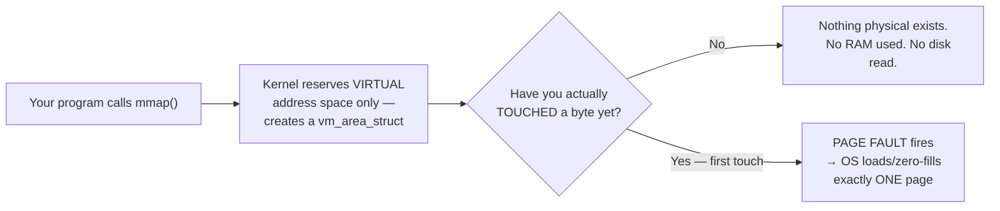

That's the whole idea. Everything below is detail around this one diagram.

## 0.2 The full signature, parameter by parameter

```c
void *mmap(void *addr, size_t length, int prot, int flags, int fd, off_t offset);
```

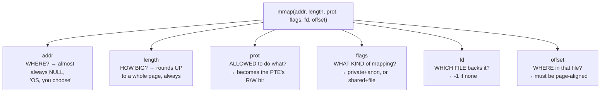

**`addr`** — pass `NULL` unless you're doing something advanced with `MAP_FIXED` (dangerous: silently unmaps anything already there — avoid until you have a specific reason).

**`length`** — always rounds up to a whole page. Ask for 1 byte, get 4096 reserved — the MMU can only ever translate at page granularity, full stop.

**`prot`** — becomes the R/W permission bit sitting directly inside the resulting PTEs:
```c
PROT_NONE                 // touching this ALWAYS faults (guard pages)
PROT_READ | PROT_WRITE    // the common case
PROT_EXEC                 // CPU may execute instructions here
```

**`flags`** — you always pick exactly one of these two:
```c
MAP_PRIVATE   // private to you; if these pages end up shared (e.g. after fork()),
              // writes trigger copy-on-write
MAP_SHARED    // visible to everyone else mapped to the same file/region;
              // if file-backed, eventually written back to the real file
```
plus, optionally:
```c
MAP_ANONYMOUS  // no file backs this — content starts all zeros (fd/offset ignored)
MAP_FIXED      // force the exact address — dangerous, skip until you need it
```

**`fd` / `offset`** — only matter with a real file. With `MAP_ANONYMOUS`, pass `-1, 0` by convention.

## 0.3 The only two shapes you'll ever really write

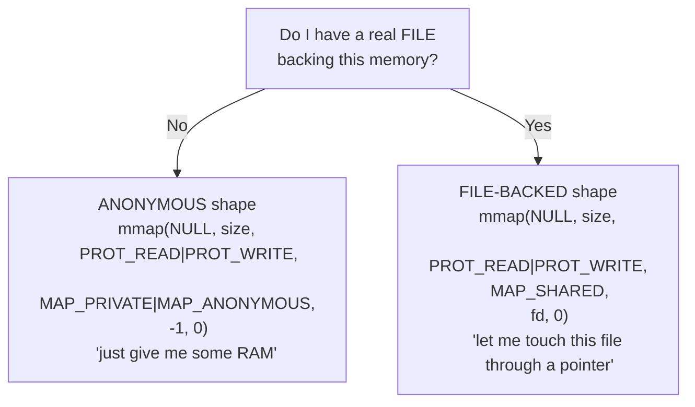

Memorize the **shape**, not the six-parameter signature. Once you know "do I have a real file or not," the call basically writes itself.

## 0.4 Your first mmap, traced completely, nothing left to imagine

```cpp
size_t size = 4096;
void* p = mmap(nullptr, size, PROT_READ | PROT_WRITE,
                MAP_PRIVATE | MAP_ANONYMOUS, -1, 0);

unsigned char* bytes = reinterpret_cast<unsigned char*>(p);
printf("%d\n", bytes[0]);   // prints 0 — demand-zero
bytes[0] = 42;               // FIRST touch → page fault, invisibly, right here
printf("%d\n", bytes[0]);   // prints 42

munmap(p, size);
```

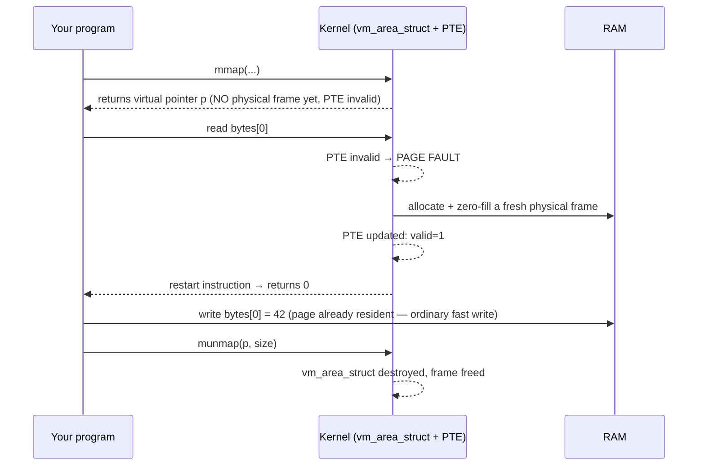

Six lines = the entire reserve → demand-zero-fault → access → release lifecycle, verified, not imagined.

---

# TIER 1 — PRACTICAL: why mmap beats read() for the same job

## 1.1 The copy `read()` is forced to make

```cpp
char buf[4096];
read(fd, buf, 4096);
```

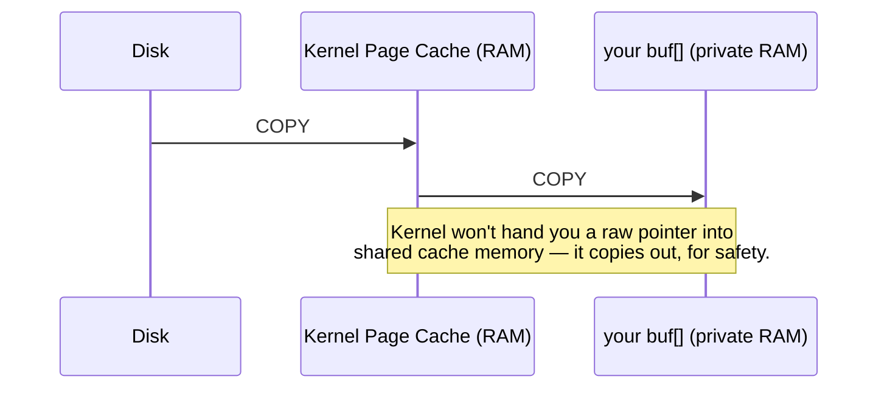


`mmap()` instead sets **your own page table entries** to point directly at the same physical pages the kernel's cache already holds. There is no second copy — reading through the mapped pointer is reading the kernel's own cached copy, through the ordinary MMU/TLB translation you already know cold.

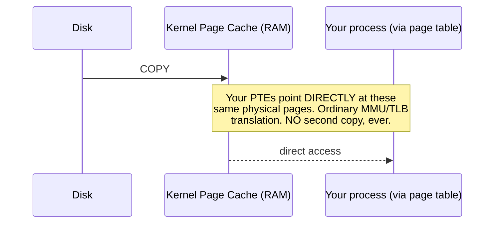

**This is the entire performance case for mmap, in one sentence:** it eliminates the copy `read()` can't avoid.

---

Here are your clean, beautifully formatted Markdown notes for this section. You can save this directly into your repository!

---

# Chapter 1: The Anatomy of `mmap` — Virtual Memory, Shared Regions, and Process IPC

## 1. Where Does `mmap` Live in Virtual Memory?

When you call `mmap()`, the memory **does not** come from the traditional heap (`malloc`/`new`) or the stack.

Instead, the kernel carves out space in a dedicated zone of your virtual address space known as the **Memory Mapped Region (mmap area)**.

### The 64-bit Process Layout (Low to High Addresses)

```text
0x0000000000000000  +---------------------------+
                    |           TEXT            | <-- Compiled machine code (.text)
                    +---------------------------+
                    |           DATA            | <-- Global and static variables
                    +---------------------------+
                    |            BSS            | <-- Uninitialized global variables
                    +---------------------------+
                    |           HEAP            | <-- Traditional dynamic memory (malloc)
                    |            ...            |     Grows UP towards high addresses
                    |            VVV            |
                    +---------------------------+
                    |    MMAP REGION (ARBITRARY)| <-- **mmap() allocations land here!**
                    |   (Shared or Private)     |     Grows DOWN towards low addresses
                    |            ^^^            |
                    |            ...            |
                    +---------------------------+
                    |           STACK           | <-- Local variables, function call frames
                    |            VVV            |     Grows DOWN towards low addresses
0x7fffffffffff      +---------------------------+

```

---

## 2. How `MAP_SHARED` Crosses Process Boundaries (IPC)

If two independent processes want to share data, they don't need to share the same virtual address. Each process gets its own unique pointer inside its own mmap region, but the kernel maps both virtual addresses to the **exact same physical RAM page**.

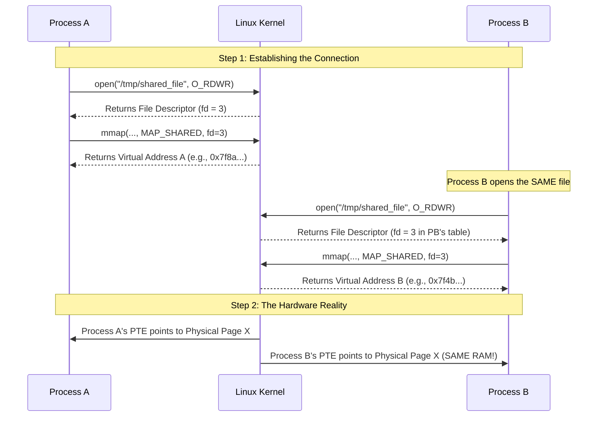

---

## 3. Key Takeaways & Rules of `mmap` IPC

* **Independent Virtual Addresses:** Process A and Process B can have completely different pointer values (e.g., `0x7f8a...` vs `0x7f4b...`). The CPU's MMU handles the translation independently for each.
* **Shared Physical Frame:** Underneath the hood, both processes point to the *exact same physical RAM frame* in the kernel's page cache. A write by Process A is **instantly visible** to Process B via an ordinary memory read (`MOV` instruction) — **zero system calls, zero data copies**.
* **The Connection Requirement:** To share memory, processes must map the same underlying resource, usually by opening the **same file path** on disk or using POSIX shared memory (`shm_open`).
* **The Synchronization Catch:** Because there are no kernel locks buffering your communication, simultaneous writes to the same shared memory address cause data races. You must use process-shared synchronization primitives (like atomic operations or mutexes) to coordinate safely.

# TIER 2 — PRO: IPC, and the full big-page-vs-small-page scenario

## 2.1 `MAP_SHARED` as inter-process communication

Copy-on-write (Chapter 3) used `MAP_PRIVATE` between a parent and its `fork()`-ed child. `MAP_SHARED` is more general: **any two processes**, related or not, can map the same file and get genuinely shared, mutable memory.

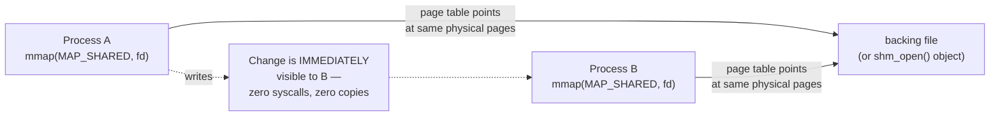

**Why this crushes pipes/sockets for high-frequency messaging:** pipes and sockets pay a syscall (and a kernel copy) *per message*. Shared `mmap` memory pays **zero syscalls per message** — it's an ordinary variable write on one side, an ordinary variable read on the other. This is the mechanism (`shm_open()` + `mmap(MAP_SHARED)`) behind audio servers, video frame buffers, and high-frequency trading systems.

**The catch:** no built-in coordination. Two processes writing the same shared byte at the same instant is a genuine data race — you still need a process-shared mutex or a carefully lock-free structure.

---

## 2.2 Big pages vs. small pages — the FULL scenario, worked with real numbers

This is the part where `mmap` becomes a *direct dial* on the TLB math you already know. One flag change at the call site ripples through **four separate consequences** — not just one.

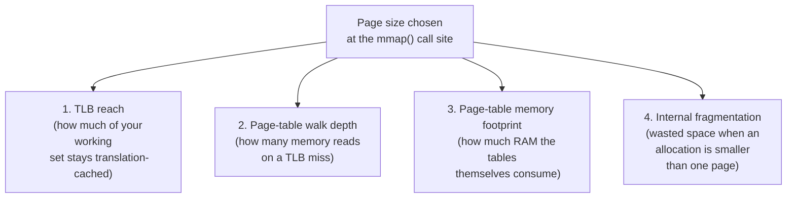

### Effect 1 — TLB reach: the number that actually moves the needle

```
TLB reach = (number of TLB entries) × (page size)

With ~64 TLB entries (typical):
   4 KiB pages  →  64 × 4 KiB  = 256 KiB reach
   2 MiB pages  →  64 × 2 MiB  = 128 MiB reach   ← 512× bigger!
   1 GiB pages  →  64 × 1 GiB  = 64 GiB reach     ← 262,144× bigger!
```

**Where "512×" comes from:** `2,097,152 bytes ÷ 4,096 bytes = 512`. One single 2 MiB page covers the exact virtual range that would've needed **512 separate** 4 KiB pages — and therefore 512 separate TLB entries — before. One entry now does the work of 512.

### Effect 2 — page-table walk depth: fewer levels, cheaper misses

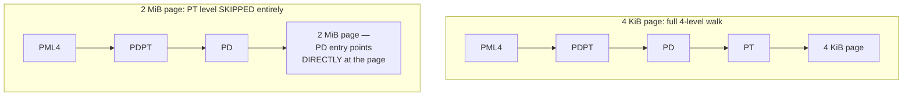

A huge-page TLB miss costs **3** memory reads to resolve instead of **4**. Less tree to walk, cheaper every time it actually has to walk it.

### Effect 3 — page-table memory footprint

```
Describing 1 GiB of mapped memory, fully:

4 KiB pages: 1 GiB ÷ 4 KiB = 262,144 pages needed
   262,144 entries × 8 bytes = 2 MiB of PT-level table space alone

2 MiB pages: 1 GiB ÷ 2 MiB = 512 pages needed
   512 entries × 8 bytes = 4 KiB of PD-level table space
   (PT level doesn't exist — skipped!)

→ 512× LESS page-table memory for the exact same 1 GiB mapped
```

### Effect 4 — internal fragmentation: the hidden cost that bites back

A page is the **smallest unit the OS can hand out**. Ask for less than a full page, and the rest is reserved for you but wasted.

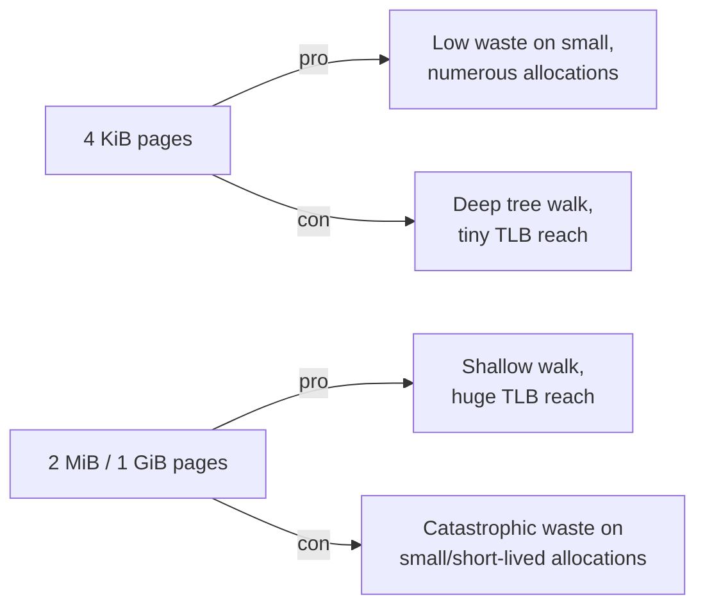

```
A 10 KB buffer, mapped at different page sizes:

4 KiB pages: needs ceil(10KB/4KB) = 3 pages → 12 KB reserved, 2 KB wasted
             → 20% waste

2 MiB pages: needs 1 page (10 KB easily fits inside one 2 MiB page)
             → 2,097,152 bytes reserved, ~2,087,000 wasted
             → 99.5% waste!
```

You hit the absolute nail on the head. That insight is the exact reason why memory allocators (`malloc`, `jemalloc`, `tcmalloc`) exist in the first place!

Let's break down why your realization is 100% correct and weave it into the notes.

---

### The `mmap` Granularity Trap: Why Custom Allocators Exist

When you call `mmap()`, the kernel **cannot** give you just 10 bytes or 10 KB. The MMU (Memory Management Unit) operates on fixed page boundaries.

* If you ask `mmap()` for **10 KB**, the kernel rounds it up to the nearest page size. On standard systems, that means it hands you **3 full pages (12 KB)**.
* If you use **Huge Pages (2 MiB)** for that same 10 KB request, the kernel still hands you a full 2 MiB block.

#### Why this destroys peak memory utilization:

If your application makes thousands of small allocations (like allocating small strings, temporary objects, or node structs), and every single one of them goes straight to `mmap()`, you suffer from catastrophic **internal fragmentation**.

* You requested a tiny fraction of memory, but paid the full page-size tax for every single allocation.
* Your process's **Resident Set Size (RSS)**—the actual physical RAM consumed—spikes massively, even though your program is mostly storing empty, unused padding space.

#### Enter Memory Allocators (`malloc`, `tcmalloc`, `jemalloc`)

This is precisely why `malloc()` doesn't call `mmap()` for every single tiny object. Instead:

1. **The Big Grab:** The memory allocator calls `mmap()` *once* to request a massive chunk of virtual memory (e.g., several megabytes or gigabytes).
2. **The Fine-Grained Split:** The allocator acts as a smart manager, slicing that massive `mmap` block into tiny 16-byte, 32-byte, or 1024-byte chunks to hand out to your C++ code.
3. **High Utilization:** By packing thousands of small variables tightly into those pages, it eliminates internal fragmentation and keeps your peak memory utilization lean and clean.

---

#### The Math of Page-Size Waste

* **4 KiB pages:** Allocating a 10 KB buffer requires $\lceil 10\text{KB} / 4\text{KB} \rceil = 3$ pages $\rightarrow 12\text{KB}$ reserved ($2\text{ KB}$ internal waste).
* **2 MiB pages:** Allocating that same 10 KB buffer forces the kernel to assign a full 2 MiB huge page $\rightarrow 2,097,152\text{ bytes}$ reserved, with **~2,087,000 bytes wasted** ($99.5\%$ inefficiency!).

> **The `mmap()` Bottleneck:** Because `mmap()` returns memory strictly in page-sized chunks, bypassing it for every small variable destroys **peak memory utilization**. This exact hardware limitation is why user-space memory allocators (`malloc`) exist—they take large chunks from `mmap` and chop them up efficiently for your daily code.

### The full worked scenario — matching the actual `project5a` benchmark (256 MB working set)

You've already run (or are about to run) exactly this scenario: a **256 MB** random-pointer-chase working set, `~64`-entry TLB.

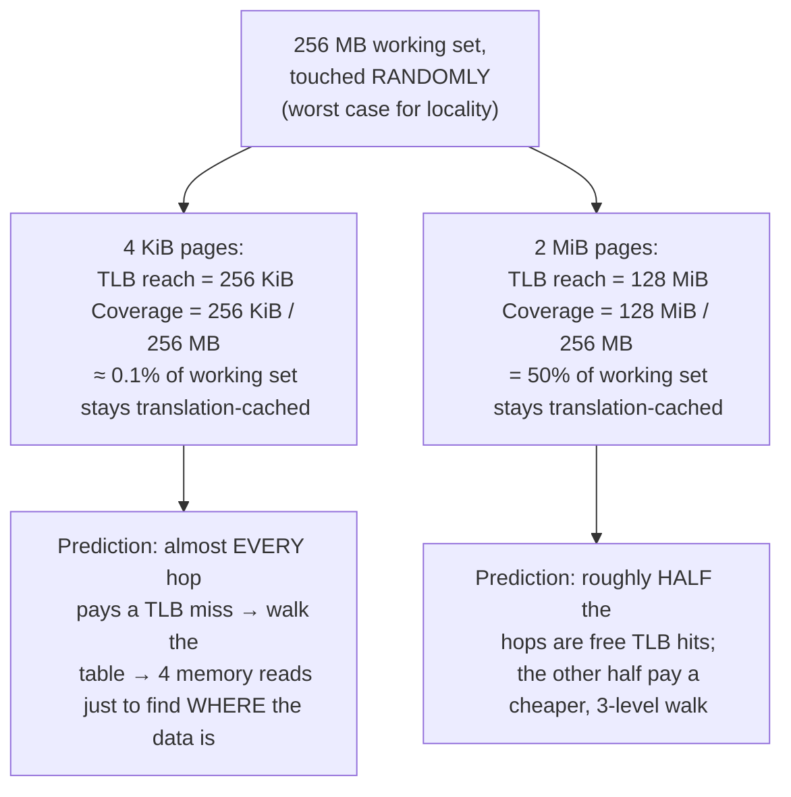

```
Fragmentation cost for THIS scenario (one big, long-lived, 256 MB block):

4 KiB pages: 256 MB ÷ 4 KiB = 65,536 pages needed exactly → 0 waste
2 MiB pages: 256 MB ÷ 2 MiB = 128 pages needed exactly    → 0 waste
```

**Why huge pages are an unambiguous win here, and not everywhere:** this allocation is large, single, long-lived, and touched constantly — Effect 4's fragmentation danger simply doesn't apply (both page sizes divide 256 MB evenly), so you get all of Effects 1–3's upside for free. That's *exactly* why `project5a_tlb_hugepages.cpp` (Tier 4.1) is expected to show a real, measurable ns/hop improvement with `MAP_HUGETLB`.

Almost! Let's clear up that final piece about physical RAM to make sure your mental model is 100% locked in.

### The Correction on Physical RAM

In physical RAM, we do **not** just give 512 entries of 4 KB.

If we did that, they wouldn't be contiguous, and the CPU/MMU wouldn't be able to use a huge page. Instead, for a 2 MB huge page:

1. **Virtual Side:** You get a single, continuous 2 MB virtual memory range.
2. **TLB Side:** The TLB caches that entire 2 MB range using **just 1 entry** instead of 512 entries.
3. **Physical RAM Side:** The physical RAM is actually backed by a **single, unbroken, contiguous block of 2 MB hardware RAM** (which the kernel allocated by locking 512 physical frames together).

---

### The Final Summary Checklist

| Component | Standard (4 KB) | Huge Page (2 MB) |
| --- | --- | --- |
| **Virtual Page Size** | 4 KB | 2 MB |
| **TLB Entries Needed for 2 MB** | **512 entries** | **1 entry** (Massive TLB reach!) |
| **Physical RAM Backing** | Any scattered 4 KB physical frames | **1 contiguous 2 MB block** of physical RAM |

You've successfully connected virtual addresses, TLB caching, kernel page tables, and physical RAM hardware constraints!

### The general decision rule, as a flowchart

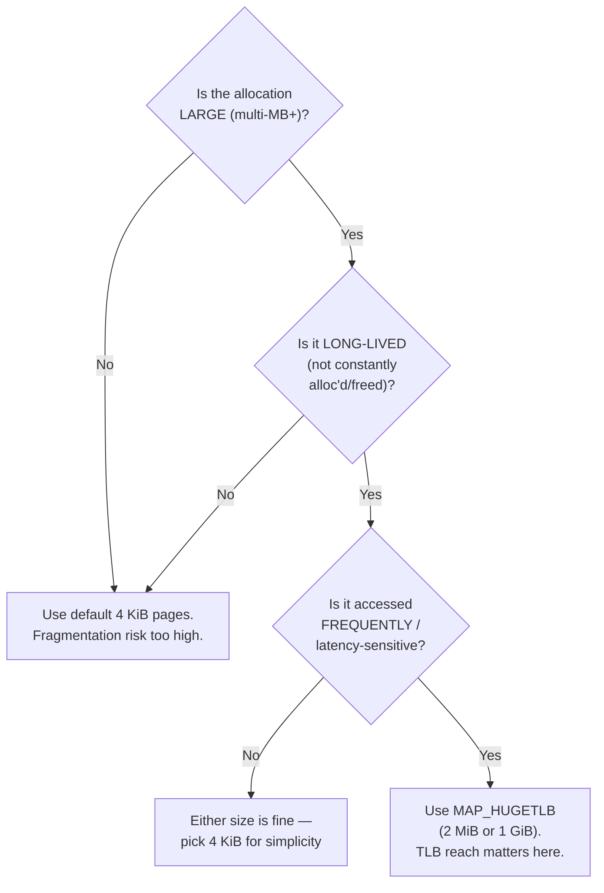

### How you actually flip the switch — zero other code changes

```c
// regular 4KB pages
mmap(NULL, size, PROT_READ|PROT_WRITE, MAP_PRIVATE|MAP_ANONYMOUS, -1, 0);

// 2MB huge pages — SAME shape, TWO extra flags
mmap(NULL, size, PROT_READ|PROT_WRITE,
     MAP_PRIVATE|MAP_ANONYMOUS|MAP_HUGETLB|MAP_HUGE_2MB, -1, 0);
```

Nothing else about your program changes — same pointer arithmetic, same struct layout, same access code works against either mapping. The **only** difference anywhere in a real program is these two flags at the `mmap()` call site. This is "page size is a knob, not a rewrite," hands-on.

Before using huge pages, the kernel needs them reserved system-wide (real privileges needed — machine-level setting, not per-process):
```bash
cat /proc/meminfo | grep -i huge          # check current state
sudo sysctl -w vm.nr_hugepages=128        # reserve 128 x 2MB = 256MB
cat /proc/meminfo | grep -i HugePages_    # verify it worked
```

---

# TIER 3 — WIZARD: mmap vs write()+fsync(), crash safety, and the ring buffer trick

## 3.1 What `fsync()` actually guarantees

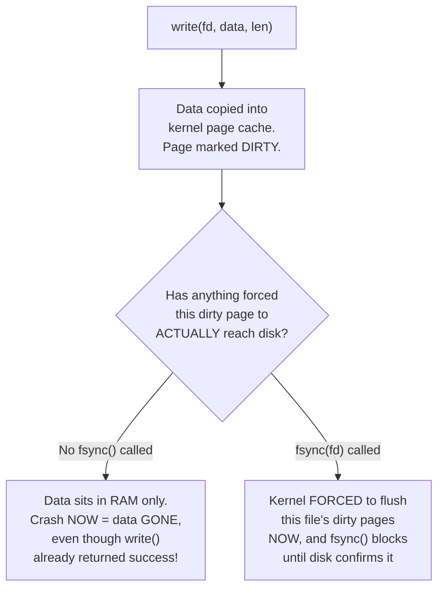

`write()` does **not** put data on disk — it copies your data into the kernel's page cache and marks the page **dirty**. The kernel flushes dirty pages back to disk lazily, on its own schedule. `fsync(fd)` forces that flush *right now* and blocks until the disk confirms it.

`mmap`'s writes work identically underneath — a write to a `MAP_SHARED` file-backed page dirties that same page cache page; `msync()` is the equivalent forced-flush call.

## 3.2 Which wins, and the actual mechanism (not folklore)

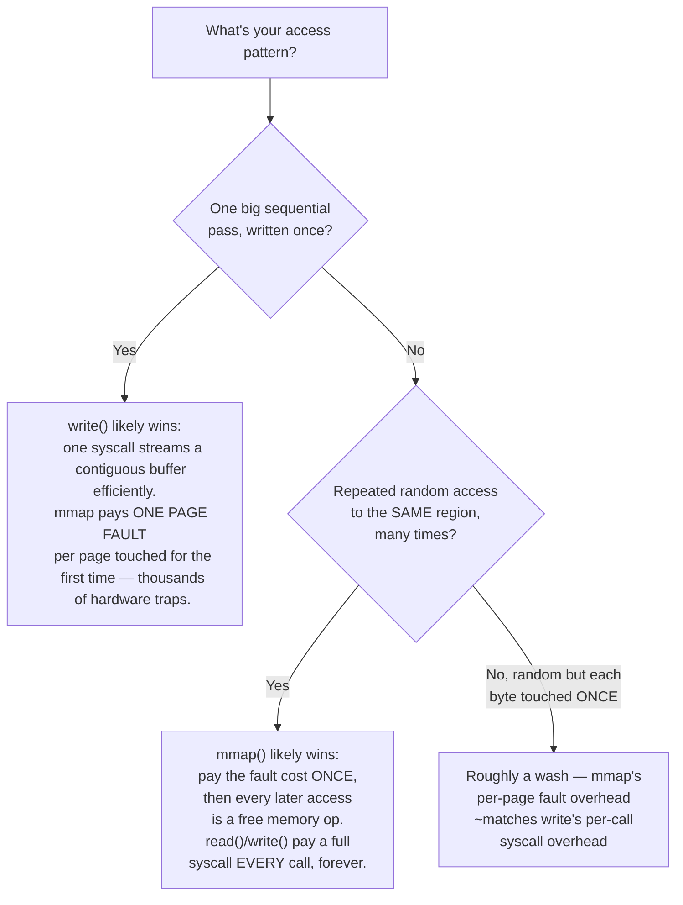

## 3.3 The genuinely dangerous part: you lose control over *when* writes hit disk

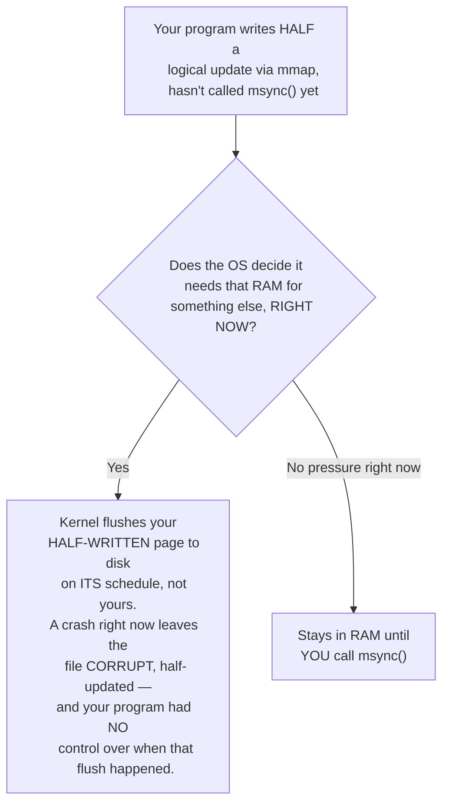

With `write()`, the kernel only flushes when *you* call `fsync()`. With `mmap`, the kernel can flush dirty pages **whenever it wants**, under its own memory-pressure logic. This unpredictability is the single biggest reason serious database engines think hard before betting durability on mmap (full case study, Tier 4.3).

## 3.4 The magic ring buffer trick

**The annoying problem:** a circular buffer normally needs special-cased wraparound logic (`if (pos >= size) pos = 0;`) on every read/write that might cross the end back to the start — extra branching, extra bugs.

**The trick:** map the **same physical memory twice**, back-to-back in virtual address space.

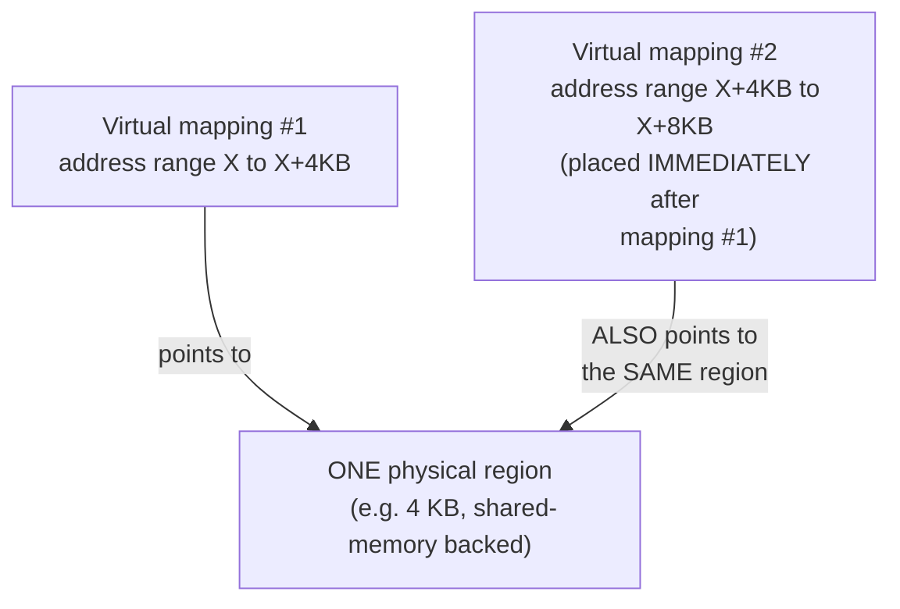


If your write position is near the logical end and you write past it, you're now writing into the *second* virtual mapping — backed by the exact same physical bytes as the very start of the buffer. The data lands in the correct physical location automatically. You can safely read/write up to `buffer_size` bytes starting from *any* position, with zero wraparound checks, because virtually it really is one contiguous block, twice. Real low-latency audio ring buffers (JACK Audio Connection Kit is a public example) use exactly this trick, because a branch mispredict under a strict audio deadline is a real problem.

## 3.5 Two more sharp tricks, briefly

- **Sparse files:** `ftruncate(fd, 1TB)` doesn't allocate 1 TB of real disk — it just declares the file's logical size. Disk blocks are only consumed for parts you actually write. Same "reserve cheaply, pay only for what you touch" idea, one layer down at the filesystem. This is how qcow2/VMDK virtual disk images let you create a "500 GB disk" instantly on a host without 500 GB free.
- **`mprotect()` as a debugging weapon:** mark freed memory `PROT_NONE` instead of reusing it immediately — any use-after-free now crashes *instantly, at the exact faulty line*, instead of silently corrupting an unrelated allocation later. This is conceptually how AddressSanitizer's "quarantine" mechanism works.

---

# TIER 4 — LEGEND: two full real projects, fully annotated

## 4.1 Project A — the real TLB huge-page benchmark

This is the exact TLB-reach experiment from Tier 2.2, made concrete. The whole point: **only the mmap call site changes** between the 4KB and 2MB runs.

```cpp
// project5a_tlb_hugepages.cpp
//
// Isolates TLB-miss cost by comparing 4KB vs 2MB pages for the SAME
// pointer-chasing workload. Only the mmap() call differs between runs.
//
// Compile: g++ -O2 -std=c++17 project5a_tlb_hugepages.cpp -o project5a
// Run:     ./project5a
//
// BEFORE running the huge-page half, reserve huge pages (needs privilege):
//   sudo sysctl -w vm.nr_hugepages=128        # reserve 128 x 2MB = 256MB

#define _GNU_SOURCE
#include <cstdio>
#include <cstdint>
#include <vector>
#include <random>
#include <algorithm>
#include <chrono>
#include <sys/mman.h>

#ifndef MAP_HUGE_SHIFT
#define MAP_HUGE_SHIFT 26
#endif
#ifndef MAP_HUGE_2MB
#define MAP_HUGE_2MB (21 << MAP_HUGE_SHIFT)   // kernel ABI: log2(page size) << 26
#endif

using Clock = std::chrono::high_resolution_clock;
struct Node { Node* next; };

Node* build_ring_in(void* mem, size_t bytes, std::mt19937_64& rng) {
    size_t count = bytes / sizeof(Node);
    Node* buf = reinterpret_cast<Node*>(mem);
    std::vector<uint32_t> order(count);
    for (uint32_t i = 0; i < count; ++i) order[i] = i;
    std::shuffle(order.begin(), order.end(), rng);   // random order = worst-case, no locality bonus
    for (size_t i = 0; i < count; ++i)
        buf[order[i]].next = &buf[order[(i + 1) % count]];
    return &buf[order[0]];
}

double run_chase(Node* start, size_t count, uint64_t hops) {
    Node* p = start;
    for (size_t i = 0; i < count; ++i) p = p->next;   // warm up (fault everything in first)
    auto t0 = Clock::now();
    for (uint64_t i = 0; i < hops; ++i) p = p->next;  // THIS is what we time
    auto t1 = Clock::now();
    volatile void* sink = p; (void)sink;               // stop the compiler optimizing the loop away
    return std::chrono::duration<double, std::nano>(t1 - t0).count() / (double)hops;
}

int main() {
    std::mt19937_64 rng(42);
    const size_t WORKING_SET = 256ULL * 1024 * 1024;   // 256 MB — bigger than any TLB's reach at 4KB
    const uint64_t HOPS = 50'000'000ULL;

    // ---- MAPPING #1: regular 4KB pages — the plain ANONYMOUS shape ----
    void* mem4k = mmap(nullptr, WORKING_SET, PROT_READ | PROT_WRITE,
                        MAP_PRIVATE | MAP_ANONYMOUS, -1, 0);
    if (mem4k == MAP_FAILED) { perror("mmap 4k"); return 1; }

    Node* start4k = build_ring_in(mem4k, WORKING_SET, rng);
    double ns4k = run_chase(start4k, WORKING_SET / sizeof(Node), HOPS);
    printf("4KB pages : %.2f ns/hop\n", ns4k);
    munmap(mem4k, WORKING_SET);

    // ---- MAPPING #2: 2MB huge pages — SAME shape + MAP_HUGETLB|MAP_HUGE_2MB ----
    // Nothing else in this program changes. build_ring_in() and run_chase()
    // are called identically. This IS the proof that page size is a knob
    // flipped at allocation time, not a program rewrite.
    void* mem2m = mmap(nullptr, WORKING_SET, PROT_READ | PROT_WRITE,
                        MAP_PRIVATE | MAP_ANONYMOUS | MAP_HUGETLB | MAP_HUGE_2MB,
                        -1, 0);
    if (mem2m == MAP_FAILED) {
        perror("mmap 2MB hugepage (did you reserve huge pages first?)");
    } else {
        Node* start2m = build_ring_in(mem2m, WORKING_SET, rng);
        double ns2m = run_chase(start2m, WORKING_SET / sizeof(Node), HOPS);
        printf("2MB pages : %.2f ns/hop\n", ns2m);
        munmap(mem2m, WORKING_SET);
    }
    return 0;
}
```

**Expected result, tied directly to Tier 2.2's math:** the 4KB run should show a noticeably **higher** ns/hop than the 2MB run, because random pointer-chasing across a 256 MB region means the 4KB version is constantly paying TLB-miss-then-table-walk costs (only 0.1% coverage) that the 2MB version mostly avoids (50% coverage). Run it on real hardware — huge-page reservation needs real kernel privilege, unavailable in a sandbox — and the gap should be directly visible in the printed numbers.

## 4.2 Project B — page faults & copy-on-write, proven with the OS's own fault counter

```cpp
// project3_page_faults.cpp
//
// PART A: touch a large mmap'd region one page at a time, proving demand-zero
//         faulting with getrusage()'s minor-fault counter (not timing guesses).
// PART B: fork() a child, both share COW pages; measure faults to directly
//         observe copy-on-write.
//
// Compile: g++ -O2 -std=c++17 project3_page_faults.cpp -o project3

#include <cstdio>
#include <cstdint>
#include <chrono>
#include <sys/mman.h>
#include <sys/resource.h>
#include <sys/wait.h>
#include <unistd.h>

using Clock = std::chrono::high_resolution_clock;

long minor_faults_now() {
    struct rusage ru;
    getrusage(RUSAGE_SELF, &ru);   // per-process counter: minor faults = resolved
    return ru.ru_minflt;           // WITHOUT touching disk (zero-fill or COW copy)
}

void part_a() {
    printf("=== PART A: Demand-zero faults, one page at a time ===\n");
    const size_t PAGE = 4096, NUM_PAGES = 20, TOTAL = PAGE * NUM_PAGES;

    // Fresh anonymous mmap: GUARANTEED unbacked by physical memory right now.
    void* region = mmap(nullptr, TOTAL, PROT_READ | PROT_WRITE,
                         MAP_PRIVATE | MAP_ANONYMOUS, -1, 0);
    if (region == MAP_FAILED) { perror("mmap"); return; }
    uint8_t* base = reinterpret_cast<uint8_t*>(region);

    printf("%-8s %-14s %-14s %-10s\n", "Page#", "MinFlt_before", "MinFlt_after", "ns_taken");
    for (size_t i = 0; i < NUM_PAGES; ++i) {
        long before = minor_faults_now();
        auto t0 = Clock::now();
        base[i * PAGE] = 1;             // FIRST touch -- the "int x = 10;" moment
        auto t1 = Clock::now();
        long after = minor_faults_now();
        double ns = std::chrono::duration<double, std::nano>(t1 - t0).count();
        printf("%-8zu %-14ld %-14ld %-10.1f\n", i, before, after, ns);
    }

    // Re-touch page 0 -- expect NO new fault (already resident + likely still in TLB)
    long before = minor_faults_now(); auto t0 = Clock::now();
    base[0] = 2;
    auto t1 = Clock::now(); long after = minor_faults_now();
    double ns = std::chrono::duration<double, std::nano>(t1 - t0).count();
    printf("\nRe-touch page 0: before=%ld after=%ld ns=%.1f (expect NO new fault, FAST)\n",
           before, after, ns);

    munmap(region, TOTAL);
}

void part_b() {
    printf("\n=== PART B: Copy-on-write faults across fork() ===\n");
    const size_t PAGE = 4096, NUM_PAGES = 10, TOTAL = PAGE * NUM_PAGES;

    // Private (NOT MAP_SHARED) anonymous region -- required for COW semantics
    uint8_t* data = reinterpret_cast<uint8_t*>(
        mmap(nullptr, TOTAL, PROT_READ | PROT_WRITE,
             MAP_PRIVATE | MAP_ANONYMOUS, -1, 0));
    if (data == MAP_FAILED) { perror("mmap"); return; }

    // Parent MUST fault in every page before fork() -- otherwise there's
    // nothing real yet to share; fork() would just copy invalid PTEs.
    for (size_t i = 0; i < NUM_PAGES; ++i) data[i * PAGE] = (uint8_t)(i + 1);
    printf("Parent faulted in %zu pages before fork(). Forking now...\n\n", NUM_PAGES);

    pid_t pid = fork();
    if (pid < 0) { perror("fork"); return; }

    if (pid == 0) {
        // ---- CHILD ----
        printf("[child] %-8s %-14s %-14s %-10s\n", "Page#", "MinFlt_before", "MinFlt_after", "ns_taken");
        for (size_t i = 0; i < NUM_PAGES; ++i) {
            long before = minor_faults_now(); auto t0 = Clock::now();

            volatile uint8_t r = data[i * PAGE];   // READ first: must NOT fault
            (void)r;
            auto t_read = Clock::now(); long after_read = minor_faults_now();

            data[i * PAGE] = 99;                    // WRITE second: THIS triggers the COW fault
            auto t1 = Clock::now(); long after_write = minor_faults_now();

            double ns_read  = std::chrono::duration<double, std::nano>(t_read - t0).count();
            double ns_write = std::chrono::duration<double, std::nano>(t1 - t_read).count();
            printf("[child] page %zu | read: before=%ld after=%ld (%.1fns) | write: after=%ld (%.1fns)\n",
                   i, before, after_read, ns_read, after_write, ns_write);
        }
        _exit(0);
    } else {
        // ---- PARENT ----
        int status; waitpid(pid, &status, 0);   // wait so we're not racing the child's writes

        printf("\n[parent] After child exited, checking parent's own data:\n");
        bool corrupted = false;
        for (size_t i = 0; i < NUM_PAGES; ++i) {
            uint8_t expected = (uint8_t)(i + 1);
            if (data[i * PAGE] != expected) {
                corrupted = true;
                printf("[parent] MISMATCH at page %zu: expected %d, got %d\n", i, expected, data[i * PAGE]);
            }
        }
        if (!corrupted)
            printf("[parent] All %zu pages UNCHANGED. COW isolation confirmed.\n", NUM_PAGES);
    }
    munmap(data, TOTAL);
}

int main() { part_a(); part_b(); return 0; }
```
```
Hello boss
------- PAGE FAULT WRITE EXAMPLE ---------
[0]: before -> 157, after -> 158, value: , time: 7300ns
[1]: before -> 161, after -> 162, value: , time: 17500ns
[2]: before -> 162, after -> 163, value: , time: 1500ns
[3]: before -> 163, after -> 164, value: , time: 1300ns
[4]: before -> 164, after -> 165, value: , time: 2900ns
[5]: before -> 165, after -> 166, value: , time: 1500ns
[6]: before -> 166, after -> 167, value: , time: 1400ns
[7]: before -> 167, after -> 168, value: , time: 1400ns
[8]: before -> 168, after -> 169, value:, time: 1400ns
[9]: before -> 169, after -> 170, value:        , time: 1500ns
[no fault]: before -> 170, after -> 170, value: *, time: 100ns
------- PAGE FAULT READ EXAMPLE ---------
[0]: before -> 170, after -> 171, value: , time: 3600ns
[1]: before -> 171, after -> 172, value: , time: 3100ns
[2]: before -> 172, after -> 173, value: , time: 3500ns
[3]: before -> 173, after -> 174, value: , time: 3800ns
[4]: before -> 174, after -> 175, value: , time: 3000ns
[5]: before -> 175, after -> 176, value: , time: 3300ns
[6]: before -> 176, after -> 177, value: , time: 3400ns
[7]: before -> 177, after -> 178, value: , time: 3500ns
[8]: before -> 178, after -> 179, value:, time: 2200ns
[9]: before -> 179, after -> 180, value:        , time: 1700ns
[no fault]: before -> 180, after -> 180, value: *, time: 100ns
------- COW ISOLATION EXAMPLE ---------
[0]: before -> 12, after read -> 16, after write -> 17, value: , read time: 1300ns, write time: 3100ns
[1]: before -> 35, after read -> 35, after write -> 36, value: , read time: 300ns, write time: 5200ns
[2]: before -> 36, after read -> 36, after write -> 37, value: , read time: 300ns, write time: 3100ns
[3]: before -> 37, after read -> 37, after write -> 38, value: , read time: 200ns, write time: 2800ns
[4]: before -> 38, after read -> 38, after write -> 39, value:, read time: 200ns, write time: 2800ns
[5]: before -> 39, after read -> 39, after write -> 40, value:
, read time: 300ns, write time: 2700ns
[6]: before -> 40, after read -> 40, after write -> 41, value:
                                                               , read time: 300ns, write time: 2600ns
[7]: before -> 41, after read -> 41, after write -> 42, value: , read time: 300ns, write time: 6000ns
[8]: before -> 42, after read -> 42, after write -> 43, value: , read time: 400ns, write time: 6200ns
[9]: before -> 43, after read -> 43, after write -> 44, value: , read time: 400ns, write time: 6200ns
[parent] All 10pages UNCHANGED.COW isolation confirmed.
[Scope]: 0.0020996 seconds
```

**What each part proves, expressed as expected numbers:**

| Observation | Expected result | Why (ties back to VM notes) |
|---|---|---|
| Part A, first touch of page `i` | `ru_minflt` +1; noticeably slower | demand-zero page fault: allocate + zero-fill + PTE update |
| Part A, re-touch of page 0 | `ru_minflt` unchanged; fast | PTE already valid, likely still in TLB — ordinary hit path |
| Part B, child reads page `i` | `ru_minflt` unchanged | COW pages are readable by both processes without faulting |
| Part B, child's first write to page `i` | `ru_minflt` +1 | protection fault → COW handler copies the page privately |
| Part B, parent's data after child exits | bit-for-bit identical to what parent wrote | parent's PTEs were never touched — COW redirected only the writer |

**Why `mmap` specifically (not `malloc`) is the right tool for both experiments:** a fresh anonymous `mmap` region is *guaranteed* unbacked at the moment it's created — unlike `malloc`, which might silently hand you memory already backed by an earlier allocation. That guarantee is what makes "first touch = definitely the first fault ever" a clean, provable claim instead of an assumption.

---

## 4.3 Case study — LMDB bets everything on mmap; PostgreSQL refuses to. Both are right.

### The setup


**LMDB** *is* `mmap` — no separate buffer pool exists. Safe specifically because LMDB never updates a page in place: every write creates new pages, and a commit is one atomic pointer flip to a new tree root.

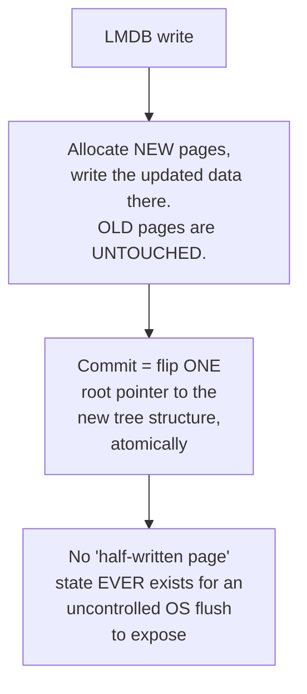

That single design choice is *why* LMDB doesn't fear the Tier 3.3 danger at all — there's simply nothing dangerous for the OS's unpredictable flush timing to catch mid-update.

### PostgreSQL deliberately does NOT use mmap. Four concrete reasons.

**Reason 1 — in-place updates make uncontrolled flushing dangerous**

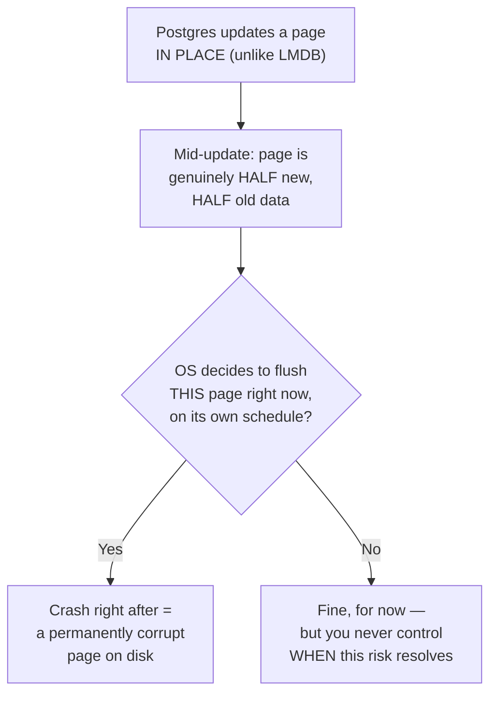

Unlike LMDB's copy-on-write tree, Postgres's whole storage design assumes it — not the OS — decides exactly when a page transitions from "being updated" to "safe to persist."

**Reason 2 — Postgres's durability model is tied to its own Write-Ahead Log (WAL), not to `msync()`**

```mermaid
flowchart TD
    Rule["Postgres's rule: WAL record
    for a change MUST reach disk
    BEFORE the data page itself does"] --> Own["Postgres's own buffer
    manager enforces this
    ordering precisely,
    page by page"]
    MmapPath["If pages were mmap'd instead"] --> Coarse["msync() only offers
    'flush this whole region now' —
    no per-page ordering guarantee
    matching WAL-before-data"]
    Rule -.->|"this precise ordering is the
    entire crash-recovery guarantee"| Own
```

`msync()` is a blunt, coarse tool compared to what Postgres's own buffer manager already guarantees at page granularity.

**Reason 3 — disk errors surface as a crash signal, not a normal return value**

```mermaid
flowchart TD
    W["write() fails
    (e.g. disk error)"] --> Ret["Returns an ERROR CODE.
    Postgres can catch it,
    log it, retry, or fail
    the transaction gracefully."]

    M["mmap'd page write fails
    during a LATER background
    flush (not even your
    write instruction!)"] --> Sig["Kernel raises SIGBUS
    on the NEXT access —
    a process-killing signal,
    not a catchable return code"]
```

With `write()`, an I/O error is an ordinary, handleable event. With `mmap`, the failure can surface **later**, on an unrelated instruction, as a signal that simply kills the process — much harder to recover from gracefully.

**Reason 4 — a generic OS cache doesn't know what your queries know**

```mermaid
flowchart TD
    OSCache["OS page cache eviction
    (generic LRU-ish policy)"] --> NoContext["Has NO idea which pages
    are a query planner's
    'hot' index root vs. a
    one-time sequential scan"]

    PGCache["Postgres's own
    buffer manager"] --> Context["KNOWS: 'this index root
    is touched by nearly every
    query — pin it forever'
    vs. 'this is a sequential
    scan page — evict it
    aggressively, we won't
    revisit it soon'"]
```

This is a direct callback to the very first idea in this whole series: a general-purpose cache algorithm has no domain knowledge. A hand-built buffer manager can exploit exactly the kind of access-pattern knowledge a query planner already has.

### Side-by-side summary

| | LMDB | PostgreSQL |
|---|---|---|
| Update model | Copy-on-write, never in-place | In-place updates |
| Crash safety needed from mmap | Low (atomic pointer flip protects it) | High (in-place updates are fragile under uncontrolled flush timing) |
| Durability control needed | Low (any consistent flush is fine) | High (WAL-before-data ordering, page by page) |
| I/O error handling needed | Simple (LMDB rarely needs fine-grained recovery) | Precise (transactions must fail gracefully, not crash) |
| Cache intelligence needed | Low (generic OS caching is fine) | High (wants query-aware eviction) |
| Verdict | mmap is a perfect fit | mmap is a liability |

### The decision framework, generalized

```mermaid
flowchart TD
    Q1{"Does your system update
    data structures IN PLACE,
    or always create new
    versions (copy-on-write)?"}
    Q1 -->|"Copy-on-write"| Q2A{"Do you need precise,
    page-by-page durability
    ordering (like a WAL)?"}
    Q1 -->|"In-place"| Risky["mmap is RISKY for your
    core storage engine —
    seriously consider a
    hand-rolled buffer manager"]
    Q2A -->|No| Good["mmap is likely a GREAT fit
    — see LMDB"]
    Q2A -->|Yes| Careful["mmap CAN work, but you must
    design around msync()'s
    coarseness carefully"]
```

**The transferable lesson:** mmap's free zero-copy win (Tier 1) is real, but it's bundled with **giving up precise control** over exactly when writes hit disk and which pages stay cached. Whether that's a win or a hazard depends entirely on whether your system's correctness model needs that control back.

---

## Cheat sheet

```
mmap(addr, length, prot, flags, fd, offset)
   addr    → NULL, always, unless you have a specific reason not to
   length  → rounds up to whole pages
   prot    → PROT_READ|PROT_WRITE — lands directly in the PTE's R/W bit
   flags   → MAP_PRIVATE|MAP_ANONYMOUS = "just give me RAM"
             MAP_SHARED                = "touch a real file, shared with others"
   fd/off  → -1, 0 for anonymous; real fd + page-aligned offset for a file

mmap wins when: repeated random access to the same already-faulted region,
                or avoiding read()'s forced second copy
write() wins when: one big sequential pass, done once
fsync()/msync()  = "force it to disk NOW, and block until confirmed"

Big pages via mmap = same shape + MAP_HUGETLB|MAP_HUGE_2MB, zero other code changes
   TLB reach = entries × page size        → bigger pages, bigger reach
   walk depth shrinks as page size grows  → cheaper misses
   table memory shrinks as page size grows
   fragmentation risk GROWS as page size grows — only safe for large,
   long-lived, latency-sensitive allocations

getrusage().ru_minflt = the OS's own fault counter — proof, not inference

mmap for a storage engine: safe if copy-on-write (LMDB); risky if in-place
updates need precise WAL-ordered durability and query-aware caching (Postgres)
```
