# Chapter 6 — brk/sbrk: The Other Way to Get Memory
### From "what is the program break" to "here's exactly when my own allocator should use brk vs mmap"

---

# TIER 0 — Syntax Bootcamp

## 0.1 The two functions, in full

```c
#include <unistd.h>

int   brk(void *addr);      // set the break to an EXACT address
void *sbrk(intptr_t increment); // move the break by a RELATIVE amount
```

**`brk(addr)`** — "Set my heap's end boundary to exactly this address."
Returns `0` on success, `-1` on failure.

**`sbrk(increment)`** — "Move my heap's end boundary by this many bytes"
(positive = grow, negative = shrink, `0` = don't move it, just tell me
where it currently is). Returns the **previous** break address on
success, `(void*)-1` on failure.

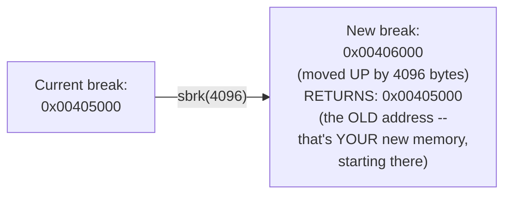

**The single most important gotcha, stated up front:** `sbrk`'s return
value is the address *before* the move — i.e., it hands you a pointer to
the start of the newly-added region, exactly like `malloc` would. This is
not an accident; it's designed to be used exactly that way.

## 0.2 What "the break" actually is

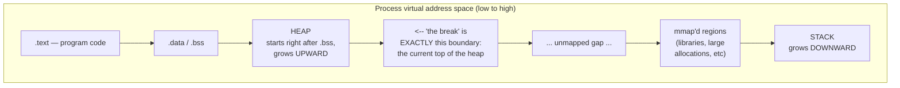

The **break** is just a single address — the current upper limit of one
specific `vm_area_struct` (Chapter 3, Tier 5.2), the one labeled `[heap]`
in `/proc/self/maps`. `sbrk`/`brk` do exactly **one thing**: move that one
boundary up or down. There is no "which region" parameter, because there
is only ever **one** heap region per process, by definition.

## 0.3 Your first sbrk, standalone

```cpp
// hello_sbrk.cpp
// Compile: g++ -O2 -std=c++17 hello_sbrk.cpp -o hello_sbrk
// Run:     ./hello_sbrk

#include <cstdio>
#include <unistd.h>

int main() {
    void* before = sbrk(0); // increment=0 means "just tell me where it is"
    printf("Initial break: %p\n", before);

    void* new_mem = sbrk(4096); // grow the heap by exactly one page
    printf("sbrk(4096) returned: %p (this is YOUR new memory)\n", new_mem);

    void* after = sbrk(0);
    printf("Break is now:  %p\n", after);
    printf("Difference: %ld bytes (should be 4096)\n",
           (char*)after - (char*)before);

    // Use the memory we just claimed, like malloc would give us
    int* p = reinterpret_cast<int*>(new_mem);
    *p = 12345;
    printf("Wrote %d into our new memory, read back: %d\n", 12345, *p);

    // Give it back by moving the break down again
    sbrk(-4096);
    void* final = sbrk(0);
    printf("After sbrk(-4096), break is: %p (should match initial)\n", final);

    return 0;
}
```

Run this and confirm: the break moves up by exactly 4096, you can write
through the returned pointer immediately (it's real memory the moment
`sbrk` returns — no lazy fault-on-first-touch subtlety to worry about
here, since the kernel commits this synchronously), and moving it back
down returns you to where you started.

---

# TIER 1 — BEGINNER: how malloc actually uses this

## 1.1 The obvious naive allocator, built directly on sbrk

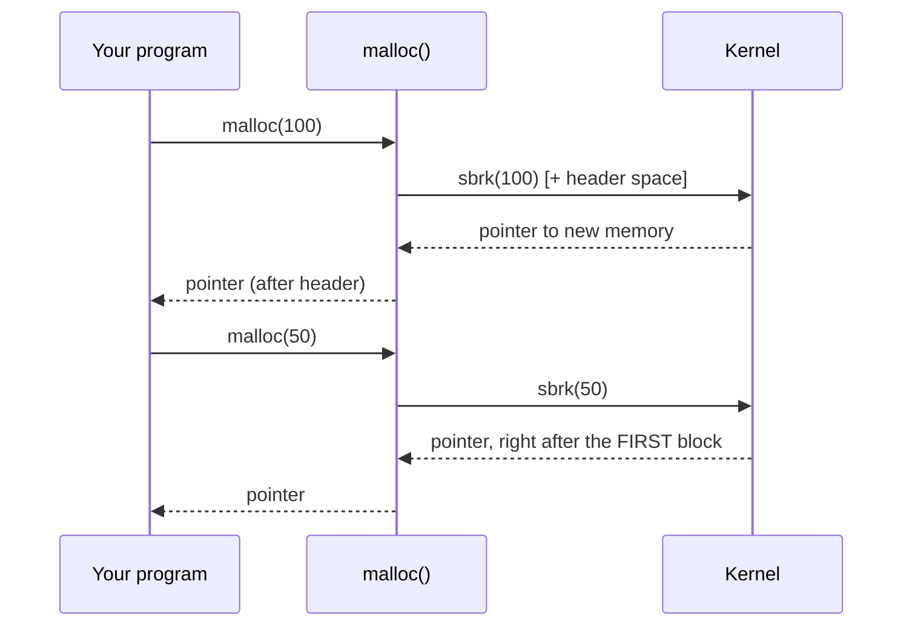

This is, almost literally, the **implicit free list** allocator from your
CMU 15-213 material — every `malloc` call that can't be satisfied from an
existing free block just calls `sbrk` to extend the heap and carve the
new space off the top. This is Chapter 7 of this series, built on exactly
this foundation.

## 1.2 Why `free` is *not* the mirror image of this

Here's the thing that trips almost everyone up on first exposure: **`free`
essentially never calls `sbrk(-size)`.** If it did, memory would only ever
be reclaimable in perfect last-in-first-out order — free the *most
recently* allocated block, and only that one, or the break can't move
down at all (Tier 3 makes this precise). Real allocators instead mark the
freed block as "free" **in place**, keep it in the heap, and hope to
reuse it for a *future* `malloc` call of a similar size — the break
almost never actually shrinks in a typical running program.

---

# TIER 2 — INTERMEDIATE: brk vs mmap, head to head

## 2.1 Both can give you "a growable chunk of RAM" — so why two mechanisms?

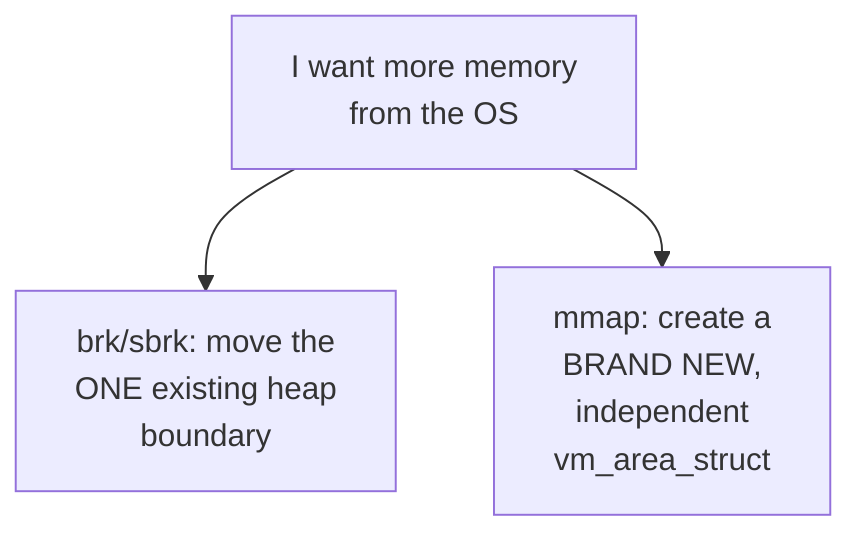

| | `brk`/`sbrk` | `mmap` (anonymous) |
|---|---|---|
| How many regions can exist | Exactly **one** (the heap) | **Unlimited** — a new region per call |
| Kernel bookkeeping per call | Cheap — just move one boundary | More expensive — new `vm_area_struct`, inserted into the process's region tree |
| Can you free it in the *middle*? | **No** — see Tier 3 | **Yes** — `munmap()` any individual region independently |
| Alignment/page-granularity | Whatever you ask, but the *boundary itself* is what the kernel tracks | Always whole pages |
| Typical use | Many small, short-lived allocations | Few large, long-lived allocations, or ones you want to release individually |

## 2.2 The concrete mechanical reason mmap costs more per call

Every `mmap` call means the kernel has to: find a free spot in your
address space, create a new `vm_area_struct`, and insert it into the
process's region-tracking data structure (a red-black tree, for fast
lookup during page faults — this is real Linux kernel internals, not
simplification). `sbrk` skips **all of that** — it just edits one number.

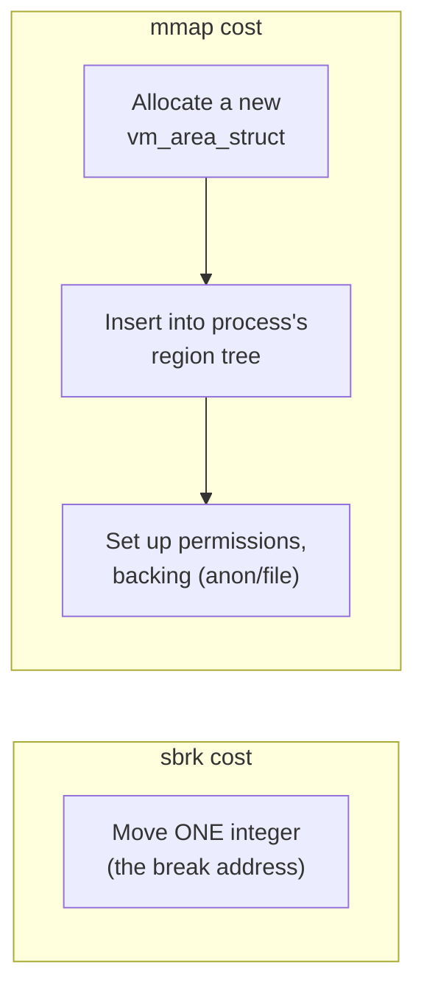

**This is why, for thousands of tiny allocations, `brk`-based allocation
is meaningfully cheaper than calling `mmap` per allocation** — not because
the memory itself is different, but because the *kernel bookkeeping
overhead per call* is dramatically lower.

---

# TIER 3 — ADVANCED: the real limitation, worked out completely

## 3.1 The "trapped memory" problem — brk can only shrink from the very top

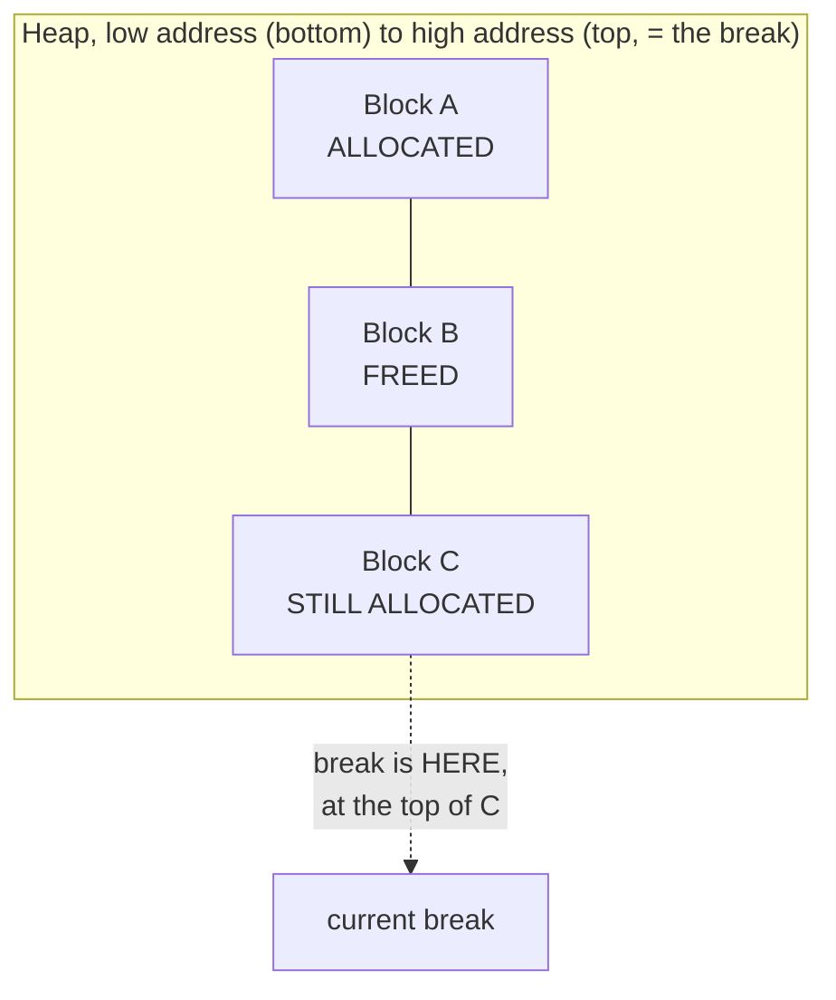

**Block B is free. Can `sbrk` reclaim its space and give it back to the
OS?** No — **not while C is still allocated**, because `sbrk` can only
move the *single* break boundary, and the break is currently sitting at
the top of C. Shrinking the break would have to shrink *past* C first,
destroying memory that's still in use. B's space is **trapped** — reusable
by a future `malloc` call from *within* your own process, but
**unreturnable to the operating system** until every block above it
(here, just C) is also freed.

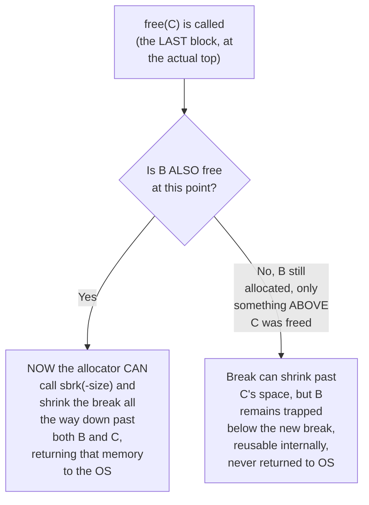

**Worked concrete cost, so this isn't abstract:** imagine a long-running
server process that allocates and frees objects of wildly different
sizes, and — by unlucky timing — a large, long-lived object happens to sit
at the very top of the heap for the process's entire lifetime. **Every
other block below it, no matter how much becomes free, is now permanently
trapped**, and your process's memory footprint (as the OS sees it, e.g.
in `top`/`ps`) will only ever grow, never shrink, for as long as that one
object at the top stays alive. This is a **real, well-documented
operational failure mode**, not a theoretical curiosity — it's the exact
mechanism behind "why does my long-running server's RSS keep climbing
even though I'm freeing things?" bug reports.

## 3.2 mmap doesn't have this problem — the direct contrast

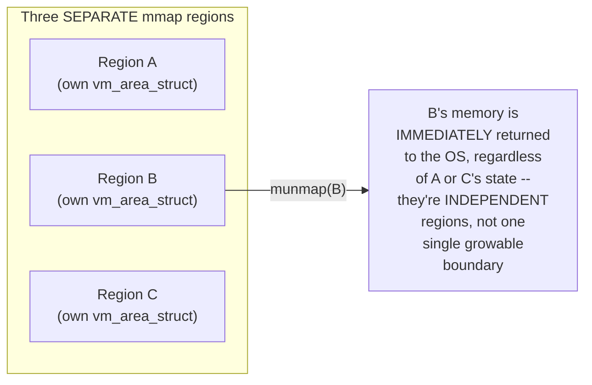

This is the single biggest practical reason large allocations get routed
through `mmap` instead of the heap in real allocators (Tier 4) — a large
block that gets freed should give its memory back to the OS
**immediately**, and only `mmap`+`munmap` can do that unconditionally,
regardless of what else is currently allocated.

## 3.3 Single heap = single point of contention across threads

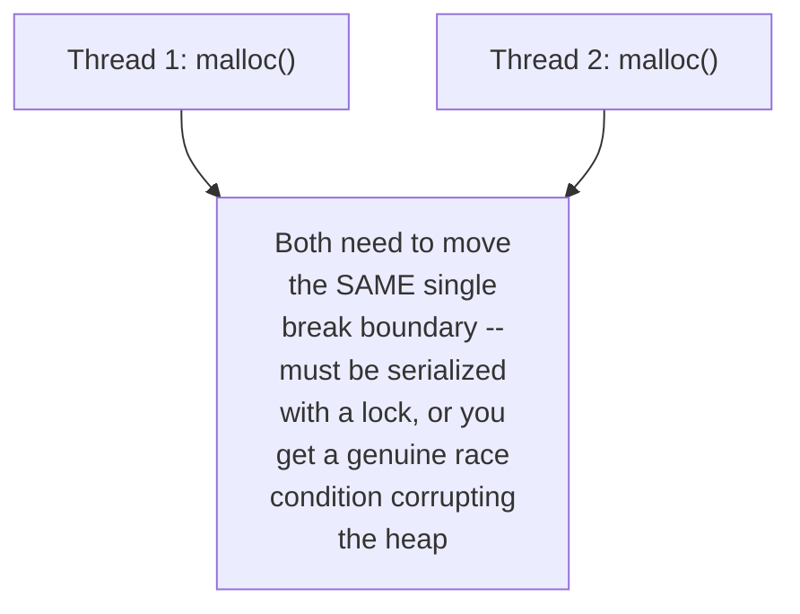

Because there is only **one** break per process, every thread calling
`malloc` and needing more memory from the OS is fighting over the exact
same shared boundary. This has to be protected by a lock — meaning
**heavy sbrk-based allocation is a genuine multi-threaded contention
point**, unrelated to anything about the allocation algorithm itself.
`mmap`, by contrast, needs no such single shared boundary — different
threads can create entirely independent regions with no coordination
needed between them (though the kernel's internal region-tree still needs
its own locking — just at a different, generally less contended,
granularity).

---

# TIER 4 — PRO: what real allocators actually do (glibc's ptmalloc2)

## 4.1 The dynamic threshold — the actual policy, not folklore

glibc's `malloc` uses **both** mechanisms, switching based on request
size, governed by a tunable called `M_MMAP_THRESHOLD` (default: 128 KB,
but it **adapts dynamically** at runtime):

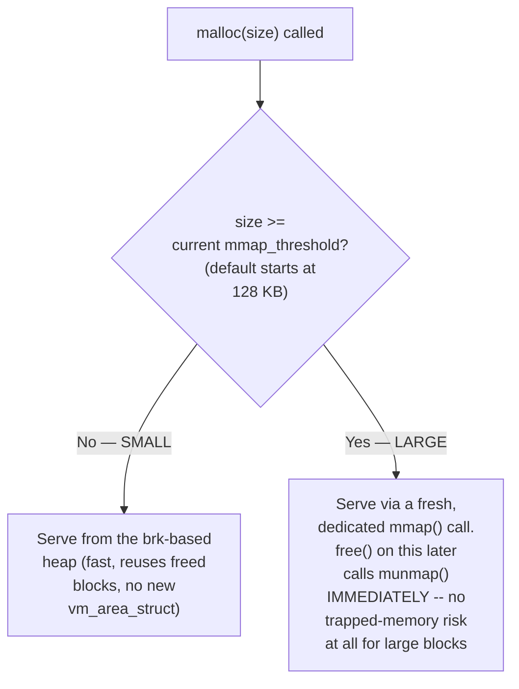

**Why 128 KB specifically, and why it adapts:** small, this is a real,
computed tradeoff — small enough that the "trapped memory" risk (Tier
3.1) for these blocks stays bounded (a 128 KB trapped block is annoying;
a 1 GB trapped block is a real operational incident), but large enough
that the per-call `mmap` overhead (Tier 2.2) doesn't dominate for the
*very frequent*, *very small* allocations most real programs make.
glibc actually **raises this threshold dynamically** if it observes a
large block get `munmap`'d and then immediately re-`mmap`'d at a similar
size shortly after — a heuristic guess that "this workload wants big
blocks to stay on the fast brk-based path instead of paying mmap/munmap
overhead repeatedly."

## 4.2 Multiple arenas — solving Tier 3.3's contention problem

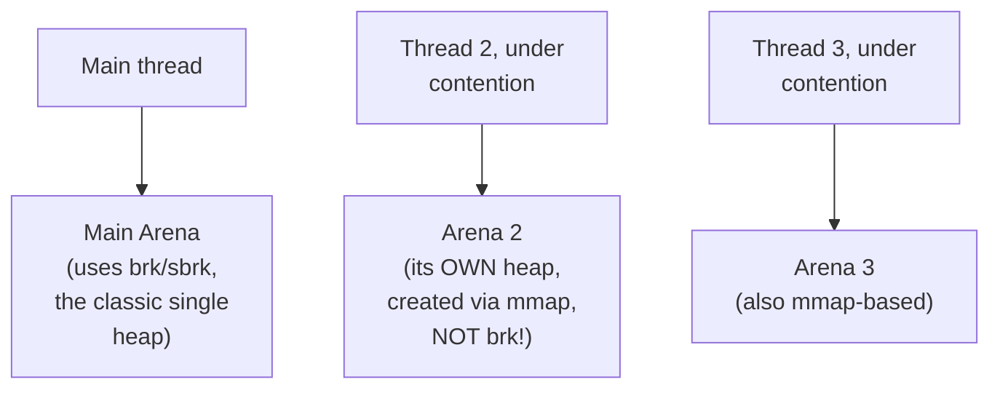

When glibc detects lock contention on the single main arena (multiple
threads fighting over the one `brk`-based heap, Tier 3.3), it **creates
additional arenas** — and crucially, **these secondary arenas are
themselves backed by `mmap`, not `brk`**, precisely because you can't have
two independent `brk`-managed heaps (there's only one break per process,
by definition — Tier 0.2). Each arena then internally behaves like its
own small brk-style heap, but the *outer* boundary of each arena is a
single big `mmap`'d region. This is a genuinely elegant hybrid: get
`brk`-style cheap internal bump-allocation *within* each arena, while
using `mmap` to get the *multiple, independent, per-thread* regions that
`brk` alone could never provide.

---

# TIER 5 — LEGEND: the decision framework for your own allocator

## 5.1 The complete comparison table, everything from this chapter in one place

| Property | `brk`/`sbrk` | `mmap` |
|---|---|---|
| Number of independent regions | 1 (always) | Unlimited |
| Per-call kernel overhead | Very low | Higher (new `vm_area_struct`) |
| Can return memory to OS mid-heap | **No** — only from the very top | **Yes** — any region, any time |
| Best for | Many small, short-lived, frequently reused allocations | Few large, long-lived, or independently-freed allocations |
| Multi-threading | Needs a lock around the single shared break | Naturally independent per region (still needs *some* kernel-level locking, but far less contended) |
| Risk | "Trapped memory" — unbounded process RSS growth if a large/long-lived object sits at the top | Slightly higher constant-factor cost per call |
| Real-world usage | glibc's *main arena*, for small blocks | glibc's *secondary arenas*, huge blocks, and the dominant strategy in jemalloc/tcmalloc/mimalloc |

## 5.2 The decision flowchart — use this when designing your own allocator

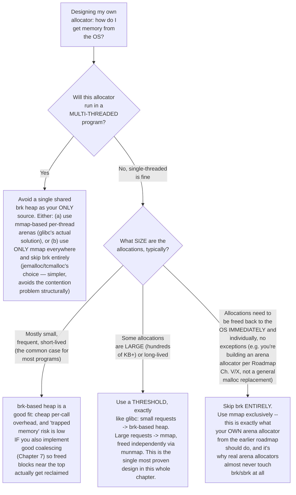

## 5.3 The one-paragraph answer, memorized

**Use `brk`/`sbrk` when you have many small, frequently-reused
allocations in a single-threaded (or single-arena) context, and you're
willing to accept some "trapped memory" risk in exchange for lower
per-call overhead. Use `mmap` when allocations are large, need
independent lifetimes, need to return memory to the OS reliably, or need
to work safely across multiple threads without a single shared
bottleneck.** Real production allocators don't pick one — they use a
**size-based threshold** (glibc: ~128 KB, dynamically tuned) to route
each request to whichever mechanism fits it best, which is exactly the
design you should carry into your own allocator starting next chapter.

---

## PROJECT 6 — Prove the "trapped memory" limitation yourself

```cpp
// project6_trapped_memory.cpp
//
// Directly demonstrates Tier 3.1's "trapped memory" problem: allocate
// three blocks via raw sbrk, free the MIDDLE one, and show the break
// literally cannot move down to reclaim it while the top block is
// still alive -- then free the top block too, and show it NOW can.
//
// Compile: g++ -O2 -std=c++17 project6_trapped_memory.cpp -o project6
// Run:     ./project6

#include <cstdio>
#include <unistd.h>

void report_break(const char* label) {
    printf("%-45s break = %p\n", label, sbrk(0));
}

int main() {
    report_break("Start:");

    // Simulate three "allocations" the way a naive bump allocator would:
    // just grab space with sbrk, one after another.
    void* A = sbrk(4096);
    report_break("After 'allocating' A (4096 bytes):");

    void* B = sbrk(4096);
    report_break("After 'allocating' B (4096 bytes):");

    void* C = sbrk(4096);
    report_break("After 'allocating' C (4096 bytes):");

    printf("\nA=%p B=%p C=%p\n\n", A, B, C);

    // "Free" B -- in a REAL allocator this just marks B's header as
    // free, it does NOT touch the break, because the break is sitting
    // at the top of C, not B. We simulate that reality directly:
    printf(">>> 'Freeing' B. B is now internally reusable by a future\n");
    printf(">>> malloc() call, but watch: the break CANNOT move, because\n");
    printf(">>> C is still allocated and sits ABOVE B.\n");
    report_break("Break after 'freeing' B (should be UNCHANGED):");

    printf("\n>>> Now 'freeing' C too (the actual top-of-heap block).\n");
    printf(">>> THIS is when sbrk can finally move back down.\n");
    sbrk(-4096); // give back C's space -- legal, C really was at the top
    report_break("Break after shrinking past C:");

    printf("\n>>> But B's space, 4096 bytes below the NEW break, is\n");
    printf(">>> STILL trapped -- we can shrink AGAIN only because B is\n");
    printf(">>> now ALSO the top-most block:\n");
    sbrk(-4096);
    report_break("Break after ALSO shrinking past B:");

    printf("\nConclusion: reclaiming B's memory from the OS required\n");
    printf("freeing C FIRST, even though B was freed earlier. This IS\n");
    printf("the trapped-memory problem, reproduced directly.\n");

    return 0;
}
```

Run it and confirm the exact sequence: the break holds steady while only
B is freed, then drops by 4096 once C is freed, then drops by another
4096 only once you explicitly shrink past B too. That ordering — **you
can only reclaim from the top, regardless of *when* something became
free** — is Tier 3.1, made undeniable with real numbers from your own
terminal.

---

# CASE STUDY — Why jemalloc and tcmalloc largely abandoned brk entirely

**jemalloc** (used by Redis, FreeBSD's libc, Rust's former default
allocator) and **tcmalloc** (Google's allocator, used throughout their
infrastructure) both take a stance more aggressive than glibc's threshold
approach: they use `mmap`-backed memory almost exclusively, for
*everything*, not just large allocations.

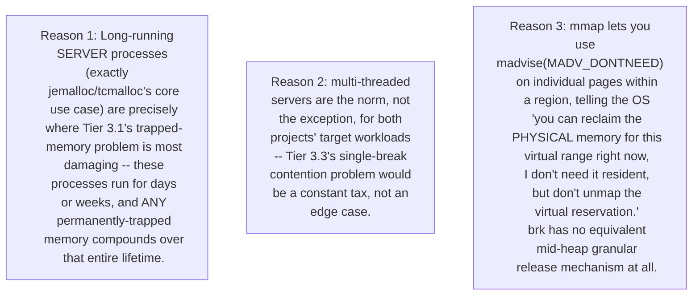

**Reason 3 deserves a moment**, because it's a genuinely different
capability than anything in this chapter so far: `madvise(addr, len,
MADV_DONTNEED)` tells the kernel "the *physical* pages backing this
*virtual* range can be discarded/zeroed immediately, but keep the virtual
reservation itself intact." This lets jemalloc/tcmalloc **give back RSS
(actual RAM usage) for freed memory in the middle of a large arena**,
without needing to `munmap` (destroy the reservation) or fight the
brk-style "only from the top" restriction at all — a capability that
exists specifically *because* the memory is `mmap`-backed in the first
place; there is no `brk` equivalent, because `brk` only ever tracks one
number (the break), with no way to mark arbitrary sub-ranges as
"physically reclaimable but still reserved."

---

### The Superpower of `mmap` + `MADV_DONTNEED`

* **Virtual Reservation vs. Physical RSS:** `mmap` cleanly separates *address reservation* (the virtual right to use an address space) from *Resident Set Size* (the actual physical RAM chips backing it).
* **Arbitrary Holes:** Unlike `brk` (which is restricted to a rigid, top-down boundary), `madvise` allows allocators to target specific sub-ranges anywhere inside an `mmap`-ed memory block.
* **How It Works:** If a multi-page allocation has unused pages in the middle, calling `madvise(addr, len, MADV_DONTNEED)` tells the kernel to instantly drop the physical RAM backing those specific pages, lowering your process RSS.
* **Pointers Stay Valid:** The virtual address reservation remains completely intact. Pointers don't break, and if code accidentally touches those addresses later, the kernel seamlessly provisions a fresh, zero-filled page on demand.

---

### The Page Granularity Caveat

* **Page-Level Execution:** `madvise` always obeys underlying page boundaries. If you target a tiny 8-byte slice, the kernel frees the **entire 4 KB page** enclosing it. You cannot surgically discard a fraction of a page.
* **The Huge Page Trap:** If memory is backed by **Huge Pages** (e.g., **2 MB** blocks), the granularity shifts drastically. An allocator cannot punch holes inside a 2 MB huge page; if even a single active 8-byte allocation lives within that block, the **entire 2 MB of physical RAM** is locked down and un-reclaimable via `madvise`.

> [!NOTE]
> High-performance allocators (like jemalloc and tcmalloc) leverage these exact mechanics—combining thread-local arenas, anonymous `mmap`, and precise page-level `madvise` calls—to balance low latency, high multi-threaded throughput, and aggressive memory reclamation.
**The transferable lesson for your own allocator design:** the
"trapped memory" problem isn't just about *where* memory comes from
(`brk` vs `mmap`) — it's about what *tools* you have available afterward
to give partial memory back. `mmap`'s regions aren't just independently
freeable; they're independently **madvise-able**, which is a strictly
richer set of options than `brk` can ever offer, and it's the real,
concrete reason the highest-performance modern allocators converged on
"use `mmap`, almost exclusively" as their answer to this chapter's
central question.
