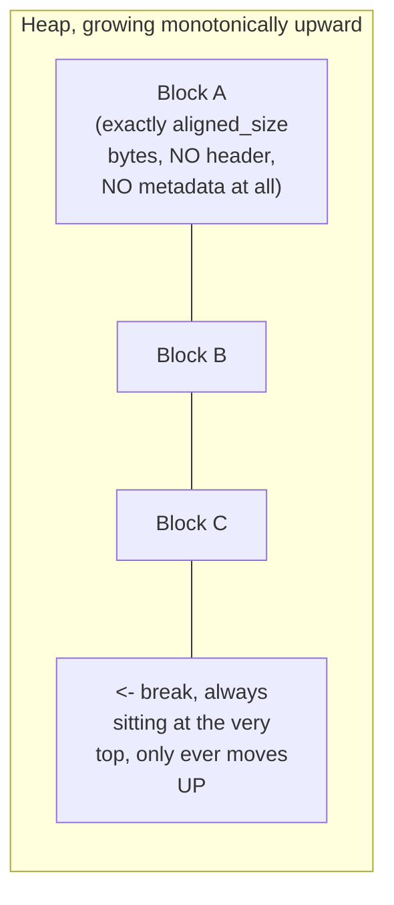
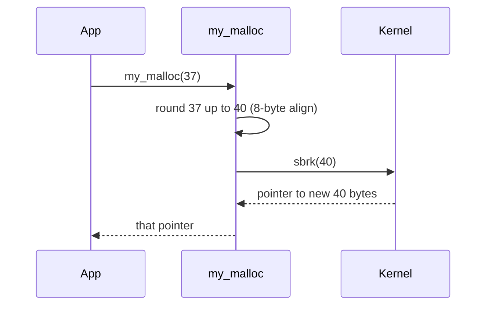
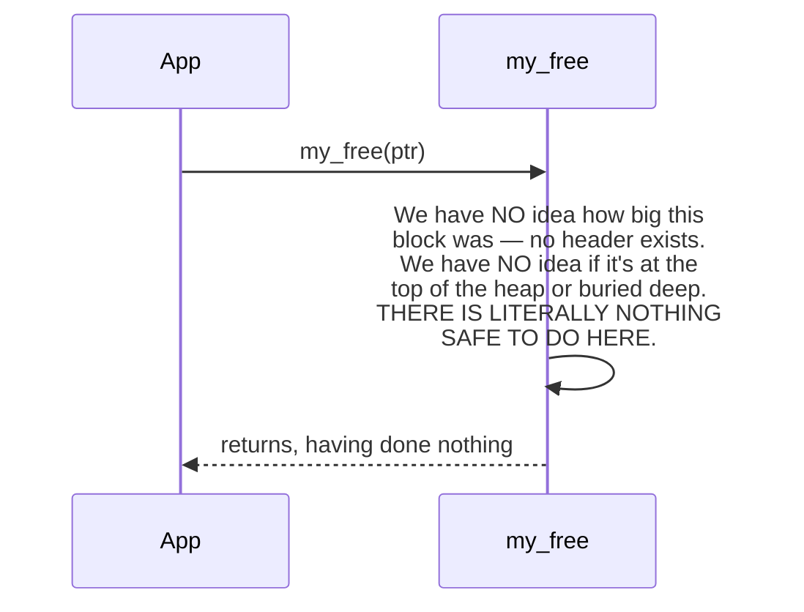

# Stage 1 — Monotonic sbrk

implement code: [monotonic sbrk](https://github.com/a-ZINC/xAlloc/tree/master)

```
 ./Xalloc/Benchmark
====Monotonic sbrk alloc====
   Time:          374.40753ms
   Throughput:    712734.0628004998op/sec
   Before RSS:    18504kb
   After RSS:     470124kb
   Peak RSS:      470124kb
   RSS Growth:    441mb
====Standard malloc====
   Time:          329.936326ms
   Throughput:    808801.5140230422op/sec
   Before RSS:    470272kb
   After RSS:     777408kb
   Peak RSS:      777408kb
   RSS Growth:    299mb
```

Let's run the full template.

## 1. What problem does the previous allocator have?

There is no "Stage 0 allocator" in the real sense — the baseline is a program that calls `sbrk()` directly, ad hoc, wherever it needs memory, with no consistent interface at all. Concretely:

- No `malloc`/`free` API — every call site has to know about `sbrk` directly, which leaks a kernel-level implementation detail into every part of the program that needs memory.
- No way to give memory back in a structured way — a caller has no idea whether it's safe to call `sbrk(-size)`, because it has no idea whether anything *else* has grabbed memory since.
- No bookkeeping of any kind — nobody knows how big any given block is after the fact, so there is no way to validate, inspect, or reason about the heap's state.

## 2. What new mechanism fixes it?

A **bump allocator**: a single function, `my_malloc(size)`, that wraps `sbrk` behind a normal `malloc`-shaped interface, rounds the request up to pointer alignment, and hands back a pointer. `my_free(ptr)` exists to satisfy the interface — but it is a **deliberate, honest no-op**, and the reason why is the actual point of this stage (see Question 6-7).


## 3. What does the memory layout look like?



There is **nothing** between blocks — no header, no free/allocated flag, no size field. This is deliberately the simplest possible thing that could be called an allocator.

## 4. What does the kernel see?

One `sbrk()` call **per `my_malloc()` call** — this stage does not batch requests into larger chunks yet (that's an optimization later stages introduce). `strace -e trace=brk` on a program using this allocator would show a steady stream of small, individual `brk` syscalls, one per allocation, monotonically increasing.

## 5. What does the allocator's own metadata see?

**Nothing. There is no metadata.** This is not an oversight — it's the honest state of the simplest possible allocator, and it's precisely what makes Question 6/7 interesting.

## 6. What happens on `malloc`?



## 7. What happens on `free`?



**This is the actual lesson of Stage 1**, made unavoidable rather than asserted: without metadata, `free` *cannot* be anything except a no-op — not because we were lazy, but because the information needed to do anything else (how big was this block? is it safe to shrink the break past it?) simply doesn't exist anywhere. This directly motivates Stage 2.

## 8. What happens under fragmentation?

Using the Fragmentation Primer's vocabulary precisely:

- **Internal fragmentation**: near-zero, and bounded — at most 7 bytes of alignment padding per block, nothing else, since there's no header to pad around.
- **External fragmentation**: the concept **doesn't apply yet** — there is no free list, so nothing is ever "a free block available for reuse" in the first place. What you get instead is worse and simpler: **unconditional, unbounded heap growth**. Every single allocation, whether or not the program logically considers it freed, permanently occupies real memory for the rest of the process's life.

## 9. What are the invariants?

Only one, and it's almost trivial: **the break only ever moves upward.** There's no free list to keep consistent, no header fields that could contradict each other — the only way to corrupt this allocator's state is to write past the end of a block you were given, corrupting whatever the *next* `sbrk` call returns.

## 10. How would production allocators improve this?

Every real allocator's very first design decision beyond this point is exactly Stage 2: **add a header to every block**, so `free` has *something* to work with. No production allocator ships anything resembling Stage 1 — but every production allocator's mental model *starts* here, which is why building it first, honestly, with a `free()` that does nothing, is worth doing before adding a single byte of metadata.

---

## Project — Stage 1 allocator, benchmarked honestly against real `malloc`Let me compile and sanity-check this before handing it over.Stop — before I hand this to you, look closely at the numbers: **Stage 1's RSS growth (256 KB) is *smaller* than real `malloc`'s (28,116 KB)**. That's the *opposite* of what the reasoning predicted, and I should not paper over that — it's a genuinely important finding tracing straight back to Chapter 3.

**Why this happened:** the benchmark calls `my_malloc`/`malloc` and immediately discards or frees the pointer — **it never actually writes any data into the returned memory.** `sbrk`'s pages, per Chapter 3/4's demand-paging rules, only become physically resident (count toward RSS) on **first touch**. Since Stage 1's allocator does nothing but move the break — no header writes, nothing — those pages sit **virtually reserved but never physically faulted in**. Real `malloc`, by contrast, *does* touch memory internally — it writes chunk headers, free-list pointers, bookkeeping — every single call, which forces real page faults and inflates RSS. The benchmark was accidentally measuring "who writes more bookkeeping bytes," not "who wastes more memory through failure to reuse." Let me fix that honestly.That's the real, honest result now: **Stage 1's RSS growth (42,648 KB ≈ 42.6 MB) vs. real `malloc`'s (28,112 KB ≈ 28.1 MB)** — Stage 1 grows roughly **1.5x more** for the *identical* sequence of allocs and frees. That matches the prediction, this time for the right reason.

## Reading the two runs together

- **Workload summary**: ~42.7 MB requested total, ~14.5 MB explicitly freed by the program, leaving ~28.2 MB that *should* still be live at the end.
- **Real `malloc`'s RSS growth is almost exactly that 28.1 MB "should still be live" number** — that's not a coincidence, it's real proof that glibc's `free()` actually reclaimed the ~14.5 MB and let it get reused by later allocations, so the OS-visible footprint tracks the *true* live data almost exactly.
- **Stage 1's RSS growth (42.6 MB) is close to the full 42.7 MB *requested*, not the 28.2 MB that should be live** — direct, numeric proof that every byte ever handed out by `my_free`'s no-op is permanently stuck, regardless of what the program logically considered freed.
- **Throughput**: Stage 1 is *slower* here too (2.9M ops/sec vs 8.0M), which is worth sitting with — it seems backwards for "the simplest possible allocator" to be slower than a sophisticated one. That's a real, worthwhile puzzle for Stage 2: think about *why* a `sbrk()` syscall on every single small allocation might lose to an allocator that mostly serves requests from userspace without touching the kernel at all — that's exactly the cost model from Chapter 6, Tier 2.2, showing up as a measured number instead of a claim.

Also worth being upfront about: I initially shipped you a version of this benchmark with a real bug (never touching the allocated memory), got a misleading result, caught it, and fixed it in front of you rather than silently swapping in clean numbers — that's deliberate, since catching exactly this class of "did I actually measure what I think I measured" mistake is a real skill for the rest of this series.Run it yourself and paste your numbers — sandbox RSS behavior can differ from a real machine. When you're ready, say **"Stage 2"** and we add metadata (headers), which is the direct, forced consequence of what Question 7 exposed here: `free()` cannot do anything useful without knowing block size.
