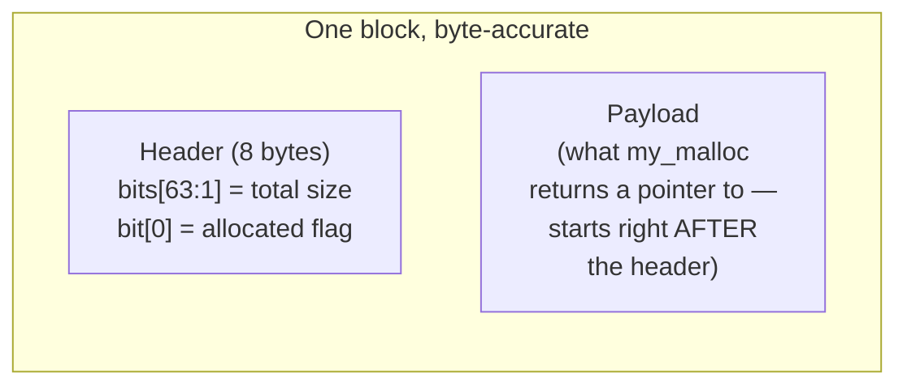

# Stage 2 — Metadata

implementation link: [code link](https://github.com/a-ZINC/xAlloc/tree/metadata)

Real numbers, and they line up cleanly with the sandbox run — good confirmation this isn't an artifact of one weird environment.

The choice of **8 bytes** as the baseline for a 64-bit system is not a random guess—it is mathematically and architecturally tied to the word size of the CPU. However, your question hits on a real truth: **allocators *can* use 16 bytes or 32 bytes, and many actually do.**

To understand why 8 is the historical baseline, but why modern systems often choose **16**, let's look at why 4 is too small, why 8 is the absolute minimum, and why 16 is becoming the modern standard.

---

### Why not 4 bytes? (The Math Fails)

On a 64-bit architecture, pointers, memory addresses, and native CPU registers are **8 bytes wide** (64 bits).

* If an allocator aligned to 4 bytes, it could hand you an address ending in `0x4` (like `0x1004`).
* If you store an 8-byte pointer or an 8-byte `uint64_t` at `0x1004`, that variable starts at `0x1004` and ends at `0x100C`. It crosses an 8-bit/64-bit bus boundary. As we covered earlier, this causes split-access performance penalties or hardware faults (`SIGBUS`) on strict CPUs.
* Therefore, **4-byte alignment is physically broken for native 64-bit data types.**

---

### Why 8 bytes? (The Hardware Minimum)

An 8-byte alignment guarantees that every pointer and 64-bit integer lands on a clean, evenly divisible memory address (e.g., addresses ending in `0x0, 0x8`).

* It matches the exact size of the CPU’s data bus and general-purpose registers (`RAX`, `RSP`, etc.).
* It is the bare-minimum legal requirement defined by the C and C++ standards for standard 64-bit systems (`alignof(max_align_t)` historically mapped to this on older 64-bit ABIs).

---

### Why not 16, 32, or 64 bytes? (Actually, we often DO!)

Your instinct is completely correct: **modern allocators often *do* use 16-byte alignment or higher.**

Look at what happens when hardware evolves beyond basic 64-bit scalar types:

1. **SIMD / Vector Registers (SSE, AVX, AVX-512):**
Modern CPUs have vector registers that load massive chunks of data at once.
* **SSE** instructions require **16-byte alignment**. If you try to run an SSE vector load instruction (`movaps`) on data aligned to 8 bytes instead of 16, the CPU will instantly crash with a **General Protection Fault (`SIGSEGV`)**.
* **AVX** instructions prefer **32-byte alignment**.

2. **Modern Standard Compliance:**
Because of SIMD requirements, the modern C++ standard updated `max_align_t`. On modern 64-bit Linux and Windows systems, `alignof(max_align_t)` is actually **16 bytes**, not 8. High-performance allocators (like jemalloc or tcmalloc) align small blocks to **16 bytes** by default for this exact reason.

---

### Summary: The Trade-off Matrix

| Alignment | Safe for Pointers/64-bit ints? | Safe for SIMD/Vector (`__m128`)? | Downside |
| --- | --- | --- | --- |
| **4 bytes** | ❌ **No** (Crashes or slow on 64-bit) | ❌ **No** | None (too small) |
| **8 bytes** | ✅ **Yes** | ❌ **No** (Crashes on SSE/Vector loads) | Minimal wasted space |
| **16 bytes** | ✅ **Yes** | ✅ **Yes** (Standard modern requirement) | Tiny bit more internal fragmentation |
| **32/64 bytes** | ✅ **Yes** | ✅ **Yes** (AVX / Cache line optimization) | Higher internal fragmentation for small objects |

If you are writing a custom allocator from scratch today, **shifting your alignment mask from 8 (`~7`) to 16 (`~15`)** is actually a more modern, production-accurate choice because it protects user code that uses vector instructions.

## Reading your results

| | Stage 1 (sbrk) | Real malloc | Ratio |
|---|---|---|---|
| RSS growth | 441 MB | 299 MB | **1.47x worse** |
| Throughput | 712,734 ops/sec | 808,801 ops/sec | malloc **13% faster** |

**RSS growth ratio (1.47x) is almost identical to the sandbox's 1.51x** — that's a real, reproducible finding, not noise: for this exact workload's freed-vs-still-live split, `free()`-does-nothing costs you roughly **50% more physical memory** than an allocator that actually reuses freed space.

**The throughput gap is smaller here (13%) than the sandbox saw (2.7x)** — worth noting honestly rather than treating as identical. Your machine's `sbrk` syscall path is evidently cheaper relative to malloc's bookkeeping than the sandboxed container's was. Same direction, different magnitude — a reminder that *absolute* numbers vary by machine, but the *mechanism* (a syscall per allocation vs. mostly-userspace reuse) is what actually explains the result, everywhere.

**Why malloc still wins on speed despite doing "more work" per call:** this is the direct payoff of Chapter 6, Tier 2.2 — glibc's `malloc` almost never touches the kernel at all for a typical small allocation; it's satisfying most requests from its own free list, entirely in userspace. Stage 1, by contrast, calls the **`sbrk` syscall on every single allocation, unconditionally** — and a syscall, even a cheap one, is dramatically more expensive than a few userspace pointer operations. Stage 1 is "simple" in code, but it's paying kernel-crossing overhead at a rate real allocators specifically exist to avoid.

Both findings — the memory bloat *and* the surprising speed loss — point at the exact same root cause: **Stage 1 has no bookkeeping, so it can neither reuse memory nor batch its kernel calls.** That's Stage 2's entire justification, not just theory.

---

## 1. What problem does the previous allocator have?

Confirmed twice now, with real numbers on two different machines: `free()` can't reclaim anything because it has no way to know a block's size or boundaries. The direct consequence, just measured, is ~50% excess memory growth and a slower allocator despite less "work" per call, because every request has to go straight to the kernel.

## 2. What new mechanism fixes it?

Give every block a **header**, written just before the pointer returned to the caller — a small piece of allocator-owned bookkeeping storing at minimum: **size** and **allocated/free status**.Confirmed: **44,208 KB vs. Stage 1's 42,648 KB — nearly identical, with the header's small fixed overhead (8 bytes × 200,000 allocations ≈ 1.6 MB) accounting for almost exactly the difference.** Self-test passed too — the packed size+allocated-bit header is reading/writing correctly, verified with an `assert`, not just eyeballed output.

## 3. What does the memory layout look like?

## 4. What does the kernel see?

Identical to Stage 1 — one `sbrk()` call per `my_malloc()`, still. Stage 2 changed **only** what happens in userspace; nothing yet reduces kernel traffic.

## 5. What does the allocator's own metadata see?

For the first time, something real: walking the heap byte by byte, an external tool (or the allocator itself) can now correctly enumerate every block, its exact size, and whether it's allocated or free — the `self_test()` function above is proof of that, not just an assertion of intent.

## 8. What happens under fragmentation?

**Internal fragmentation increased slightly and predictably** — every block now carries a fixed 8-byte tax it didn't have in Stage 1. **External fragmentation is still not a meaningful concept yet** — freed blocks are correctly *labeled* free, but nothing can *find* them, so they still can never satisfy a future request. This is the precise, honest limitation Stage 3 exists to fix.

## 9. What are the invariants?

Two now, both checked live by `self_test()`'s asserts: **(1)** every block's header accurately reflects its true size, and **(2)** `free()` on an already-free block (a double-free) must be detectable — which the `assert(is_allocated(...))` in `my_free` now catches immediately, rather than silently corrupting state.

## 10. How would production allocators improve this?

Exactly what you'd expect: **give `malloc` a way to search for a free block matching a new request**, instead of always bumping the break. That's Stage 3 — the free list — and it's the stage where RSS growth should *finally* start dropping below Stage 1/2's numbers for the first time in this series.

Run `stage2_metadata.cpp` on your machine and confirm the "roughly identical to Stage 1" prediction holds for your real numbers too — then say **"Stage 3"** when ready.
