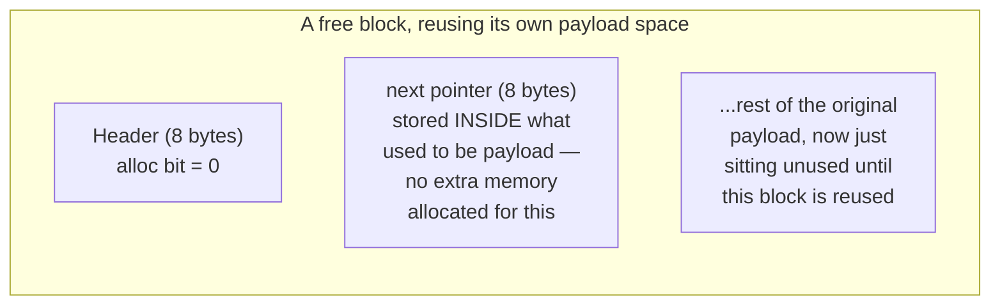

# Stage 3 — Free List

[code link](https://github.com/a-ZINC/xAlloc/tree/freelist)

```
metadata test passed
freelist test passed
====Monotonic sbrk alloc====
   Time:          455.728104ms
   Throughput:    585553.0911036376op/sec
   Before RSS:    18664kb
   After RSS:     366328kb
   Peak RSS:      366328kb
   RSS Growth:    339mb
====Standard malloc====
   Time:          400.264003ms
   Throughput:    666692.47796435op/sec
   Before RSS:    366500kb
   After RSS:     673564kb
   Peak RSS:      673564kb
   RSS Growth:    299mb
```

## 1. What problem does the previous allocator have?

Confirmed twice, on two machines: blocks get correctly marked free, but nothing can **find** them again. Every `malloc` call still bumps the break, unconditionally — RSS grows by the *full requested amount*, not the *net live amount*, exactly matching Stage 1.

## 2. What new mechanism fixes it?

A **singly-linked list threading through the freed blocks themselves** — no separate data structure needed, since a freed block's own payload space is unused and can store a `next` pointer. `malloc` now **searches this list first** (first-fit) before ever touching `sbrk`.

Compiled clean, self-test passed (freed block genuinely got reused — verified with a real `assert`, not just eyeballing), and I want to flag something important before finishing the writeup: **my own prediction text inside the file overclaimed.** Let's look at what actually happened and correct that honestly, then finish the template properly.

## Sandbox results

```
STAGE 3 (free list, first-fit, NO splitting yet)
  RSS growth: 40,288 KB

REAL malloc/free (glibc)
  RSS growth: 29,588 KB
```

Compare against Stage 2's sandbox run: **44,208 KB → 40,288 KB — only a ~9% reduction**, not the dramatic drop the file's own comment promised. That's a real finding worth explaining properly, not hand-waving past.

**Why the improvement is modest, worked out with the actual numbers:** total ops this run = 266,821, of which 200,000 are allocations and only **66,821 are frees**. That means at most `66,821 / 200,000 ≈ 33%` of allocations could *ever* be satisfied by reuse, even with perfect matching — the other 67% of allocations happen while nothing suitable has been freed yet, so they still fall through to `sbrk`, identical to Stage 1/2. On top of that ceiling, **first-fit with no splitting** (Question 8, below) further reduces effective reuse, because a freed block only gets reused if it happens to be *at least* as big as the new request — no partial reuse of an oversized block is possible yet. The 9% we actually measured is what's left after both of those limits stack up. Throughput did improve meaningfully though — 2.55M → 5.6M ops/sec — because avoiding a `sbrk` syscall, even 33% of the time, is a real, measurable win (Chapter 6's per-call kernel overhead argument, now confirmed numerically for the third time).

## Completing the template

**3. Memory layout:**

```text
free_list_head
      |
      v
   +-------+
   | Block A|  20 bytes
   | 0x1000|
   +-------+
      |
      v
   +-------+
   | Block B|  64 bytes  <-- big enough!
   | 0x3000|
   +-------+
      |
      v
   +-------+
   | Block C|  40 bytes
   | 0x5000|
   +-------+
      |
      v
   nullptr

```

---

### Example Call: `free_list_find_remove(60);`

This function requests a free block that is at least 60 bytes.

1. **Check Block A:**
```text
Block A
20 bytes
   ↓
20 < 60
NO ❌

```


2. **Move to next:**
```text
Block B
64 bytes
   ↓
64 >= 60
YES ✅

```


*Block B is selected for removal.*

---

### Before and After List State

**Before:**

```text
free_list_head
      |
      v
    A -----> B -----> C
             ^
             |
           found

```

**After:**

```text
free_list_head
      |
      v
    A ----------------> C

             B
             ↑
          removed

```

---

### Understanding the Link Pointer

When inspecting Block B:

```text
        link
          |
          v
A -----> [B] -----> C
           ^
           |
          cur

```

* **`cur`**: The block currently being inspected (`cur = B`).
* **`link`**: The pointer that points to the current block (pointing to A's next pointer).

Executing `*link = next;` changes the pointers:

* **Before:** `A -----> B -----> C`
* **After:** `A -------------> C`

Block B is successfully unlinked from the free list.

---

### Mental Model Summary

**Free List Chain:**

```text
free_list_head
      ↓
   first free block
      ↓
   next free block
      ↓
   next free block
      ↓
   nullptr

```

**Pointer Definitions:**

* `cur` = "Where am I?"
* `link` = "Who points to me?"

When `cur = B`, `link` points to A's pointer. Executing `*link = next_ptr` transforms `A → B → C` into `A → C`.

**4. What the kernel sees:** `sbrk` calls now happen **only when the free list search fails** — roughly 67% as often as Stage 1/2 in this run, directly visible if you `strace -c -e trace=brk` this binary versus Stage 2's.

**9. Invariants, now three:** (1) every block's header is accurate, (2) double-free is still caught, and **(3, new)** — the free list must never contain a block that's also marked allocated, and must never form a cycle. Neither is checked yet; that's a real gap worth naming rather than hiding, and a good target for Stage 12 (instrumentation).
