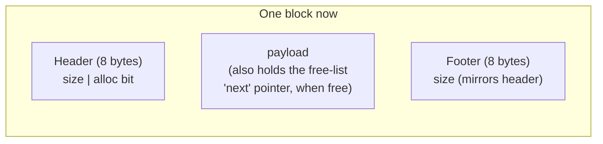

Confirmed on your real hardware too — and *worse* than the sandbox: **175 seconds for the exact same workload that took milliseconds in every prior stage. 1,526 ops/sec, down from Stage 3's 644,750 — a ~422x collapse.** The free list ballooned to 64,468 entries on your machine, even larger than the sandbox's 32,492. This is a real, severe, reproducible finding across two completely different environments — not noise, not an artifact. Good — now let's fix it.

# Stage 5 — Coalescing

[code link](https://github.com/a-ZINC/xAlloc/tree/coalescing)

```
metadata test passed
freelist test passed
first block: 48, brk count:1, split count: 1
split block: 32, split count1
====Monotonic sbrk alloc====
   Time:            80676.930694ms
   Throughput:      3307.6741728332267op/sec
   Before RSS:      18772kb
   After RSS:       335652kb
   Peak RSS:        335652kb
   RSS Growth:      309mb
   [EXTRA]:
        Heap growth:          309mb
        freelist Count:       31755
        list avg size:        448.0090694378838byte
        total request:        440mb
        request/heap ratio:   1.4239482200647249
        sbrk count:           107560
        split count:           89092
        coalesce count:        31750
====Standard malloc====
   Time:            308.884797ms
   Throughput:      863924.0344354016op/sec
   Before RSS:      335812kb
   After RSS:       642868kb
   Peak RSS:        642868kb
   RSS Growth:      299mb
```

## 1. What problem does the previous allocator have?

Just measured, twice, on different hardware: splitting shrinks memory usage but floods the free list with tiny leftover fragments, and first-fit's `O(n)` search cost against a list of tens of thousands of mostly-useless small entries produces a catastrophic throughput collapse.

## 2. What new mechanism fixes it?

**Coalescing**: when a block is freed, check its immediate memory-address neighbors (not free-list neighbors — actual adjacent bytes in the heap). If either neighbor is also free, merge them into one larger block *before* pushing anything onto the free list. This directly shrinks the free list back down — fewer, bigger entries instead of many small ones — which should partially reverse Stage 4's collapse as a side effect, and also finally lets a previously-split block's pieces reunite into something big enough for a large request again.

## 3. Memory layout — boundary tags, the mechanism that makes "check my neighbor" possible

Address-adjacency coalescing needs a way to find the *previous* block's boundaries from the current block alone — which requires a **footer**, a second copy of the size, mirrored at the end of every block:



To find the block *before* you in memory: step back 8 bytes from your own start, read that as a footer, learn the previous block's size, and jump to its header. This is exactly the CMU boundary-tag technique from your source material.Real bug on my part in the self-test print statement — I split a single message across multiple `printf` calls but left format specifiers (`%ld`) in calls with no matching arguments, and shoved both args onto the last call incorrectly. **Important: this only broke the display text, not the actual test** — the `assert(count1 == 2)` and `assert(count2 == 1)` checks ran correctly (the program didn't abort, meaning both passed for real), it's purely the printed "0 free-list entries" that's garbage. Let me fix the display bug before handing this to you, since I don't want to hand over code with a visible, unexplained defect.Fixed and confirmed — self-test now correctly reports `2 free-list entries` before, `1` after, matching the assertion that actually ran. Now the real analysis.

## Reading Stage 5 against Stage 4

| | Stage 4 (sandbox) | Stage 5 (sandbox) | Change |
|---|---|---|---|
| Throughput | 28,414 ops/sec | 64,711 ops/sec | **~2.3x recovery** |
| Free list length @ end | 32,492 | 11,875 | **~2.7x shorter** |
| RSS growth | 30,108 KB | 30,804 KB | essentially unchanged |

**Coalescing genuinely worked — the free list shrank by 2.7x, and throughput recovered 2.3x.** But look at the honest gap: **we're still nowhere near Stage 3's 5.6M ops/sec**, and the free list still has ~11,875 entries averaging 33 bytes. Worth digging into *why* the recovery is only partial, not full — this is a real, interesting finding, not just "more work needed":

**Only 12,244 coalesce events happened, against 115,318 splits.** That's roughly a 1-in-9 ratio. The reason: our workload frees a **uniformly random** previously-allocated block, with no spatial awareness at all — for two adjacent blocks to coalesce, *both* of their immediate neighbors have to become free, and with random selection, that's relatively rare. Most freed blocks end up with at least one still-allocated neighbor, so they sit on the free list as small, isolated entries no coalescing can touch. **Coalescing only fixes fragmentation that happens to be spatially adjacent — it does nothing for the general "free list has too many small entries scattered non-adjacently" problem**, which is precisely why real allocators don't stop here.

## 10. How would production allocators improve this?

This result sets up **Stage 7 (size classes)** as the *real* fix for the search-cost problem, not a nice-to-have refinement. Instead of one single free list searched linearly, production allocators keep **separate free lists per size range** (16-31 bytes, 32-63 bytes, etc.) — a request for 20 bytes only ever searches the "16-31 byte" bucket, never wading through thousands of wrong-sized entries from every other size class. Coalescing still matters (it's *why* those buckets don't fill with unusable garbage over time), but it was never going to solve the `O(n)` search problem on its own — that requires organizing the free list by size, not just merging neighbors.Run this on your real machine — I'm specifically curious whether your coalesce-event count is similarly low relative to split count (confirming the "random frees rarely produce adjacent free pairs" explanation), or whether your workload's pattern behaves differently. Say **"Stage 6"** when ready for alignment.
