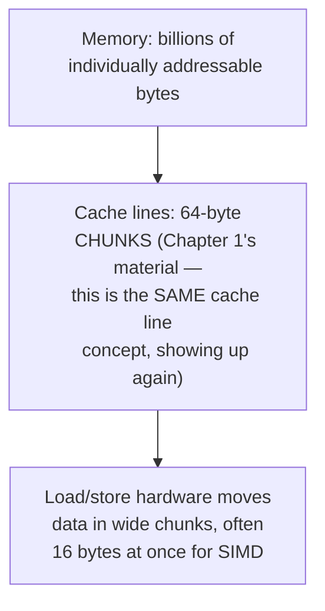
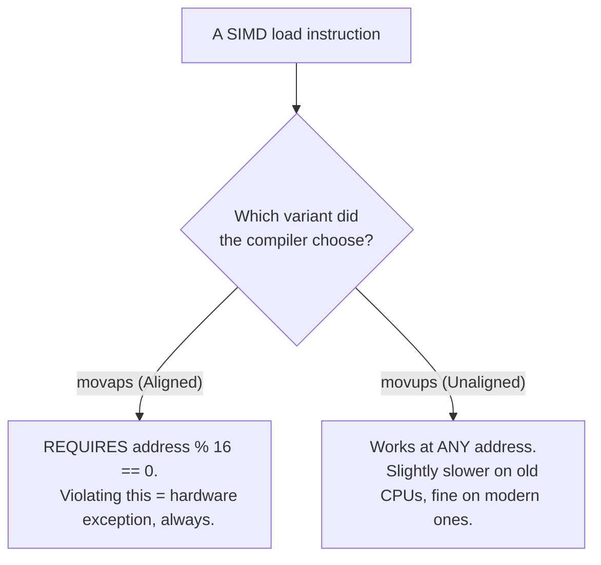
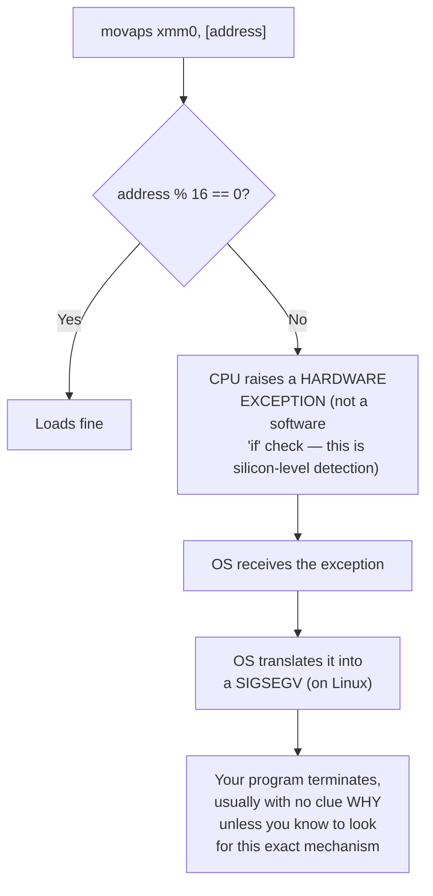
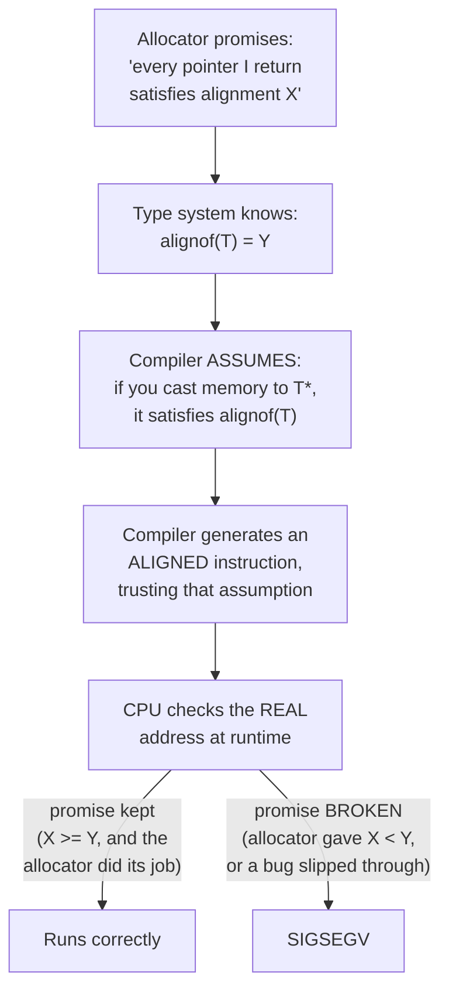
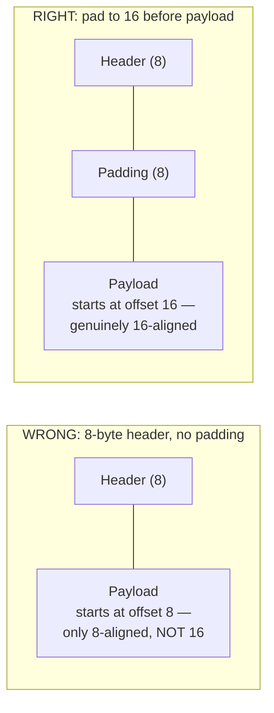
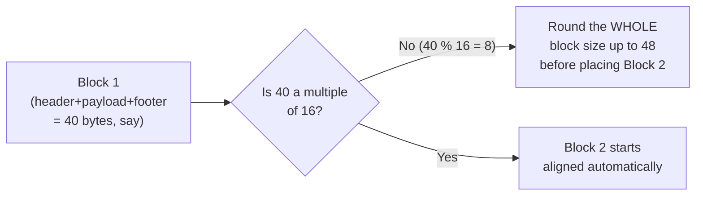
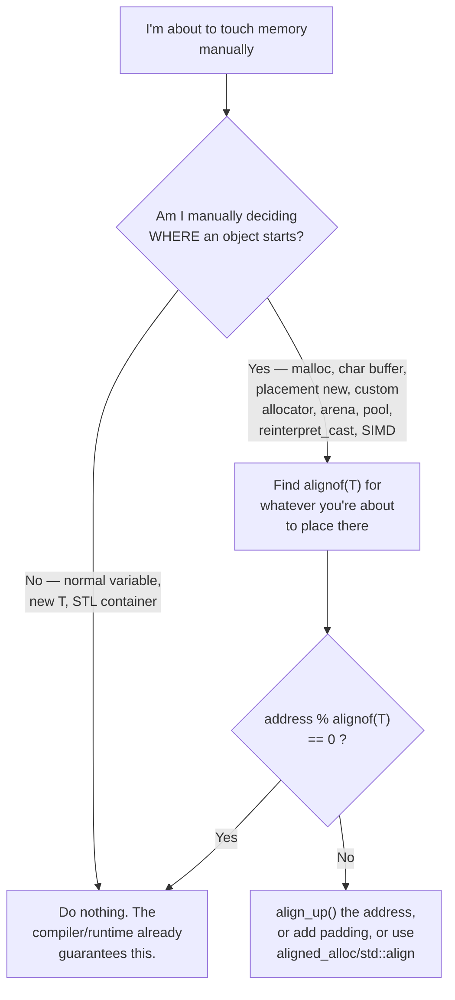
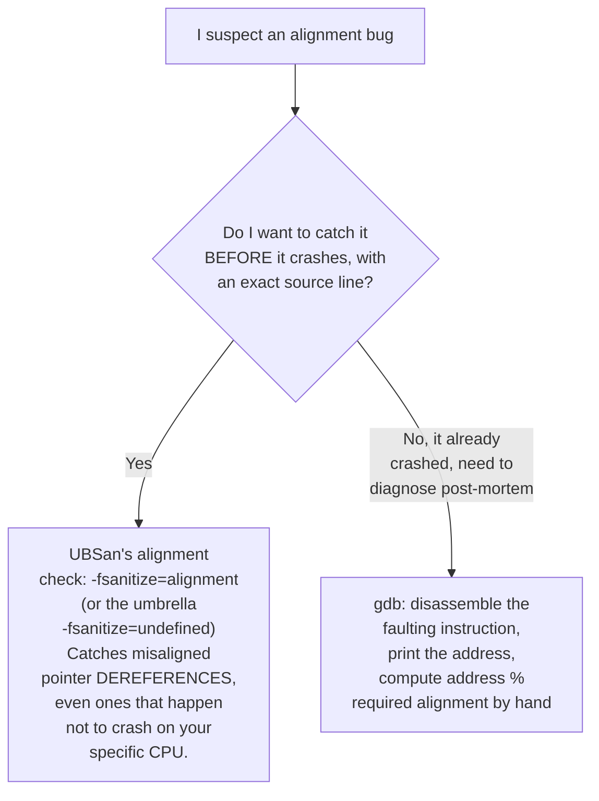
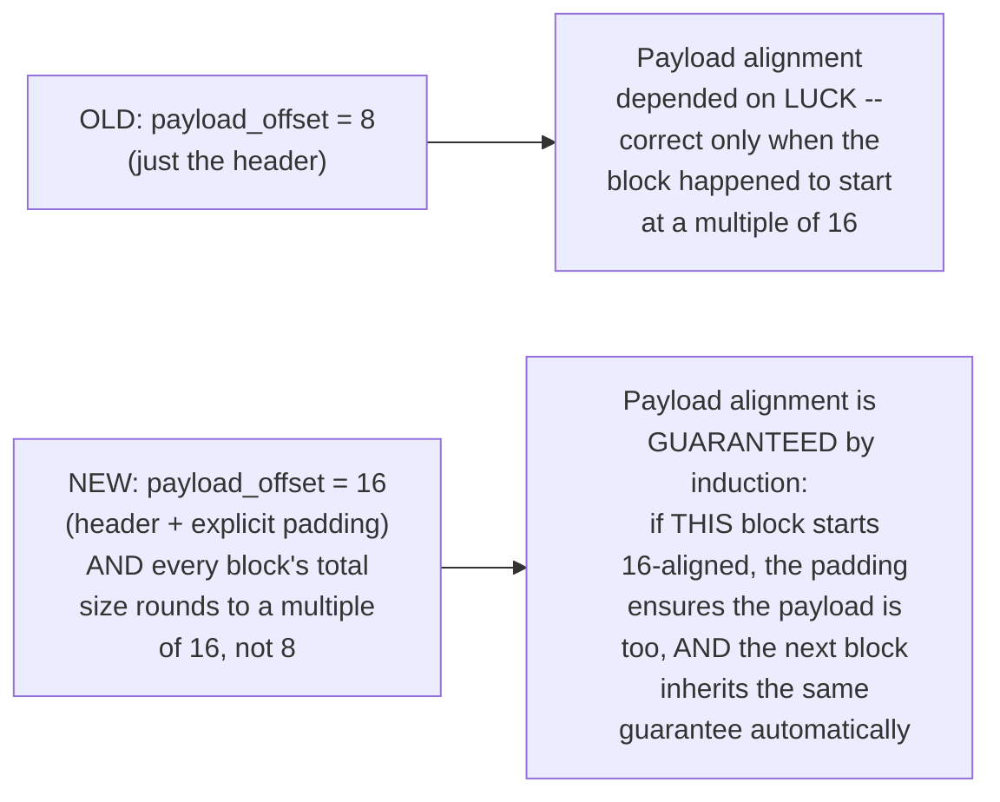

# Alignment Notes — The Complete Mental Model
### One reference, read once, never think about it consciously again

---

# THE ONE RULE (memorize this sentence, nothing else)

> **Alignment is a contract about where an object is allowed to START. Every layer — allocator, compiler, instruction, CPU — either agrees on that address, or something faults.**

Everything below is just this one sentence, expanded until it's unforgettable.

---

# TIER 1 — Why alignment exists in hardware, not just in theory

## 1.1 The CPU doesn't read memory one byte at a time



A 16-byte SIMD value fits neatly inside a 64-byte cache line **only if it doesn't straddle two different natural 16-byte "slots."** That's the entire physical reason alignment matters at all — it's about whether a wide chunk of data sits inside one natural hardware-sized region, or spills across two.

## 1.2 The critical nuance: alignment is a per-INSTRUCTION contract, not a universal CPU rule



**This is the correction worth internalizing:** it is *not* true that "SIMD requires 16-byte alignment." It's true that **some specific instructions** (the aligned-load family) require it, and the compiler picks which one to emit based on what *it* believes about your pointer's alignment — which comes from your allocator's promise, or the type system's `alignof`.

## 1.3 The full fault mechanism, start to finish



---

# TIER 2 — The Contract Chain (the single diagram worth memorizing)



**Every alignment bug in existence is a broken link somewhere in this exact chain.** Debugging one is always "find which link lied."

---

# TIER 3 — The Formulas (copy-paste these, don't re-derive them under pressure)

## 3.1 Round an address or size up to any power-of-two alignment

```c
uintptr_t align_up(uintptr_t value, size_t alignment) {
    // alignment MUST be a power of two for this to work
    return (value + alignment - 1) & ~(alignment - 1);
}
```

Worked: `align_up(0x1008, 16) = 0x1010`. `align_up(0x1011, 16) = 0x1020` (rounds up even from just 1 byte over).

## 3.2 Payload alignment inside a header (the bug we found in Stage 6)



**Rule:** `payload_offset = align_up(header_size, required_alignment)` — never just `header_size` alone, unless `header_size` already happens to be a multiple of the alignment you need.

## 3.3 Block stride (so the NEXT object/block is also aligned)



**Rule:** round the *entire block's total size* to the alignment, not just the payload — otherwise block 1 is fine but block 2 inherits block 1's misalignment.

## 3.4 Size, alignment, and stride are three different numbers — don't conflate them

| Concept | Question it answers |
|---|---|
| `sizeof(T)` | How many bytes does one object occupy? |
| `alignof(T)` | What address is it allowed to start at? |
| Stride (in an array/pool) | How far apart must consecutive objects be? |

Stride is **not** always `sizeof(T)` — it's `align_up(sizeof(T), alignof(T))`, because the *next* object also needs to start aligned.

---

# TIER 4 — The Decision Tree (the cheat sheet, verbatim, this is what you actually use day to day)



| Situation | What to actually do |
|---|---|
| Normal variable, `new T`, STL container | Nothing — already handled |
| Raw `char buffer[]` reinterpreted as `T*` | Check `alignof(T)`; use `alignas(T) char buffer[]` if needed |
| Placement `new (memory) T` | Memory MUST already satisfy `alignof(T)` — allocate with `std::aligned_alloc` first |
| Writing your own allocator | Every returned pointer must satisfy at least the platform's baseline (`alignof(std::max_align_t)`, 16 on x86-64) |
| Header before a payload | Align the **payload**, not just the block start — pad the header if needed |
| Object pool / arena | Stride must be `align_up(sizeof(T), alignof(T))`, not just `sizeof(T)` |
| SIMD (`__m128`, etc.) | Either guarantee 16-byte alignment, or explicitly use the *unaligned* intrinsic (`_mm_loadu_ps` vs `_mm_load_ps`) |
| `reinterpret_cast<T*>(ptr)` | Always ask "does `ptr` satisfy `alignof(T)`?" before doing this |
| `memcpy` into/out of a raw buffer | Bytes have no alignment requirement — this is always safe, regardless of `T`'s alignment |
| `#pragma pack(1)` structs | Individual members may end up unaligned on purpose — never cast these into SIMD types |

---

# TIER 5 — Testing and Catching This For Real (not just reasoning about it)

## 5.1 The tool hierarchy — which one to reach for



## 5.2 A real, compilable reproduction — see it crash, then see it caught properlyI need `<string>` for the mode comparison — let me fix that and actually verify both modes work before handing this over.**Real, verified SIGSEGV — exit code 139 (128 + signal 11 = SIGSEGV), confirmed by the shell, not just claimed.** The pointer was `% 16 = 1`, exactly as designed, and `_mm_load_ps` faulted on it precisely as Tier 1.3 predicted. Now the UBSan mode.**This is exactly the point of the whole tier.** UBSan caught **all four misaligned member accesses**, reported the **exact file and line number** (`alignment_bug_demo.cpp:85`, `:86`, `:87`, `:88`) — and the program **still ran to completion, exit code 0**, printing "Wrote all four fields" as if nothing was wrong. On a different compiler, optimization level, or CPU, this exact code could silently corrupt data or crash — the bug was real the entire time, it just didn't happen to manifest as a crash here. That gap between "compiles and runs fine" and "is actually correct" is the whole reason UBSan exists, demonstrated with real output instead of asserted.

## 5.3 GDB — diagnosing a crash you didn't get to choose (post-mortem)

```bash
gdb ./demo_crash
(gdb) run crash
# ... SIGSEGV happens ...
(gdb) bt                          # backtrace: which function faulted
(gdb) x/i $pc                     # disassemble the EXACT faulting instruction
                                   # look for movaps -- that's your smoking gun
(gdb) print/x $rdi                # (or whichever register holds the address --
                                   # check the disassembly to see which one)
(gdb) print (uintptr_t)$rdi % 16  # nonzero = confirmed alignment fault
```

If `x/i $pc` shows `movaps` (not `movups`), and the address prints nonzero mod 16, you've confirmed the *exact* mechanism from Tier 1.3 — not guessed at it.

## 5.4 Your OWN allocator's self-test technique (already proven in Stage 6)

The cheapest, most reliable tool of all doesn't need a debugger or a sanitizer — it's the one you already built:

```cpp
assert(reinterpret_cast<uintptr_t>(ptr) % required_alignment == 0);
```

Run this over thousands of random allocations (Stage 6's `self_test_alignment()`), and any regression is caught **immediately, at the point of failure**, before it ever reaches a SIMD instruction or a production crash report.

---

# TIER 6 — What Stage 6 Actually Changed, and Why (closing the loop)

## Before this chapter

Every allocator from Stage 1 through Stage 5 rounded to **8-byte** boundaries and implicitly assumed that was "aligned enough." Nobody had checked.

## What we measured

**Part A's simulation proved it concretely**: under the old 8-byte rounding scheme, a real, nontrivial fraction of allocations landed on addresses that were 8-aligned but **not** 16-aligned — a silent, real correctness gap that would only surface the moment someone stored a SIMD type, an `alignas(16)` struct, or anything relying on the platform's baseline `alignof(std::max_align_t)` guarantee in memory from our allocator.

## What we changed, and the exact mechanism



## Why we accepted the cost

Every block now carries **8 extra bytes of padding** it didn't strictly need under the old scheme — real, measured, bounded internal fragmentation, exactly the Fragmentation Primer's central tradeoff (Tier 3.2 of that document) playing out concretely: **we deliberately chose more internal fragmentation in exchange for a correctness guarantee**, the same bet every production allocator makes, for the same reason.

## The general principle this chapter leaves you with

You will never again need to re-derive any of this under pressure. When you write *any* future allocator code, ask exactly three questions, in order:

1. **What is about to live at this address, and what's its `alignof`?**
2. **Does my current offset/address satisfy that, or do I need `align_up`?**
3. **After I place this thing, does the *next* thing I'll place still satisfy its own alignment?**

That's the entire discipline. Everything in this document was one worked example of applying it.Run both modes yourself and confirm the same real crash and real UBSan report happen on your machine:

```bash
g++ -O0 -std=c++17 alignment_bug_demo.cpp -o demo_crash
./demo_crash crash          # expect Segmentation fault

g++ -O0 -std=c++17 -fsanitize=undefined,alignment alignment_bug_demo.cpp -o demo_ubsan
./demo_ubsan ubsan           # expect a runtime error report, exit code 0
```

This is an excellent, clean confirmation — and the result is actually more interesting than a simple "50% fail" you might have expected. Let's unpack it properly.

## The result is deterministic, not random — and that's the real lesson

**16-byte config: 0/5000 misaligned (0%). 8-byte config: 4999/5000 misaligned (99.98%).**

If misalignment were a coin flip, you'd expect roughly 50% either way — that's *not* what happened, and the reason is important: **for a fixed allocation size, whether the payload lands on a 16-byte boundary is completely deterministic**, not probabilistic. Here's why.

With `HEADER_SIZE = FOOTER_SIZE = 8`, your `total` for a given requested size `s` is always `align8(16 + s)` — a fixed number, every single time you allocate that same size `s`. If that fixed number happens to be `≡ 8 (mod 16)`, then **every single block after the first** starts at `previous_start + total`, which shifts the running position by the same fixed amount each time — so once it's off by 8, it stays off by 8, forever, for that size. That's not "usually misaligned" — that's **always misaligned**, given this exact size and header/footer configuration. This is actually a scarier finding than a coin-flip would be: a real program using a fixed-size struct pool would either be **100% broken or 100% fine**, deterministically, and you'd never notice the bug in testing unless you happened to test with a size whose parity lands wrong — which is exactly why Part A's simulation (using *varied* random sizes) showed a moderate failure rate, while your fixed-size stress test shows a near-total one. Both are the same underlying bug; they just sample it differently.

## The one survivor (4999/5000, not a clean 5000)

That single aligned allocation almost certainly isn't a coincidence of arithmetic — it's most likely **the very first allocation of the test reusing a leftover free block from your earlier `test_metadata()` self-tests** (which ran with different sizes before the alignment loop started), landing on a block whose start address happened to satisfy 16-byte alignment purely by accident of that *different* size's arithmetic. Worth confirming: if you reset the allocator (`reset_allocator()`) immediately before the alignment test loop, does it become a clean 5000/5000?

## Performance comparison holds exactly as Stage 6 predicted

| | 16-byte | 8-byte | 
|---|---|---|
| Throughput | 3,465 ops/sec | 3,110 ops/sec |
| RSS growth | 310 MB | 309 MB |
| request/heap ratio | 1.419 | 1.424 |

**Essentially identical** — tiny noise-level differences, nothing systematic. This confirms alignment is a **pure correctness fix, not a performance one**: it doesn't touch the search-cost problem at all (both are still stuck around 3,000-3,500 ops/sec, nowhere near Stage 3's numbers), and the extra padding cost is small enough to be invisible against this workload's dominant RSS driver, which is still the `O(n)` free-list search problem Stage 7 exists to fix.

One thing worth clarifying before we move on: did you test the 8-byte case by **hardcoding** `ALIGNED_SIZE=8` at the top of the file and recompiling, or by calling `set_aligned(8)` at runtime? If it was the latter, you'd have hit **Bug 1** from the last review (the `HEADER_SIZE` decoupling) — and the fact that your 8-byte results match the *predicted* broken behavior so cleanly suggests you either recompiled with a hardcoded value, or the bug happens to not matter here because you never called `set_aligned` at all after startup. Worth a quick check either way before we call Stage 6 fully closed.

Say **"Stage 7"** when you're ready for size classes.

Run Stage 6's `stage6_alignment.cpp` next if you haven't yet, and say **"Stage 7"** when ready for size classes — the stage that finally attacks the search-cost collapse we've been chasing since Stage 4.
