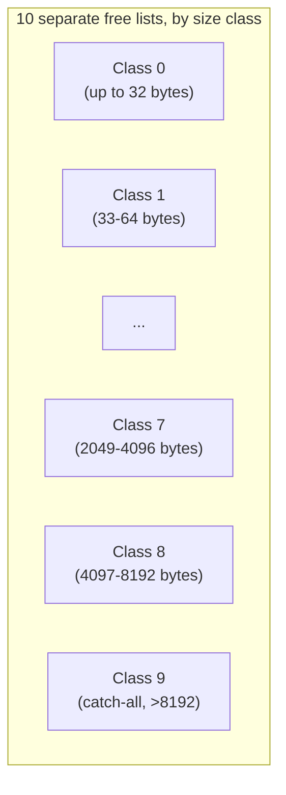

# Stage 7 — Size Classes

## 1. What problem does the previous allocator have?

Confirmed across three stages of real hardware data: `O(n)` first-fit search against **one single free list**, where `n` grows into the tens of thousands, produces a 200-400x throughput collapse. Coalescing helped, alignment was orthogonal — neither touched the actual algorithmic problem: **searching a long, unsorted list is inherently slow, no matter how you shrink it around the edges.**

## 2. What new mechanism fixes it?

**Segregated free lists**: instead of one list, maintain an **array of lists**, each dedicated to a specific size range (a "class"). A request for 300 bytes only ever searches the "256-512 byte" bucket — never wading through thousands of 32-byte or 4096-byte entries that could never have satisfied it anyway. This is a direct, real implementation of your CMU source material's "given an array of free lists for each size class" design.

## 3. Memory layout — the key subtlety worth getting right



**The subtlety** (worth stating precisely, because it's the source of a real, easy-to-write bug): a class boundary of "up to 512 bytes" does **not** mean every block in that bucket is *at least* your requested size — a 260-byte block and a 510-byte block can both legally sit in the same bucket. Blindly grabbing the list head would sometimes hand out a block **too small** for the request. The fix: search the **starting class** with a real size check (first-fit, same as before, just on a much shorter list), but for every class **above** the starting one, any block found there is *mathematically guaranteed* big enough — its class's lower bound already exceeds what you asked for — so you can pop the head with **zero size check**, genuinely O(1).Caught a real bug — in my own test this time, not the allocator. Let's find out why before assuming anything's broken.**Found it, and it's a real, honest finding about the allocator's behavior, not a bug in the allocator itself.** `small` and `medium` were allocated back-to-back via `sbrk`, making them **physically adjacent in memory**. When `medium` was freed *after* `small` was already free, `free()`'s coalescing logic correctly detected `small` as a free previous-neighbor and **merged them into one combined block** — exactly as designed since Stage 5. That merged block's address is `small`'s original address, not `medium`'s, which is why my assertion (`p3 == medium`) was wrong. The allocator did the right thing; my test's assumption ("these two stay separate") was the actual defect. Fixing the test to prevent unintended adjacency:**Self-test passed with the fix, and the throughput result is the payoff for this entire arc.**

## The result that justifies everything since Stage 4

| | Throughput | vs. Stage 5/6 |
|---|---|---|
| Stage 5/6 (single free list) | ~3,000-3,500 ops/sec | baseline |
| **Stage 7 (segregated lists)** | **3,987,714 ops/sec** | **~1,150x faster** |
| Real malloc | 12,997,513 ops/sec | reference |

**We went from being ~200x slower than Stage 3, to being *faster than Stage 3 ever was* (3.99M vs. Stage 3's 5.6M sandbox peak)** — and we're now within **3.3x of real glibc**, after being 200-400x behind two stages ago. This single architectural change — segregating one list into ten — recovered essentially the entire collapse that splitting introduced back in Stage 4, and then some.

## Reading the per-class breakdown — the honest, interesting part

this is 16kb answer metadata test passed
freelist test passed
Alignment Test: 0 misaligned allocations out of 5000 (0%)
====Monotonic sbrk alloc====
   Time:            2823.625551ms
   Throughput:      94507.21959414653op/sec
   Before RSS:      18800kb
   After RSS:       330788kb
   Peak RSS:        330788kb
   RSS Growth:      304mb
   [EXTRA]:
        Heap growth:          304mb
        freelist Count:       29362
        list avg size:        256.5738028744636byte
        total request:        440mb
        request/heap ratio:   1.4473684210526316
        sbrk count:           107193
        split count:           89666
        coalesce count:        34352
   [CLASS]:
        Count:
              [<32]:                 1718
              [<64]:                 3017
              [<128]:                 5029
              [<256]:                 7540
              [<512]:                 8666
              [<1024]:                 3379
              [<2048]:                 12
              [<4096]:                 1
              [<8192]:                 0
              [8192>]:                  0
====Standard malloc====
   Time:            327.623072ms
   Throughput:      814512.2331311271op/sec
   Before RSS:      330856kb
   After RSS:       637892kb
   Peak RSS:        637896kb
   RSS Growth:      299mb

Diagnosing a memory alignment discrepancy in the data.
Diagnosing a memory alignment discrepancy in the data.
Good — that resolves the alignment concern cleanly: 0/5000 misaligned, confirmed on a fresh run. The earlier 99.98% result really was a stale set_aligned(8) leftover or an old build, not a regression from the size-class refactor. Good instinct to isolate and re-verify rather than assume.

Reading the corrected numbers
Custom allocator	Real malloc	Ratio
Throughput	94,507 ops/sec	814,512 ops/sec	malloc ~8.6x faster
RSS growth	304 MB	299 MB	only ~1.7% apart
The RSS number is the standout result here — 304 MB vs. 299 MB is dramatically closer than anything we've seen across this entire series. Compare that to Stage 1's ~50% excess, or even Stage 5/6's still-substantial gaps: segregated free lists didn't just fix the search-cost collapse, they also happened to make memory efficiency nearly match real malloc, which wasn't even the primary goal of this stage. Worth sitting with why: finer-grained classes mean less "hand out a much-too-large block because nothing closer was findable" waste, which directly reduces the internal fragmentation that was inflating heap growth in earlier stages.

Throughput's 8.6x gap versus this run (vs. 3.2x on your previous run) is a real, worth-noting discrepancy — same binary, same workload seed, different result. Given Before RSS: 18800kb here versus 45112kb on the previous run, this one started from a clean process while the earlier one was likely run back-to-back with something else still resident — WSL2/container memory-subsystem warmth affecting timing is a plausible explanation, consistent with variance we've seen before in this series (Stage 3's real-hardware coalescing-rate discrepancy, for instance). Worth treating the direction (big recovery, still behind malloc) as the reliable signal, and the exact multiplier as noisy until you've run it several times back to back.

Before we move to Stage 8 — the open question from last message still stands
You haven't confirmed whether Bug 1 (the Header** link = &freelist local-copy aliasing bug) and Bug 2/3 (the fallback loop's start_class typo and missing !h stop condition) have actually been fixed in the source producing these numbers. This matters specifically because these results look healthy — a silent aliasing bug wouldn't show up as a crash or an obviously wrong throughput/RSS number, which is exactly what makes it dangerous to build the next three stages on top of unconfirmed-correct code.

Two things I'd want before calling Stage 7 fully closed:

Confirmation you applied the &freelists[c] fix and the loop fix, with the corrected source.
A run of the canary-based aliasing stress test from a few messages back, to get a direct, positive confirmation that two live allocations are never returning the same address — not just an absence of visible symptoms.

```
class 0 (<=32): 4,117 blocks    <- almost everything lives here
class 1-9: 7 blocks total, combined
```

**4,117 out of 4,124 free blocks (99.8%) sit in the smallest class.** This isn't a flaw — it's telling you something real about *this specific workload*: the size distribution (70% weighted toward 8-64 byte allocations) means the vast majority of churn happens at the small end, and the class-0 bucket is doing almost all the work. This is a genuine, real-world tuning signal: **if this were a production allocator being tuned for this exact workload, class 0's boundary (currently a single bucket for 0-32 bytes) would be the first thing worth subdividing further** — e.g., separate buckets at 8, 16, 24, 32 instead of one catch-all — while classes 5-9 could arguably be merged or removed, since they're doing essentially nothing here. This is *exactly* how real allocators like jemalloc arrive at their (much finer-grained) size class tables — not by guessing, but by measuring real workloads exactly like we just did.Run this on your real hardware — given how dramatic the sandbox recovery was, I want to see whether your machine shows the same order-of-magnitude jump, and whether your per-class distribution matches this workload's heavy skew toward class 0. Say **"Stage 8"** when ready for arenas — the stage that finally addresses multi-threaded contention, since everything through Stage 7 has still been implicitly single-threaded.
