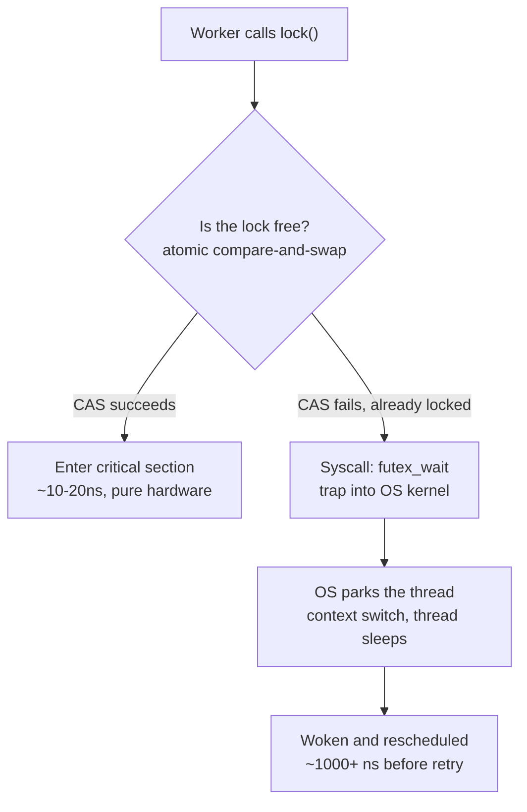
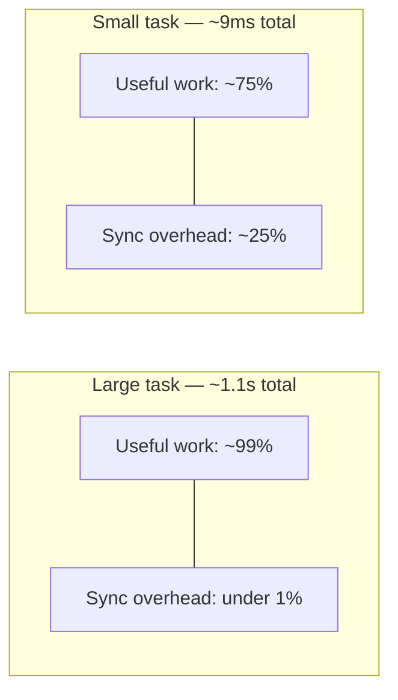
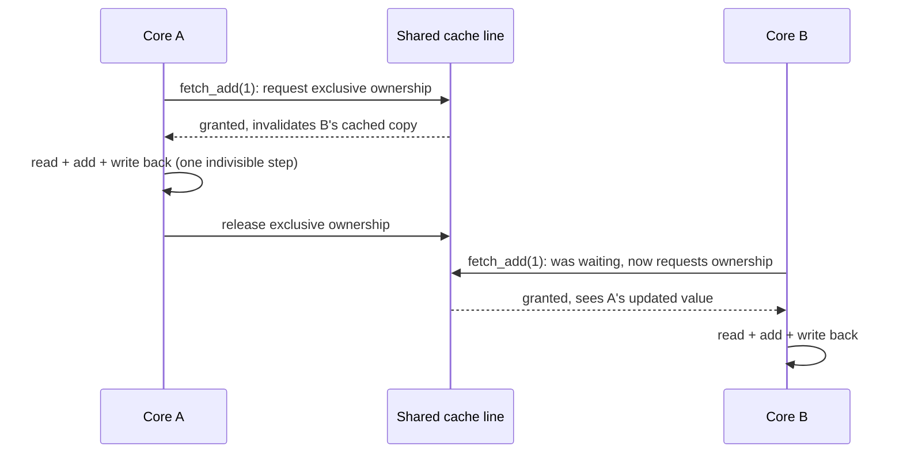
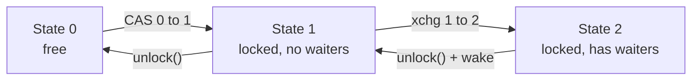
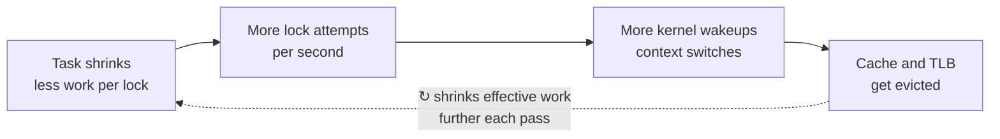
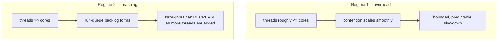

# C++ Multithreading Notes — Part 5: Deep Dive — Mutex Internals, Atomics, and Thrashing

A deep-dive companion to Part 4's mutex-vs-atomic comparison. This part answers
four questions in full technical depth: *why does mutex overhead depend on
task size, how does `lock xadd` actually work in hardware, how is a mutex's
CAS fast path actually written in software, and what really happens when
synchronization overhead spirals into full-blown thrashing.*

---

## 1. Why mutex overhead depends on task size

### 1.1. What `mutex.lock()` really does

A mutex lock isn't one operation — it's a two-tier system:

- **Fast path (uncontended):** a single atomic compare-and-swap flips the
  lock's state from *free* to *held*. Pure user-space, a few nanoseconds, no
  operating system involved.
- **Slow path (contended):** if someone else holds the lock, the thread can't
  just spin forever burning CPU — it makes a **system call** asking the OS
  kernel to put it to sleep until the lock frees up. That syscall means a
  mode switch into the kernel, the scheduler saving thread state, and later
  waking and rescheduling the thread. This can cost **100–1000x** more than
  the fast path.



### 1.2. Why task size determines how often you hit the expensive path

Whether the slow path gets hit depends on **how often two threads try to
grab the lock at nearly the same moment**:

- **Large tasks:** each worker spends a long time computing between lock
  attempts. By the time it comes back for the shared resource, the other
  workers are almost certainly still busy — contention is rare, and nearly
  every lock/unlock hits the cheap fast path.
- **Tiny tasks:** all workers finish almost simultaneously and race back to
  the lock over and over, thousands of times a second. Contention becomes
  common, and the program keeps hitting the expensive kernel-involved path.

This matches what was actually measured in the video and reproduced in our
own experiments:

| Scenario | Mutex overhead |
|---|---|
| Large tasks (light=100, heavy=1000 iterations) | ~0% — 1.1s either way |
| Medium tasks (light=2, heavy=30) | ~20–25% slower with the mutex |

### 1.3. It's Amdahl's law in disguise

```
total_time = (number of tasks) × (work_time_per_task + sync_time_per_task)
```

`sync_time_per_task` is roughly *fixed* — it doesn't shrink just because the
task got lighter:

- **Large `work_time`:** the fixed sync cost is a tiny sliver of each task's
  total time, even if it occasionally hits the slow path.
- **Small `work_time`:** that same fixed sync cost becomes a huge proportion
  of each task's time — and it's hitting the expensive path more often too.
  Hit twice: proportionally bigger, *and* more frequently expensive.



### 1.4. Tying it back to our own `GetTask()` queue

In our Part 4 queue design, every single call to `GetTask()` is a
synchronization point — once per *task*, not once per *chunk*. That's
exactly why task size matters so directly there: with `light_iterations`
around 100+, the lock is barely ever contended. Shrink it toward 2–3
iterations and workers are back at the lock so often that contention (and
the kernel sleep/wake cycle) becomes a real, measurable tax.

There's also a smaller secondary effect: even in the *uncontended* fast
path, the mutex's internal lock variable lives in one CPU cache line, and
every lock/unlock forces that line to be handed between cores (a
cache-coherency cost). Small next to a kernel syscall, but it adds up at
extremely high frequency.

---

## 2. How `lock xadd` actually works in hardware

### 2.1. What a plain (non-atomic) increment compiles to

`idx_++` on ordinary memory is really three separate CPU instructions:

```
load  idx_        ; read the current value into a register
add   1            ; increment it in the register
store idx_         ; write the new value back to memory
```

The gap between `load` and `store` is exactly where a race condition lives —
another core can `load` the same still-old value before the first core's
`store` happens.

### 2.2. What `lock xadd` does instead

`xadd` (exchange-and-add) reads a memory location *and* adds to it as one
indivisible step. The `lock` prefix makes this safe across cores:

1. The executing core requests **exclusive ownership** of the cache line
   holding the variable, via the CPU's cache-coherency protocol (e.g. MESI).
   Any copy of that line in another core's cache gets invalidated.
2. While holding exclusive ownership, it reads, adds, and writes back — all
   as one uninterruptible unit. No other core can observe or touch that
   memory in between.
3. It releases exclusive ownership; the updated value becomes visible to
   whichever core asks for it next.

**None of this involves the operating system** — it's pure CPU/cache
hardware. A contending core just waits a few extra cycles for the hardware
handoff; no syscalls, no thread parking, no scheduler.



### 2.3. Why a mutex is "worse" than an atomic here

| | Best case (uncontended) | Worst case (contended) |
|---|---|---|
| **Mutex** | Atomic CAS + bookkeeping — a few ns | Full syscall: kernel trap, park, wake, reschedule — **microseconds** |
| **Atomic `fetch_add`** | Single hardware instruction — a few ns | Brief wait for cache line handoff — **still just nanoseconds, no OS** |

Both have similar *best* cases (a mutex typically uses an atomic instruction
internally anyway). The gap opens in the *worst* case: a mutex's worst case
escalates all the way to the OS; an atomic's worst case never leaves the
CPU. This is why the atomic version of our queue's `GetTask()` measured
roughly **2x faster** than the mutex version — it completely sidesteps ever
hitting the expensive kernel path.

**Important caveat:** this only holds for a single, simple, indivisible
operation on one variable (a counter). The moment you need to protect more
than that, a single atomic instruction can't express it — you're back to
needing a mutex, or a much harder to get right hand-built lock-free
structure. **Default to a mutex; reach for atomics only for simple, hot,
narrowly-scoped operations, after measuring a real bottleneck.**

---

## 3. How a mutex's CAS fast path is actually written

### 3.1. What CAS means in code

```cpp
std::atomic<int> state{0};

int expected = 0;
bool success = state.compare_exchange_strong(expected, 1);
// If state == expected (0): atomically set state = 1, return true.
// If state != expected: load state's ACTUAL value into `expected`, return false.
```

This whole check-and-maybe-swap is one hardware instruction (`cmpxchg` with
a `lock` prefix on x86 — same family of trick as `lock xadd`).
`compare_exchange_weak` is the same idea but may spuriously fail even when
values matched (some architectures implement it via load-linked/
store-conditional) — fine for CAS-in-a-loop code, which retries anyway.

### 3.2. The naive version: a pure spinlock

```cpp
class SpinLock
{
public:
    void lock()
    {
        bool expected = false;
        while (!locked_.compare_exchange_weak(expected, true, std::memory_order_acquire))
        {
            expected = false; // CAS overwrites `expected` on failure, reset it
        }
    }

    void unlock()
    {
        locked_.store(false, std::memory_order_release);
    }

private:
    std::atomic<bool> locked_{false};
};
```

This genuinely is how a mutex's *fast path* works. The problem: if the lock
is held for a while, every waiting thread burns 100% CPU re-trying
thousands of times a second. Fine for microsecond-scale waits, wasteful for
longer ones — which is why real mutexes add a second layer.

### 3.3. The real design: a 3-state futex mutex

This is essentially what glibc's `pthread_mutex` and similar implementations
do (based on Ulrich Drepper's design). A single integer with three states:

- **0** — unlocked
- **1** — locked, no one waiting
- **2** — locked, at least one thread is asleep waiting for it



```cpp
#include <atomic>
#include <linux/futex.h>
#include <sys/syscall.h>
#include <unistd.h>

class FutexMutex
{
public:
    void lock()
    {
        int expected = 0;
        // Fast path: try 0 -> 1 (free -> locked, no waiters). Zero syscalls if this works.
        if (state_.compare_exchange_strong(expected, 1, std::memory_order_acquire))
            return;

        // Slow path: someone else holds it. Announce "there's a waiter" (-> state 2)
        // and sleep, but only while state_ is STILL 2 when we check.
        int c = expected;
        do
        {
            if (c == 2 || state_.exchange(2, std::memory_order_acquire) != 0)
            {
                futex_wait(&state_, 2); // OS puts us to sleep here
            }
            c = state_.exchange(2, std::memory_order_acquire);
        } while (c != 0);
    }

    void unlock()
    {
        // Decrement first: 1 -> 0 (no one waiting) or 2 -> 1 (someone might be waiting)
        if (state_.fetch_sub(1, std::memory_order_release) != 1)
        {
            // It was 2 -- at least one thread might be asleep. Reset and wake it.
            state_.store(0, std::memory_order_release);
            futex_wake(&state_, 1);
        }
        // If it WAS 1, it's now 0 and we're done -- no syscall needed at all.
    }

private:
    std::atomic<int> state_{0};

    static long futex_wait(std::atomic<int>* addr, int expected_val)
    {
        return syscall(SYS_futex, addr, FUTEX_WAIT, expected_val, nullptr, nullptr, 0);
    }
    static long futex_wake(std::atomic<int>* addr, int n)
    {
        return syscall(SYS_futex, addr, FUTEX_WAKE, n, nullptr, nullptr, 0);
    }
};
```

**Why this design is clever:** `unlock()` decrements first and only calls
`futex_wake` if the state was `2`. If nobody was ever waiting, `unlock()` is
one atomic decrement — **zero syscalls, ever.** The kernel only gets
involved when there's an actual sleeping thread that genuinely needs
waking. This is exactly why the "fast path is basically free" claim isn't
hand-wavy — the state machine is engineered so the common case never
touches the OS.

### 3.4. The portable, modern C++ way

Since C++20, `std::atomic<T>` has `.wait()` / `.notify_one()` /
`.notify_all()` — the same futex-like mechanism, portable across platforms
(futex on Linux, `WaitOnAddress` on Windows):

```cpp
class PortableMutex
{
public:
    void lock()
    {
        int expected = 0;
        if (state_.compare_exchange_strong(expected, 1, std::memory_order_acquire))
            return; // fast path, no syscall

        for (;;)
        {
            int old = state_.exchange(2, std::memory_order_acquire);
            if (old == 0) return; // got it
            state_.wait(2, std::memory_order_relaxed); // sleeps until value changes
        }
    }

    void unlock()
    {
        if (state_.fetch_sub(1, std::memory_order_release) != 1)
        {
            state_.store(0, std::memory_order_release);
            state_.notify_one();
        }
    }

private:
    std::atomic<int> state_{0};
};
```

This is essentially what real `std::mutex` implementations look like
internally on most platforms today — a small atomic state variable, a
CAS-based fast path, and a fallback to an OS "sleep until this memory
changes" primitive only when actually necessary.

---

## 4. Too much switching: syscalls, context switches, and thrashing

### 4.1. What happens, mechanically, on every contended lock/unlock

Every time a worker hits the contended branch of `FutexMutex::lock()`:

1. Thread calls `futex_wait` → traps into the kernel (mode switch).
2. Kernel removes the thread from the run queue, marks it blocked, saves its
   register state.
3. Kernel picks something else to run on that core.
4. Later, `unlock()` sees `state_ == 2` and calls `futex_wake`.
5. Kernel marks the sleeping thread runnable again — but it may not run
   *immediately*; it waits its turn to actually be scheduled onto a core.
6. When it finally runs, the kernel restores its register state.

That whole dance — **a context switch** — happens twice per contended lock
acquisition (once to sleep, once to resume).

### 4.2. Direct cost vs. hidden cost

- **Direct cost** — saving/restoring registers, scheduler bookkeeping.
  Typically **1–10 microseconds**. Threads in the *same process* (like our
  worker pool) share one address space, so no full page-table switch or TLB
  flush is needed — just register state. Much cheaper than switching between
  unrelated processes.
- **Hidden cost** — while a thread was asleep, the core ran other code,
  evicting the thread's data from L1/L2 caches and polluting the branch
  predictor. Resuming means re-warming all of that from scratch — often
  **several times more expensive** than the direct switch itself, especially
  for tasks touching a meaningful amount of memory.

### 4.3. A second drawback: the thundering herd / convoy effect

If a mutex wakes *every* waiting thread on unlock (instead of just one), all
of them wake up, race for the lock, exactly one wins, and the rest go
straight back to sleep — paying the full context-switch cost for nothing.
This is why `FutexMutex::unlock()` deliberately calls `futex_wake(&state_,
1)` — wake exactly one, never everyone.

### 4.4. What "thrashing" actually is

"Thrashing" isn't just a fancier word for overhead — it's a specific
**runaway feedback loop**. The term comes from classic OS memory
management: a system thrashes when it's so oversubscribed on memory that it
spends nearly all its time swapping pages in and out instead of computing —
and the more processes you add, the *worse* it gets, not just
proportionally worse.

The thread/lock version follows the same shape:



The loop closes on itself: cache pollution slows down whatever useful work
*does* happen, worsening the ratio of work to next-lock-attempt, which makes
the *next* round of contention even more frequent. This compounding
(not just additive) behavior is the defining feature of thrashing.

### 4.5. When does it actually cross the line into real thrashing?

Two distinct regimes:

**Regime 1 — "just overhead" (what we actually measured).** As long as
worker thread count stays at or below the number of physical CPU cores,
each contended lock/unlock costs a fairly predictable, bounded amount extra
— overhead scales up smoothly as tasks shrink, but doesn't spiral. This is
the ~20–25% overhead territory measured with `light_iterations = 2`.
Annoying, measurable, not catastrophic.

**Regime 2 — actual thrashing.** Kicks in specifically when the CPU is
**oversubscribed** — many more runnable/contending threads than physical
cores — combined with tiny critical sections. A woken thread now has to sit
in the run queue behind other threads for multiple scheduling time-slices
before it actually runs, while more threads pile up behind it, each
contributing more cache eviction while waiting their turn. The telltale
sign: **negative scaling** — adding more concurrent threads makes total
throughput go *down*, not just plateau. That's fundamentally different from
diminishing returns; it's the system actively getting worse as more
competitors pile onto the same resource.

Concretely: our 4-worker experiment on a 4+ core machine sits solidly in
Regime 1. Genuine Regime 2 thrashing would show up spinning up, say, 32–64
worker threads all hammering the same tiny lock on a 4-core machine — now
the OS scheduler itself becomes the bottleneck, spending more wall-clock
time deciding who runs next than any thread spends doing useful work.



### 4.6. Detecting it in practice

- **Context switch count** — `perf stat` (Linux) reports `context-switches`;
  a high count relative to work items processed is a red flag.
- **Throughput vs. thread count curve** — plot total work/sec against worker
  count. Regime 1 looks like diminishing returns (curve flattens). Regime 2
  looks like the curve turning *downward* past some thread count.
- **High CPU usage with low actual throughput** — `top`/`htop` showing
  busy cores while task throughput stays low often means a lot of that
  "busy" time is kernel-side scheduling overhead, not your code.

### 4.7. The practical fix

Two standard remedies, both attacking the root cause directly:

1. **Batch more work per synchronization point** — shrinks the *frequency*
   of contention (bigger tasks per lock acquisition).
2. **Prefer atomics for tiny, hot, simple operations** — removes the kernel
   from the picture entirely. Atomics never sleep, so there's no context
   switch to trigger the feedback loop at all — Regime 2 essentially can't
   happen around a pure atomic counter, which is part of why our
   `fetch_add`-based queue stayed fast even as task size shrank.

---

## 5. Key Takeaways — Mutex Internals & Thrashing

- A mutex is two-tiered: an essentially-free atomic CAS fast path, and a
  syscall-based slow path that's 100–1000x more expensive. Task size
  controls how often you hit the expensive tier, not whether the mutex is
  "good" or "bad" in the abstract.
- `lock xadd` (and CAS) achieve atomicity purely through CPU cache-coherency
  protocols (exclusive cache-line ownership) — no OS involvement, which is
  why atomics avoid the mutex's expensive worst case entirely, for the
  narrow case of a single simple operation.
- A real mutex's fast path is literally just a `compare_exchange_strong` in
  a wrapper; its slow path is a small state machine (free / locked-no-
  waiters / locked-has-waiters) built so that `unlock()` only calls into the
  kernel when a thread might actually be asleep waiting.
- A context switch has both a direct cost (register save/restore, scheduler
  bookkeeping) and a larger hidden cost (cache/TLB/branch-predictor
  pollution) that shows up as a burst of misses when the thread resumes.
- Thrashing is a specific compounding feedback loop, not just "a lot of
  overhead" — it kicks in when thread count meaningfully exceeds core count
  combined with very small critical sections, and its hallmark is
  *negative* scaling: through
