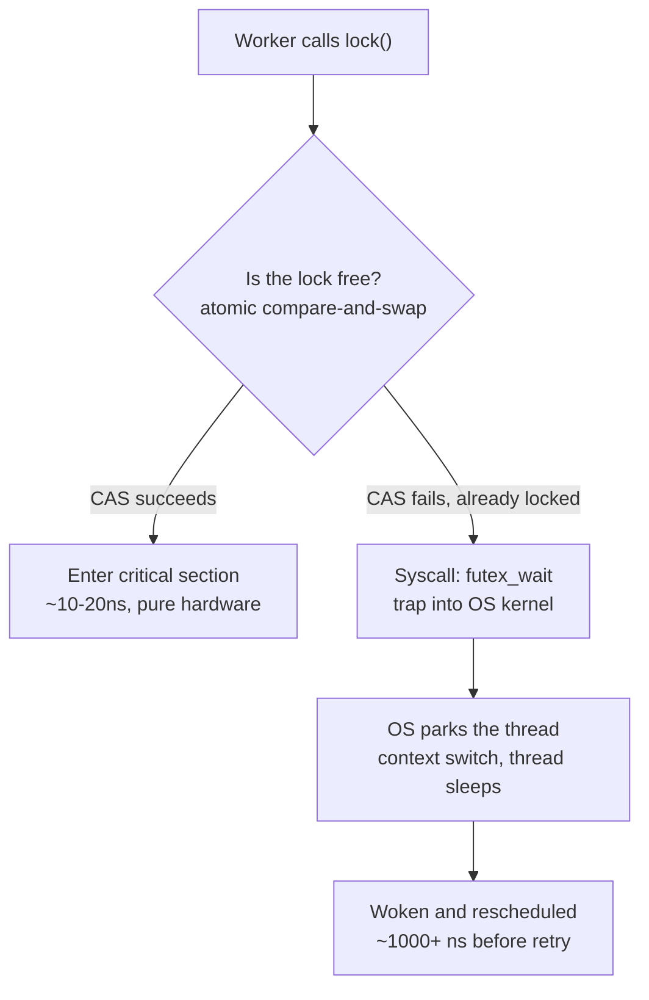
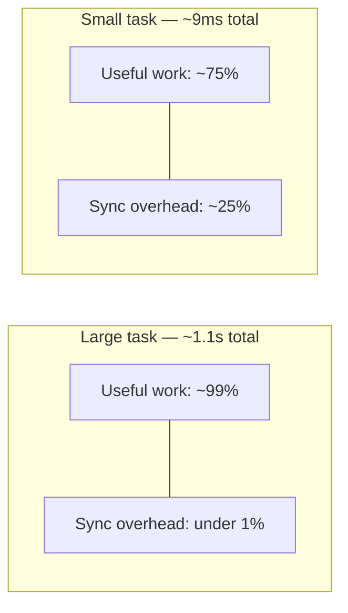
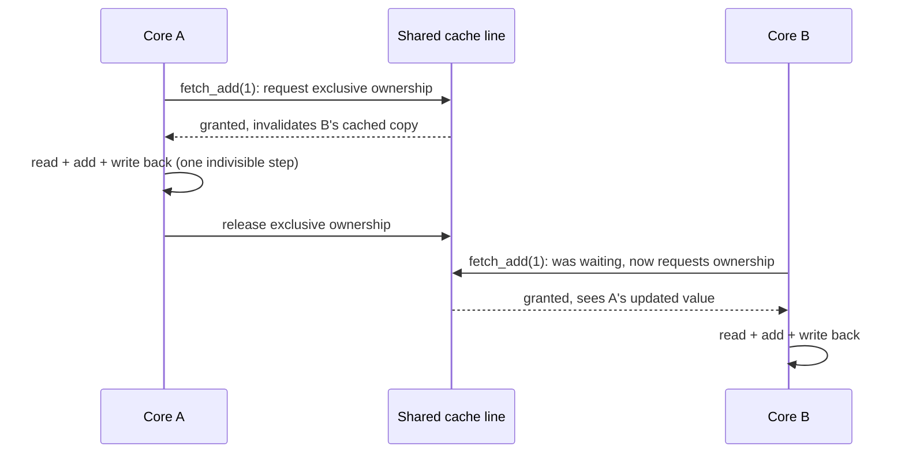
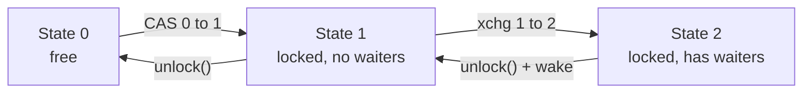
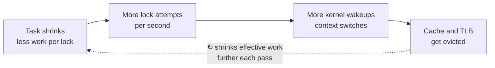
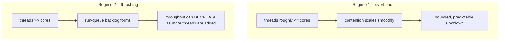
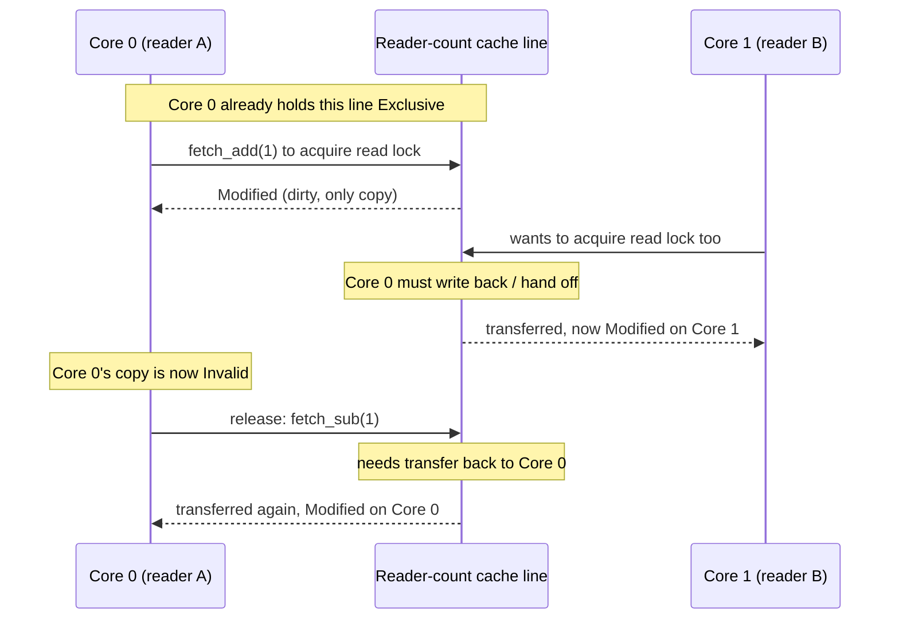
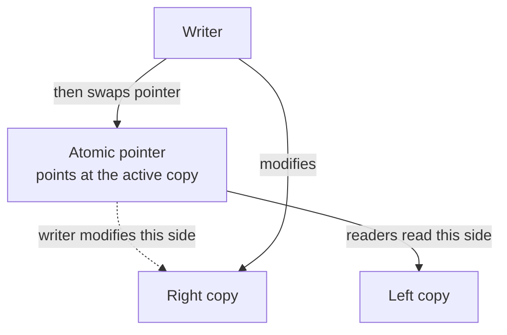

# C++ Multithreading Notes — Part 5: Deep Dive — Mutex Internals, Atomics, and Thrashing

A deep-dive companion to Part 4's mutex-vs-atomic comparison. This part answers
four questions in full technical depth: *why does mutex overhead depend on
task size, how does `lock xadd` actually work in hardware, how is a mutex's
CAS fast path actually written in software, and what really happens when
synchronization overhead spirals into full-blown thrashing.*

---

## 1. Why mutex overhead depends on task size

### 1.1. What `mutex.lock()` really does

A mutex lock isn't one operation — it's a two-tier system:

- **Fast path (uncontended):** a single atomic compare-and-swap flips the
  lock's state from *free* to *held*. Pure user-space, a few nanoseconds, no
  operating system involved.
- **Slow path (contended):** if someone else holds the lock, the thread can't
  just spin forever burning CPU — it makes a **system call** asking the OS
  kernel to put it to sleep until the lock frees up. That syscall means a
  mode switch into the kernel, the scheduler saving thread state, and later
  waking and rescheduling the thread. This can cost **100–1000x** more than
  the fast path.



### 1.2. Why task size determines how often you hit the expensive path

Whether the slow path gets hit depends on **how often two threads try to
grab the lock at nearly the same moment**:

- **Large tasks:** each worker spends a long time computing between lock
  attempts. By the time it comes back for the shared resource, the other
  workers are almost certainly still busy — contention is rare, and nearly
  every lock/unlock hits the cheap fast path.
- **Tiny tasks:** all workers finish almost simultaneously and race back to
  the lock over and over, thousands of times a second. Contention becomes
  common, and the program keeps hitting the expensive kernel-involved path.

This matches what was actually measured in the video and reproduced in our
own experiments:

| Scenario | Mutex overhead |
|---|---|
| Large tasks (light=100, heavy=1000 iterations) | ~0% — 1.1s either way |
| Medium tasks (light=2, heavy=30) | ~20–25% slower with the mutex |

### 1.3. It's Amdahl's law in disguise

```
total_time = (number of tasks) × (work_time_per_task + sync_time_per_task)
```

`sync_time_per_task` is roughly *fixed* — it doesn't shrink just because the
task got lighter:

- **Large `work_time`:** the fixed sync cost is a tiny sliver of each task's
  total time, even if it occasionally hits the slow path.
- **Small `work_time`:** that same fixed sync cost becomes a huge proportion
  of each task's time — and it's hitting the expensive path more often too.
  Hit twice: proportionally bigger, *and* more frequently expensive.



### 1.4. Tying it back to our own `GetTask()` queue

In our Part 4 queue design, every single call to `GetTask()` is a
synchronization point — once per *task*, not once per *chunk*. That's
exactly why task size matters so directly there: with `light_iterations`
around 100+, the lock is barely ever contended. Shrink it toward 2–3
iterations and workers are back at the lock so often that contention (and
the kernel sleep/wake cycle) becomes a real, measurable tax.

There's also a smaller secondary effect: even in the *uncontended* fast
path, the mutex's internal lock variable lives in one CPU cache line, and
every lock/unlock forces that line to be handed between cores (a
cache-coherency cost). Small next to a kernel syscall, but it adds up at
extremely high frequency.

---

## 2. How `lock xadd` actually works in hardware

### 2.1. What a plain (non-atomic) increment compiles to

`idx_++` on ordinary memory is really three separate CPU instructions:

```
load  idx_        ; read the current value into a register
add   1            ; increment it in the register
store idx_         ; write the new value back to memory
```

The gap between `load` and `store` is exactly where a race condition lives —
another core can `load` the same still-old value before the first core's
`store` happens.

### 2.2. What `lock xadd` does instead

`xadd` (exchange-and-add) reads a memory location *and* adds to it as one
indivisible step. The `lock` prefix makes this safe across cores:

1. The executing core requests **exclusive ownership** of the cache line
   holding the variable, via the CPU's cache-coherency protocol (e.g. MESI).
   Any copy of that line in another core's cache gets invalidated.
2. While holding exclusive ownership, it reads, adds, and writes back — all
   as one uninterruptible unit. No other core can observe or touch that
   memory in between.
3. It releases exclusive ownership; the updated value becomes visible to
   whichever core asks for it next.

**None of this involves the operating system** — it's pure CPU/cache
hardware. A contending core just waits a few extra cycles for the hardware
handoff; no syscalls, no thread parking, no scheduler.



### 2.3. Why a mutex is "worse" than an atomic here

| | Best case (uncontended) | Worst case (contended) |
|---|---|---|
| **Mutex** | Atomic CAS + bookkeeping — a few ns | Full syscall: kernel trap, park, wake, reschedule — **microseconds** |
| **Atomic `fetch_add`** | Single hardware instruction — a few ns | Brief wait for cache line handoff — **still just nanoseconds, no OS** |

Both have similar *best* cases (a mutex typically uses an atomic instruction
internally anyway). The gap opens in the *worst* case: a mutex's worst case
escalates all the way to the OS; an atomic's worst case never leaves the
CPU. This is why the atomic version of our queue's `GetTask()` measured
roughly **2x faster** than the mutex version — it completely sidesteps ever
hitting the expensive kernel path.

**Important caveat:** this only holds for a single, simple, indivisible
operation on one variable (a counter). The moment you need to protect more
than that, a single atomic instruction can't express it — you're back to
needing a mutex, or a much harder to get right hand-built lock-free
structure. **Default to a mutex; reach for atomics only for simple, hot,
narrowly-scoped operations, after measuring a real bottleneck.**

---

# Understanding Cache Coherency, Race Conditions, and Atomic Operations

When multiple threads concurrently perform `cnt++` on a single shared variable, two distinct issues arise:
1. **Correctness (Data Race):** Unsynchronized access leads to lost updates.
2. **Performance (Cache Bouncing / Contention):** Multiple CPU cores repeatedly invalidate each other's cache lines.

This document explains why cache line ownership alone **does not** prevent race conditions at the software level and how atomic operations (`LOCK` / `std::atomic`) solve this at the hardware level.

---

## 1. Core Paradox: Register State vs. Cache State

A race condition and cache ownership operate on **two completely different layers** of modern computing architecture:

* **Cache Ownership (MESI Protocol):** Operating at the **Hardware Layer** (nanoseconds, CPU clock cycles), cache coherency protocols manage which core has permission to read or write a given 64-byte cache line.
* **Instruction Execution (`cnt++`):** Operating at the **Instruction / Software Layer** (multiple clock cycles), `cnt++` is a high-level language statement that decomposes into three distinct machine-level operations:
  1. **Read (`MOV`):** Read `cnt` from memory/cache into a CPU general-purpose register.
  2. **Modify (`INC`):** Increment the register value inside the CPU Execution Unit (ALU).
  3. **Write (`MOV`):** Write the updated register value back to memory/cache.

Even though a core claims **Exclusive Ownership** of the cache line when executing a write, it only holds that ownership for the brief instant required to perform that single write instruction. It **does not lock the cache line across the entire Read-Modify-Write sequence**.

---

## 2. Step-by-Step Breakdown of the Race Condition

Below is a detailed execution timeline of two threads running on Core 0 and Core 1 attempting to increment `cnt` (initially `0`):

| Time Step | Core 0 (Thread 1) | Core 1 (Thread 2) | Cache Line Ownership | Memory/Cache Value |
| :--- | :--- | :--- | :--- | :--- |
| **$T_1$** | **READ:** Loads `cnt` (`0`) into Register `EAX`. | *Idle* | Shared (Core 0) | `0` |
| **$T_2$** | Computes `INC EAX` (Register value becomes `1`). | **READ:** Loads `cnt` (`0`) into Register `EBX`. | Shared (Core 0, Core 1) | `0` |
| **$T_3$** | **WRITE:** Requests Exclusive ownership. Invalidates Core 1's cache line. Writes `1` to cache. | Computes `INC EBX` (Register value becomes `1`). | Exclusive (Core 0) | `1` |
| **$T_4$** | *Execution finished.* | **WRITE:** Requests Exclusive ownership. Invalidates Core 0's cache line. Writes `1` to cache. | Exclusive (Core 1) | `1` **(Lost Update!)** |

### Why Cache Ownership Fails to Prevent the Race

1. **Registers are Local to Each CPU Core:** Core 1 reads `cnt = 0` at $T_2$ and stores it in its private general-purpose register `EBX`. When Core 0 writes `1` to the cache line at $T_3$, the cache coherency controller invalidates Core 1's **L1/L2 cache line**, but it **cannot modify or invalidate data already inside Core 1's CPU register**.
2. **Ownership Duration is Short:** Core 0 only acquires exclusive cache line ownership during its store instruction (`MOV [cnt], EAX`). It releases/yields ownership as soon as Core 1 requests ownership for its own store instruction at $T_4$.

---

## 3. Hardware Solution: Atomic Execution (`LOCK` / `std::atomic`)

To guarantee thread safety without heavy software locks (mutexes), hardware provides **atomic read-modify-write instructions**.

On x86 architectures, applying the `LOCK` prefix (e.g., `LOCK INC [cnt]`) or using `std::atomic<int>` in C++ alters how the hardware manages cache ownership:

### Non-Atomic `cnt++` vs. Atomic `LOCK INC [cnt]`

#### Non-Atomic Execution (Race Condition)
```
Core 0: [Read cnt=0] ---------> [INC in Reg] ---------> [Acquire Line -> WRITE cnt=1 -> Release Line]
Core 1: ------- [Read cnt=0] ---------> [INC in Reg] ---------> [Acquire Line -> WRITE cnt=1 -> Release Line]
                                                                                                  ^
                                                                                           Final result: 1 (WRONG)
```
* **The Gap:** Core 1 reads `0` into its register *before* Core 0 writes `1` back to cache. Invalidation at $T_3$ does not wipe Core 1's register.

#### Atomic Execution (Hardware Enforced)
```
Core 0: [Acquire Exclusive Cache Line] ---> [Read 0] ---> [INC to 1] ---> [Write 1] ---> [Release Cache Line]
Core 1:                                                                                   [Acquire Line] ---> [Read 1] ---> [INC to 2] ---> [Write 2]
                                                                                                                                                 ^
                                                                                                                                          Final result: 2 (CORRECT)
```

### Hardware Timeline of an Atomic Increment

1. **Lock Acquisition:** Core 0 issues `LOCK INC [cnt]`. It immediately asserts a hardware **Cache Lock** on the cache line containing `cnt` using MESI state transitions.
2. **Stalling Other Cores:** If Core 1 attempts to read or write to `cnt` while Core 0 holds this lock, the cache coherency controller **stalls Core 1's request** at the hardware interconnect level.
3. **Atomic Execution:** Core 0 reads `cnt` (`0`), increments it to `1`, and updates the cache line—all while holding unbroken exclusive ownership.
4. **Lock Release & Invalidation:** Core 0 releases its cache lock and transmits an **Invalidate** signal across the interconnect.
5. **Core 1 Resumes:** Core 1's stalled request is released. Core 1 experiences a cache miss, fetches the updated cache line (`1`) from Core 0, acquires ownership, and executes its increment to `2`.

---


## 3. How a mutex's CAS fast path is actually written

### 3.1. What CAS means in code

```cpp
std::atomic<int> state{0};

int expected = 0;
bool success = state.compare_exchange_strong(expected, 1);
// If state == expected (0): atomically set state = 1, return true.
// If state != expected: load state's ACTUAL value into `expected`, return false.
```

This whole check-and-maybe-swap is one hardware instruction (`cmpxchg` with
a `lock` prefix on x86 — same family of trick as `lock xadd`).
`compare_exchange_weak` is the same idea but may spuriously fail even when
values matched (some architectures implement it via load-linked/
store-conditional) — fine for CAS-in-a-loop code, which retries anyway.

### 3.2. The naive version: a pure spinlock

```cpp
class SpinLock
{
public:
    void lock()
    {
        bool expected = false;
        while (!locked_.compare_exchange_weak(expected, true, std::memory_order_acquire))
        {
            expected = false; // CAS overwrites `expected` on failure, reset it
        }
    }

    void unlock()
    {
        locked_.store(false, std::memory_order_release);
    }

private:
    std::atomic<bool> locked_{false};
};
```

This genuinely is how a mutex's *fast path* works. The problem: if the lock
is held for a while, every waiting thread burns 100% CPU re-trying
thousands of times a second. Fine for microsecond-scale waits, wasteful for
longer ones — which is why real mutexes add a second layer.

### 3.3. The real design: a 3-state futex mutex

This is essentially what glibc's `pthread_mutex` and similar implementations
do (based on Ulrich Drepper's design). A single integer with three states:

- **0** — unlocked
- **1** — locked, no one waiting
- **2** — locked, at least one thread is asleep waiting for it



```cpp
#include <atomic>
#include <linux/futex.h>
#include <sys/syscall.h>
#include <unistd.h>

class FutexMutex
{
public:
    void lock()
    {
        int expected = 0;
        // Fast path: try 0 -> 1 (free -> locked, no waiters). Zero syscalls if this works.
        if (state_.compare_exchange_strong(expected, 1, std::memory_order_acquire))
            return;

        // Slow path: someone else holds it. Announce "there's a waiter" (-> state 2)
        // and sleep, but only while state_ is STILL 2 when we check.
        int c = expected;
        do
        {
            if (c == 2 || state_.exchange(2, std::memory_order_acquire) != 0)
            {
                futex_wait(&state_, 2); // OS puts us to sleep here
            }
            c = state_.exchange(2, std::memory_order_acquire);
        } while (c != 0);
    }

    void unlock()
    {
        // Decrement first: 1 -> 0 (no one waiting) or 2 -> 1 (someone might be waiting)
        if (state_.fetch_sub(1, std::memory_order_release) != 1)
        {
            // It was 2 -- at least one thread might be asleep. Reset and wake it.
            state_.store(0, std::memory_order_release);
            futex_wake(&state_, 1);
        }
        // If it WAS 1, it's now 0 and we're done -- no syscall needed at all.
    }

private:
    std::atomic<int> state_{0};

    static long futex_wait(std::atomic<int>* addr, int expected_val)
    {
        return syscall(SYS_futex, addr, FUTEX_WAIT, expected_val, nullptr, nullptr, 0);
    }
    static long futex_wake(std::atomic<int>* addr, int n)
    {
        return syscall(SYS_futex, addr, FUTEX_WAKE, n, nullptr, nullptr, 0);
    }
};
```

**Why this design is clever:** `unlock()` decrements first and only calls
`futex_wake` if the state was `2`. If nobody was ever waiting, `unlock()` is
one atomic decrement — **zero syscalls, ever.** The kernel only gets
involved when there's an actual sleeping thread that genuinely needs
waking. This is exactly why the "fast path is basically free" claim isn't
hand-wavy — the state machine is engineered so the common case never
touches the OS.

### 3.4. The portable, modern C++ way

Since C++20, `std::atomic<T>` has `.wait()` / `.notify_one()` /
`.notify_all()` — the same futex-like mechanism, portable across platforms
(futex on Linux, `WaitOnAddress` on Windows):

```cpp
class PortableMutex
{
public:
    void lock()
    {
        int expected = 0;
        if (state_.compare_exchange_strong(expected, 1, std::memory_order_acquire))
            return; // fast path, no syscall

        for (;;)
        {
            int old = state_.exchange(2, std::memory_order_acquire);
            if (old == 0) return; // got it
            state_.wait(2, std::memory_order_relaxed); // sleeps until value changes
        }
    }

    void unlock()
    {
        if (state_.fetch_sub(1, std::memory_order_release) != 1)
        {
            state_.store(0, std::memory_order_release);
            state_.notify_one();
        }
    }

private:
    std::atomic<int> state_{0};
};
```

This is essentially what real `std::mutex` implementations look like
internally on most platforms today — a small atomic state variable, a
CAS-based fast path, and a fallback to an OS "sleep until this memory
changes" primitive only when actually necessary.

---

## 4. Too much switching: syscalls, context switches, and thrashing

### 4.1. What happens, mechanically, on every contended lock/unlock

Every time a worker hits the contended branch of `FutexMutex::lock()`:

1. Thread calls `futex_wait` → traps into the kernel (mode switch).
2. Kernel removes the thread from the run queue, marks it blocked, saves its
   register state.
3. Kernel picks something else to run on that core.
4. Later, `unlock()` sees `state_ == 2` and calls `futex_wake`.
5. Kernel marks the sleeping thread runnable again — but it may not run
   *immediately*; it waits its turn to actually be scheduled onto a core.
6. When it finally runs, the kernel restores its register state.

That whole dance — **a context switch** — happens twice per contended lock
acquisition (once to sleep, once to resume).

### 4.2. Direct cost vs. hidden cost

- **Direct cost** — saving/restoring registers, scheduler bookkeeping.
  Typically **1–10 microseconds**. Threads in the *same process* (like our
  worker pool) share one address space, so no full page-table switch or TLB
  flush is needed — just register state. Much cheaper than switching between
  unrelated processes.
- **Hidden cost** — while a thread was asleep, the core ran other code,
  evicting the thread's data from L1/L2 caches and polluting the branch
  predictor. Resuming means re-warming all of that from scratch — often
  **several times more expensive** than the direct switch itself, especially
  for tasks touching a meaningful amount of memory.

### 4.3. A second drawback: the thundering herd / convoy effect

If a mutex wakes *every* waiting thread on unlock (instead of just one), all
of them wake up, race for the lock, exactly one wins, and the rest go
straight back to sleep — paying the full context-switch cost for nothing.
This is why `FutexMutex::unlock()` deliberately calls `futex_wake(&state_,
1)` — wake exactly one, never everyone.

### 4.4. What "thrashing" actually is

"Thrashing" isn't just a fancier word for overhead — it's a specific
**runaway feedback loop**. The term comes from classic OS memory
management: a system thrashes when it's so oversubscribed on memory that it
spends nearly all its time swapping pages in and out instead of computing —
and the more processes you add, the *worse* it gets, not just
proportionally worse.

The thread/lock version follows the same shape:



The loop closes on itself: cache pollution slows down whatever useful work
*does* happen, worsening the ratio of work to next-lock-attempt, which makes
the *next* round of contention even more frequent. This compounding
(not just additive) behavior is the defining feature of thrashing.

### 4.5. When does it actually cross the line into real thrashing?

Two distinct regimes:

**Regime 1 — "just overhead" (what we actually measured).** As long as
worker thread count stays at or below the number of physical CPU cores,
each contended lock/unlock costs a fairly predictable, bounded amount extra
— overhead scales up smoothly as tasks shrink, but doesn't spiral. This is
the ~20–25% overhead territory measured with `light_iterations = 2`.
Annoying, measurable, not catastrophic.

**Regime 2 — actual thrashing.** Kicks in specifically when the CPU is
**oversubscribed** — many more runnable/contending threads than physical
cores — combined with tiny critical sections. A woken thread now has to sit
in the run queue behind other threads for multiple scheduling time-slices
before it actually runs, while more threads pile up behind it, each
contributing more cache eviction while waiting their turn. The telltale
sign: **negative scaling** — adding more concurrent threads makes total
throughput go *down*, not just plateau. That's fundamentally different from
diminishing returns; it's the system actively getting worse as more
competitors pile onto the same resource.

Concretely: our 4-worker experiment on a 4+ core machine sits solidly in
Regime 1. Genuine Regime 2 thrashing would show up spinning up, say, 32–64
worker threads all hammering the same tiny lock on a 4-core machine — now
the OS scheduler itself becomes the bottleneck, spending more wall-clock
time deciding who runs next than any thread spends doing useful work.



### 4.6. Detecting it in practice

- **Context switch count** — `perf stat` (Linux) reports `context-switches`;
  a high count relative to work items processed is a red flag.
- **Throughput vs. thread count curve** — plot total work/sec against worker
  count. Regime 1 looks like diminishing returns (curve flattens). Regime 2
  looks like the curve turning *downward* past some thread count.
- **High CPU usage with low actual throughput** — `top`/`htop` showing
  busy cores while task throughput stays low often means a lot of that
  "busy" time is kernel-side scheduling overhead, not your code.

### 4.7. The practical fix

Two standard remedies, both attacking the root cause directly:

1. **Batch more work per synchronization point** — shrinks the *frequency*
   of contention (bigger tasks per lock acquisition).
2. **Prefer atomics for tiny, hot, simple operations** — removes the kernel
   from the picture entirely. Atomics never sleep, so there's no context
   switch to trigger the feedback loop at all — Regime 2 essentially can't
   happen around a pure atomic counter, which is part of why our
   `fetch_add`-based queue stayed fast even as task size shrank.

---

## 5. Key Takeaways — Mutex Internals & Thrashing

- A mutex is two-tiered: an essentially-free atomic CAS fast path, and a
  syscall-based slow path that's 100–1000x more expensive. Task size
  controls how often you hit the expensive tier, not whether the mutex is
  "good" or "bad" in the abstract.
- `lock xadd` (and CAS) achieve atomicity purely through CPU cache-coherency
  protocols (exclusive cache-line ownership) — no OS involvement, which is
  why atomics avoid the mutex's expensive worst case entirely, for the
  narrow case of a single simple operation.
- A real mutex's fast path is literally just a `compare_exchange_strong` in
  a wrapper; its slow path is a small state machine (free / locked-no-
  waiters / locked-has-waiters) built so that `unlock()` only calls into the
  kernel when a thread might actually be asleep waiting.
- A context switch has both a direct cost (register save/restore, scheduler
  bookkeeping) and a larger hidden cost (cache/TLB/branch-predictor
  pollution) that shows up as a burst of misses when the thread resumes.
- Thrashing is a specific compounding feedback loop, not just "a lot of
  overhead" — it kicks in when thread count meaningfully exceeds core count
  combined with very small critical sections, and its hallmark is
  *negative* scaling: throughput going down as concurrency goes up.
- The fix for both plain overhead and true thrashing is the same direction:
  reduce how often threads need to synchronize (batch more work per lock),
  or remove the OS from the loop entirely for simple hot operations
  (atomics) — the standard "reach for a mutex first, atomics only for
  narrow, measured hot paths" advice holds throughout.

---

## 6. Are Mutexes Slow? Mutex vs RW Lock vs Lock-Free (C++ translation)

This section covers a separate but closely related deep dive — a conference
talk on lock performance (originally presented with Rust code) — translated
into C++. It directly builds on Sections 1–5 above: same CPU-cache mechanics,
applied to a read-heavy workload and a completely different kind of lock.

### 6.1. The benchmark, translated to C++

The setup is deliberately extreme, to isolate synchronization cost from
everything else: a single shared counter, **many threads, all of which only
read it** — nothing ever writes to it after initialization. Since there's no
real work happening, *any* slowdown as thread count increases must be purely
the cost of synchronization itself.

```cpp
#include <atomic>
#include <chrono>
#include <mutex>
#include <shared_mutex>
#include <thread>
#include <vector>

// Prevents the compiler from optimizing the read away entirely
// (equivalent to Rust's std::hint::black_box).
template <typename T>
void DoNotOptimize(T const& value)
{
    asm volatile("" : : "r,m"(value) : "memory");
}

template <typename ReadOp>
double BenchmarkReadOnly(size_t num_threads, ReadOp&& do_one_read,
                          std::chrono::milliseconds duration)
{
    std::atomic<bool> stop{false};
    std::vector<std::thread> threads;
    std::vector<size_t> counts(num_threads, 0);

    for (size_t t = 0; t < num_threads; ++t)
    {
        threads.emplace_back([&, t]
        {
            size_t local_count = 0;
            while (!stop.load(std::memory_order_relaxed))
            {
                do_one_read();
                ++local_count;
            }
            counts[t] = local_count;
        });
    }

    std::this_thread::sleep_for(duration);
    stop.store(true, std::memory_order_relaxed);
    for (auto& th : threads) th.join();

    size_t total = 0;
    for (auto c : counts) total += c;
    return static_cast<double>(total) / (duration.count() / 1000.0); // ops/sec
}
```

Testing a `std::mutex`:

```cpp
std::mutex mtx;
long counter = 42;

double ops_per_sec = BenchmarkReadOnly(num_threads, [&]
{
    std::lock_guard<std::mutex> lock(mtx);
    DoNotOptimize(counter);
}, std::chrono::seconds(1));
```

Testing C++17's reader-writer lock, `std::shared_mutex`, taking only the
*read* side:

```cpp
std::shared_mutex rw_mtx;
long counter = 42;

double ops_per_sec = BenchmarkReadOnly(num_threads, [&]
{
    std::shared_lock<std::shared_mutex> lock(rw_mtx); // read lock
    DoNotOptimize(counter);
}, std::chrono::seconds(1));
```

### 6.2. What the results actually show

- **`std::mutex`:** with 1 thread, extremely fast (hundreds of millions of
  ops/sec). Jumping to 2 threads, throughput drops roughly **10x**. Adding
  more threads after that barely changes anything — the graph goes nearly
  flat at that low level.
- **`std::shared_mutex` (read lock only):** starts about the same as the
  mutex, but instead of flattening out, it keeps getting **worse** as more
  reader threads are added — eventually becoming *slower* than the plain
  mutex, even though every thread is only reading and a reader-writer lock
  is specifically designed to let reads happen concurrently.

This is deeply counter-intuitive: a lock built to let many readers proceed
in parallel ends up *scaling worse* than a lock that only ever lets one
thread through at a time. The reason is entirely about CPU cache mechanics.

### 6.3. Why: cache lines and MESI, applied to locks

Recall from earlier in this document: main memory is "far away" from the
CPU (on the order of 100ns round trip), so CPUs keep a hierarchy of caches
close by — L1 (smallest, fastest, private per core), L2 (bigger, still
mostly private), L3 (biggest, shared across all cores). When one core's
cached copy of some memory needs to be kept consistent with another core's
copy, the cores negotiate using a cache-coherence protocol — commonly a
variant of **MESI**:

- **M**odified — this core has the only copy, and it's been changed (dirty,
  differs from RAM).
- **E**xclusive — this core has the only copy, but it matches RAM (clean).
- **S**hared — multiple cores have a copy, all identical.
- **I**nvalid — this core's copy is stale/unusable.

The key rule: **writing to a cache line that other cores also hold requires
cross-core coordination** — you have to get everyone else to give up their
copy (or the current owner to hand theirs to you) before you can safely
write.

### 6.4. Why a read-lock acquisition is secretly a write

Here's the crux of the whole mystery: taking a *read* lock on a
`std::shared_mutex` isn't a pure read of memory — internally, it has to
**increment a shared reader-count field** so the lock knows how many readers
are currently active (and a writer can check whether it's safe to proceed).
Incrementing that field is a **write**, even though the caller only wanted
to read data.



Each of those cross-core transfers costs roughly **30ns**. A single reader's
acquire-then-release cycle needs **two** transfers — one to increment, one
to decrement — so **~60ns** minimum, just for lock bookkeeping, before any
actual work happens. For context:

| Access | Approximate latency |
|---|---|
| L1 cache | ~1 ns |
| Cross-core cache-line transfer (MESI) | ~30 ns |
| Main memory (RAM) | ~100 ns |

Acquiring and releasing a read lock, in the worst case, costs **more than
half of a full RAM access** — for an operation whose entire purpose was to
avoid touching RAM.

### 6.5. Why the mutex flattens out but the RW lock keeps getting worse

This is the part that resolves the mystery. Both locks involve cache-line
ping-pong — so why does one plateau while the other keeps degrading?

- **Mutex:** it's a single "owned or not" bit. Exactly one thread can hold
  it at a time, by design — that's the whole point of mutual exclusion. Once
  you already have more threads than can possibly make progress at once
  (which happens almost immediately, at 2 threads), adding *more* waiting
  threads doesn't add more cache-line traffic per operation — there's still
  only ever one owner handing off to one waiter at a time. The cost per
  operation hits a floor and roughly stays there.
- **RW lock's reader count:** there is no such single-owner discipline for
  the reader-count field. *Every* reader thread independently and
  concurrently tries to increment (and later decrement) that same shared
  field, with no orderly hand-off queue managing who goes next. As you add
  more reader threads, **more distinct cores are simultaneously racing for
  ownership of that one cache line** — and that contention genuinely scales
  up with reader count, unlike the mutex's naturally self-limiting single
  owner. More readers literally means more cache-line fighting, not less.

This is also why the mutex actually beats the RW lock in this specific,
read-only, short-critical-section benchmark — the RW lock's very mechanism
for allowing "concurrent" reads is exactly what causes it to contend with
itself more as concurrency increases.

**Important scope note:** this result is specific to *short* critical
sections and *high* thread counts. If the code inside the lock does
meaningful work (not just reading one integer), the fixed ~60ns of lock
overhead becomes a smaller and smaller fraction of the total time — and a
real RW lock's ability to let readers overlap their *actual work* still
pays off. The problem shown here is specifically about lock *acquisition*
overhead dominating when the protected work is nearly instantaneous.

---

## 7. Dissecting "10 instructions per operation"

The claim in the talk: at 1 thread, the mutex benchmark hit roughly 250
million operations per second on a 2.5 GHz CPU, and that "means about 10
instructions per operation." Here's exactly where that number comes from.

### 7.1. The math

```
cycles per operation = clock speed (Hz) / throughput (ops/sec)

              2.5 × 10^9 cycles/sec
            = ----------------------
                250 × 10^6 ops/sec

            = 10 cycles per operation
```

That's it — it's just dividing "how many clock ticks happen per second" by
"how many operations happen per second," giving "how many clock ticks each
operation gets, on average."

### 7.2. Why "10 cycles" becomes "about 10 instructions"

The extra step is assuming, roughly, **1 instruction retires per cycle** on
average for this kind of code. That's a simplification — modern CPUs are
superscalar and can retire more than one instruction per cycle for
easily-parallelizable code — but for a lock/unlock sequence involving a
`lock`-prefixed instruction (which is inherently serializing and slow
compared to ordinary instructions), assuming roughly 1 cycle per instruction
is a reasonable **ballpark, not an exact count**. Ten cycles is plausible for
something like: load the lock word, execute a `lock cmpxchg`, compare the
result, branch, do the actual read, execute the unlock store — a small
handful of instructions, one of which (the atomic RMW) is disproportionately
expensive on its own.

### 7.3. The general-purpose formula (useful as a sanity check)

```cpp
double cycles_per_op = clock_hz / measured_ops_per_sec;
```

This is a fast, back-of-envelope way to ask: **"is my hot loop doing roughly
the amount of work I'd expect, or is something unexpectedly expensive?"** If
you expect a simple operation to take a handful of cycles and your measured
throughput implies hundreds or thousands of cycles per operation instead,
that's a strong signal you're paying for something invisible in the
source code — usually cache misses, contention, or an unexpectedly heavy
library call — even before you reach for a profiler.

---

## 8. The Left-Right data structure — wait-free reads

Presented as an alternative to both mutexes and RW locks for **read-heavy,
write-rare** workloads. The idea: give every reader thread its *own* cache
line to touch, so readers never have to contend with each other at all.

### 8.1. The core idea

Keep **two full copies** of the data (`left` and `right`). One atomic
pointer tells everyone which copy is currently "active" (safe to read). The
writer always modifies the *inactive* copy, then atomically flips the
pointer, then eventually catches the *now-inactive* copy up to match.



Readers never take a lock and never wait — they just read the pointer, read
the data it points to, and go. The *only* coordination needed is: the writer
must know when it's safe to start modifying the side that just became
inactive — i.e., once every reader that was using it has finished.

### 8.2. Tracking "is it safe yet?" — per-reader epoch counters

Each reader owns a private counter. It increments the counter once *before*
reading, and again *after* reading. The writer, after swapping the pointer,
scans every reader's counter: a reader is "caught up" (safely past the old
copy) if its counter is **even** (not mid-read) or has **changed** since the
writer took its snapshot (meaning it started and finished a fresh read,
which had to be using the new pointer).

```cpp
struct alignas(64) ReaderEpoch   // padding explained in 8.3 below
{
    std::atomic<uint64_t> counter{0};
};

template <typename T>
class LeftRight
{
public:
    // Called by a reader thread.
    template <typename F>
    auto Read(ReaderEpoch& my_epoch, F&& func)
    {
        my_epoch.counter.fetch_add(1, std::memory_order_acq_rel); // enter
        T* ptr = active_.load(std::memory_order_acquire);
        auto result = func(*ptr);
        my_epoch.counter.fetch_add(1, std::memory_order_release); // exit
        return result;
    }

    // Called by the (single) writer thread.
    template <typename F>
    void Write(F&& mutate, std::vector<ReaderEpoch>& readers)
    {
        T* inactive = (active_.load() == &left_) ? &right_ : &left_;

        mutate(*inactive);                                  // safe: nobody reads this side
        T* old_active = active_.exchange(inactive,
                                          std::memory_order_acq_rel); // flip

        WaitForReaders(readers);                             // block until safe

        mutate(*old_active);   // replay the SAME deterministic change here too
    }

private:
    void WaitForReaders(std::vector<ReaderEpoch>& readers)
    {
        std::vector<uint64_t> snapshot(readers.size());
        for (size_t i = 0; i < readers.size(); ++i)
            snapshot[i] = readers[i].counter.load(std::memory_order_acquire);

        for (size_t i = 0; i < readers.size(); ++i)
        {
            while (true)
            {
                uint64_t now = readers[i].counter.load(std::memory_order_acquire);
                if (now % 2 == 0 || now != snapshot[i]) break; // caught up
                std::this_thread::yield();
            }
        }
    }

    T left_{};
    T right_{};
    std::atomic<T*> active_{&left_};
};
```

Note the `mutate(*inactive)` call appears **twice** — once on the currently
inactive copy immediately, and again later on the *other* copy once readers
have moved off it. This is the "deterministic operation log" requirement:
**left-right only works for operations that produce the exact same result
applied to both copies**, since you're literally replaying the same mutation
on both sides at different times.

### 8.3. The false-sharing bug (a real debugging story worth knowing)

While benchmarking this design, performance was expected to scale up
linearly with more reader threads — but instead it suddenly dropped by
roughly **10x** at 4 threads. The cause wasn't NUMA, wasn't a different CPU
package — it was **false sharing**.

Cache coherence operates at the granularity of a whole **64-byte cache
line**, not individual bytes. If several readers' epoch counters happen to
land next to each other in memory (e.g., a tightly-packed
`std::vector<ReaderEpoch>` with no padding), multiple *logically independent*
counters can end up sharing one physical cache line. Even though each reader
only ever touches *its own* counter, the cache line as a whole still bounces
between cores every time *any* reader on that line updates its own field —
completely undoing the "each reader gets its own private cache line" design
goal, silently.

```cpp
// WRONG -- false sharing likely: counters are tightly packed
struct ReaderEpoch { std::atomic<uint64_t> counter{0}; }; // 8 bytes
std::vector<ReaderEpoch> epochs(num_readers); // up to 8 counters share one 64-byte line!

// RIGHT -- force each counter onto its own cache line
struct alignas(64) ReaderEpoch { std::atomic<uint64_t> counter{0}; };
std::vector<ReaderEpoch> epochs(num_readers); // exactly one counter per cache line
```

For portability (some platforms don't use a 64-byte line), C++17 provides
`std::hardware_destructive_interference_size` in `<new>` instead of a
hardcoded `64`:

```cpp
#include <new>
struct alignas(std::hardware_destructive_interference_size) ReaderEpoch
{
    std::atomic<uint64_t> counter{0};
};
```

**The lesson generalizes far beyond left-right: "lock-free" does not mean
"contention-free."** Removing locks doesn't remove the underlying cache
coherence cost if independent variables still happen to share a cache line.
The fix here was a one-line alignment change, but finding it required
understanding cache-line-granularity coherence — a generic profiler alone
wouldn't have pointed at this directly, since nothing is "wrong" at the
instruction level; the cost is entirely in cross-core cache traffic.

### 8.4. Left-right's trade-offs

| Property | Left-right |
|---|---|
| Reads | Wait-free — never block, never loop, never touch a lock |
| Writers | Single-writer only (needs an external mutex around writers for multiple writers, which reintroduces lock contention on that side) |
| Memory cost | Two full copies of the data |
| Consistency | Eventually consistent, not linearizable — a writer cannot immediately read its own just-written change (it might read the other, stale copy) |
| Requirement | Only works for deterministic operations that can be safely replayed on both copies |
| Best for | Read-dominated workloads (e.g. caches, lookups) — gets **worse** than a plain RW lock if writes become frequent |

---

## 9. Comparison: mutex vs RW lock vs left-right

| | Mutex | RW lock (read side) | Left-right |
|---|---|---|---|
| Reader/reader contention | N/A — fully serialized anyway | High — every reader writes a shared counter | None — each reader has its own cache line |
| Scaling with thread count | Drops once, then flattens | Keeps getting worse as readers increase | Scales linearly, close to ideal |
| Writer cost | Same as any lock acquisition | Same as any lock acquisition | Must wait for all readers, then apply mutation twice |
| Read staleness | None — always current | None — always current | Possible — readers may see a slightly old copy |
| Multiple writers | Fine | Fine | Not supported natively (needs external synchronization) |
| Memory overhead | 1 copy of data | 1 copy of data | 2 copies of data |
| Best suited for | General-purpose; short or long critical sections; frequent writes | Long critical sections where actual read work dominates lock overhead | Read-heavy, write-rare, deterministic updates |

There is no universally "best" lock — the right choice depends on your
actual read/write ratio, how long the protected work takes, how many
threads you'll realistically run, and how much staleness you can tolerate.

---

## 10. How to actually measure this in real life

### 10.1. Stop the compiler from cheating

If nothing observably uses the result of a read, the compiler is free to
delete the whole loop. Force it to keep the work with a "do not optimize"
barrier (shown in 6.1), or use a proper benchmarking library's built-in
equivalent (e.g. Google Benchmark's `benchmark::DoNotOptimize`).

### 10.2. Measure throughput over a fixed duration, not a fixed iteration count

Run each configuration for a fixed wall-clock window (e.g. 1 second) and
count how many operations completed, rather than timing a fixed number of
iterations. This avoids skew from thread start-up/tear-down overhead
dominating a short run.

### 10.3. Vary thread count systematically and plot it

Run the same benchmark at 1, 2, 4, 8... threads (up to your physical core
count, and optionally beyond into hyperthreads) and plot throughput against
thread count. The *shape* of that curve is the real signal:

- Flattening → hit a synchronization floor (like the mutex).
- Steadily worsening → contention scaling with thread count (like the RW
  lock's reader count).
- Roughly linear growth → genuinely parallel, low-contention design (like
  left-right, in the read-heavy case).
- Downward-turning past some thread count → likely true thrashing
  (Section 4).

### 10.4. Control for scheduling and topology

- **Pin threads to cores** (`pthread_setaffinity_np` on Linux, or the
  equivalent via `std::thread::native_handle()`) so the OS scheduler doesn't
  migrate threads mid-run and skew results.
- **Check NUMA topology** (`numactl --hardware` on Linux) if running on a
  multi-socket machine — crossing sockets is dramatically more expensive
  than crossing cores on the same socket, and can masquerade as "the
  algorithm doesn't scale" when it's really a topology effect.
- **Warm up before timing** — let the CPU reach steady clock frequency and
  let caches fill with the working set before starting the measurement
  window.
- **Repeat multiple trials** and report the median (or use a proper harness
  like Google Benchmark, which handles this for you).

### 10.5. Use real profiling tools once you have a suspicious shape

- `perf stat` — cache miss counts, context switches, instructions-per-cycle;
  a good first check against the "10 cycles per op" style sanity math from
  Section 7.
- `perf c2c` (Linux) — specifically built to detect cache-to-cache transfers
  and false sharing, exactly the class of bug in Section 8.3.
- Intel VTune / AMD uProf — deeper, vendor-specific microarchitectural
  analysis when `perf` isn't enough.

### 10.6. Always validate against the real workload

A microbenchmark like "many threads, read-only, do nothing else" is
deliberately extreme, built to isolate synchronization cost. It's a great
tool for building intuition (which is the whole point of this section), but
it can flip conclusions entirely once real critical-section work, a
realistic read/write ratio, or a realistic thread count enters the picture.
**Measure the actual workload before committing to a lock strategy** — don't
just pick "the fastest lock in a benchmark you found," pick the one whose
trade-offs match your actual access pattern.

---

## 11. Key Takeaways — Read-Heavy Locks & Left-Right

- A reader-writer lock's read-side acquisition is secretly a **write** (it
  increments a shared reader count), so "read lock" contention is really
  ordinary cache-coherence contention on that counter — which is why RW
  locks can scale *worse* than plain mutexes for many short, concurrent
  reads.
- A mutex's single-owner design naturally caps its own cache-line traffic
  once it's already fully serialized (around 2 threads); an RW lock's
  shared reader count has no such cap, so contention — and cost — keeps
  growing as more readers pile on.
- The "~10 instructions per operation" claim comes from a simple formula —
  `clock speed ÷ measured throughput = cycles per operation` — combined with
  a rough 1-cycle-per-instruction assumption. It's a fast sanity-check
  heuristic, not a literal instruction count, but a genuinely useful one for
  spotting hidden overhead.
- Left-right sidesteps reader contention entirely by giving every reader
  its own private cache line (a padded per-reader epoch counter) and having
  the writer maintain two full copies of the data — trading memory and
  write-side complexity for wait-free, perfectly scaling reads.
- **Lock-free does not mean contention-free.** Even a design with zero locks
  can silently reintroduce the exact same cache-line ping-pong problem via
  false sharing — independent variables placed too close together in
  memory. Padding to a cache-line boundary (`alignas(64)`, or
  `std::hardware_destructive_interference_size` for portability) is the fix.
- There's no single "fastest lock" — mutexes, RW locks, and left-right each
  win under different conditions (read/write ratio, critical section length,
  thread count, staleness tolerance). Choose based on your actual access
  pattern, and always measure the real workload, not just an isolated
  microbenchmark.
