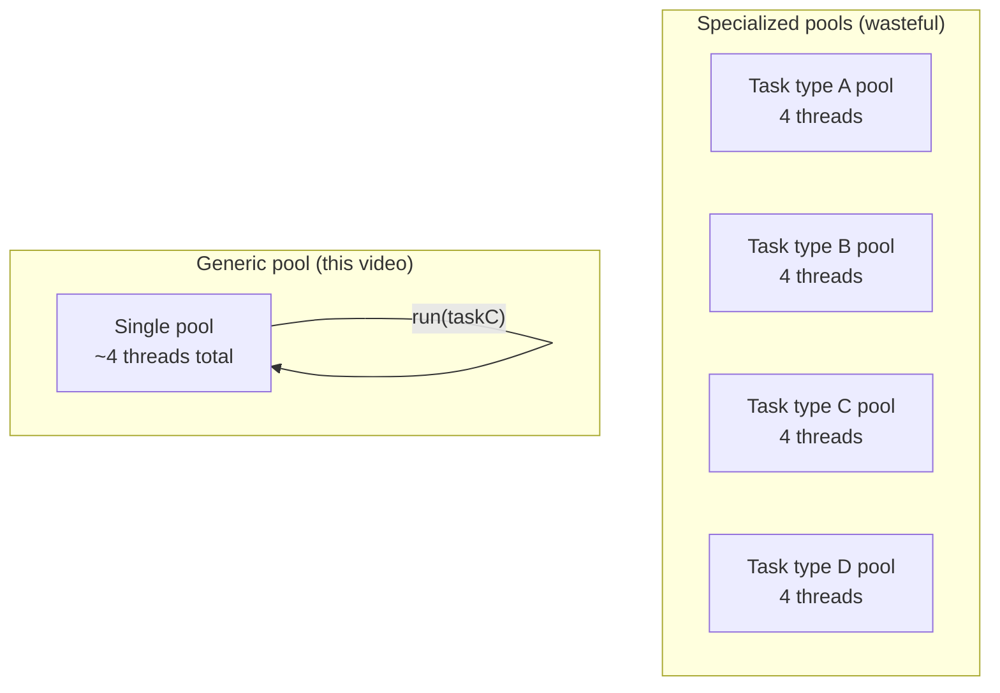
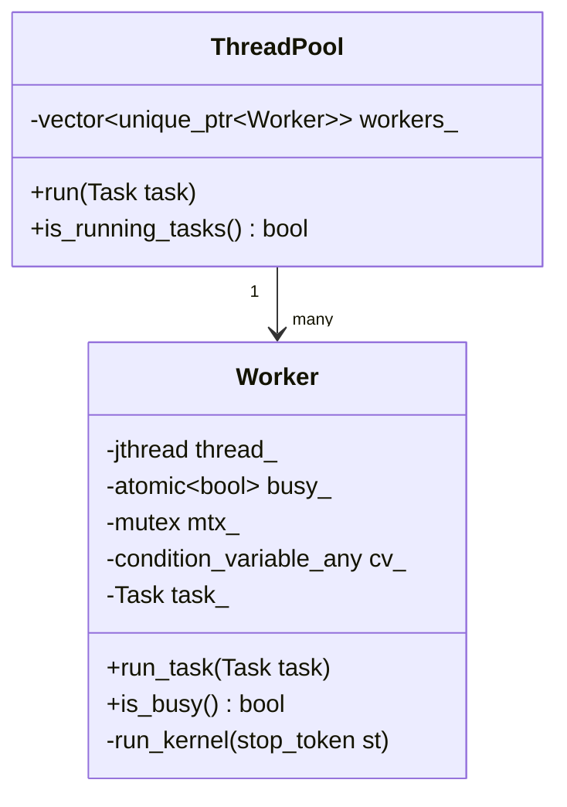
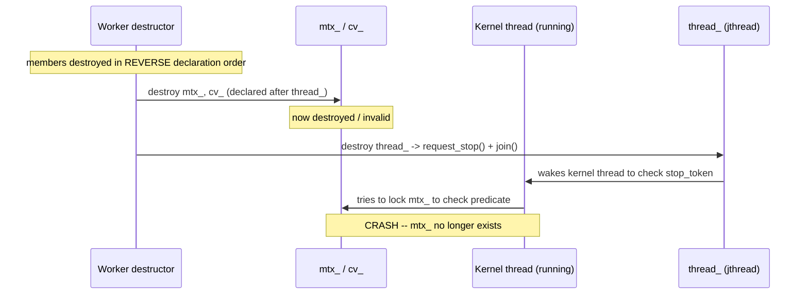

# C++ Multithreading Notes — Part 7: A Generic Thread Pool for Arbitrary Tasks

Continuation of the multithreading notes series (Parts 1–6 covered the
worker-pool/queue/unbalanced-workload arc). This part covers a shift in
direction: instead of a pool of workers specialized for *one* kind of task,
this video builds a **generic thread pool** that can execute *any* callable
thrown at it — the pattern almost everyone means when they say "thread
pool" in production code.

---

## 1. The problem with specialized worker pools

Recall the earlier design: a `MasterControl` + `Worker` pool where every
worker runs the exact same kind of job (processing a `std::span<Task>`).
That's efficient for one recurring workload, but breaks down once a real
program has to do *many different kinds* of work.

### Concretely, why it breaks down

- Suppose a machine has **4 cores**, and the program has **4 different task
  types** (A, B, C, D). To fully use the CPU for each task type, you'd want
  a dedicated pool of ~4 worker threads *per type* — that's **16 threads
  total**, most of which sit idle at any given moment (since usually only
  one or two task types are actually running at once). Idle threads still
  cost memory (each has its own stack), even while consuming zero CPU.
- Scale this up: **16 cores, 100 task types**, each wanting full CPU
  utilization → **1,600 threads**, memory usage in the gigabyte range, for
  a program that's realistically only running one or two task types at a
  time. Almost all of that memory is wasted.
- **Oversubscription** is the second problem: if 3 task types happen to run
  *simultaneously*, each with its own 4-thread pool sized for "use the
  whole machine," you now have **12 threads competing for 4 cores** — the
  OS is constantly context-switching between them for no benefit (this is
  exactly the thrashing territory from earlier notes).

### The fix: one generic pool

Instead of a bespoke worker type per task, build **one worker type that can
run anything**, by having each task be a type-erased callable
(`std::function<void()>`). Now the program only ever needs as many threads
as it has cores, *period* — regardless of how many different kinds of work
exist in the codebase.



---

## 2. Design overview



- **`Task`** is just an alias for `std::function<void()>` — any callable
  with the signature `void()` (a lambda, a bound member function, whatever)
  can be handed to the pool.
- **`Worker`** owns its own `std::jthread` (auto-joining, and — critically
  for this design — supports cooperative cancellation via `stop_token`,
  see Section 4).
- **`ThreadPool::run(task)`** scans its workers for one that's free; if it
  finds one, hands it the task; if none are free, it creates a brand-new
  worker on the spot and gives *that* one the task.

### Why `std::vector<std::unique_ptr<Worker>>` instead of `std::vector<Worker>`?

A `Worker` contains a `std::mutex`, a `std::condition_variable_any`, and a
`std::jthread` — **none of these are movable in a way that's safe here**
(a `std::jthread` capturing `this` inside its kernel function would be left
dangling if the vector reallocated and moved the `Worker` to a new
address — the exact same reasoning as Part 2's worker-pool design). Wrapping
each `Worker` in `std::unique_ptr` guarantees a stable address for its whole
lifetime, letting the vector grow freely without invalidating anything.

---

## 3. The worker's wake-up condition, and `jthread`'s `stop_token`

Each worker's kernel loop needs to wake up for **two different reasons**:
"I have a new task" or "it's time to shut down." `std::jthread` has a
built-in mechanism for the second case — a `std::stop_token`, which the
thread can poll, and which gets automatically signaled (`request_stop()`)
when the `jthread` is destroyed.

The catch: a plain `std::condition_variable` can't be woken by a stop
request — only by an explicit `notify()`. If the destructor requests a stop
but nothing ever calls `notify()`, the worker sleeps forever and the
`jthread`'s destructor hangs waiting to join it. The fix is
**`std::condition_variable_any`**, whose `wait()` overload can take a
`stop_token` directly:

```cpp
cv_.wait(lock, stop_token, [this] { return static_cast<bool>(task_); });
```

This wakes the thread if **either** a stop is requested **or** the
predicate (a task has arrived) becomes true — combining both wake-up
reasons into one call, without manually managing a separate "dying" flag
the way the earlier `Worker`/`MasterControl` design in Part 2 had to.

### A subtlety: getting the `stop_token`

`std::jthread`'s constructor will automatically pass a `stop_token` as the
*first* parameter to the function it launches, **but only if that function's
first parameter is a `stop_token`**. This interacts awkwardly with
non-static member functions passed as `&Worker::run_kernel, this`, since
the compiler's template deduction can get confused about which parameter
is the implicit stop token and which is `this`. The simpler fix used in the
video: don't take a `stop_token` parameter at all — instead, retrieve it
from inside the kernel function via `thread_.get_stop_token()`.

---

## 4. The real bug: member destruction order

This is a genuinely instructive bug, worth understanding in detail.

### The setup

C++ guarantees member variables are **constructed in declaration order**
and **destroyed in the reverse of that order**. If `Worker` is declared
like this:

```cpp
class Worker
{
    std::jthread thread_;             // declared FIRST
    std::mutex mtx_;
    std::condition_variable_any cv_;
    Task task_;
    std::atomic<bool> busy_{false};
};
```

...then destruction order is: `busy_`, `task_`, `cv_`, `mtx_`, and **only
then** `thread_` — because `thread_` was declared first, it's destroyed
*last*.

### Why this breaks

`std::jthread`'s destructor calls `request_stop()` and then **joins** the
thread — meaning it blocks until the worker's kernel function actually
returns. But the kernel function needs `mtx_` and `cv_` to wake up and
notice the stop request and exit its loop. If `mtx_` and `cv_` were
**already destroyed** before `thread_`'s destructor even runs (because they
were declared *after* `thread_`, so destroyed *before* it)... the kernel
thread is trying to use objects that no longer exist. This produces exactly
the crash the video hits: an access violation inside `mutex::lock()`,
because the mutex object itself had already been torn down.



### The fix

**Declare `thread_` last**, so it's constructed last (after everything the
kernel loop depends on already exists) and destroyed **first** — meaning
`request_stop()` + `join()` happens *before* `mtx_`/`cv_`/`task_` are torn
down, so the kernel thread always has valid objects to work with right up
until it actually exits:

```cpp
class Worker
{
    // ... mtx_, cv_, task_, busy_ declared first ...
    std::jthread thread_; // declared LAST -> constructed last, destroyed first
};
```

**General lesson:** when a thread object's destructor needs to signal and
join a thread that depends on other member variables, **that thread member
must be declared after everything it depends on**, so C++'s
construct-in-order/destroy-in-reverse-order guarantee keeps those
dependencies alive for the thread's entire real lifetime.

---

## 5. The open question: does `run_task()` need the mutex?

The video deliberately leaves this unresolved, so it's worth actually
working through with what this series has already covered.

```cpp
void run_task(Task task)
{
    // No mutex taken here, on purpose, in the video's version:
    task_ = std::move(task);
    busy_.store(true);
    cv_.notify_one();
}
```

**Analysis:** this is very likely a genuine data race, for a specific
reason worth calling out — the condition variable's **predicate** doesn't
even check the atomic `busy_` flag; it checks `task_` directly
(`return static_cast<bool>(task_);`). `task_` is a plain, **non-atomic**
`std::function`. The consumer thread reads it (inside `wait()`'s predicate)
while holding `mtx_` — but the producer thread (`run_task`) writes to it
**without ever holding `mtx_` at all**. A mutex only provides mutual
exclusion if **every** piece of code touching the shared data acquires it —
one side locking and the other side not locking provides no real
protection, regardless of how "atomic-adjacent" the surrounding code looks.
The neighboring atomic `busy_` write doesn't retroactively make the
*separate*, non-atomic `task_` write safe, because nothing on the consumer
side actually performs an acquire-load of `busy_` as part of deciding
whether to read `task_` — the predicate reads `task_` straight away.

This is a nice callback to the acquire/release material from earlier in
this series: a synchronizing atomic only creates a real happens-before edge
for the *specific* memory it's paired with through actual acquire/release
operations on *that same atomic* — it doesn't provide any blanket
protection for unrelated non-atomic variables sitting nearby, no matter how
intuitively "close" they feel in the code. **The mutex should be taken on
both sides.** The video's version likely works in testing because, on x86,
the actual window for this race is extremely small and rarely gets hit
under light testing — the exact same "it didn't crash in 2,000 runs"
trap from earlier in this series, not proof of correctness.

---

## 6. Practice Code — a corrected, complete generic thread pool

This reconstruction keeps the video's overall design, fixes the
destruction-order bug (thread declared last), and takes the mutex on both
sides of the shared `task_`/`busy_` state to close the race identified
above.

```cpp
// generic_thread_pool.cpp
// Compile: g++ -std=c++20 -O2 -pthread generic_thread_pool.cpp -o pool_demo

#include <atomic>
#include <condition_variable>
#include <functional>
#include <iostream>
#include <memory>
#include <mutex>
#include <thread>
#include <vector>

namespace tk
{

using Task = std::function<void()>;

class Worker
{
public:
    Worker() : thread_(&Worker::RunKernel_, this) {}

    // Hand this worker a new task. Only safe to call when IsBusy() is false.
    void RunTask(Task task)
    {
        {
            std::lock_guard<std::mutex> lock(mtx_); // taken on BOTH sides now
            task_ = std::move(task);
            busy_.store(true, std::memory_order_relaxed);
        }
        cv_.notify_one();
    }

    bool IsBusy() const { return busy_.load(std::memory_order_relaxed); }

private:
    void RunKernel_(std::stop_token stop_token)
    {
        std::unique_lock<std::mutex> lock(mtx_);
        while (true)
        {
            cv_.wait(lock, stop_token, [this] { return static_cast<bool>(task_); });

            if (stop_token.stop_requested() && !task_)
            {
                return; // shutting down, no pending task -- exit the kernel
            }

            Task local_task = std::move(task_);
            task_ = nullptr;

            lock.unlock();
            local_task(); // run the task WITHOUT holding the lock
            lock.lock();

            busy_.store(false, std::memory_order_relaxed);
        }
    }

    std::mutex mtx_;
    std::condition_variable_any cv_;
    Task task_;
    std::atomic<bool> busy_{false};
    std::jthread thread_; // declared LAST: constructed last, destroyed first
};

class ThreadPool
{
public:
    void Run(Task task)
    {
        // NOTE: this pool is intended for use by a single submitting thread.
        // Supporting multiple concurrent callers to Run() would need its own
        // mutex protecting `workers_` -- not covered in this version.
        for (auto& w : workers_)
        {
            if (!w->IsBusy())
            {
                w->RunTask(std::move(task));
                return;
            }
        }
        // No free worker -- grow the pool.
        workers_.push_back(std::make_unique<Worker>());
        workers_.back()->RunTask(std::move(task));
    }

    bool IsRunningTasks() const
    {
        for (auto& w : workers_)
        {
            if (w->IsBusy()) return true;
        }
        return false;
    }

    size_t WorkerCount() const { return workers_.size(); }

private:
    std::vector<std::unique_ptr<Worker>> workers_;
};

} // namespace tk

int main()
{
    using namespace std::chrono_literals;

    tk::ThreadPool pool;

    pool.Run([] { std::cout << "hi from task 1\n"; });
    pool.Run([] { std::cout << "hi from task 2\n"; });
    pool.Run([] { std::cout << "hi from task 3\n"; });

    while (pool.IsRunningTasks())
    {
        std::this_thread::sleep_for(1ms);
    }

    std::cout << "Workers created: " << pool.WorkerCount() << "\n";

    return 0; // pool destructor: workers destruct in order, each jthread
              // requests stop + joins cleanly thanks to the member ordering fix
}
```

### Suggested experiments

1. Run this and confirm all three tasks print, then the program exits
   cleanly (no hang, no crash) — this is the destruction-order fix working.
2. Deliberately move `thread_` back to being declared *first* in `Worker`
   and confirm you can reproduce the video's crash — a good way to *see*
   the bug rather than just read about it.
3. Submit more tasks than there are "free" workers in quick succession and
   confirm the pool grows (`WorkerCount()` increases) rather than blocking.
4. As an exercise: add a mutex around `workers_` in `ThreadPool` and make
   `Run()` safely callable from multiple threads simultaneously — the
   video explicitly scopes this out, but it's a natural next step.
5. Try removing the mutex from `RunTask()` (matching the video's original,
   racier version) and run this under ThreadSanitizer (`-fsanitize=thread`)
   with many rapid task submissions — see whether TSan flags the race on
   `task_` directly.

---

## 7. Key Takeaways

- A **generic** thread pool (type-erased tasks via `std::function`) avoids
  needing a bespoke worker pool per task type, which otherwise wastes huge
  amounts of memory on idle threads and causes CPU oversubscription when
  multiple task-specific pools happen to run at once.
- `std::jthread` + `std::condition_variable_any` + `stop_token` lets a
  worker wake up for either "new task" or "shutdown requested" through one
  unified `wait()` call, instead of manually managing a separate "dying"
  flag.
- **Member destruction order matters when a thread's destructor needs to
  join it.** A `jthread` member must be declared *after* every other member
  its kernel function depends on, so those dependencies are destroyed only
  *after* the thread has actually been signaled and joined — never before.
- **A mutex only protects data if every piece of code touching that data
  acquires it.** An atomic flag sitting near a non-atomic variable does not
  extend any protection to that variable unless the consumer's
  synchronization point is an acquire-load of that *specific* atomic —
  which wasn't the case here, since the condition variable's predicate read
  the non-atomic `task_` directly.
- Storing workers as `std::vector<std::unique_ptr<Worker>>` (rather than
  by value) is necessary whenever a worker's thread captures `this` —
  exactly the same reasoning that applied back in Part 2's original
  worker-pool design.
- This pool, as designed, is single-producer only (one thread may call
  `Run()`) and only ever grows, never shrinks — both explicitly flagged in
  the video as directions for future iteration.
