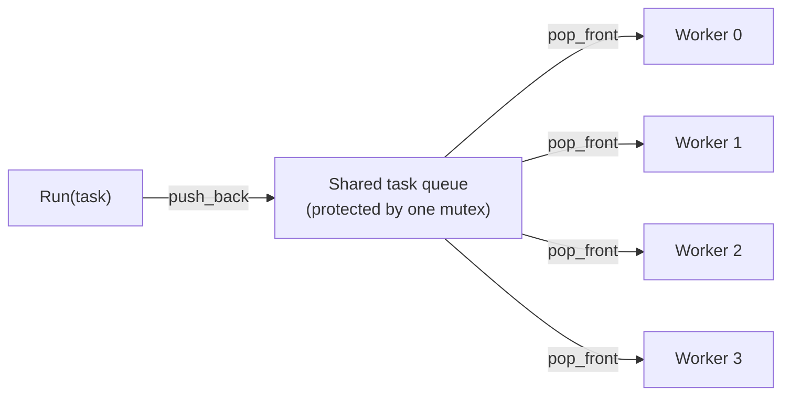
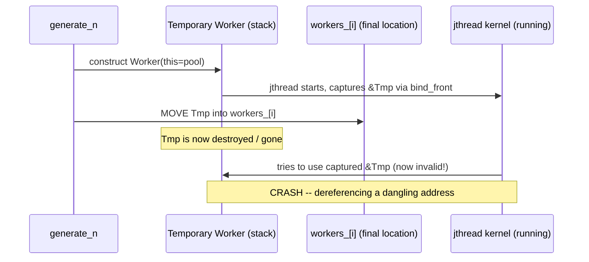
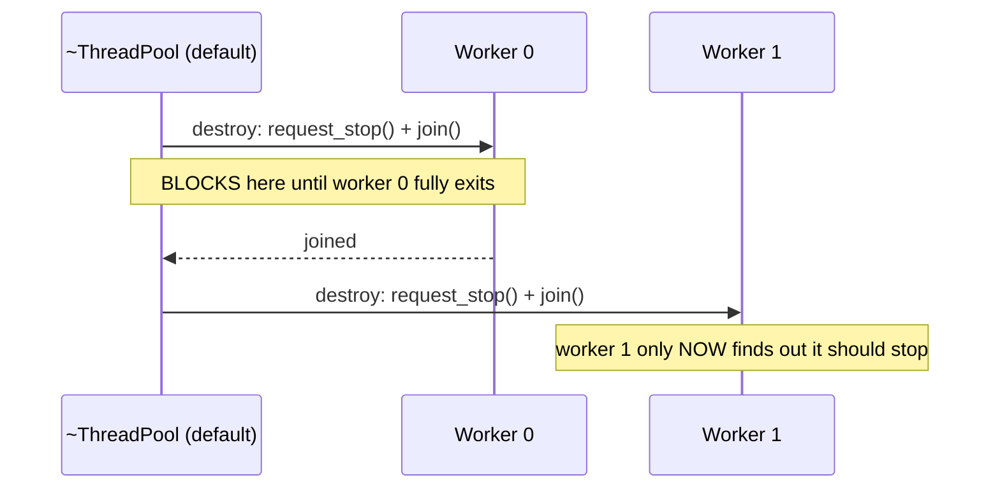
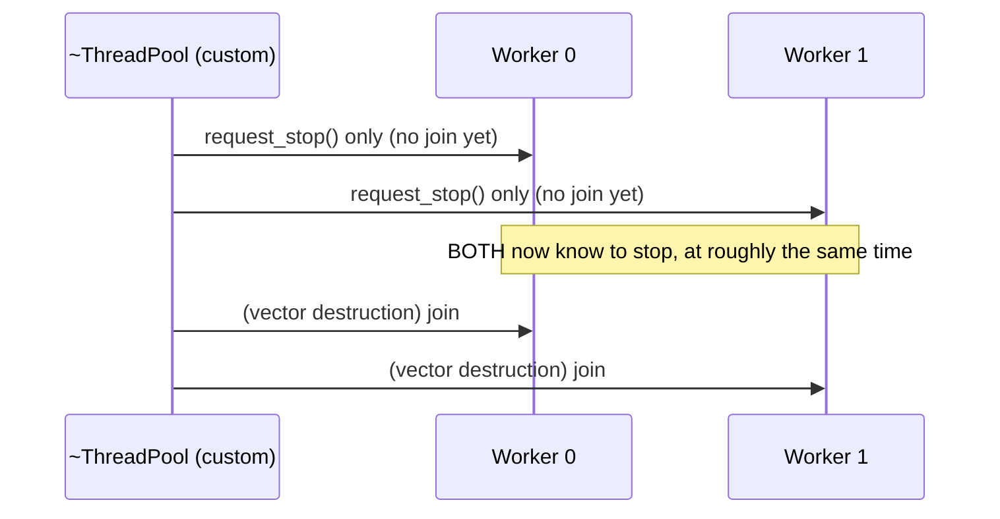

# C++ Multithreading Notes — Part 8: Adding a Task Queue to the Generic Thread Pool

Continuation of Part 7's generic thread pool. That version spawned a brand
new worker for every task that arrived with no free worker — which risks
**unbounded thread creation** and oversubscription. This part fixes that
with a **fixed-size pool + shared task queue**, and along the way hits three
genuinely instructive real bugs.

---

## 1. Why a queue?

Part 7's pool grows every time `Run()` is called and no worker is free —
throw it 24 tasks at once, and it may spin up 24 threads simultaneously.
That's exactly the oversubscription problem the whole series has been
building toward avoiding: more threads than cores just means the OS spends
its time context-switching instead of doing useful work.

**The fix:** create a **fixed number of workers up front** (sized to the
number of cores you actually want to use), and give them a **shared queue**
to pull tasks from. If all workers are busy, new tasks just wait in the
queue instead of spawning new threads — the pool's size is now a hard cap,
not a suggestion.



### What moved out of `Worker`

Since all workers now share one queue instead of each holding its own
task, most of the old per-worker state disappears:

| Part 7 (per-worker) | Part 8 (shared, pool-level) |
|---|---|
| `mutex` per worker | **one** `mutex` protecting the shared queue |
| `condition_variable_any` per worker | **one** `condition_variable_any` shared by all workers |
| `Task task_` per worker | task lives in the shared `std::deque<Task>` |
| `atomic<bool> busy_` per worker | not needed — a worker's state is now just "am I currently executing something," which nothing outside needs to query directly |

A `Worker` is now almost nothing: just a `jthread` and a pointer back to
its pool so it can call `pool_->GetTask(stop_token)`.

---

## 2. The kernel loop, simplified

```cpp
void Worker::RunKernel(std::stop_token st)
{
    while (Task task = pool_->GetTask(st))
    {
        task();
    }
    // GetTask returned an empty Task -> time to shut down
}
```

Compare this to Part 7's kernel loop — no local mutex, no local condition
variable, no manual busy-flag bookkeeping. All of that complexity moved
into one shared place (`ThreadPool::GetTask`), which is simpler to reason
about precisely because there's only one copy of it instead of one per
worker.

### `GetTask`, and a genuinely useful `condition_variable_any` trick

```cpp
Task ThreadPool::GetTask(std::stop_token st)
{
    std::unique_lock lock(task_queue_mtx_);
    bool woke_on_condition = task_queue_cv_.wait(lock, st,
        [this] { return !tasks_.empty(); });

    if (!woke_on_condition) return Task{}; // woke because of stop request

    Task task = std::move(tasks_.front());
    tasks_.pop_front();
    return task;
}
```

The 4-argument `wait(lock, stop_token, predicate)` overload of
`condition_variable_any` **returns a `bool`** — `true` if it woke up
because the predicate became true, `false` if it woke up because of the
stop token. This means the caller doesn't need to separately check
`st.stop_requested()` — the return value already tells you why you woke
up. (This turns out to have a subtlety, covered in Bug #2 below.)

---

## 3. Bug #1 — the moved-worker dangling `this` pointer

### The setup

To create the fixed-size pool up front, the natural first instinct is:

```cpp
std::vector<Worker> workers_;
// ...
std::generate_n(std::back_inserter(workers_), num_workers,
    [this] { return Worker(this); }); // constructs a temporary, then MOVES it in
```

This compiles and even seems to run — until it throws an exception with a
clearly garbage pointer value inside `RunKernel`.

### Why it breaks

`std::generate_n` calls the lambda, which constructs a **temporary**
`Worker` — and that `Worker`'s constructor starts its `jthread`
immediately, binding `this` (pointing at the *temporary's* address) into
the kernel function. Then `generate_n` **moves** that temporary into its
final resting place inside the vector. The `jthread` is now running with a
`this` pointer aimed at an address that no longer holds a valid `Worker` —
the temporary is gone, but the thread captured its old address.



### The fix

**Construct each `Worker` directly in its final location** — never
construct-then-move it. `std::vector::emplace_back` does exactly this:

```cpp
workers_.reserve(num_workers);
for (size_t i = 0; i < num_workers; i++)
{
    workers_.emplace_back(this); // constructed IN PLACE, never moved afterward
}
```

**General lesson:** if an object's constructor starts a thread that
captures `this`, that object must **never move after construction** —
whether that's via `std::unique_ptr` for stable addressing (Part 7's fix)
or, when the type happens to be movable, by making sure construction
happens directly at its final address (`emplace_back`) instead of
constructing a temporary and relocating it.

---

## 4. Bug #2 — `wait()`'s return value quietly ignores the stop request

### The setup

The plan for early cancellation: call `request_stop()`, and expect workers
to stop pulling new tasks off the queue, even if the queue still has
items in it.

### Why it breaks

`condition_variable_any::wait(lock, stop_token, predicate)`'s return value
turned out to prioritize the **predicate**, not the stop token: as long as
`!tasks_.empty()` is true, `wait()` keeps returning `true` — **even after
`request_stop()` has been called.** The workers just kept pulling tasks off
the queue and running them, completely ignoring the cancellation request,
as long as there was still work queued up.

### The fix

Check the stop token **explicitly**, after `wait()` returns, and let that
check take priority over the predicate result:

```cpp
Task ThreadPool::GetTask(std::stop_token st)
{
    std::unique_lock lock(task_queue_mtx_);
    task_queue_cv_.wait(lock, st, [this] { return !tasks_.empty(); });

    if (st.stop_requested()) return Task{}; // cancellation wins, even with queued work

    Task task = std::move(tasks_.front());
    tasks_.pop_front();
    return task;
}
```

**General lesson:** don't assume a convenience overload's return value
tells you everything you need — when a wake-up can happen for two
different reasons, it's often safer to explicitly re-check the condition
you actually care about (here: "was cancellation requested?") rather than
trust an aggregated boolean to prioritize things the way you expect.

---

## 5. Bug #3 — staggered shutdown

### The setup

With Bug #2 fixed, cancellation works — but it was observed to be
**staggered**: worker 0 stops quickly, but workers 1–3 keep running for a
while longer before also stopping, instead of all four stopping at once.

### Why it happens

Default destruction of `std::vector<Worker>` destroys each `Worker`
**one at a time, in order**. Each `Worker`'s destructor (via its `jthread`
member) calls `request_stop()` **and then blocks joining that thread**
before moving on to destroy the next `Worker`. So worker 0 gets signaled
and *fully joins* before worker 1 ever receives its own stop signal — a
slow, sequential wind-down instead of a simultaneous one.



### The fix

Add an explicit `ThreadPool` destructor that signals **every** worker
first, *before* letting any of them actually be destroyed/joined:

```cpp
ThreadPool::~ThreadPool()
{
    for (auto& w : workers_)
    {
        w.RequestStop(); // just request_stop() on each jthread -- no joining yet
    }
    // vector's default destruction now runs: each jthread joins, but every
    // one of them already knows to stop, so they exit close to simultaneously
}
```



**General lesson:** when destroying multiple thread-owning objects that
each individually signal-then-join, the default one-at-a-time destruction
order can serialize what should be a simultaneous shutdown. Broadcasting
the stop signal to *everyone* first, then letting the joins happen
afterward, turns a staggered shutdown into a near-simultaneous one.

---

## 6. `WaitForAllDone` — a second, separate condition variable

To let callers optionally block until the entire queue has drained (rather
than cancelling early), a **second** condition variable is used:

```cpp
void ThreadPool::WaitForAllDone()
{
    std::unique_lock lock(task_queue_mtx_);
    all_done_cv_.wait(lock, [this] { return tasks_.empty(); });
}
```

Workers notify it whenever they empty the queue:

```cpp
if (tasks_.empty())
{
    all_done_cv_.notify_all();
}
```

**Why a separate condition variable instead of reusing `task_queue_cv_`?**
Two reasons:
- `notify_one` on the shared queue's condition variable has no guarantee of
  waking the specific thread waiting in `WaitForAllDone` rather than a
  worker.
- Using `notify_all` on the *shared* condition variable would wake every
  idle worker too, just so they can immediately re-check their predicate
  and go back to sleep — wasted scheduling overhead. A dedicated condition
  variable for this one purpose avoids disturbing workers that have nothing
  to do.

---

## 7. Practical experiments confirmed in the video

- **Concurrency check:** four tasks each printing their `std::this_thread::get_id()` after a 500ms sleep — confirmed distinct thread IDs, and the whole batch finished in ~500ms (not 2 seconds), proving genuine parallel execution.
- **Reuse check:** running four tasks, waiting for completion, then running four more — the *same* thread IDs appeared again, confirming workers are persistent and reused, not respawned per task.
- **Submission speed vs. worker startup latency:** task submission is extremely fast compared to how long it takes a freshly-constructed worker thread to actually reach its "waiting on the queue" state. In one run, 16,000 tasks could be queued before the very first worker had even started processing — a concrete illustration of why keeping threads alive in a pool (rather than spawning them per task) matters: thread startup has real, measurable latency.

---

## 8. Practice Code — corrected queue-based thread pool

```cpp
// queue_thread_pool.cpp
// Compile: g++ -std=c++20 -O2 -pthread queue_thread_pool.cpp -o queue_pool_demo

#include <condition_variable>
#include <deque>
#include <functional>
#include <iostream>
#include <mutex>
#include <sstream>
#include <thread>
#include <vector>

namespace tk
{

using Task = std::function<void()>;

class ThreadPool
{
public:
    explicit ThreadPool(size_t num_workers)
    {
        workers_.reserve(num_workers);
        for (size_t i = 0; i < num_workers; i++)
        {
            workers_.emplace_back(this); // constructed IN PLACE -- Bug #1 fix
        }
    }

    ~ThreadPool()
    {
        for (auto& w : workers_)
        {
            w.RequestStop(); // signal everyone first -- Bug #3 fix
        }
        // vector destruction now joins each worker; all already know to stop
    }

    void Run(Task task)
    {
        {
            std::lock_guard<std::mutex> lock(task_queue_mtx_);
            tasks_.push_back(std::move(task));
        } // release the lock BEFORE notifying
        task_queue_cv_.notify_one();
    }

    void WaitForAllDone()
    {
        std::unique_lock<std::mutex> lock(task_queue_mtx_);
        all_done_cv_.wait(lock, [this] { return tasks_.empty(); });
    }

private:
    class Worker
    {
    public:
        explicit Worker(ThreadPool* pool)
            : pool_(pool), thread_(std::bind_front(&Worker::RunKernel_, this))
        {
        }

        void RequestStop() { thread_.request_stop(); }

    private:
        void RunKernel_(std::stop_token st)
        {
            while (Task task = pool_->GetTask_(st))
            {
                task();
            }
        }

        ThreadPool* pool_;
        std::jthread thread_; // last-constructed member here is fine: Worker
                               // has no OTHER members the kernel depends on
    };

    Task GetTask_(std::stop_token st)
    {
        std::unique_lock<std::mutex> lock(task_queue_mtx_);
        task_queue_cv_.wait(lock, st, [this] { return !tasks_.empty(); });

        if (st.stop_requested()) return Task{}; // Bug #2 fix: cancellation wins

        Task task = std::move(tasks_.front());
        tasks_.pop_front();

        if (tasks_.empty())
        {
            all_done_cv_.notify_all();
        }

        return task;
    }

    std::deque<Task> tasks_;
    std::mutex task_queue_mtx_;
    std::condition_variable_any task_queue_cv_;
    std::condition_variable all_done_cv_;
    std::vector<Worker> workers_;
};

} // namespace tk

std::string ThreadIdString()
{
    std::ostringstream oss;
    oss << std::this_thread::get_id();
    return oss.str();
}

int main()
{
    using namespace std::chrono_literals;

    tk::ThreadPool pool(4);

    auto make_task = [](int n)
    {
        return [n]
        {
            std::this_thread::sleep_for(500ms);
            std::cout << "[task " << n << "] thread " << ThreadIdString() << "\n";
        };
    };

    for (int i = 0; i < 4; i++) pool.Run(make_task(i));
    pool.WaitForAllDone();

    std::cout << "--- batch 1 done, running batch 2 (should reuse threads) ---\n";

    for (int i = 4; i < 8; i++) pool.Run(make_task(i));
    pool.WaitForAllDone();

    return 0;
}
```

### Suggested experiments

1. Run this and confirm batch 2 reuses the same thread IDs from batch 1.
2. Remove the `emplace_back`-in-place construction and go back to
   `push_back(Worker(this))` to reproduce Bug #1's dangling-`this` crash.
3. Remove the explicit `st.stop_requested()` check in `GetTask_` (go back
   to trusting `wait()`'s return value alone) and confirm that calling
   `RequestStop()` while the queue is non-empty fails to stop workers early.
4. Remove the custom destructor (let default one-at-a-time destruction
   happen) and add timestamped logging to each worker's shutdown to observe
   the staggered-vs-simultaneous shutdown difference directly.
5. Queue up a large burst of tasks (e.g. 10,000) immediately followed by
   destroying the pool without calling `WaitForAllDone()` — confirm most of
   them get cancelled rather than executed, proving early-cancellation
   actually works end-to-end.

---

## 9. Key Takeaways

- A **fixed-size pool + shared queue** caps thread count at a hard limit,
  fixing the unbounded-thread-creation risk from Part 7's design — new
  tasks queue up instead of spawning new OS threads.
- Centralizing the mutex/condition-variable/queue at the **pool** level
  (rather than per-worker) collapses a lot of duplicated bookkeeping into
  one place, at the cost of all workers now contending on one shared lock
  when pulling tasks.
- **Never construct an object that captures `this` in a thread and then
  move it.** `generate_n` + `back_inserter` constructs-then-moves;
  `emplace_back` (or reserving capacity first) constructs directly in its
  final location — the only safe option when a constructor starts a thread.
- **Convenience return values can hide priority decisions you didn't
  expect.** `wait(lock, stop_token, predicate)`'s boolean return favored
  the predicate over the stop token; explicitly re-checking
  `stop_token.stop_requested()` after waking up was necessary to get true
  early-cancellation behavior.
- **Default one-at-a-time destruction of thread-owning objects can turn a
  simultaneous shutdown into a staggered one**, since each destructor both
  signals *and* blocks-joins before the next object's destructor even runs.
  Broadcasting the stop signal to everyone first, then letting joins happen
  afterward, fixes this.
- A dedicated "all done" condition variable (separate from the one workers
  use to pull tasks) avoids waking idle workers unnecessarily just to
  signal a *different* waiting thread that the queue has drained.
