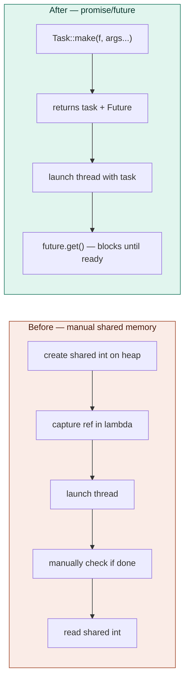
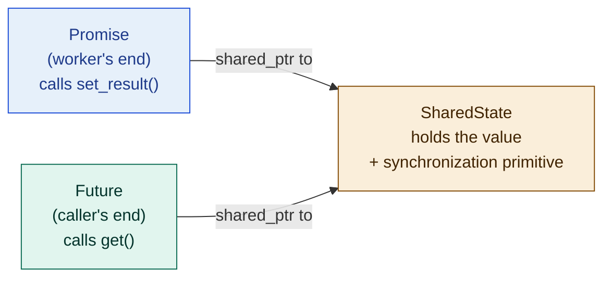
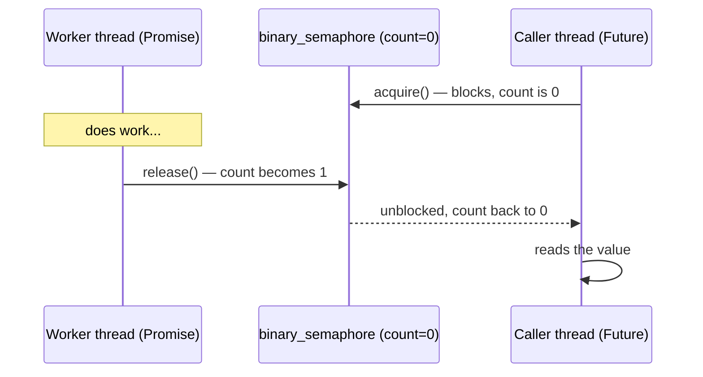
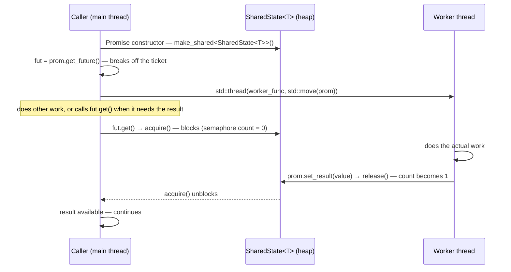

# Multithreading video 17: building promise/future from scratch — notes

**Source:** Visual Studio C++ series (Chili-style) — multithreading part 17
**Topic:** Designing and implementing a `Promise<T>` / `Future<T>` system
from scratch, including the shared state, binary semaphore synchronization,
and a live demo of the full promise→thread→future flow
**Builds on:** earlier thread pool videos (tasks, worker threads, queues)
**Series position:** video 17 of 30 in the playlist

---

## 1. The problem being solved

The existing thread pool only accepts tasks that are:
- **Void** — they take no parameters and return nothing
- **Side-effect only** — if you want a result out of a task, you have to
  manually create shared memory, capture a reference to it in the lambda,
  manage its lifetime on the heap, and synchronize access from both sides

This is error-prone, verbose, and leaks low-level details into every
call site. The goal of this video (and the next two) is to replace that
pattern with a **functional style**: a task is just a function that
returns a value, and the caller gets that value back through a `Future<T>`
— a handle they can use to retrieve the result whenever they need it,
blocking if it isn't ready yet.



## 2. The architecture — three pieces

The whole system has three cooperating pieces, all sharing a single heap-
allocated state object:



- **`SharedState<T>`** — lives on the heap (via `shared_ptr`), owned
  jointly by both ends. Holds the actual value and the synchronization
  primitive that lets `Future::get()` wait until `Promise::set_result()`
  fires.
- **`Promise<T>`** — the worker's write-only end. Only it can call
  `set_result()`. Only one future can be extracted from a promise (one
  ticket per transaction).
- **`Future<T>`** — the caller's read-only end. Calls `get()`, which
  blocks until the promise has set a value, then returns it.

The one-directional design (write from one side, read from the other) is
deliberate: it prevents two threads racing to write the same memory at
once. The promise writes; the future reads. Never the other way around.

## 3. SharedState<T> — design decisions

### 3.1 Storing the value — `std::optional<T>`

The value doesn't exist at construction time. You can't just
default-construct a `T` because:
- Not all types have a default constructor.
- Even if they do, default-constructing and then overwriting later is
  semantically wrong — you'd have no way to tell "default value" from
  "not set yet."

`std::optional<T>` solves both problems cleanly: it has a "no value yet"
state without requiring a default constructor for `T`.

### 3.2 Synchronization — `std::binary_semaphore` (C++20)

Two obvious candidates for "let the future block until the promise fires":

| Option | Problem with it |
|---|---|
| `std::mutex` (held by worker, released when done) | A mutex must be acquired and released on the **same thread** — but the shared state is created on the caller's thread and the value is set on the worker's thread. Cross-thread lock/unlock is undefined behavior. |
| `std::condition_variable` | Works, but heavier than necessary for a single one-shot signal |
| `std::binary_semaphore` (C++20) | Lightweight, **not tied to a specific thread** — acquire and release can happen on different threads. Exactly what's needed here. |

A `binary_semaphore` is a counting semaphore with a max count of 1. It's
initialized with **count 0** (no resources available), meaning anyone who
calls `acquire()` before `release()` is fired will block. The worker
calls `release()` (count 0 → 1) when it sets the value; the caller calls
`acquire()` (count 1 → 0) to wait or pass through.



### 3.3 SharedState<T> full structure

```cpp
#include <optional>
#include <semaphore>

template<typename T>
class SharedState
{
public:
    template<typename R>
    void set(R&& result)
    {
        if (!result_.has_value())               // only allow setting once
        {
            result_.emplace(std::forward<R>(result));
            ready_signal_.release();            // wake up anyone waiting
        }
    }

    T get()
    {
        ready_signal_.acquire();                // block until set() fires
        return std::move(*result_);
    }

private:
    std::optional<T> result_;
    std::binary_semaphore ready_signal_{ 0 };   // starts at 0 = not ready
};
```

## 4. Promise<T>

```cpp
template<typename T>
class Future;   // forward declaration — Promise needs to return one

template<typename T>
class Promise
{
public:
    Promise()
        : p_state_{ std::make_shared<SharedState<T>>() }
    {}

    template<typename R>
    void set_result(R&& value)
    {
        p_state_->set(std::forward<R>(value));
    }

    Future<T> get_future()
    {
        assert(future_available_);          // only one future per promise
        future_available_ = false;
        return Future<T>{ p_state_ };       // Future's constructor is private,
    }                                       // Promise is its friend

private:
    std::shared_ptr<SharedState<T>> p_state_;
    bool future_available_ = true;
};
```

Key invariant: **one promise → one future**, enforced by the
`future_available_` flag. Trying to call `get_future()` twice asserts.
Think of the future as a ticket: you can only tear off one per
transaction.

## 5. Future<T>

```cpp
template<typename T>
class Future
{
public:
    T get()
    {
        assert(!result_acquired_);          // only get once
        result_acquired_ = true;
        return p_state_->get();             // blocks until ready
    }

private:
    // Only Promise<T> can construct a Future
    friend class Promise<T>;
    explicit Future(std::shared_ptr<SharedState<T>> p_state)
        : p_state_{ std::move(p_state) }
    {}

    std::shared_ptr<SharedState<T>> p_state_;
    bool result_acquired_ = false;
};
```

`Future` is deliberately not constructible from outside — only `Promise`
(declared as `friend`) can create one. This enforces the contract that
every future came from a matching promise.

## 6. Usage demo from the video

```cpp
// Worker function — takes a promise by value
void worker_func(Promise<int> p)
{
    std::this_thread::sleep_for(std::chrono::milliseconds(2500));
    p.set_result(69);       // signal the result
}

int main()
{
    Promise<int> prom;
    Future<int> fut = prom.get_future();

    // move the promise into the thread — the thread now owns it
    std::thread t{ worker_func, std::move(prom) };
    t.detach();             // let it run independently

    // caller can do other work here...

    int result = fut.get(); // blocks until the worker calls set_result()
    // result == 69, printed after ~2.5s
}
```

## 7. Flow diagram — full promise/future lifecycle



## 8. What this doesn't have yet (flagged for future videos)

- **No integration with the thread pool** yet — the demo manually
  creates a `std::thread` and detaches it. The task abstraction and pool
  integration are videos 18 and 19.
- **No support for `void` tasks** — a `Promise<void>` / `SharedState<void>`
  with `std::optional<void>` makes no sense (`std::optional<void>` is
  ill-formed). That specialization is built in video 19.
- **No exception propagation** — if the worker throws, the exception is
  lost. This is flagged as an open question at the end of video 19
  ("what happens if the function throws?").

## 9. Key concepts introduced

| Concept | What it is |
|---|---|
| `std::binary_semaphore` | C++20 lightweight sync primitive; unlike mutex, can acquire and release on different threads; initialized to 0 here for "not ready yet" signaling |
| `std::optional<T>` | A value that may or may not be present; used to hold the result before it's set, without requiring a default constructor for T |
| `shared_ptr` for shared state | Both promise and future hold a `shared_ptr` to the same `SharedState`, so the state's lifetime is independent of either owner going out of scope |
| `friend` constructor | `Future`'s constructor is private; only `Promise<T>` (declared `friend`) can construct one — enforces the one-to-one contract |
| `std::move` into thread | The promise is moved (not copied) into the worker thread so only one owner holds the write end |

## 10. Gotchas

- **Never copy a `Promise`** — only move it. Two copies of a promise
  would both be able to call `set_result()`, violating the "set once"
  contract. The video moves the promise into the thread explicitly.
- **`binary_semaphore` initialized to 0, not 1.** Initialized to 1 would
  mean the future's `acquire()` returns immediately without waiting —
  the opposite of what's wanted.
- **`get()` and `set_result()` are each one-shot operations.** The video
  enforces this with flags and asserts. In a production implementation
  you'd likely throw instead of assert.
- **`detach()` in the demo is for illustration only.** In production,
  detached threads are generally a bad idea — if the process exits, the
  thread is killed mid-work. The thread pool (video 19) solves this
  properly.
