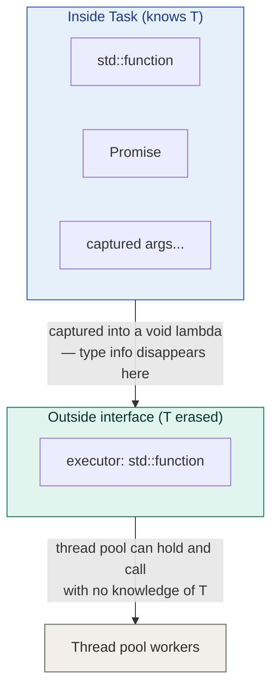
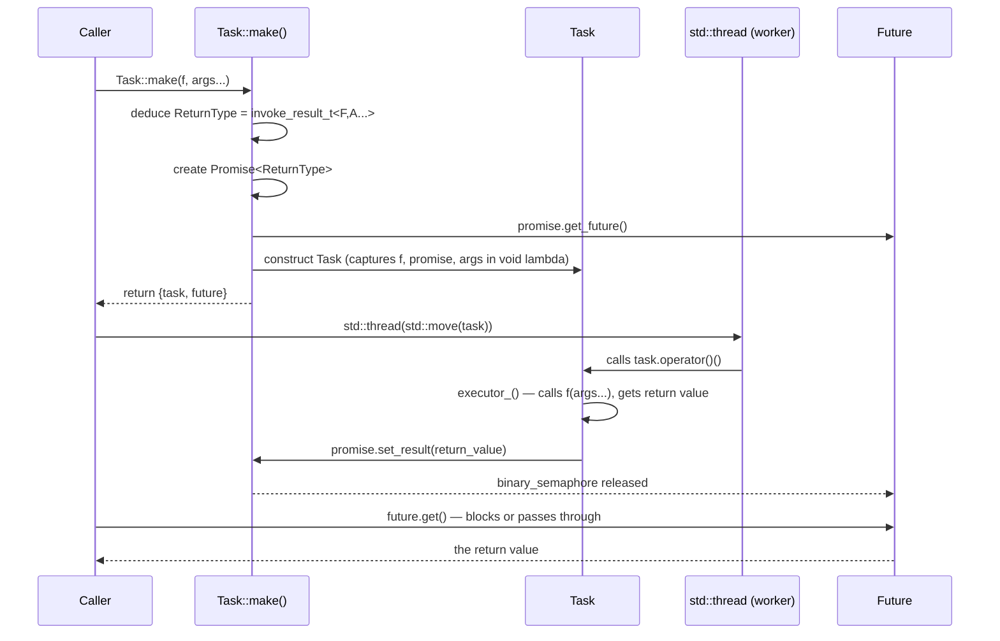

# Multithreading video 18: the Task wrapper and type erasure — notes

**Source:** Visual Studio C++ series (Chili-style) — multithreading part 18
**Topic:** Wrapping promise/future into a type-erased `Task` class so any
function with any signature can be submitted to the thread pool
**Builds on:** video 17 (Promise/Future from scratch), existing thread pool
**Series position:** video 18 of 30

---

## 1. The problem being solved

After video 17, `Promise<T>` and `Future<T>` work, but using them is
still manual — you have to explicitly create a promise, break off the
future, move the promise into a lambda, launch a thread, etc. And there's
a deeper structural problem: the thread pool's worker threads need to be
able to run **any** task, regardless of what type `T` is. But if `Task`
is templated on `T`, the thread pool would need to be templated too,
and worker threads would need to know `T` at compile time — which breaks
the whole point of a general-purpose thread pool.

The solution is **type erasure**: the external interface of `Task` is
`void` (no template visible from the outside), but internally it captures
all the templated details (the function, its arguments, the promise) in a
lambda that knows everything it needs at the point of capture.



## 2. Task class — structure

```cpp
class Task
{
public:
    // --- public interface: type-erased ---

    // invoke the task (runs the function, sets the promise)
    void operator()() { executor_(); }

    // check if the task holds a callable
    explicit operator bool() const { return static_cast<bool>(executor_); }

    // Tasks are moveable but not copyable
    Task() = default;
    Task(Task&&) = default;
    Task& operator=(Task&&) = default;
    Task(const Task&) = delete;
    Task& operator=(const Task&) = delete;

    // --- factory function ---
    template<typename F, typename... A>
    static auto make(F&& f, A&&... args);

private:
    // --- private constructor: knows T, erases it into executor ---
    template<typename F, typename P, typename... A>
    Task(F&& f, P&& promise, A&&... args)
    {
        executor_ = [
            f       = std::forward<F>(f),
            promise = std::forward<P>(promise),
            args    = std::forward<A>(args)...   // capture parameter pack
        ]() mutable
        {
            promise.set_result(f(args...));      // call f, set the result
        };
    }

    std::function<void()> executor_;
};
```

### Key design decisions

**Why `executor_` is `std::function<void()`?**
`std::function<void()>` can hold any callable with no parameters returning
void — which is exactly what the lambda becomes after capturing everything
it needs. The thread pool only ever calls `operator()()` on a task, which
calls `executor_()`, which runs the captured lambda. The pool never needs
to know what's inside it.

**Why the constructor is private?**
If you construct a `Task` directly, you'd have to create the promise
yourself, break off the future yourself, and carefully manage lifetimes.
The `make()` factory function handles all of that and returns both the
task and the future together, atomically. Making the constructor private
means users can't bypass `make()`.

**Capturing a parameter pack in a lambda:**
```cpp
// this syntax is how you capture a variadic pack into a lambda (C++20)
[... args = std::forward<A>(args)]() mutable { /* use args... */ }
```
The `...` before `args` in the capture list expands the pack. This was
described as "the first time I've ever done this too" in the video —
it's a relatively obscure C++20 feature worth noting.

## 3. Task::make() — the factory function

This is the public entry point. It creates the promise, breaks off the
future, constructs the task, and returns both as a `std::pair`:

```cpp
template<typename F, typename... A>
static auto Task::make(F&& f, A&&... args)
{
    // deduce the return type of f(args...) at compile time
    using ReturnType = std::invoke_result_t<F, A...>;

    Promise<ReturnType> promise;
    Future<ReturnType> future = promise.get_future();

    return std::make_pair(
        Task{ std::forward<F>(f), std::move(promise), std::forward<A>(args)... },
        std::move(future)
    );
}
```

`std::invoke_result_t<F, A...>` is the standard type trait that gives
you the return type of calling `F` with argument types `A...` — used
here to instantiate the right `Promise<T>` without the user having to
name `T` explicitly.

### Usage (structured bindings, C++17)

```cpp
auto [task, future] = Task::make(
    [](int x) { return x + 4; },   // the function
    69                              // its argument
);

std::thread t{ std::move(task) };   // Task has operator() so it works
t.detach();

int result = future.get();          // 69 + 4 = 73
```

## 4. The full flow with Task::make



## 5. What about thread pool compatibility?

The video checks whether `Task` (as defined) is already compatible with
the existing thread pool's internal interface. It is, because:
- `Task` has `operator()()` — just like the old `std::function<void()>`.
- `Task` is moveable — required to push into the queue.
- The pool's workers just call `task()` — which calls `executor_()` —
  with no knowledge of `T`.

However, the **pool's `run()` method** still takes a `Task` directly,
and you'd have to call `Task::make()` yourself before submitting. The
next step (video 19) wraps `Task::make()` inside `ThreadPool::run()` so
callers just pass a function and arguments directly to the pool.

## 6. Glossary — new concepts this video

| Concept | Plain-English meaning |
|---|---|
| Type erasure | Hiding a concrete templated type behind a non-templated interface — here, hiding `Promise<T>`, `Future<T>`, `f`, and `args...` inside a `std::function<void()>` |
| `std::invoke_result_t<F, A...>` | A standard type trait that computes the return type of calling callable `F` with argument types `A...` at compile time |
| Variadic template parameter pack (`...A`) | A template parameter that accepts zero or more types — used to handle functions with any number of arguments |
| Pack capture in lambda (`... args = std::forward<A>(args)`) | C++20 syntax to capture a variadic pack into a lambda |
| `std::make_pair` / structured bindings | Returning two values together; the caller destructures them with `auto [task, future] = ...` |

## 7. Gotchas

- **`mutable` on the lambda is required** — the lambda captures `promise`
  by value, and `promise.set_result()` modifies the promise (it's not a
  const operation). Without `mutable`, the compiler rejects it because
  lambda captures are `const` by default.
- **The private constructor enforces `make()` as the only entry point.**
  If you somehow bypass `make()` (which you can't, since it's private),
  you'd create a task with no associated future — the result would be
  silently discarded.
- **`Task` is move-only.** Copying a task would copy the captured promise
  too, giving two promises that could both fire `set_result()` — breaking
  the one-shot guarantee from video 17.
- **`std::invoke_result_t` vs. `std::result_of` (deprecated):** older
  code uses `std::result_of<F(A...)>`. The modern replacement (C++17+) is
  `std::invoke_result_t<F, A...>`. Use the modern form.

## 8. What's next

Video 19 does two things:
1. Folds `Task::make()` into `ThreadPool::run()` so callers just pass a
   function and get a `Future<T>` back — the pool creates the task internally.
2. Handles the `void` return type special case — `Promise<void>` /
   `SharedState<void>` requires a template specialization because
   `std::optional<void>` is ill-formed.
