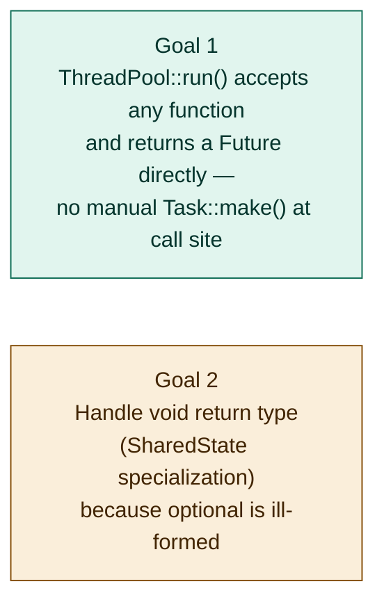
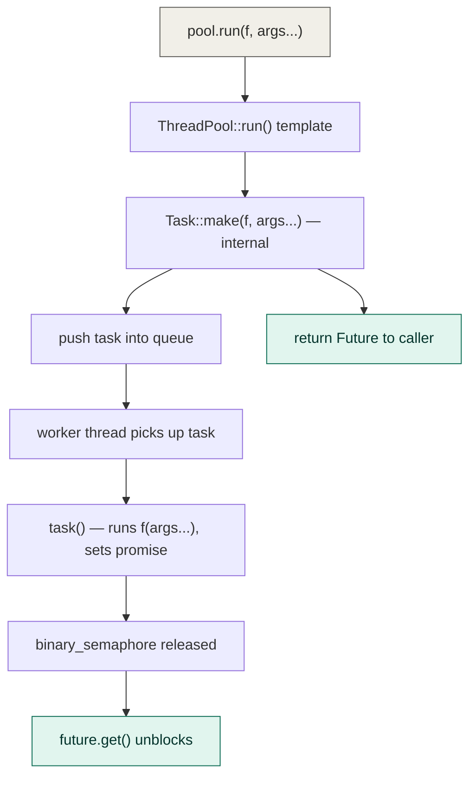
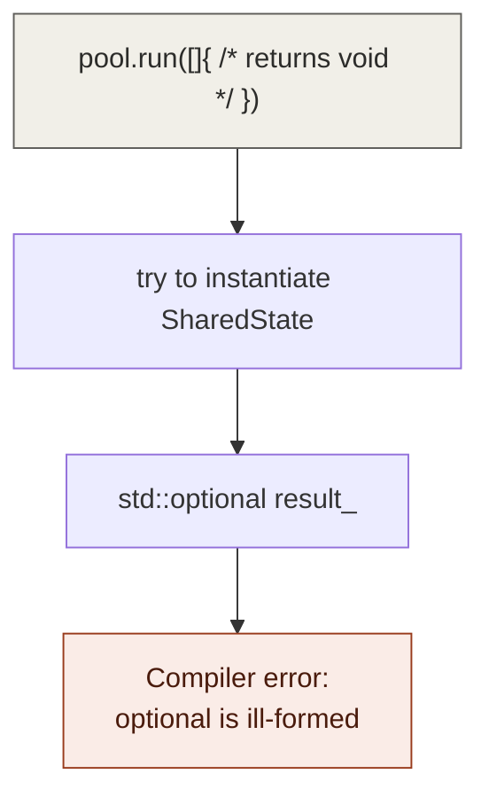
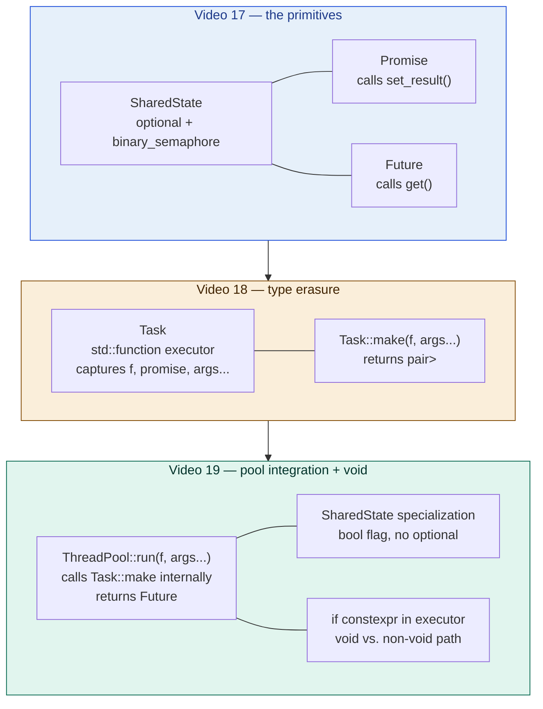

# Multithreading video 19: thread pool integration and void specialization — notes

**Source:** Visual Studio C++ series (Chili-style) — multithreading part 19
**Topic:** Folding `Task::make()` into `ThreadPool::run()` so callers just
pass functions; fixing the `void` return type edge case with a template
specialization; using ranges for clean task submission
**Builds on:** video 17 (SharedState/Promise/Future), video 18 (Task
type erasure), existing thread pool
**Series position:** video 19 of 30

---

## 1. The two goals of this video



---

## 2. Goal 1 — updating ThreadPool::run()

### Before (video 18)
```cpp
// caller had to do this every time:
auto [task, future] = Task::make(myFunc, arg1, arg2);
pool.run(std::move(task));
// then use future...
```

### After (this video)
```cpp
// caller just does this:
auto future = pool.run(myFunc, arg1, arg2);
// then use future...
```

### The new `run()` implementation

```cpp
template<typename F, typename... A>
auto ThreadPool::run(F&& f, A&&... args)
{
    auto [task, future] = Task::make(
        std::forward<F>(f),
        std::forward<A>(args)...
    );

    {
        std::lock_guard lock{ mutex_ };
        task_queue_.push(std::move(task));
    }
    cv_.notify_one();

    return future;   // caller gets the ticket — Future<invoke_result_t<F,A...>>
}
```

`run()` is now templated on `F` and `A...`. The return type is deduced
automatically as `Future<invoke_result_t<F, A...>>` — the caller doesn't
name `T` at all; it's inferred from the function's actual return type.



---

## 3. Goal 2 — the void specialization problem

### Why void breaks things

When `F` returns `void`, `invoke_result_t<F, A...>` is `void`. The
code tries to instantiate `Promise<void>` and `SharedState<void>`, which
hits `std::optional<void>` inside `SharedState<T>`:

```cpp
std::optional<T> result_;   // T = void → std::optional<void> — ill-formed
```

`std::optional<void>` is explicitly disallowed by the standard — it makes
no semantic sense (an optional that either "has no value" or "has void"
is meaningless). The compiler will refuse to instantiate it.



### The fix — template specialization for `SharedState<void>`

Specialize the entire `SharedState` class for `T = void`, replacing
`std::optional<T>` with a simple `bool` flag, and making `set()`
take no arguments and `get()` return nothing:

```cpp
template<>
class SharedState<void>
{
public:
    void set()
    {
        if (!complete_)
        {
            complete_ = true;
            ready_signal_.release();   // signal that work is done
        }
    }

    void get()
    {
        ready_signal_.acquire();       // block until set() fires
        // nothing to return — it's void
    }

private:
    bool complete_ = false;
    std::binary_semaphore ready_signal_{ 0 };
};
```

The `Future<void>::get()` still blocks and synchronizes — it just
doesn't return a value. This is still useful: the caller can `await`
the completion of a fire-and-forget task without caring about its result.

### Corresponding `Task` executor — `if constexpr`

Inside `Task`'s private constructor, the executor lambda needs to handle
both cases: call `set_result(f(args...))` when `f` returns a value, and
call `set_result()` (no args) when `f` returns void:

```cpp
executor_ = [f = std::forward<F>(f), promise = std::forward<P>(promise),
             ... args = std::forward<A>(args)...]() mutable
{
    if constexpr (std::is_void_v<std::invoke_result_t<F, A...>>)
    {
        f(args...);            // call f, ignore (void) return
        promise.set_result();  // signal completion with no value
    }
    else
    {
        promise.set_result(f(args...));   // normal path — pass return value
    }
};
```

`if constexpr` (C++17) evaluates the branch at **compile time** based on
the type, discarding the other branch entirely — so neither branch ever
tries to use a void value or a non-void `set()` signature.

---

## 4. The full working example from the video

```cpp
// a function with parameters and a return value
auto make_output = [](int milliseconds) -> std::string
{
    std::this_thread::sleep_for(std::chrono::milliseconds(milliseconds));
    std::ostringstream ss;
    ss << "task slept for " << milliseconds << "ms";
    return ss.str();
};

// submit 40 tasks, get 40 futures back
std::vector<Future<std::string>> futures;
for (int i = 0; i < 40; i++)
{
    futures.push_back(pool.run(make_output, i * 25));
}

// reap results
for (auto& f : futures)
{
    std::cout << f.get() << '\n';
}
```

Each task is parameterized differently (`i * 25` ms of sleep), returns a
string, and the caller stores the futures and reaps them at leisure.
The pool handles all the task/promise/future machinery internally.

### Ranges version (C++20)

```cpp
#include <ranges>

auto futures = std::views::iota(0, 40)
    | std::views::transform([&pool](int i)
    {
        return pool.run(make_output, i * 25);
    })
    | std::ranges::to<std::vector>();

for (auto& f : futures)
    std::cout << f.get() << '\n';
```

`std::views::iota(0, 40)` generates integers 0-39. `transform` converts
each into a `Future<std::string>` by submitting a task. `ranges::to<std::vector>`
materializes the lazy view into a vector (forcing all submissions to
actually execute — views are lazy, so without this the tasks would never
be submitted at all).

---

## 5. The complete three-video architecture, assembled



---

## 6. What's still missing — flagged open question

At the end of the video, Chili poses this question:

> **"What happens if our function throws an exception?"**

Right now: the exception propagates inside the worker thread's executor
lambda, is not caught by anything, and causes `std::terminate()` — the
program crashes, the future's `get()` blocks forever (the semaphore is
never released), and the caller has no way to know an exception occurred.

The correct solution (standard C++'s `std::promise` uses this) is to
catch the exception inside the executor, store it in `SharedState` via
`std::exception_ptr`, and re-throw it inside `Future::get()` on the
caller's thread. This is not implemented in this series as of this video.

---

## 7. Comparison with standard library equivalents

Everything built in videos 17-19 has direct standard library equivalents.
The custom implementation exists for teaching purposes — to understand
the mechanics before using the library version:

| Custom (this series) | Standard library equivalent |
|---|---|
| `SharedState<T>` | Internal to `std::promise`/`std::future` — not exposed |
| `Promise<T>` | `std::promise<T>` (`#include <future>`) |
| `Future<T>` | `std::future<T>` (`#include <future>`) |
| `Task::make(f, args...)` | `std::packaged_task<T(A...)>` or `std::async(f, args...)` |
| `ThreadPool::run(f, args...)` | `std::async(std::launch::async, f, args...)` (spawns a thread per call, no pool) or a custom pool using `std::packaged_task` |
| `binary_semaphore` for sync | `std::promise` uses internal condition variable — same concept |

---

## 8. Gotchas

- **`ranges::to<std::vector>` forces the lazy view.** Without it, the
  `transform` view is lazy — tasks are never submitted to the pool
  because the range is never iterated. This is a common surprise with
  C++20 ranges: view pipelines are not executed until consumed.
- **`if constexpr`, not `if`.** A plain `if` would still try to compile
  both branches for all instantiations. With `if constexpr`, the branch
  that doesn't apply is discarded at compile time, so the void branch
  never tries to call `set_result(void_value)`.
- **Template specialization must be in the same namespace.** `template<>
  class SharedState<void>` must be in the same namespace as the primary
  `SharedState<T>` template, and must appear after the primary template
  definition in the translation unit.
- **The `void` future's `get()` still matters.** Even though it returns
  nothing, calling `future.get()` on a `Future<void>` is still the way
  to block until the task completes. Don't skip it if you need to know
  when a fire-and-forget task is done.

---

## 9. Full reconstructed code summary

```cpp
// ---- SharedState<T> (video 17) ----
template<typename T>
class SharedState
{
public:
    template<typename R>
    void set(R&& r) { if (!result_) { result_.emplace(std::forward<R>(r)); ready_.release(); } }
    T get() { ready_.acquire(); return std::move(*result_); }
private:
    std::optional<T> result_;
    std::binary_semaphore ready_{ 0 };
};

// ---- SharedState<void> specialization (video 19) ----
template<>
class SharedState<void>
{
public:
    void set() { if (!complete_) { complete_ = true; ready_.release(); } }
    void get() { ready_.acquire(); }
private:
    bool complete_ = false;
    std::binary_semaphore ready_{ 0 };
};

// ---- Promise<T> (video 17) ----
template<typename T> class Future;
template<typename T>
class Promise
{
public:
    Promise() : state_{ std::make_shared<SharedState<T>>() } {}
    template<typename... R>
    void set_result(R&&... r) { state_->set(std::forward<R>(r)...); }
    Future<T> get_future() { assert(available_); available_ = false; return Future<T>{ state_ }; }
private:
    std::shared_ptr<SharedState<T>> state_;
    bool available_ = true;
};

// ---- Future<T> (video 17) ----
template<typename T>
class Future
{
public:
    T get() { assert(!acquired_); acquired_ = true; return state_->get(); }
private:
    friend class Promise<T>;
    explicit Future(std::shared_ptr<SharedState<T>> s) : state_{ std::move(s) } {}
    std::shared_ptr<SharedState<T>> state_;
    bool acquired_ = false;
};

// ---- Task (video 18) ----
class Task
{
public:
    void operator()() { executor_(); }
    explicit operator bool() const { return bool(executor_); }
    Task() = default;
    Task(Task&&) = default;
    Task& operator=(Task&&) = default;
    Task(const Task&) = delete;
    Task& operator=(const Task&) = delete;

    template<typename F, typename... A>
    static auto make(F&& f, A&&... args)
    {
        using R = std::invoke_result_t<F, A...>;
        Promise<R> p;
        auto fut = p.get_future();
        return std::make_pair(
            Task{ std::forward<F>(f), std::move(p), std::forward<A>(args)... },
            std::move(fut)
        );
    }

private:
    template<typename F, typename P, typename... A>
    Task(F&& f, P&& promise, A&&... args)
    {
        executor_ = [f = std::forward<F>(f),
                     p = std::forward<P>(promise),
                     ... args = std::forward<A>(args)...]() mutable
        {
            if constexpr (std::is_void_v<std::invoke_result_t<F, A...>>)
                { f(args...); p.set_result(); }
            else
                { p.set_result(f(args...)); }
        };
    }

    std::function<void()> executor_;
};

// ---- ThreadPool::run() (video 19) ----
template<typename F, typename... A>
auto ThreadPool::run(F&& f, A&&... args)
{
    auto [task, future] = Task::make(std::forward<F>(f), std::forward<A>(args)...);
    { std::lock_guard lock{ mutex_ }; queue_.push(std::move(task)); }
    cv_.notify_one();
    return future;
}
```
