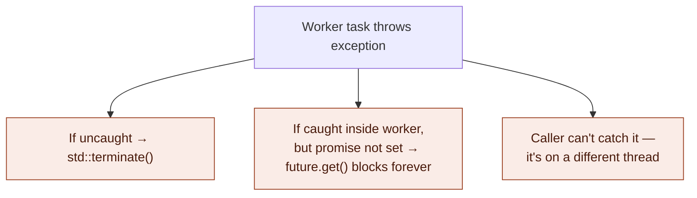
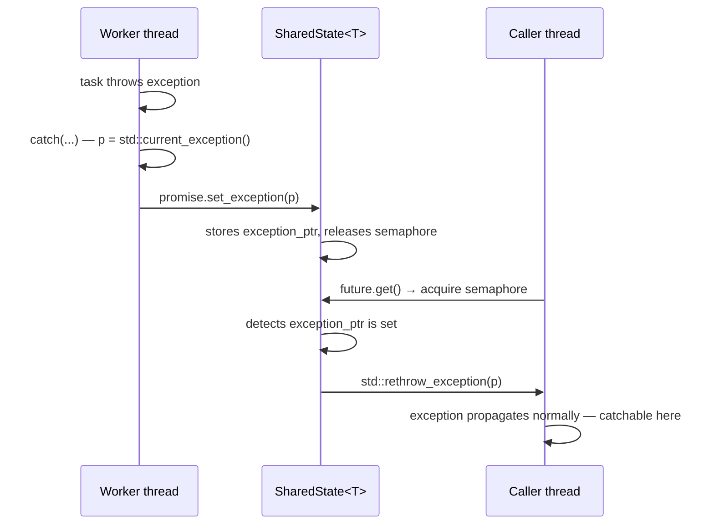
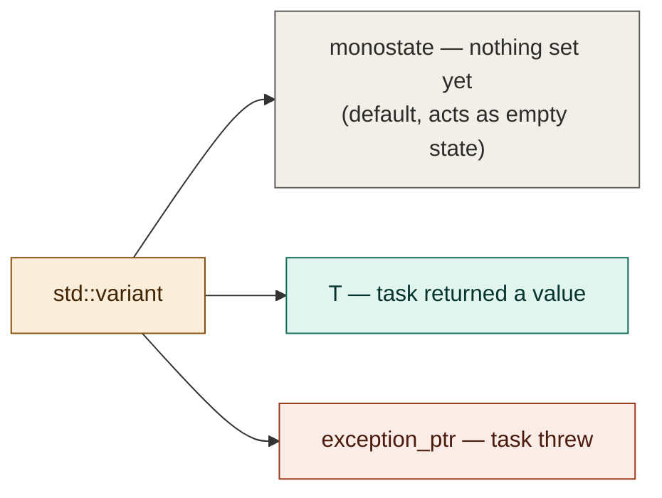
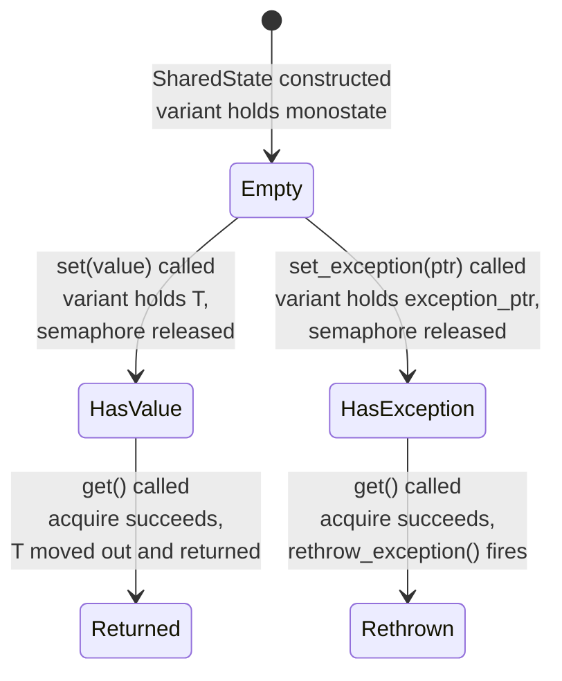
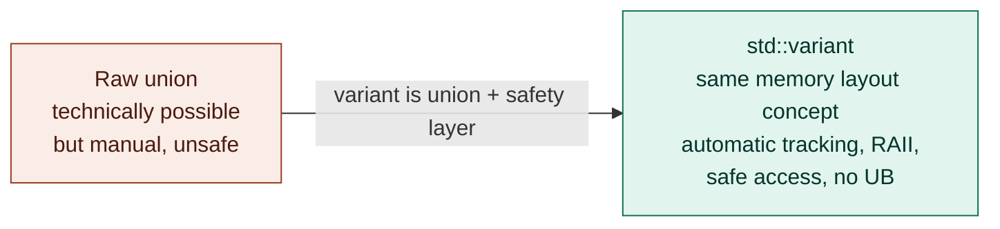

# Multithreading video 20: exception marshalling and future polling — notes

**Source:** Visual Studio C++ series (Chili-style) — multithreading part 20
**Topic:** Catching exceptions thrown inside worker tasks, marshalling them
across thread boundaries using `std::exception_ptr`, storing them in
`SharedState` via `std::variant`, and adding a non-blocking `ready()`
poll to `Future<T>`
**Builds on:** videos 17-19 (SharedState, Promise, Future, Task, thread pool)
**Series position:** video 20 of 30

---

## 1. The problem — exceptions across thread boundaries

When a task running on a worker thread throws an exception:
1. If uncaught, it propagates to the top of the thread's call stack and
   calls `std::terminate()` — the entire process dies.
2. If caught inside the worker, the `Promise` never gets `set_result()`
   called — the `Future::get()` on the main thread blocks forever (the
   binary semaphore is never released).
3. Catching in the caller's context (`try { future.get(); }`) doesn't
   work — the exception was thrown on a different thread, not on the
   caller's thread.



The desired behavior: exceptions should behave just like return values —
the caller calls `future.get()`, and if the task threw, the exception
re-surfaces there, catchable with a normal `try/catch`. This is called
**exception marshalling**: capturing an exception in one thread context
and re-throwing it in another.

## 2. The tool: `std::exception_ptr`

The core problem with marshalling exceptions is that you don't know what
type will be thrown — it could be a `std::runtime_error`, an `int`, a
`bool`, or any arbitrary type. You can't `catch (const SomeType& e)` for
every possible thing that could ever be thrown.

`std::exception_ptr` solves this:
- It can hold **any exception**, regardless of type — acts like a
  type-erased container for an in-flight exception.
- You can't inspect or copy the exception out of it.
- The **only** thing you can do with it is re-throw it via
  `std::rethrow_exception()`.
- Created from inside a catch block via `std::current_exception()`.

```cpp
std::exception_ptr p;

try {
    throw std::runtime_error("something went wrong");
}
catch (...) {
    p = std::current_exception();  // capture any exception, any type
}

// later, on another thread:
if (p) {
    std::rethrow_exception(p);     // re-throws the original exception
}
```



## 3. Storing the exception in SharedState — `std::variant`

`SharedState<T>` now needs to store **either** a `T` (success) **or** an
`std::exception_ptr` (failure) — but never both at the same time. It also
needs a "nothing yet" state before either is set.

This is a perfect use case for `std::variant` — a type-safe union.

### What std::variant is

A `std::variant<A, B, C>` is a value that holds **exactly one** of the
listed types at any given time — like a `union`, but safe: it always
knows which type it currently holds and prevents accessing the wrong one.
Unlike `std::optional` (which is just "value or nothing"), variant
expresses "one of several distinct possibilities."



`std::monostate` is a special empty type provided by the standard library
exactly for this purpose: an empty "placeholder" alternative inside a
variant. A variant must always hold one of its alternatives — it can't be
"empty" the way `std::optional` can — so `monostate` fills that role.
Importantly, **variant defaults to the first alternative**, which is why
`monostate` goes first: a freshly constructed `SharedState` holds
`monostate` (not yet set).

### Updated SharedState<T>

```cpp
#include <variant>
#include <exception>

template<typename T>
class SharedState
{
public:
    // set a successful result
    template<typename R>
    void set(R&& r)
    {
        if (std::holds_alternative<std::monostate>(result_))
        {
            result_.emplace<T>(std::forward<R>(r));
            ready_.release();
        }
    }

    // set an exception (called from catch(...) block)
    void set_exception(std::exception_ptr p)
    {
        if (std::holds_alternative<std::monostate>(result_))
        {
            result_ = p;
            ready_.release();   // still signals the future — it just gets an exception
        }
    }

    T get()
    {
        ready_.acquire();   // block until either set() or set_exception() fires

        // check if an exception was stored
        if (auto* p = std::get_if<std::exception_ptr>(&result_))
        {
            std::rethrow_exception(*p);  // re-throw on the caller's thread
        }

        return std::move(std::get<T>(result_));
    }

private:
    std::variant<std::monostate, T, std::exception_ptr> result_;
    std::binary_semaphore ready_{ 0 };
};
```

Key API used:
- `std::holds_alternative<Type>(v)` — check if variant currently holds
  `Type`
- `std::get_if<Type>(&v)` — get a pointer to the held value if it's
  `Type`, otherwise `nullptr` — combines "does it hold this?" and "give
  me a pointer" in one call, avoiding a race between the two
- `std::get<Type>(v)` — get the held value as `Type`; throws
  `std::bad_variant_access` if it holds a different alternative

## 4. Updating SharedState<void>

`SharedState<void>` already can't use `optional` — and there's no return
value to store in a variant either. The fix is simpler: add a separate
`std::exception_ptr` field alongside the existing `bool complete_`:

```cpp
template<>
class SharedState<void>
{
public:
    void set()
    {
        if (!complete_)
        {
            complete_ = true;
            ready_.release();
        }
    }

    void set_exception(std::exception_ptr p)
    {
        if (!complete_)
        {
            complete_ = true;
            p_exception_ = p;
            ready_.release();
        }
    }

    void get()
    {
        ready_.acquire();
        if (p_exception_)
            std::rethrow_exception(p_exception_);
        // nothing to return — void task completed successfully
    }

private:
    bool complete_ = false;
    std::exception_ptr p_exception_;
    std::binary_semaphore ready_{ 0 };
};
```

## 5. Where the catch goes — inside the Task executor

The catch must be in the worker thread's code — specifically inside the
executor lambda in `Task`, wrapping the call to `f(args...)`:

```cpp
executor_ = [f = ..., p = ..., ... args = ...]() mutable
{
    try
    {
        if constexpr (std::is_void_v<std::invoke_result_t<F, A...>>)
        {
            f(args...);
            p.set_result();
        }
        else
        {
            p.set_result(f(args...));
        }
    }
    catch (...)
    {
        // capture any exception type, marshal it to the caller
        p.set_exception(std::current_exception());
    }
};
```

And `Promise<T>` needs a forwarding method:

```cpp
void set_exception(std::exception_ptr p)
{
    state_->set_exception(p);
}
```

## 6. Why Future<T> doesn't change at all

This is an elegant property of exceptions worth noting explicitly.
`Future::get()` calls `state_->get()`. If `get()` re-throws, the
exception propagates naturally up through `future.get()` to the caller —
with no special handling needed in `Future` itself. The caller just wraps
`future.get()` in a `try/catch`:

```cpp
try {
    auto result = future.get();
    std::cout << result << '\n';
}
catch (const std::exception& e) {
    std::cout << "yikes: " << e.what() << '\n';
}
```

Unlike error codes (which must be explicitly checked and forwarded at
every intermediate step in the call chain), exceptions propagate through
intermediate layers automatically. `Future::get()` is one such
intermediate layer, and it propagates the exception without needing any
code changes.

## 7. Adding non-blocking polling — `Future::ready()`

### The motivation

`Future::get()` is a blocking call — it always waits until the result is
available. But sometimes you want to do other work while the result is
pending and only check periodically whether it's ready:

```cpp
while (!future.ready()) {
    update_ui();            // keep doing other work
}
auto result = future.get(); // now guaranteed not to block
```

### Implementation on SharedState

`std::binary_semaphore` provides `try_acquire()` — a non-blocking version
of `acquire()` that returns `true` if the semaphore was successfully
acquired (and decrements the count), or `false` if it wasn't available.

The subtlety: if `try_acquire()` succeeds, it *consumes* the signal
(count goes 1 → 0). If you then call `get()`, it will block forever
because the signal is already spent. The fix: immediately `release()` it
again if you acquired it during the poll — you're just checking, not
consuming:

```cpp
bool ready()
{
    if (ready_.try_acquire())   // non-blocking check
    {
        ready_.release();       // put it back — just peeking, not consuming
        return true;
    }
    return false;
}
```

This works safely because `Future` is single-consumer by design
(enforced by the `result_acquired_` flag from video 17) — there's no
race between the poll and the actual `get()` call since only one thread
ever touches this future.

### Adding it to Future<T>

```cpp
bool ready()
{
    return p_state_->ready();   // forward to SharedState
}
```

### Full polling usage demo

```cpp
auto future = pool.run(long_running_task, args...);

while (!future.ready())
{
    std::cout << "waiting...\n";
    std::this_thread::sleep_for(std::chrono::milliseconds(100));
}

auto result = future.get();   // doesn't block — ready() confirmed it
```

---

## 8. The full picture — what SharedState holds and when



---

## 9. Alternative approach — `union` instead of `std::variant`

You asked: could the same thing be done with a raw C-style `union`
instead of `std::variant`? Yes — it's technically possible, but
`std::variant` exists precisely because raw `union` has several serious
problems that make it dangerous in practice.

### What a raw union would look like

```cpp
union Result {
    T value;
    std::exception_ptr exception;
};
enum class State { Empty, Value, Exception };

Result result_;
State state_ = State::Empty;
```

### Why this is painful and error-prone

| Problem | Detail |
|---|---|
| **No automatic construction/destruction** | `union` members are not automatically constructed or destroyed. If `T` has a non-trivial constructor or destructor (e.g. `std::string`), you must manually call placement-new to construct it and explicitly call the destructor before switching to a different member. Forget either step → undefined behavior. |
| **You track the active member yourself** | `union` has no concept of "which member is currently active." You need a separate `enum`/`int` flag (like `State` above). `std::variant` tracks this internally. |
| **Reading the wrong member is UB** | If `state_` says `Value` but you access `result_.exception`, that's undefined behavior — the compiler can assume it never happens and optimize accordingly. `std::variant` throws `std::bad_variant_access` instead. |
| **No standard copy/move semantics** | If any member has non-trivial copy/move, the union's copy/move is implicitly deleted. You'd have to implement them manually. `std::variant` handles this automatically. |
| **Can't hold reference types or `void`** | A union member can't be a reference, an array, or void. Variant can hold `std::monostate` as the "empty" state cleanly. |

### What the manual union equivalent would require

```cpp
// construction — must use placement new
new (&result_.value) T(std::forward<R>(r));

// destruction — must call destructor manually before switching
result_.value.~T();
new (&result_.exception) std::exception_ptr(p);

// access — must track state yourself, no safety check
if (state_ == State::Value)
    return std::move(result_.value);
else if (state_ == State::Exception)
    std::rethrow_exception(result_.exception);
```

Every one of these steps is an opportunity for a bug. Forget to call the
destructor before switching → resource leak or double-free. Access the
wrong member → silent undefined behavior. Copy the union → undefined if
the active member has non-trivial copy semantics.

### The actual relationship between union and variant

`std::variant` is essentially what you'd get if you implemented a type-
safe, RAII-aware union correctly yourself — with all the manual tracking,
construction, destruction, and safety checks done for you. It uses a raw
union internally in most implementations, but wraps it in a fully-correct
abstraction layer. There is no reason to reach for a raw `union` when
`std::variant` is available in C++17 and later, unless you're working in
an embedded context with no STL or have extreme memory constraints where
even the variant's type-tag byte matters.



**Bottom line:** use `std::variant`. The only scenario where a raw
`union` is justified here is if you are targeting C++14 or earlier (where
`std::variant` doesn't exist). In that case, you'd want to look at
`boost::variant` as a safer alternative before falling back to raw union
mechanics.

---

## 10. Glossary — new concepts this video

| Term | Plain-English meaning |
|---|---|
| Exception marshalling | Capturing an exception in one thread, transporting it (via `exception_ptr`), and re-throwing it in another thread's context |
| `std::exception_ptr` | A type-erased, copyable handle to any in-flight exception; the only operation it supports is `std::rethrow_exception()` |
| `std::current_exception()` | Called from inside a `catch` block; returns an `exception_ptr` to the currently-handled exception |
| `std::rethrow_exception(p)` | Re-throws whatever exception is stored in the `exception_ptr` |
| `std::variant<A,B,C>` | A type-safe union — holds exactly one of its listed alternatives at any time; always knows which one; safe access via `get`/`get_if`/`holds_alternative` |
| `std::monostate` | A standard empty-state type, used as the first alternative in a variant to give it a valid default "nothing yet" state |
| `std::get_if<Type>(&v)` | Returns a pointer to the variant's value if it holds `Type`, otherwise `nullptr` — combines type-check and access in one step |
| `try_acquire()` | Non-blocking version of `binary_semaphore::acquire()` — returns `true` and decrements the count if available, `false` if not |

---

## 11. Gotchas

- **`set_exception()` must also release the semaphore.** The future's
  `get()` blocks on `acquire()` — it doesn't know or care whether the
  eventual signal carries a value or an exception. Both paths must call
  `release()`.
- **`try_acquire()` consumes the signal if it succeeds.** The
  `ready()` implementation must `release()` immediately after a
  successful `try_acquire()` — otherwise the future's subsequent
  `get()` call will block forever on a semaphore that's already at 0.
- **`catch(...)` catches everything — including non-`std::exception`
  types** like thrown `int`s or raw pointers. `current_exception()` can
  capture these too. They'll re-throw correctly, but a catch block of
  `catch(const std::exception& e)` won't catch them — the caller may
  need a `catch(...)` fallback.
- **Exception propagation through `Future::get()` is free.** No changes
  needed to `Future` itself — the exception bubbles up naturally from
  `state_->get()` through `Future::get()` to the caller, just like any
  other thrown exception propagating through a call stack.
