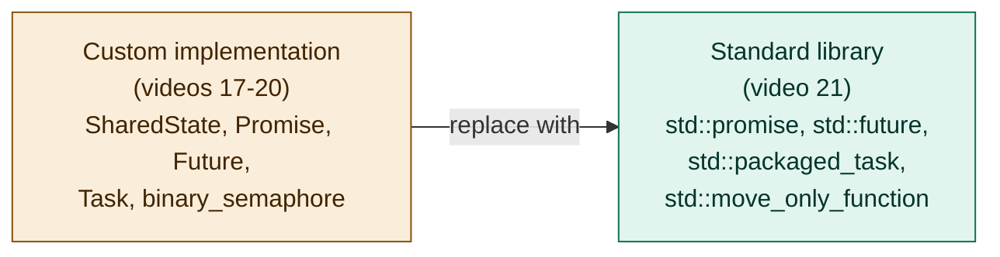
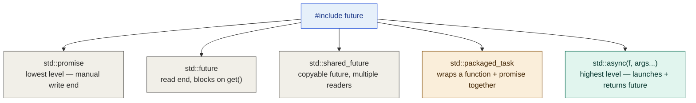
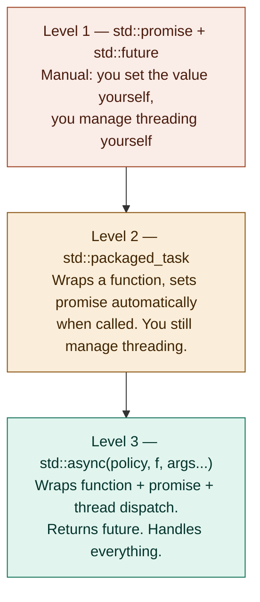
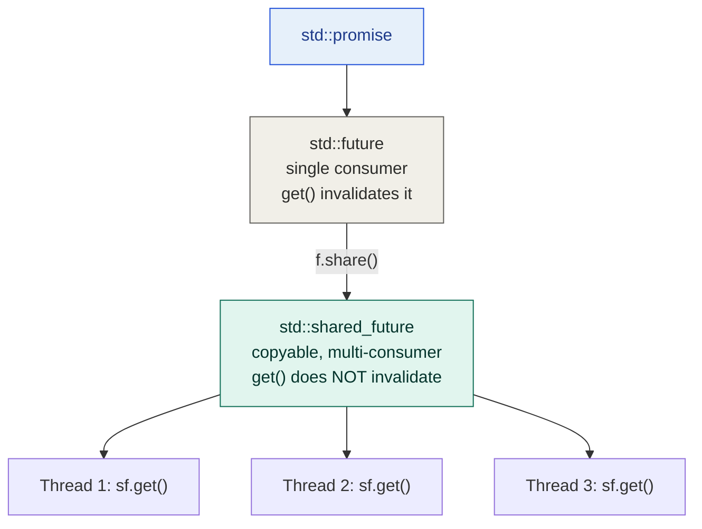
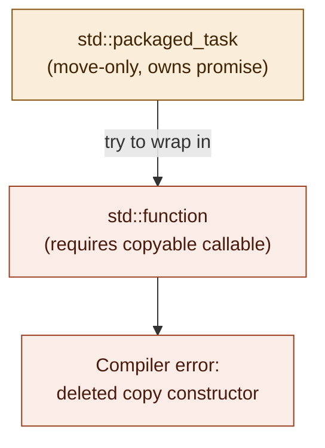
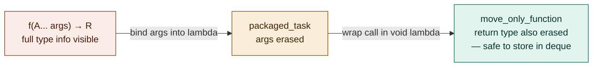
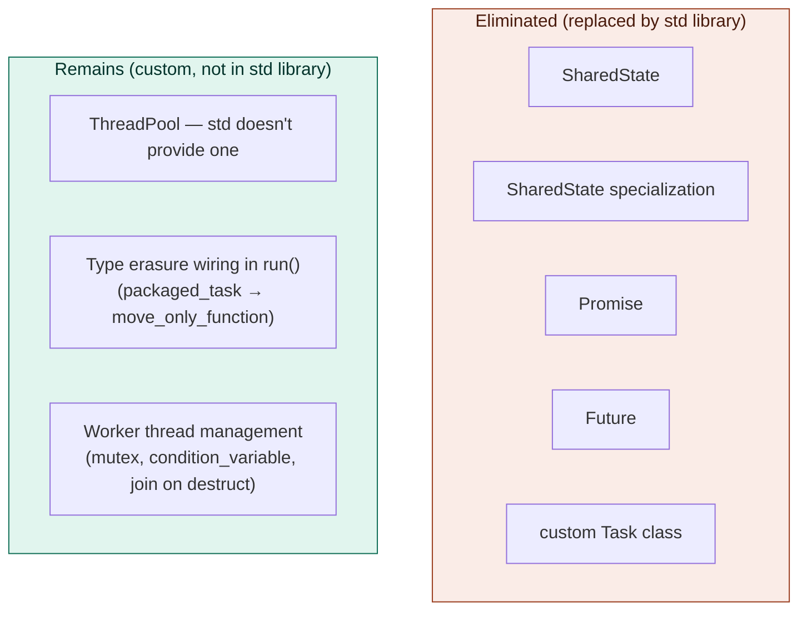

# Multithreading video 21: migrating to std::future — notes

**Source:** Visual Studio C++ series (Chili-style) — multithreading part 21
**Topic:** Replacing the custom Promise/Future/Task/SharedState implementation
(videos 17-20) with the standard library equivalents: `std::promise`,
`std::future`, `std::packaged_task`, `std::move_only_function` (C++23),
and `std::async`
**Builds on:** videos 17-20 (the custom implementation now being replaced)
**Series position:** video 21 of 30

---

## 1. Why this video exists

Videos 17-20 built everything from scratch deliberately — to understand
*why* these primitives exist, what shared state actually is, how a binary
semaphore synchronizes between threads, and what type erasure means in
practice. Now that the mechanics are fully understood, the message is:
**use the standard library instead.** It's more tested, more robust,
handles more edge cases, and already exists — building your own is only
justified if you have a specific reason to deviate.



---

## 2. Standard library overview — what's in `<future>`



### Three levels of abstraction



---

## 3. std::promise and std::future — mapping to the custom version

| Custom (videos 17-20) | Standard library equivalent |
|---|---|
| `SharedState<T>` | Hidden inside the implementation — not exposed at all |
| `Promise<T>::set_result(v)` | `std::promise<T>::set_value(v)` |
| `Promise<T>::set_exception(p)` | `std::promise<T>::set_exception(p)` — separate function, not an overload |
| `Promise<T>::get_future()` | `std::promise<T>::get_future()` — identical |
| `Future<T>::get()` | `std::future<T>::get()` — identical semantics |
| `Future<T>::ready()` | No direct equivalent — use `wait_for(0ms)` and check return value |
| `Future<T>` (single consumer) | `std::future<T>` — get() releases shared state, can only be called once |
| N/A (not in custom version) | `std::future<T>::share()` → `std::shared_future<T>` (multiple readers) |

### Polling equivalent for `ready()`

```cpp
// custom version:
if (future.ready()) { ... }

// standard library equivalent:
if (future.wait_for(std::chrono::milliseconds(0)) == std::future_status::ready)
{ ... }
```

`wait_for(0ms)` returns immediately — it returns `std::future_status::ready`
if the value is available, or `std::future_status::timeout` if not.
There's also `std::future_status::deferred` for the lazy-launch case.

### Additional features in `std::promise` not in the custom version

- `set_value_at_thread_exit(v)` — schedules the value to be set when
  the *current thread exits*, not immediately. Useful for "fire the
  signal when this thread's entire scope finishes."
- `set_exception_at_thread_exit(p)` — same but for exceptions.
- `valid()` — checks whether the future still has a shared state
  (i.e. hasn't had `get()` called yet).
- `wait()` — blocks until ready, but doesn't retrieve the value.
- `wait_until(time_point)` — waits until a specific clock time.

---

## 4. std::packaged_task — the Task class replacement

`std::packaged_task<RetType(Args...)>` is the direct equivalent of the
custom `Task` class from video 18 — it wraps a callable, owns an
internal promise, and sets it automatically when invoked.

```cpp
// custom Task::make():
auto [task, future] = Task::make(myFunc, arg1);

// std::packaged_task equivalent:
std::packaged_task<int(int)> pt{ myFunc };
std::future<int> future = pt.get_future();
pt(arg1);   // or std::thread(std::move(pt), arg1) to run on another thread
```

Key difference: `std::packaged_task` is **templated on the full function
signature** (`RetType(Args...)`), not just the return type. It does *not*
do type erasure by itself — two package tasks with different signatures
are different types and can't go in the same container. Type erasure
(so different tasks can live in the same `deque`) still has to be done
manually when integrating with the thread pool (see section 6).

---

## 5. std::async — the highest level option

```cpp
// launch on a new thread immediately, get a future back
std::future<int> f = std::async(std::launch::async, myFunc, arg1, arg2);

// deferred: don't actually run until f.get() is called
std::future<int> f = std::async(std::launch::deferred, myFunc, arg1, arg2);
```

`std::async` handles everything: creates the promise, wraps the function,
dispatches it to a thread (with `launch::async`), and returns the future.
No thread pool, no Task class, no manual promise management.

**The thread pool question:** `std::async` is *not* guaranteed to use a
thread pool — the standard only says it may reuse threads. In practice,
MSVC does maintain an internal thread pool behind `std::async`, meaning
you don't pay thread-creation cost per call. But since this is
unspecified behavior, you can't rely on it for guaranteed performance
characteristics — which is why the series maintains a custom thread pool
rather than switching entirely to `std::async`.

**When to use `std::async`:** when you need a quick way to launch a task
and get a future, and you don't need fine control over thread pool sizing,
scheduling, or task cancellation.

---

## 6. std::shared_future — one thing the custom version can't do

The custom `Future<T>` (video 17) enforces single-consumer access via a
flag. `std::future<T>` works the same way — `get()` releases the shared
state and leaves the future invalid. But the standard library adds one
more option:

```cpp
std::future<int> f = promise.get_future();
std::shared_future<int> sf = f.share();   // f is now invalid
// sf can be copied freely
// sf.get() can be called from multiple threads
// the value is not released on get() — all readers see the same value
```

`std::shared_future<T>` is copyable and can be handed to multiple
threads. All of them can call `get()` and receive the same value. This is
specifically for "fan-out" scenarios: one producer, many consumers all
waiting on the same result.



---

## 7. Reworking the thread pool — two migrations

### Step 1: replace custom Promise/Future with std::promise/future

In `Task::make()` (video 18's implementation):

```cpp
// before (custom):
Promise<ReturnType> promise;
Future<ReturnType> future = promise.get_future();

// after (standard library):
std::promise<ReturnType> promise;
std::future<ReturnType> future = promise.get_future();

// set_result → set_value
promise.set_value(f(args...));
// set_exception stays the same:
promise.set_exception(std::current_exception());
```

This eliminates `SharedState`, `Promise`, and `Future` entirely — about
80% of the custom code written in videos 17-20.

### Step 2: the std::function problem — it requires copyability

The thread pool's task queue stores tasks in a `std::deque<Task>`, where
the old custom `Task` held a `std::function<void()>` executor. When
migrating to use `std::packaged_task`, there's a problem:

- `std::packaged_task` is **move-only** (can't be copied — it owns a
  promise internally, which can't be copied).
- `std::function<void()>` requires the callable it wraps to be
  **copyable**.

Wrapping a move-only `packaged_task` inside `std::function` is a
compilation error.



### Step 3: the fix — std::move_only_function (C++23)

C++23 introduces `std::move_only_function<Sig>` — a drop-in replacement
for `std::function` that doesn't require the stored callable to be
copyable. The thread pool's deque becomes:

```cpp
// before:
std::deque<Task> tasks_;       // custom Task with std::function<void()>

// after (step 1 — eliminate custom Task):
std::deque<std::move_only_function<void()>> tasks_;
```

And `ThreadPool::run()` wraps the `packaged_task` in a lambda, erasing
its type into a `std::move_only_function<void()>`:

```cpp
template<typename F, typename... A>
auto ThreadPool::run(F&& f, A&&... args)
{
    using R = std::invoke_result_t<F, A...>;

    // bind args into the packaged_task, erasing argument types
    std::packaged_task<R()> pt{
        [f = std::forward<F>(f), ... args = std::forward<A>(args)]() mutable {
            return f(args...);
        }
    };

    auto future = pt.get_future();

    {
        std::lock_guard lock{ mutex_ };
        // erase return type into move_only_function<void()>
        tasks_.push_back([pt = std::move(pt)]() mutable { pt(); });
    }
    cv_.notify_one();

    return future;
}
```

Type erasure happens in two stages:
1. Arguments are erased by binding them into the `packaged_task`'s
   lambda wrapper (the `packaged_task` itself becomes `packaged_task<R()>`
   — no argument types visible).
2. The return type is erased by wrapping the `packaged_task` call in a
   `move_only_function<void()>` lambda.



---

## 8. What was eliminated vs. what remains



The standard library provides all the promise/future/task primitives but
deliberately does not provide a thread pool — that's a design decision
left to the application. The thread pool itself, its queue management,
and the type-erasure wiring to put tasks into the queue, all stay custom.

---

## 9. Key C++23 feature: std::move_only_function

Worth noting as a distinct callout since it's a C++23 feature that's
often not widely known yet:

| | `std::function<Sig>` (C++11) | `std::move_only_function<Sig>` (C++23) |
|---|---|---|
| Stored callable must be... | Copyable | Move-only is fine |
| Can store a `std::packaged_task`? | No | Yes |
| Can store a unique_ptr capturing lambda? | No | Yes |
| Overhead | Slightly higher (copies callable on copy) | Slightly lower |
| Availability | C++11 and later | C++23 and later |

If targeting C++17/20 without C++23, workarounds include: wrapping the
move-only callable in a `shared_ptr` (making it copyable at the cost of
a heap allocation and shared ownership), or using a custom type-erasing
wrapper — which is essentially what the original custom `Task` class was
doing.

---

## 10. Summary — the migration in one table

| Component | Videos 17-20 (custom) | Video 21 (standard library) |
|---|---|---|
| Shared state | `SharedState<T>` (custom) | Hidden inside `std::promise` |
| Write end | `Promise<T>::set_result()` | `std::promise<T>::set_value()` |
| Exception write | `Promise<T>::set_exception()` | `std::promise<T>::set_exception()` |
| Read end | `Future<T>::get()` | `std::future<T>::get()` |
| Polling | `Future<T>::ready()` | `future.wait_for(0ms) == ready` |
| Multi-reader | Not supported | `std::shared_future<T>` via `.share()` |
| Task wrapping | Custom `Task` class | `std::packaged_task<R()>` |
| Type-erased container | `std::function<void()>` (custom Task hid this) | `std::move_only_function<void()>` (C++23) |
| Auto-thread dispatch | Not provided | `std::async(launch::async, f, args...)` |
| Thread pool | Custom | Still custom (std doesn't provide one) |

---

## 11. Gotchas

- **`std::future::get()` invalidates the future.** After `get()` returns,
  `future.valid()` is `false` — calling `get()` again is undefined
  behavior. Check `valid()` before calling `get()` if there's any
  chance the future has already been consumed.
- **`std::packaged_task` must be `mutable` when captured in a lambda.**
  Calling `pt()` modifies the packaged_task's internal state (sets the
  promise). If the capturing lambda is not `mutable`, the call is on a
  `const` reference and won't compile.
- **`std::move_only_function` requires C++23.** If your compiler/project
  is C++20 or earlier, you'll need a workaround (shared_ptr trick, or
  keep the custom Task class).
- **`std::async` without a launch policy** defaults to
  `launch::async | launch::deferred` — the implementation can choose
  either. Always specify the policy explicitly if you care which happens.
- **`std::async` with `launch::async` does NOT guarantee a thread pool.**
  Despite MSVC reusing threads in practice, this is a quality-of-
  implementation detail, not a standard guarantee. Don't rely on it for
  bounded thread usage.

---

## 12. Next video

Flagged as: performance implications of using the thread pool for
**mixed workloads** — both async (I/O-bound, mostly blocking) tasks and
compute-heavy (CPU-bound) tasks running simultaneously — and a conceptual
framework for load balancing between them.
