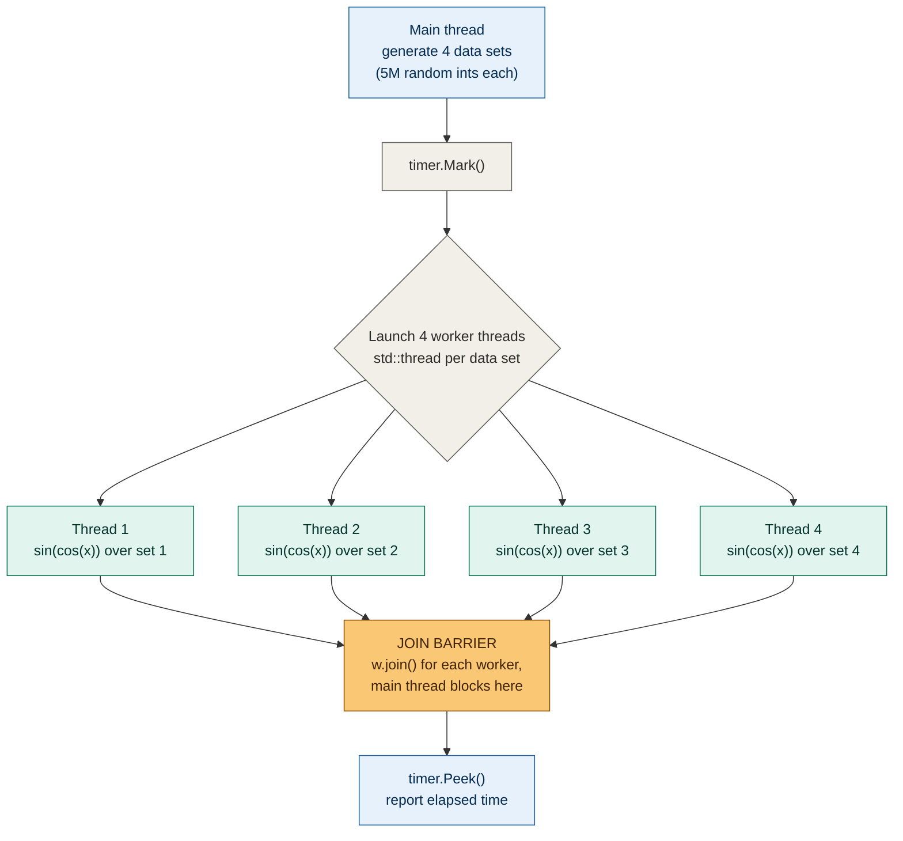
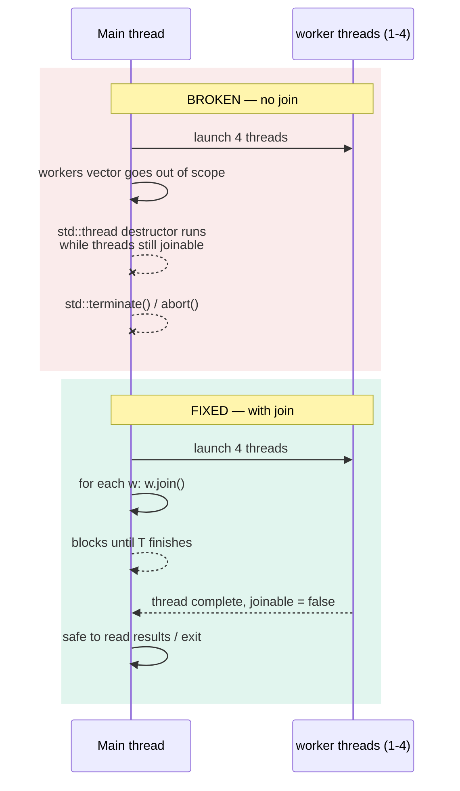

# C++ multithreading basics — personal notes

**Source:** Visual Studio C++ tutorial (Chili-style) — intro to `std::thread`
**Topic:** Parallelizing CPU-bound work across threads
**Status:** Done watching, code reconstructed and verified against narration

---

## 1. Why this matters (context)

Single-threaded code only uses one core. If you've got independent chunks of
expensive CPU work, you're leaving performance on the table on any modern
multi-core machine. This video is the "hello world" of fixing that with
`std::thread` — no synchronization yet, just naive parallel execution.

**Precondition for any speedup:** the work has to be CPU-bound, not
memory-bound or I/O-bound. If threads spend their time waiting on memory
bandwidth or disk, adding more threads won't help — you'll just get four
threads waiting instead of one.

## 2. The experiment (what was actually built)

1. Generate 4 data sets of 5,000,000 random ints each.
2. Run an artificially expensive math operation (`sin(cos(x))`, scaled) over
   every element of every data set.
3. Time it single-threaded.
4. Time it again with one thread per data set.
5. Compare.

## 3. Diagram — overall flow



Key thing this diagram is meant to capture: **the main thread fans work out
to 4 workers, then blocks until all 4 report back before it's safe to read
the result or exit.** That join barrier (orange box) is the part people
forget — skip it and you get `std::terminate()`, not a silently-wrong
result.

### 3.1 Timeline view — single thread vs. 4 threads

```mermaid
gantt
    title CPU time per approach (illustrative, not to scale)
    dateFormat X
    axisFormat %L

    section Single-threaded
    Set 1 :a1, 0, 100
    Set 2 :a2, after a1, 100
    Set 3 :a3, after a2, 100
    Set 4 :a4, after a3, 100

    section 4 threads (parallel)
    Set 1 :b1, 0, 100
    Set 2 :b2, 0, 100
    Set 3 :b3, 0, 100
    Set 4 :b4, 0, 100
```



Single-threaded: 4 chunks run back-to-back, total time = sum of all chunks
(~0.41s). Multi-threaded: 4 chunks run side-by-side, total time ≈ time of
**one** chunk (~0.11s) — assuming you actually have ≥4 cores free and the
work is genuinely independent.

## 4. Build log / decisions, in order

### 4.1 Data setup
- `std::vector<std::array<int, data_set_size>>`, 4 elements, each array 5M ints.
- `data_set_size` is `constexpr size_t` — known at compile time.
- Random fill via `std::mt19937` + `std::ranges::generate(array, engine)`.
  - **Why ranges:** pass the container directly, no `.begin()/.end()` boilerplate.
- Timed with a reused personal `ChiliTimer` utility (`Mark()` / `Peek()`).
- Result: data gen ≈ **0.11s**.

### 4.2 The "fake work"
- Per int `x`: scale into `[-1, 1]` using `numeric_limits<int>::max()`
  (computed `constexpr`), run `sin(cos(y))`, scale back to int range,
  accumulate into `set[0]` (reused as the accumulator slot — no extra
  allocation).
- **Why trig functions specifically:** floating-point heavy → CPU-bound →
  actually shows a multithreading benefit. If the work were trivial, thread
  launch/join overhead would dominate and you'd see *worse* performance, not
  better.
- Single-threaded baseline: ≈ **0.41s**.

> **Open question raised in the video:** data sets are stored in a
> `std::vector` of `std::array`s even though the count (4) is fixed at
> compile time. Why not a plain `std::array` of arrays instead? Worth
> thinking through — vector adds heap allocation + indirection for no
> obvious benefit here.

### 4.3 First multithreading attempt — broken
```cpp
auto w = std::thread([&set] { /* process set */ });
workers.push_back(std::move(w));
```
- Ran without joining → reported ~0.001s (lol, no) → **crash**: `abort() has
  been called`.

**Root cause:** `std::thread`'s destructor calls `std::terminate()` if the
thread object is destroyed while still joinable. You *must* explicitly
`join()` or `detach()` before the `std::thread` goes out of scope.

### 4.4 Fix — join the workers
```cpp
for (auto& w : workers) {
    w.join();
}
```
- Blocks main thread until each worker completes, in order checked (not
  necessarily completion order — `join()` just waits for that specific
  thread).
- Timer must be peeked **after** this loop, not before.



### 4.5 Lambda vs. free function — the `std::ref` gotcha
Swapped the lambda for a standalone function to see what changes:
```cpp
void process_data_set(std::array<int, data_set_size>& set) { ... }
```
- Passing it straight to `std::thread(process_data_set, set)` → **compile
  error**, ugly template diagnostics pointing into `std::invoke`.
- **Why:** `std::thread`'s constructor decays/copies its arguments before
  invoking the callable. A bare reference parameter doesn't survive that —
  unlike a lambda capture by reference, which captures the reference
  directly.
- **Fix:** `std::thread(process_data_set, std::ref(set))`.
  `std::ref` wraps the reference in a `std::reference_wrapper` that *can*
  be stored/forwarded safely.
- Don't double-wrap (`std::ref(std::ref(...))`) — one wrapping is enough.

## 5. Results

| Mode | Time | Notes |
|---|---|---|
| Single-threaded | ~0.41s | Baseline |
| 4 threads, debug, before join fix | 0.18s | Misleading — didn't actually finish the work |
| 4 threads, release, after fix | **~0.11s** | ~4x speedup, matches thread count |

4 threads on 4 independent CPU-bound chunks → ~4x speedup. Textbook
"embarrassingly parallel" case — no shared state between workers, so no
synchronization needed (yet).

## 6. Gotchas to remember next time

- **Always join before scope exit.** Forgetting this isn't a logic bug, it's
  a guaranteed crash (`std::terminate` via the `std::thread` destructor).
- **References into `std::thread` need `std::ref()`.** Lambdas with `[&]`
  captures don't have this problem — only plain function + reference-param
  combos do.
- **Speedup ceiling = thread count, roughly**, only when work is CPU-bound,
  independent, and roughly equal-sized across threads. Don't expect this on
  I/O-bound or heavily-shared-state workloads.
- **This is the easy 20%.** No mutexes, no atomics, no shared accumulator,
  no race conditions — because each thread owns a fully independent data
  set. Real synchronization is a separate, harder topic for later.

## 7. Follow-up topics (mentioned as "next video")

- Bird's-eye view of different multithreading models/approaches.
- Synchronization primitives (mutex, atomics, condition variables).
- Inter-thread communication.
- Why "just throw more threads at it" breaks down once threads need to share
  state.

---

## 8. Full code (reconstructed)

```cpp
#include <vector>
#include <array>
#include <random>
#include <ranges>
#include <cmath>
#include <limits>
#include <thread>
#include "ChiliTimer.h"

constexpr size_t data_set_size = 5'000'000;

void process_data_set(std::array<int, data_set_size>& set)
{
    constexpr auto limit = double(std::numeric_limits<int>::max());

    for (auto& x : set)
    {
        const auto y = double(x) / limit;
        x += int((std::sin(std::cos(y))) * limit);
    }
}

int main()
{
    std::vector<std::array<int, data_set_size>> data_sets(4);
    std::mt19937 rng{ std::random_device{}() };

    ChiliTimer timer;
    timer.Mark();

    for (auto& set : data_sets)
    {
        std::ranges::generate(set, rng);
    }

    auto t = timer.Peek();
    // "generating the data sets took " << t << " seconds"

    timer.Mark();

    // --- Lambda-based version ---
    std::vector<std::thread> workers;
    for (auto& set : data_sets)
    {
        workers.push_back(std::thread([&set]
        {
            constexpr auto limit = double(std::numeric_limits<int>::max());
            for (auto& x : set)
            {
                const auto y = double(x) / limit;
                set[0] += int(std::sin(std::cos(y)) * limit);
            }
        }));
    }

    for (auto& w : workers)
    {
        w.join();
    }

    t = timer.Peek();
    // "processing the data sets took " << t << " seconds"

    // --- Alternative: free function + std::ref, instead of the lambda above ---
    // workers.push_back(std::thread(process_data_set, std::ref(set)));

    return 0;
}
```

> Reconstructed by ear from narration — exact variable names/formatting may
> differ from the original project, but the logic and API usage
> (`std::ranges::generate`, `std::thread`, `.join()`, `std::ref`) match what
> was shown.
