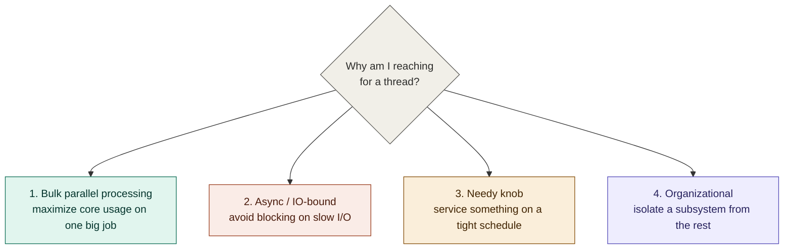
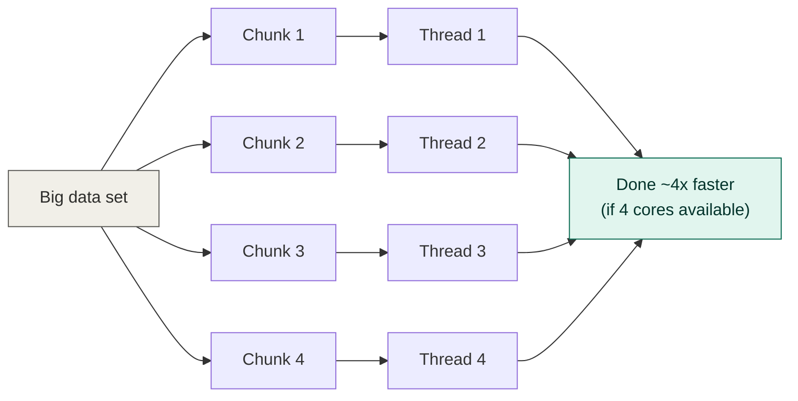
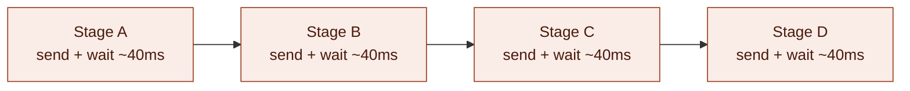
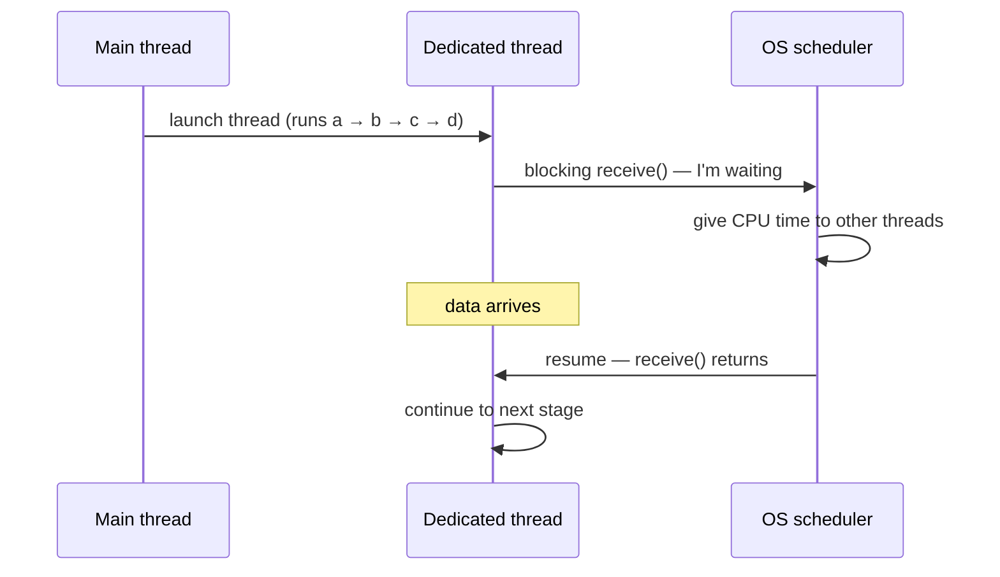
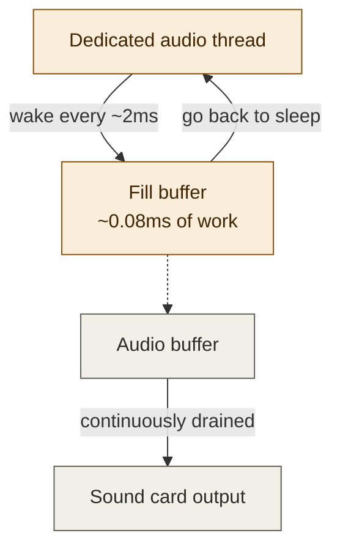
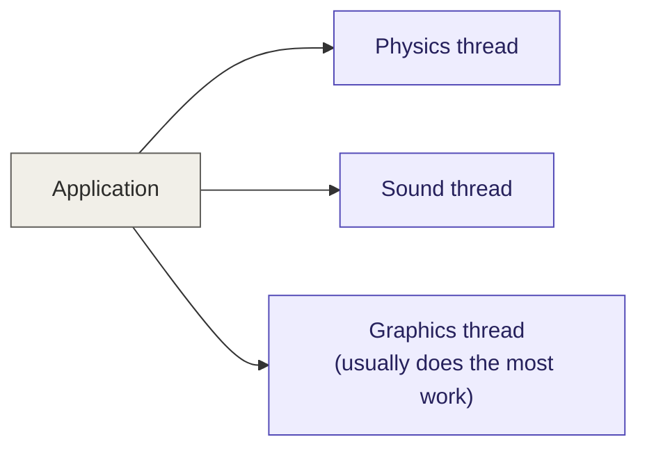

# Multithreading: 4 categories of use cases — personal notes

**Source:** Visual Studio C++ series (Chili-style) — conceptual/whiteboard video, no code this time
**Topic:** A mental model for *why* you'd reach for a thread, before getting into mechanics
**Status:** Conceptual overview, watched once, notes written for future-me / onboarding a junior

---

## 1. Why this video exists

The previous video in the series showed the mechanics of launching threads
(`std::thread`, `.join()`, `std::ref`). This one zooms out: **before you
write `std::thread(...)`, what problem are you actually solving?**

Author's own disclaimer, paraphrased: these 4 categories are not a formal
taxonomy from a textbook — they're a personal framework for thinking about
multithreading, made up to be useful, not to be authoritative. Real
problems often span more than one category. Use it as a checklist for
"what am I actually trying to achieve here," not as a rigid classification
system.

## 2. The four categories, at a glance

| # | Category | Core question | Goal | Cares about core count? |
|---|---|---|---|---|
| 1 | Bulk parallel processing | "How do I finish this big job faster?" | Maximize CPU utilization | Yes — thread count ≈ core count |
| 2 | Async / IO-bound | "How do I avoid blocking while waiting on something slow?" | Don't waste a thread spinning/polling | No — useful even on 1 core |
| 3 | Needy knob | "What needs feeding on a tight, regular schedule?" | Avoid starving a real-time consumer (audio, etc.) | No — about responsiveness, not throughput |
| 4 | Organizational | "How do I keep one slow subsystem from freezing everything else?" | Separation of concerns / responsiveness | Sometimes, but often secondary |

---

## 3. Category 1 — Bulk parallel processing

This is what the *previous video's* code demonstrated: divide one big
homogeneous job into N independent chunks, run each chunk on its own
thread, and finish ~N times faster (up to the number of physical cores you
have).

**Term to know: "embarrassingly parallel."** Work where the chunks don't
depend on each other at all and don't share memory — no communication
needed between threads while they work. This is the easy case.

### When it gets harder (not embarrassingly parallel anymore)
- **Chunks depend on each other's results** — you have to combine outputs,
  or stage N needs stage N-1's output.
- **Shared memory** — multiple threads reading/writing the same data.
  This is where synchronization (mutexes, atomics) becomes mandatory, and
  getting it wrong causes data races / undefined behavior. Not covered
  yet — flagged as a future topic.
- **Uneven work sizes** — if you split 40 work items into 4 equal-*count*
  groups but item sizes vary wildly, one thread finishes early and sits
  idle while another is still grinding. Splitting by *count* isn't the
  same as splitting by *work*.
- **Streaming input** — not all data is available up front; you need
  queues and a dispatcher to hand out work as it arrives, rather than a
  fixed split at the start.

### Rule of thumb on thread count
- 1 core → no benefit from this category, ever. You're not adding compute,
  just adding scheduling overhead.
- N cores → roughly N threads is the sweet spot. Launching way more
  threads than you have cores (e.g. 20 threads on 4 cores) doesn't help
  for *this* category — there's no extra silicon to use, you're just
  forcing the OS to context-switch more.
- **Aside on hyperthreading (SMT):** a 4-core CPU might expose 8 logical
  processors. Each physical core runs two hardware threads so that if one
  stalls (usually on a memory access) the other can use the core's
  execution units. It's *not* the same as having 8 real cores — benefit is
  workload-dependent and sometimes negligible or even negative. Treat "use
  ~core count" as physical cores unless you've actually measured otherwise
  for your workload.

---

## 4. Category 2 — Async / IO-bound waiting

The problem: you're waiting on something **slow but not CPU-intensive** —
classically, network I/O. A request might take 40ms round-trip while the
actual processing on each end is sub-millisecond. If you call a blocking
`receive()` and just sit there, your thread (and the work it could be
doing) is wasted.

Each stage depends on the previous stage's result — can't skip ahead.
Across 4 stages at 40ms latency each, that's ~160ms where the CPU is
mostly idle, just waiting.

### Approaches to this problem (ranked roughly worst → best DX)

| Approach | How it works | Downside |
|---|---|---|
| **Polling** (`check_receive()` in a loop) | Non-blocking check function; call it repeatedly, do other work between checks | You build a hand-rolled state machine yourself to track "what stage am I in" — tedious, error-prone, gets the result back out of the state machine into the rest of your program |
| **Callbacks** | Pass a function to `receive(callback)`; engine calls it later when data arrives | "Callback hell" — nested functions inside functions, gets brutal once you add error handling. This is a real, commonly-used term for exactly this pain |
| **Coroutines** (`async`/`await` in C#, `co_await` in C++20) | Write code that *looks* sequential (`a(); b(); c(); d();`); compiler transforms it into a state machine for you | C++20 has the low-level language support but (as of this video) no ergonomic standard library utilities yet — writing your own coroutine machinery is still non-trivial |
| **Dedicated thread, blocking calls** | Spin up a thread whose only job is to run `a(); b(); c(); d();` with normal *blocking* `receive()` calls | Simplest code by far — you write straight-line logic and let the OS scheduler handle the waiting |

### Why "just use a thread" works here
When a thread calls a blocking function and has to wait, the OS scheduler
notices it's blocked and gives the core to a *different* thread that
actually has work to do. You don't write any waiting/scheduling logic
yourself — the OS already does this, for free, better than you'd hand-roll
it.

### Category 2 vs. category 1 — important contrast
- **Category 1**: you care about maximizing core *utilization*. Pointless
  on a single-core machine.
- **Category 2**: you do **not** care about utilization — most of the
  thread's life is spent asleep. This is worth doing **even on a
  single-core CPU**, because the benefit isn't "more compute," it's
  "don't block your other work while waiting."

---

## 5. Category 3 — "Needy knob" (real-time servicing)

A thread whose entire job is to **feed something on a tight, recurring
schedule**, or bad things happen immediately and audibly/visibly.

**Canonical example: audio buffer.** A sound card consumes samples from a
buffer continuously, e.g. ~200KB/sec at 44.1kHz. If the buffer runs dry
even briefly, you get a pop/glitch in the audio. Personal anecdote in the
video: scrolling a webpage on an old PC could starve the MP3 player's
buffer-fill code of CPU time and cause audible glitching.

### Why you can't just make the buffer bigger
Buffer size directly sets latency. A long buffer means data written now
might not play for several seconds — bad for anything interactive (UI
feedback, live audio). So buffers must stay small, which means they must
be refilled *frequently* and *reliably*. That's the "needy" part.

### Why this needs its own thread
If buffer-filling logic were scattered as function calls sprinkled through
your main loop (render code, physics code, networking code...), any single
slow call anywhere in that loop can starve the buffer and cause a glitch.
A dedicated thread that wakes up on a tight interval, does a tiny bit of
work, and goes back to sleep avoids that — it's isolated from however long
everything else takes.

**General pattern:** mostly sleeping, briefly very active, on a strict
deadline. Contrast with category 1 (continuously busy) and category 2
(occasionally active but with no strict deadline).

---

## 6. Category 4 — Organizational (separation of concerns)

Put logically distinct *systems* on separate threads — not because you're
chasing a specific performance number, but to isolate them from each
other.

### Honest caveat from the video
This category often delivers **less performance benefit than it sounds
like it should.** If one system (e.g. graphics) dominates the total work,
splitting physics/sound/graphics onto 3 threads doesn't actually balance
load — the other two threads finish almost immediately and just sit idle.
A lot of real games "have multithreading" in this loose organizational
sense while still doing the bulk of the work on one dominant thread.

### Where this category earns its keep: responsiveness, not throughput
Best example: **keep the UI thread free.** If a long calculation runs on
the same thread that's supposed to be servicing the UI, the UI freezes —
a familiar and unpleasant user experience. Moving that calculation to its
own thread keeps the UI thread free to keep responding.

**Note the overlap with category 3:** a UI thread also has to be serviced
at a "good enough" rate to not feel laggy — so you can view UI threading
either as organizational (isolating concerns) or as a needy-knob problem
(must be serviced regularly). This is the author's point about categories
not being mutually exclusive — same problem, two valid lenses.

---

## 7. Overlap and judgment calls

These categories blur together constantly in real systems:

- A UI thread = organizational **and** needy-knob.
- A network request handled by a dedicated thread = async/IO-bound, but
  if that thread is also isolating networking from rendering, it's also
  organizational.
- A bulk-parallel job (category 1) that streams in data over the network
  also has an async/IO-bound component feeding it.

**Practical takeaway:** when sizing up a multithreading problem, don't
try to force it into exactly one bucket. Ask the 4 questions from the
table in section 2 and see which ones actually apply — that's more useful
than picking a single "correct" category.

---

## 8. Glossary (terms introduced this video)

| Term | Meaning |
|---|---|
| Embarrassingly parallel | Work that splits into independent chunks with zero inter-chunk communication needed |
| Blocking call | A function that doesn't return until its result is ready (e.g. `receive()`) |
| Polling | Repeatedly calling a non-blocking check function to see if a result is ready yet |
| Callback hell | The mess of deeply nested callback functions that results from chaining async operations via callbacks |
| Coroutine | Language-level construct that lets you write sequential-looking code that the compiler turns into an implicit state machine (C++20 has core support, no rich stdlib utilities yet as of this video) |
| Hyperthreading / SMT | A physical core exposing 2 logical processors so a stalled hardware thread doesn't waste the core's execution units |

## 9. Follow-up topics (mentioned as coming up)

- Deep dive into category 1 (bulk parallel processing) across several
  videos: breaking problems into task units, dispatching to worker
  threads, thread pooling.
- Synchronization primitives: mutex, condition variable, atomics — what
  happens when threads *do* need to share state.

---

## 10. No code this video

This was a whiteboard/conceptual session — no source file changes. The
worked example with actual `std::thread`/`std::ref`/`.join()` code lives
in the previous video's notes (`cpp_multithreading_notes.md`).
