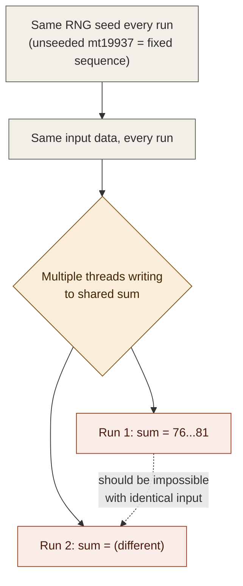
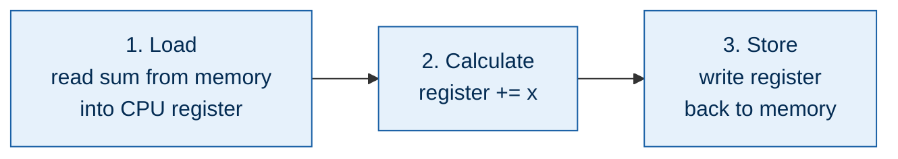
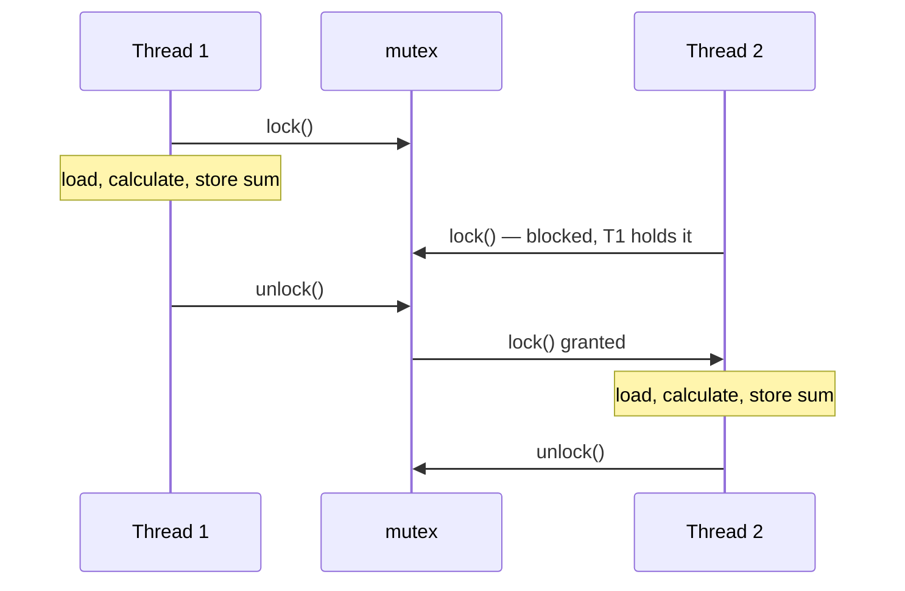
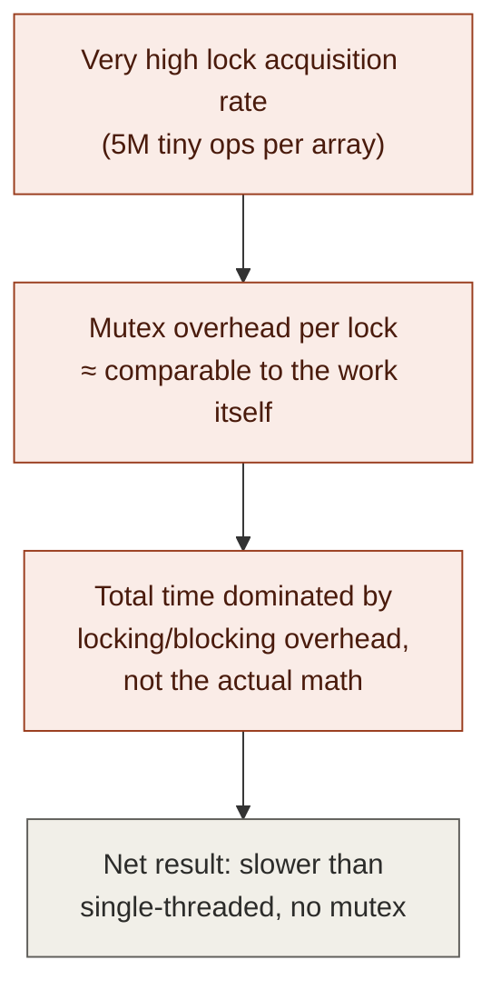
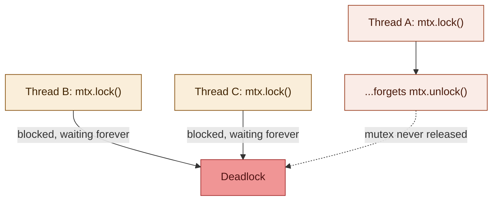
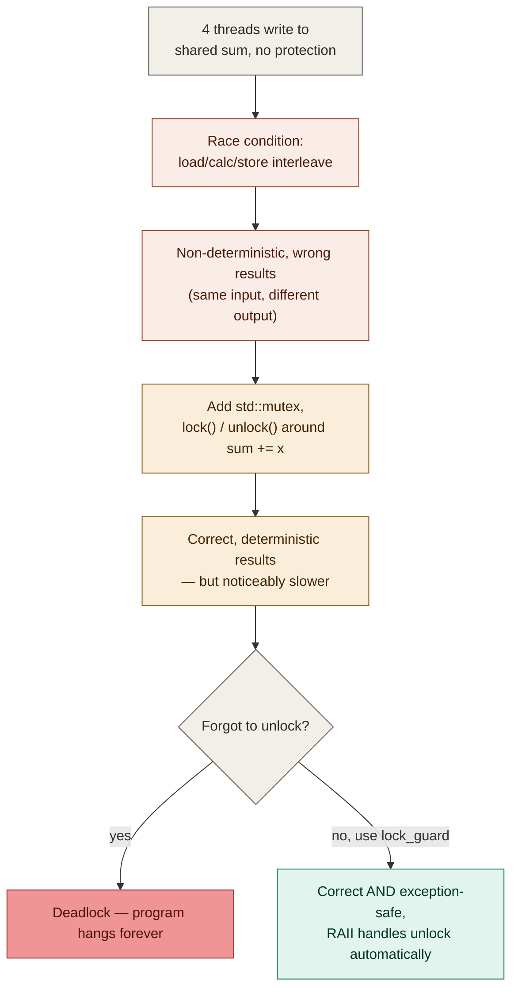

# Race conditions and mutexes in C++ — personal notes

**Source:** Visual Studio C++ series (Chili-style) — multithreading part 3
**Topic:** What a race condition actually is at the CPU instruction level, and the basic mutex fix
**Status:** Code reconstructed and verified against narration
**Builds on:** `cpp_multithreading_notes.md` (video 1 — launching threads, join)

---

## 1. The setup

Starting point is the exact code from video 1: 4 large arrays, one worker
thread per array, each doing a bit of trig math (`sin`/`cos`/division) on
every element. In video 1, each thread accumulated its result into
**element 0 of its own array** — every thread writing to a different piece
of memory.

This video changes one thing: instead of 4 separate accumulators, all 4
threads accumulate into **one shared `int sum`**.

```cpp
int sum = 0;
```

Passed into each worker via `std::ref(sum)`, same pattern as `std::ref`
for the array in video 1's function-pointer variant.

## 2. The bug, observed before it's understood

Symptom, in order:
1. Single-threaded baseline (writing to own array slot): **~1.1s**.
2. Multi-threaded, all writing to shared `sum`: **~0.3s** first run — but
   slower than expected for 4 threads, and the result printed was
   suspicious.
3. Ran again with **identical input** (RNG is unseeded → deterministic,
   same sequence every run) → got a **different sum** and a **different
   time (~2.25s)**.

> **The actual alarm bell here isn't the slowdown — it's that the same
> deterministic input produced a different output on every run.** That's
> the tell. Performance numbers can vary run to run for all sorts of
> innocent reasons (OS scheduling noise, other processes). A *different
> result* from *identical input* cannot be explained by noise — it means
> something is fundamentally broken about how the program executes.



## 3. Diagnosis — what a single `sum += x` actually costs

This is the core lesson of the whole video. Don't think of `sum += x` as
one atomic step. At the hardware level it's always (at least) **three
separate steps**:

1. **Load** — read the current value of `sum` from memory into a CPU
   register.
2. **Calculate** — add `x` to the register's value.
3. **Store** — write the register's value back to `sum`'s memory location.



These three steps are **not atomic** by default — nothing stops another
thread's load/calculate/store from being interleaved in the middle.

## 4. The actual race — step by step

The diagram above shows it visually. Walking through it in words, with
two threads (T1, T2) both accumulating into the same `sum`:

**Safe case** (no overlap): T1 fully completes load→calc→store before T2
starts. `sum` goes 0 → 1 (T1 adds 1) → 3 (T2 adds 2). Correct.

**Race case**: T1 and T2 both **load** `sum` (currently 3) *before either
has stored anything new*. Both now have a stale local copy of 3 in their
own register.
- T1 calculates 3 + 4 = 7
- T2 calculates 3 + 5 = 8
- T1 stores 7 back to `sum`
- T2 stores 8 back to `sum`, **overwriting T1's store entirely**

Final result: `sum == 8`. Correct result should have been
1 + 4 + 2 + 5 = 12. T1's contribution vanished without a trace, no
crash, no warning — just a silently wrong number.

**Why this is so insidious:** this bad interleaving only has to happen
**once** across millions of operations to permanently poison the final
result. With 5 million elements per array running through this addition,
the odds of it never happening even once across a full run are
essentially zero — hence a different wrong answer almost every time.

This is the textbook definition of a **race condition**: program
correctness depends on the unpredictable timing/interleaving of
operations across threads.

## 5. The fix — mutex (mutual exclusion)

```cpp
#include <mutex>
```

A `std::mutex` lets you mark a region of code such that **only one
thread can be inside it at a time.** Any other thread that tries to enter
while one is already inside has to wait (block) until it leaves.

### Basic (manual) usage

```cpp
std::mutex mtx;   // one mutex, shared by reference across all threads
                   // — passed via std::ref(mtx), same as the sum

mtx.lock();
sum += x;          // only one thread can be executing this at a time
mtx.unlock();
```

By wrapping the load-calculate-store sequence inside `lock()`/`unlock()`,
you make it behave as if it *were* one indivisible operation from every
other thread's point of view — exactly what was missing in section 3.



### Result after adding the mutex
- Same deterministic input → **same result every time.** Race condition
  fixed; correctness restored.
- But: **slower than even the single-threaded baseline** — went from
  ~0.4s (single-threaded) to ~0.6s with 4 threads + mutex on this
  workload.

## 6. Why the mutex made things slower here — and when it wouldn't

A locked mutex isn't free even to *contend for*. When a thread tries to
`lock()` a mutex that's already held, the OS has to block that thread and
context-switch away from it, then later wake it and switch back — real
overhead beyond just "waiting your turn."



**This is workload-dependent, not a property of mutexes being bad.** The
ratio that matters is: *(time spent doing useful work per critical
section)* vs. *(mutex lock/unlock + contention overhead)*.

| Scenario | Mutex overhead vs. useful work | Verdict |
|---|---|---|
| Tiny, extremely frequent critical sections (this video — 5M ops/array) | Overhead dominates | Mutex can make things *slower* than single-threaded |
| Larger, less frequent critical sections (longer work per lock) | Overhead becomes negligible | Mutex is a perfectly good, simple, correct choice |

**Key lesson, stated explicitly in the video:** "you can throw a bunch of
threads at a problem, but if you don't do it correctly — if the problem
isn't inherently multi-threadable to begin with — you'll end up spending
more time than if you'd just written it single-threaded." This wastes
both your time as a programmer and the CPU's time.

**Not the takeaway:** "never use mutex." Mutex is usually the *first*
tool to reach for — easy to use, easy to reason about, gets you a correct
result with minimal code. For high-contention, very-fine-grained
scenarios like this artificial benchmark, atomics or lock-free techniques
are better suited — but they require more careful thinking and are a
separate (future) topic.

## 7. The other footgun — forgetting to unlock → deadlock

If you call `mtx.lock()` and never call `mtx.unlock()` (e.g. you forget,
or an exception is thrown between lock and unlock), every other thread
that later tries to `lock()` that mutex blocks **forever**. In the video
this manifested as the program hanging and eventually being killed by the
OS/timeout, observed as an unusual negative exit code.

This is called a **deadlock**.



### The fix — `std::lock_guard` (RAII)

```cpp
#include <mutex>

{
    std::lock_guard<std::mutex> guard(mtx);  // calls mtx.lock() here
    sum += x;
}   // guard destructor calls mtx.unlock() automatically here
```

`std::lock_guard` is a thin RAII wrapper: its constructor locks the
mutex, its destructor unlocks it. This means the mutex is **always**
unlocked when the guard goes out of scope — including if an exception is
thrown partway through the critical section. Manual `lock()`/`unlock()`
has no such guarantee; an exception between the two leaves the mutex
locked forever with no code path left to unlock it.

Three concrete wins over manual lock/unlock:
1. One line shorter (no explicit `unlock()` call needed).
2. Impossible to forget the unlock — it's tied to scope, not to
   remembering a second statement.
3. Exception-safe: a thrown exception still triggers the destructor.

This is a specific application of a general C++ idiom: **RAII**
(Resource Acquisition Is Initialization) — tie a resource's lifetime to
an object's scope so cleanup happens automatically. Same pattern as
`std::unique_ptr`/`std::vector` managing memory; here it's managing a
lock instead.

## 8. Summary diagram — the whole episode in one flow



## 9. Gotchas to remember next time

- **`sum += x` is never one step.** It's load → calculate → store, three
  separate memory/register operations. Any of those steps can interleave
  with another thread's steps unless you explicitly prevent it.
- **A different result from identical, deterministic input is a hard
  signal of a race condition** — not noise, not bad luck. Treat it as a
  correctness bug, full stop.
- **A race condition only needs to misfire once** to corrupt a whole
  run's output. At high iteration counts, "once" is close to guaranteed,
  which is why race conditions often look "random" even though each
  individual interleaving is a perfectly deterministic possible
  schedule.
- **Mutex correctness is free; mutex performance is not.** Always
  correct once applied properly — but can make a high-contention,
  fine-grained workload *slower* than not multithreading it at all. Check
  the ratio of (work per critical section) to (lock overhead) before
  assuming a mutex fix is "free" performance-wise.
- **Always prefer `std::lock_guard` (or `std::unique_lock`/`std::scoped_lock`)
  over manual `lock()`/`unlock()`.** Manual unlock is one missed line or
  one thrown exception away from a permanent deadlock.
- **Shared mutable state is the actual root cause here**, not threading
  itself. Video 1's version (each thread writes to its own array slot)
  never needed a mutex because there was no shared memory being written
  by more than one thread. The need for synchronization shows up
  precisely when multiple threads can write the same memory location.

## 10. Follow-up topics (flagged as "next video")

- A couple of unaddressed issues acknowledged but not covered yet
  (paraphrased as "elephants in the room") — likely candidates based on
  context: false sharing / cache contention, and atomics as a
  lower-overhead alternative to mutex for simple operations like this
  accumulation.
- Atomic operations and lock-free techniques as an alternative
  synchronization strategy for high-contention, low-work-per-access
  scenarios like this one.

---

## 11. Full code (reconstructed)

```cpp
#include <vector>
#include <array>
#include <random>
#include <ranges>
#include <cmath>
#include <limits>
#include <thread>
#include <mutex>
#include "ChiliTimer.h"

constexpr size_t data_set_size = 5'000'000;

int main()
{
    std::vector<std::array<int, data_set_size>> data_sets(4);
    std::mt19937 rng{};  // unseeded -> deterministic sequence every run

    ChiliTimer timer;
    timer.Mark();

    for (auto& set : data_sets)
    {
        std::ranges::generate(set, rng);
    }

    timer.Mark();

    int sum = 0;
    std::mutex mtx;

    std::vector<std::thread> workers;
    for (auto& set : data_sets)
    {
        workers.push_back(std::thread([&set, &sum, &mtx]
        {
            constexpr auto limit = double(std::numeric_limits<int>::max());

            for (auto& x : set)
            {
                const auto y = double(x) / limit;
                const int result = int(std::sin(std::cos(y)) * limit);

                // --- Critical section: protect the shared accumulator ---
                std::lock_guard<std::mutex> guard(mtx);
                sum += result;
                // -----------------------------------------------------
            }
        }));
    }

    for (auto& w : workers)
    {
        w.join();
    }

    const auto t = timer.Peek();
    // print: "processing took " << t << " seconds"
    // print: "result is " << sum

    return 0;
}
```

> Note: the transcript reconstructs the code by ear from narration —
> exact variable names/spacing may differ from the original Visual
> Studio project, but the logic and API usage (`std::mutex`,
> `.lock()`/`.unlock()`, `std::lock_guard`, `std::ref`) match what was
> demonstrated. The video itself showed manual `lock()`/`unlock()` first,
> then replaced it with `lock_guard` — the code above already reflects
> the final, recommended version.
