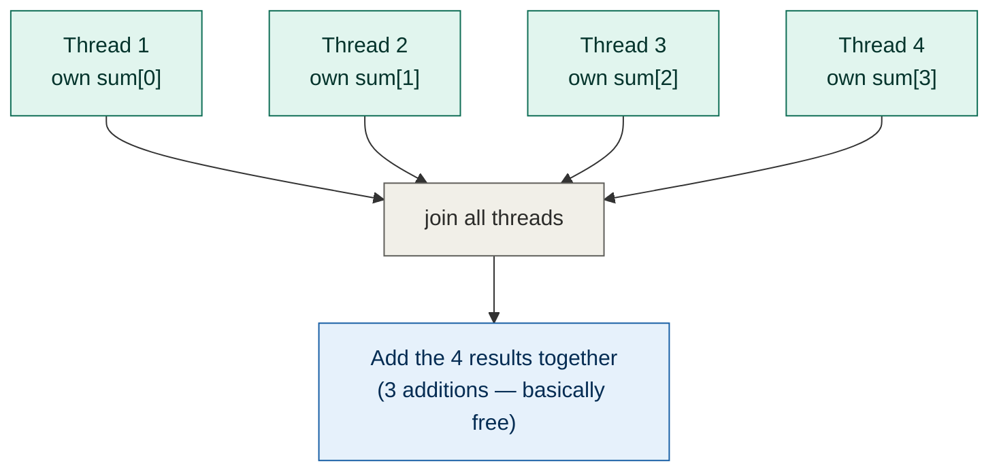
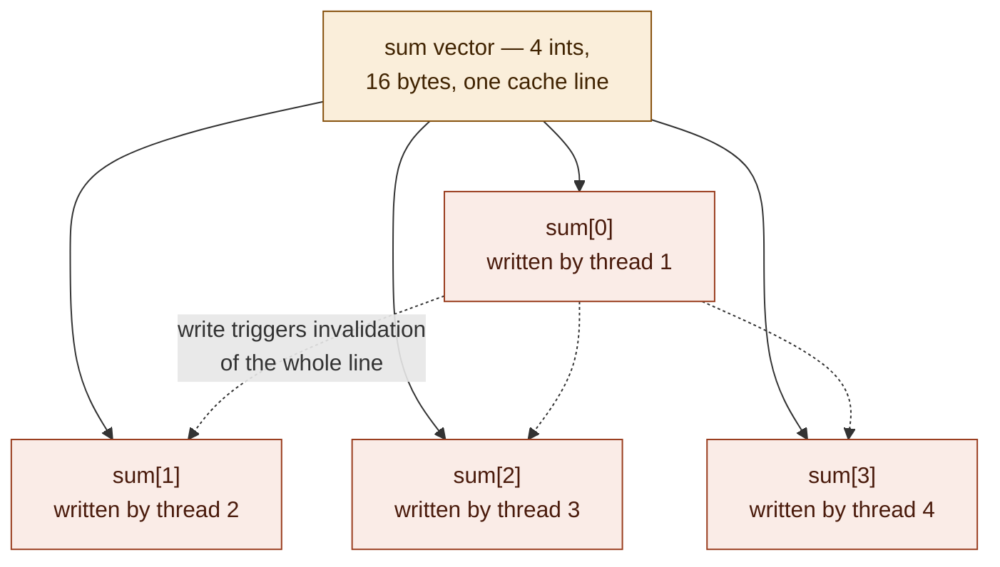
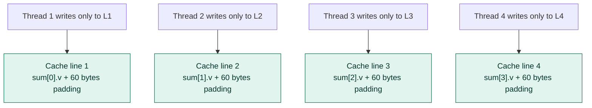

# False sharing — foundations notes (4 of 4)

**Series:** Computer architecture foundations, written to fully understand
false sharing (the topic of multithreading video 5).
**Builds on:** Part 0 (bytes/addresses/cores), Part 1 (memory hierarchy),
Part 2 (64-byte aligned cache lines), Part 3 (cache coherency /
invalidation)
**Status:** This part finally covers the actual video — code included

---

## 1. Where video 4 picks up

Video 3 ended with: a shared `sum` variable, protected by a `std::mutex`,
giving correct results but at a steep cost — about **6x slower** than
the unsynchronized (and wrong) version, and slower even than running
single-threaded. Video 4 opens by addressing two things left unexplained
("elephants in the room"):

1. **Can the problem be restructured to need a lot less synchronization
   in the first place?**
2. **Even with zero synchronization in your code, why was a second,
   separate slowdown still happening?**

Elephant 1 has a clean fix. Elephant 2 is false sharing, and it needs
everything from parts 0-3 to actually explain.

## 2. Elephant 1 — give each thread its own accumulator

Instead of every thread fighting over one shared `sum` (which is why a
mutex was needed at all), give each thread its **own private
accumulator**, and only combine them at the very end, after all threads
have finished.



While the threads are running, **no memory is shared between them at
all** — each writes only to its own accumulator. `join()` (from video 1)
acts as the synchronization point: you don't need a mutex during the
work, because there's no concurrent access to protect against. You only
combine results once every thread has already finished and stopped
running.

```cpp
std::vector<int> sum(4);   // one accumulator per thread, default-initialized to 0

for (size_t i = 0; i < 4; i++)
{
    workers.push_back(std::thread([&data_sets, &sum, i]
    {
        constexpr auto limit = double(std::numeric_limits<int>::max());
        for (auto& x : data_sets[i])
        {
            const auto y = double(x) / limit;
            sum[i] += int(std::sin(std::cos(y)) * limit);
        }
    }));
}

for (auto& w : workers) { w.join(); }

const int total = sum[0] + sum[1] + sum[2] + sum[3];
```

**Result: no mutex needed, correct every time, and roughly 2x faster
than the mutex version** (~0.29s vs. ~0.6s in the video). A real,
solid win — but notably **not the ~4x speedup** you'd expect from 4
fully independent threads with zero synchronization. Something was still
holding it back, and that something doesn't show up anywhere in the
code above.

## 3. Elephant 2 — the leftover slowdown, and where it actually was

The video's key observation: the *unsynchronized* version from earlier
(every thread writing to its own array's element 0, no shared `sum` of
any kind) ran in about **1.1s** as a baseline... but the new
per-thread-accumulator version above, despite *also* having no
synchronization in the code, was taking about **2.25s — over twice as
slow**, for a problem that's structurally just as parallel.

This is the moment all of parts 1-3 exist to explain. Nothing in the
*source code* differs in any way that should matter — four threads,
four independent accumulators, no shared memory, no locks. So the cause
has to live below the level the code can see.

### Walking it through with what you now know
1. `std::vector<int> sum(4)` allocates **4 `int`s laid out consecutively
   in memory** — 16 bytes total (4 bytes × 4, from part 0's "an int is
   commonly 4 bytes").
2. A cache line is 64 bytes (part 2). 16 bytes is far smaller than that —
   so **all 4 `int`s land inside the same single 64-byte aligned cache
   line.**
3. Each thread runs on its own core, and each core has its own private
   cache (part 1, part 3).
4. Every thread, millions of times per second, writes to *its own*
   element of `sum` — but because all 4 elements share one cache line,
   every single one of those writes triggers the cache coherency
   protocol (part 3) to invalidate that line in every *other* core's
   cache, even though those other cores were only ever touching their
   own, completely different element.
5. That invalidation-and-refetch cost, paid constantly by all 4 cores
   fighting over one line, is what made this version slower than even
   the original single-array-element version.



**This is false sharing**: multiple threads accessing *logically
independent* variables that happen to physically share a cache line, so
the hardware's coherency protocol treats them as if they were
contended — paying real cross-core synchronization cost for accesses
that, from the program's point of view, never touch the same data at
all. No bug in the code causes it. No tool flags it as a race condition,
because it isn't one — the result is always correct. It's purely a
performance problem, and an invisible one unless you already understand
parts 1-3.

> Worth being precise about the name: this is **not** the same problem
> as video 3's race condition. A race condition is a *correctness* bug —
> wrong answers from unsynchronized access to genuinely shared data.
> False sharing produces **correct answers, every time** — it's purely a
> *performance* problem caused by independent data accidentally sharing
> hardware-level storage.

## 4. Confirming the theory experimentally

The video doesn't just assert this — it tests it. Two pieces of
supporting evidence given:

1. **Looking it up**: cache line size for the CPU in question was
   confirmed at 64 bytes (consistent with part 2's general claim, and
   shown to be true for the specific real hardware being used, not just
   a textbook number).
2. **The actual fix, tried and measured**: pad each accumulator out so
   that it's forced onto its own separate cache line, and see if the
   slowdown disappears.

```cpp
struct alignas(64) Value
{
    int v;
    char padding[60];   // 4 bytes for v + 60 bytes padding = 64 bytes total
};

std::vector<Value> sum(4);   // now each Value occupies its own full cache line
```

By making each `Value` exactly 64 bytes (the size of one cache line),
the compiler lays out `sum[0]`, `sum[1]`, `sum[2]`, and `sum[3]` so that
**each one starts on a new cache line** rather than being packed
together into one. Each thread's accumulator is now physically isolated
from the others, even though logically nothing about the algorithm
changed.



**Result: ~1.2-1.3s** — back in line with the original no-synchronization
baseline (~1.1s), confirming the diagnosis. The "wasted" 60 bytes of
padding per accumulator is a trade: you spend a little memory to
completely eliminate cross-core coherency traffic that was costing far
more in time than the padding costs in space.

## 5. The full before/after, in one table

| Version | Synchronization in code | Time | Why |
|---|---|---|---|
| Single thread, own array slot | None needed | ~0.4-0.44s | Baseline, no parallelism |
| 4 threads, own array slot each | None needed | ~1.1s* | *(this number from video 4 is the no-mutex multi-thread baseline, distinct from the 0.4s single-thread number — both appear in the transcripts and reflect different runs/conditions) |
| 4 threads, shared `sum`, no mutex | None — but wrong answers | ~0.11-0.3s, non-deterministic | Race condition (video 3) — fast but incorrect |
| 4 threads, shared `sum`, with mutex | `std::mutex` + `lock_guard` | ~0.6s | Correct, but mutex contention overhead dominates (video 3) |
| 4 threads, separate accumulators, no padding | None in code | ~2.25-2.29s | **False sharing** — correct, but cache line contention |
| 4 threads, separate accumulators, padded to 64 bytes | None in code | ~1.2-1.3s | Correct, no false sharing, close to ideal |

*(Exact numbers vary run to run per the video's own caveats about
background system load — treat the relative ordering and the
"order-of-magnitude" gaps as the reliable takeaway, not the precise
decimal values.)*

## 6. Why this matters beyond this one example

The general principle, stated plainly: **giving each thread its own
private data to work on eliminates the need for explicit synchronization
(mutexes) — but doesn't automatically eliminate hardware-level
contention if that private data still happens to be laid out close
together in memory.** "No shared variables in my code" and "no
contention at the hardware level" are not the same guarantee. You can
write code that looks perfectly clean — no locks, no shared state, no
race conditions possible — and still pay a real performance cost that's
invisible at the source level, purely from memory layout.

The general fix is the same shape every time: **separate per-thread data
by at least one full cache line (typically 64 bytes)**, either through
explicit padding (as shown here) or other layout techniques (e.g.
`alignas`, separate allocations per thread, or letting each thread keep
its result in a local variable and return it rather than writing to a
shared array element at all — mentioned in the video as a cleaner
alternative approach for the future, requiring more machinery around
thread results).

## 7. Recap — how parts 0-3 each fed into this

| Part | What it gave you | How it was used here |
|---|---|---|
| 0 — basics | Bytes, addresses, "a variable is just bytes at an address," cores | Made it possible to reason about `sum[0..3]` as actual byte ranges in memory |
| 1 — memory hierarchy | Per-core private caches vs. shared L3/RAM | Explained why each core has its *own* copy of the line to begin with |
| 2 — cache lines | Fixed 64-byte aligned blocks, unrelated data can share a line | Directly explained why 4 small ints ended up in one line |
| 3 — cache coherency | Per-line invalidation on any write, cost of cross-core sync | Explained the actual mechanism causing the slowdown — and that it's invisible in source code |

## 8. Full code (reconstructed) — final version with the fix applied

```cpp
#include <vector>
#include <array>
#include <random>
#include <ranges>
#include <cmath>
#include <limits>
#include <thread>
#include "ChiliTimer.h"

constexpr size_t data_set_size = 5'000'000;

struct alignas(64) Value
{
    int v = 0;
    char padding[60];
};

int main()
{
    std::vector<std::array<int, data_set_size>> data_sets(4);
    std::mt19937 rng{};

    ChiliTimer timer;
    timer.Mark();

    for (auto& set : data_sets)
    {
        std::ranges::generate(set, rng);
    }

    timer.Mark();

    std::vector<Value> sum(4);   // each Value padded to its own cache line

    std::vector<std::thread> workers;
    for (size_t i = 0; i < 4; i++)
    {
        workers.push_back(std::thread([&data_sets, &sum, i]
        {
            constexpr auto limit = double(std::numeric_limits<int>::max());
            for (auto& x : data_sets[i])
            {
                const auto y = double(x) / limit;
                sum[i].v += int(std::sin(std::cos(y)) * limit);
            }
        }));
    }

    for (auto& w : workers) { w.join(); }

    const auto t = timer.Peek();
    const int total = sum[0].v + sum[1].v + sum[2].v + sum[3].v;
    // print: "processing took " << t << " seconds"
    // print: "result is " << total

    return 0;
}
```

> Note: reconstructed by ear from narration, same caveat as previous
> videos' notes — exact variable names/spacing may differ from the
> original project, but the logic and the key technique
> (`alignas(64)` + padding to force one accumulator per cache line)
> match what was demonstrated.

## 9. Gotchas to remember

- **False sharing produces correct results.** It will never show up as a
  bug report, a wrong answer, or a crash — only as "this should be
  faster than it is," which makes it easy to miss entirely unless you
  know to look for it.
- **"No shared variables" in your source code is not the same as "no
  shared cache lines" in memory.** Always ask, for hot per-thread data:
  how close together are these allocated, and could they fit in one
  64-byte block?
- **The fix costs memory to save time.** Padding a 4-byte `int` out to 64
  bytes is a 16x memory blow-up for that one variable. Worth it when the
  variable is written extremely frequently from multiple cores; not
  worth doing reflexively to every small variable in a program.
- **This is architecture-dependent.** Cache line size (commonly 64 bytes
  on modern x86/ARM, per part 2) is a hardware property, not a language
  guarantee. Don't hardcode `64` everywhere without a comment explaining
  why — `std::hardware_destructive_interference_size` (C++17) exists
  specifically to express "the size you should pad to avoid false
  sharing" portably, instead of a hardcoded magic number, though the
  video used a hardcoded value to keep things explicit while teaching.

## 10. Follow-up topics (flagged by the video itself)

- A cleaner alternative to manual padding: have each thread keep its
  accumulator as a pure local variable (no shared array at all) and
  return its result from the thread, rather than writing into shared
  memory during the loop. Mentioned as needing "more machinery" — likely
  pointing toward `std::future`/`std::async`/`std::packaged_task` in a
  future video, since plain `std::thread` has no built-in return-value
  mechanism.
- Atomics and lock-free techniques, flagged back in video 3 as a better
  fit than mutexes for high-contention scenarios, still not covered in
  detail as of this video.
