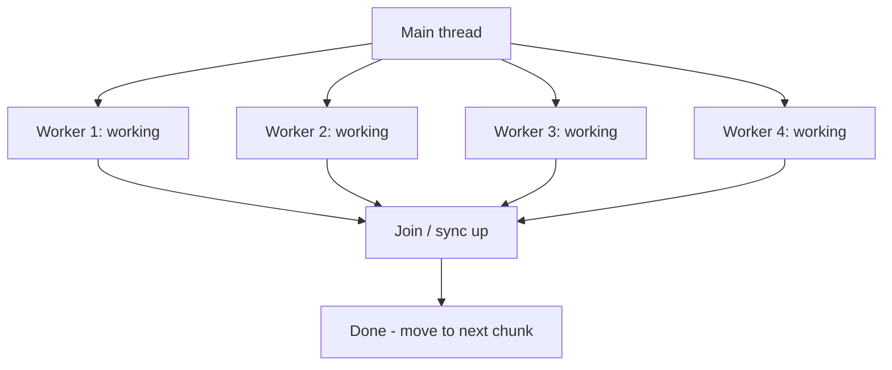
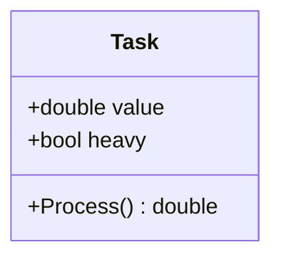
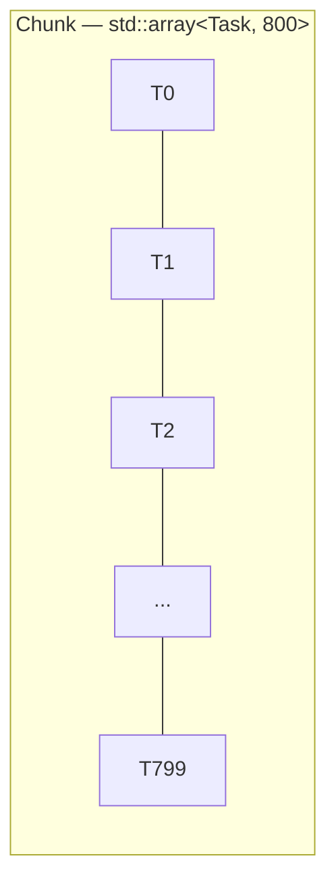
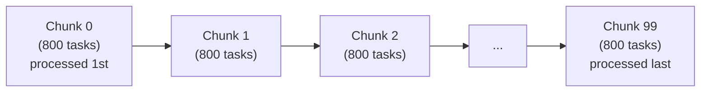
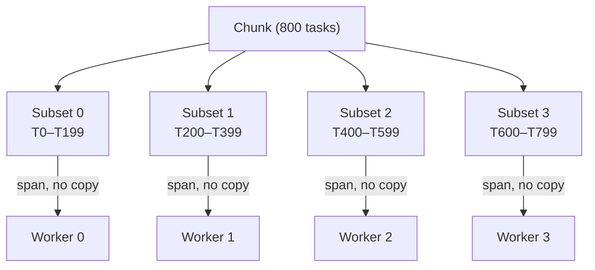
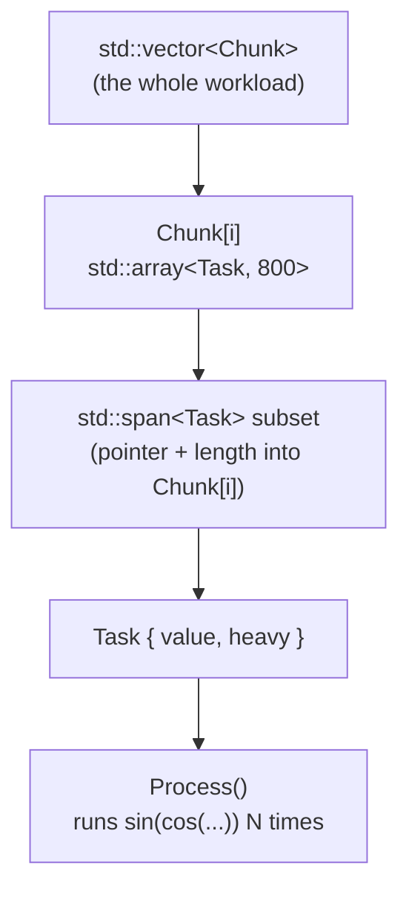

# C++ Multithreading Notes — Part 3: The "Unbalanced Workloads" Experiment (Prep)

Continuation of the notes series. This part covers three messy, "live coding"
videos where Chili builds an **experiment rig** to study a real problem:
*what happens when some work items take longer than others, and those slow
items don't get spread out evenly across your worker threads?*

This is explained simply below, followed by a clean practice implementation
you can build yourself.

---

## 0. Quick Primer: What Is a "Thread"?

Before diving in, here's the mental model this whole series relies on.

Normally your program runs as **one sequence of instructions**, executed one
at a time, top to bottom — this is your "main thread." A **thread** is an
independent, separately-scheduled sequence of instructions that the operating
system can run **at the same time** as (or interleaved with) other threads,
usually on a different CPU core.

**Single-threaded** — one task after another, in order:


**Multi-threaded** — the main thread hands out work, several threads run it
at the same time, then everyone waits for the slowest one before continuing:



Key ideas used throughout this series:

- **Each thread has its own call stack**, but threads can share access to the
  same memory (variables, arrays, etc.) — which is powerful, but dangerous:
  two threads writing to the same memory at the same time causes bugs (data
  races), hence all the `mutex`/`condition_variable` machinery from earlier
  parts of these notes.
- **Creating a thread is expensive** (Part 2 covered this) — the OS has to
  set up a stack and scheduling context for it — which is why we reuse a pool
  of long-lived "worker" threads instead of creating a new thread for every
  small piece of work.
- **In this experiment**, we create exactly `worker_count` (e.g. 4) threads
  once, and repeatedly hand each one a slice of data to chew on, chunk after
  chunk — never creating or destroying threads mid-run.

---

## 1. What problem is this "prep" actually about?

So far in the series, every worker thread did the same amount of work per
chunk — nice and even. That's unrealistic. In real programs (games, servers,
image processing, etc.):

- Some tasks are naturally slower than others (a "heavy" item vs a "light" item).
- You usually **can't know in advance** which tasks will be slow — you only
  find out after you've done them.
- If your slow tasks happen to all land on the same one or two threads while
  the others get easy tasks, the fast threads finish early and just **sit
  idle**, waiting for the slow one to catch up. The whole chunk can only move
  forward once *every* thread is done.

**The big question this prep work sets up:** *how much does an uneven
distribution of "heavy" vs "light" work actually hurt total performance,
compared to spreading the heavy work out evenly?* And once we can measure
that, in a later video, how do we fix it?

Think of it like a group project: if one person gets all the hard parts and
everyone else gets easy parts, the group isn't done until the one overloaded
person finishes — everyone else is just waiting around.

---

## 2. Building blocks of the experiment (in plain English)

### a) A "Task" = one unit of work

Each task has:
- A `value` (a random floating-point number).
- A `heavy` flag: `true` if this task should take a long time, `false` if it's quick.

Processing a task just loops doing repeated `sin`/`cos` math on the value —
purely a way to "burn time." Heavy tasks loop **many more times** than light
tasks (e.g. light = 100 iterations, heavy = 1,000+), so heavy tasks
genuinely take longer to compute, simulating a real slow task.

### b) Chunks and subsets

- The whole workload is broken into **chunks** (like "frames" in a game —
  you finish one chunk completely before starting the next).
- Each chunk is one array of tasks.
- Each chunk is further divided into **subsets**, one subset per worker
  thread. So if you have 4 workers, a chunk is sliced into 4 equal pieces.

This mirrors real multithreaded rendering/game loops: you can't skip ahead to
next frame's work until this frame's work (across all threads) is complete.

### c) Controlling "heaviness"

Two ways to decide which tasks are heavy, used to compare scenarios:

1. **Random (Bernoulli distribution)** — each task independently has some
   probability (e.g. 2%) of being heavy. Realistic "you don't know in
   advance" scenario.
2. **Controlled distributions**, to run fair experiments:
   - **Evenly distributed** — heavy tasks are spread out at a fixed interval
     (e.g. every 20th task is heavy), so each worker's subset gets roughly
     the same number of heavy tasks.
   - **Stacked** — all the heavy tasks are placed at the very front of the
     chunk. Since each worker gets a contiguous slice, this means **one
     unlucky worker gets ALL the heavy tasks**, and everyone else gets
     nothing but light tasks — the worst-case scenario.

Importantly, "evenly" and "stacked" use **the exact same underlying data** —
same total number of heavy tasks, same total workload — just rearranged. This
makes it a fair, apples-to-apples comparison: *any timing difference is
purely due to how the work was distributed, not how much work there was.*

**Visual comparison** — `H` = heavy task, `.` = light task, same chunk, same
total number of `H`s, just arranged differently before being sliced into 4
worker subsets:

**Evenly distributed** — heavy tasks spread out (`H` = heavy, `·` = light):

| Worker | Its slice of tasks | Heavy count |
|---|---|---|
| Worker 0 | `· · H · · · H · · · H · · · H · ·` | some |
| Worker 1 | `· · H · · · H · · · H · · · H · ·` | some |
| Worker 2 | `· · H · · · H · · · H · · · H · ·` | some |
| Worker 3 | `· · H · · · H · · · H · · · H · ·` | some |

→ All 4 workers get roughly the same amount of heavy work, so they finish
around the same time. Little idle waiting.

**Stacked** — heavy tasks all crammed at the front, then sliced into 4:

| Worker | Its slice of tasks | Heavy count |
|---|---|---|
| Worker 0 | `H H H H H H H H H H H H H H H H H` | **ALL of them** |
| Worker 1 | `· · · · · · · · · · · · · · · · ·` | none |
| Worker 2 | `· · · · · · · · · · · · · · · · ·` | none |
| Worker 3 | `· · · · · · · · · · · · · · · · ·` | none |

→ Workers 1–3 finish almost instantly, then sit **idle**, waiting for Worker
0 to slog through every heavy task alone before the chunk is considered
"done" and everyone can move on to the next chunk.

```mermaid
gantt
    title Stacked scenario: one chunk's timeline
    dateFormat  X
    axisFormat %s
    section Worker 0
    All the heavy tasks      :active, w0, 0, 10
    section Worker 1
    Light tasks              :done, w1, 0, 2
    Idle (waiting)           :crit, w1b, 2, 10
    section Worker 2
    Light tasks              :done, w2, 0, 2
    Idle (waiting)           :crit, w2b, 2, 10
    section Worker 3
    Light tasks              :done, w3, 0, 2
    Idle (waiting)           :crit, w3b, 2, 10
```



This is exactly why the "stacked" run took roughly 2x as long in the video —
the chunk can't finish until its *slowest* worker finishes, and idle time on
the fast workers doesn't help speed anything up.

### d) A subtle bug worth knowing about: "chaotic" math

Early on, repeatedly applying `sin(cos(x))` to a value causes it to converge
to the same fixed value no matter what you start with (a mathematical
fixed-point). That's bad for this experiment because:
- If a race condition or bug scrambled the order of operations, you'd still
  get the same final answer by coincidence — hiding real bugs.
- The fix: use a "chaotic" operation instead (extracting digits from the
  middle of a number and feeding them back in) so tiny differences in input
  produce very different final results. This makes correctness bugs easier
  to detect, because a real bug will visibly change the output.

**Takeaway:** when writing test/benchmark code, prefer computations sensitive
to input differences — computations that "wash out" differences can hide bugs.

---

## 2.5. The Data Types We're Actually Building — Step by Step

It helps to see exactly what shape the data has at each level, since the
video builds this up piece by piece and it can get confusing. Here's the
full picture, small to large:

### Level 1 — `Task`: the smallest unit of work

```cpp
struct Task
{
    double value;  // a random number to compute on
    bool   heavy;  // is this task slow (true) or quick (false)?
};
```



That's it — just two fields. Nothing fancy, but it's the atomic thing a
worker thread will process one at a time.

### Level 2 — `Chunk`: a fixed-size array of Tasks

```cpp
using Chunk = std::array<Task, chunk_size>;   // e.g. chunk_size = 800
```

A `Chunk` is one "frame's worth" of work — all the tasks that need to be
finished before we can move on to the next chunk.


*(each `T` is one `Task{ value, heavy }`)*

### Level 3 — `std::vector<Chunk>`: the whole workload

```cpp
std::vector<Chunk> chunks;   // size = chunk_count, e.g. 100 chunks
```

This is the entire dataset for the whole run — a sequence of chunks that get
processed one after another, in order (like 100 consecutive game frames).


This whole sequence is one `std::vector<Chunk>` — `chunk_count = 100` chunks,
processed strictly in order, one fully finished before the next begins.

### Level 4 — `std::span<Task>`: a *view* into part of one chunk

We don't copy data out to give a worker its share — instead we hand it a
lightweight **view** (`std::span`) pointing at the right slice of the chunk
in-place. A span is just a `(pointer, length)` pair — no ownership, no copy.

```cpp
std::span<Task> subset(chunk.data() + worker_index * subset_size, subset_size);
```

Putting it all together, here's how ONE chunk gets divided among 4 workers:



Each `std::span<Task>` just *points into* the original `Chunk` — the actual
`Task` objects never move or get copied. This is why `std::span` matters:
cheap to create, no allocation, and every worker safely reads/writes only its
own slice of memory (no overlap between workers = no data race on the tasks
themselves).

### Putting all 4 levels together



So when we say "give worker 2 its job," what's really happening is: we
compute a pointer 400 tasks into the current chunk, wrap it with a 200-task
`span`, and hand that span to `Worker 2` via `SetJob()`. Worker 2 then loops
over its 200 `Task`s, calling `.Process()` on each one and accumulating the
results — completely independently of the other 3 workers, since their spans
point at non-overlapping memory.

### e) Measuring what actually happened

For meaningful results, the program measures (and later writes to a CSV file
for analysis in Excel):
- Total time for the whole run.
- Time spent per chunk.
- Per-thread, per-chunk: how long that thread spent working, how many heavy
  items it processed, and (derived) how long it spent **idle** waiting for
  slower threads.
- Totals across all threads per chunk: total heavy count, total idle time
  (summed across threads — how many "thread-seconds" were wasted waiting).

Measurements are stored in memory during the run and only written to disk
*after* processing finishes, so file I/O doesn't distort the timing.

---

## 3. What the results showed

- With work evenly distributed, the run was fast — all workers finish around
  the same time, minimal idle waiting.
- With heavy work **stacked** onto one worker, total time roughly
  **doubled** (or worse), even though the total amount of work was identical.
- The reason: one worker becomes the "bottleneck" — a chunk isn't done until
  its slowest worker finishes, so the other workers' idle time is pure waste.
- This confirms the core problem: **static, even-sized splitting of work
  across threads is fragile** — if the workload turns out uneven (which you
  usually can't predict ahead of time), you lose a lot of the benefit of
  multithreading, because fast threads sit idle instead of helping out.

This sets up the *next* video's actual solution (not covered in this prep):
some kind of **dynamic work-stealing or dynamic dispatch** scheme, so idle
threads can pick up extra work instead of just waiting.

---

## 4. Practice Code

A clean, from-scratch reconstruction of the experiment. This is simplified
compared to the video's messy live-coding (no CSV writer complexity —
just console output — but you can extend it) so it's easier to learn from
and build upon.

```cpp
// unbalanced_workload_demo.cpp
// Compile (g++):  g++ -std=c++20 -O2 -pthread unbalanced_workload_demo.cpp -o workload_demo
//
// Usage:
//   ./workload_demo evenly
//   ./workload_demo stacked

#include <algorithm>
#include <array>
#include <chrono>
#include <cmath>
#include <condition_variable>
#include <cstring>
#include <iostream>
#include <memory>
#include <mutex>
#include <numeric>
#include <random>
#include <span>
#include <vector>

// ---------------- Experiment settings ----------------
constexpr size_t worker_count = 4;
constexpr size_t chunk_size = 800;      // must be a multiple of worker_count
constexpr size_t chunk_count = 100;
constexpr size_t light_iterations = 100;
constexpr size_t heavy_iterations = 1000; // 10x heavier than light
constexpr double probability_heavy = 0.05; // 5% of tasks are heavy

static_assert(chunk_size % worker_count == 0,
              "chunk_size must be a multiple of worker_count");

// ---------------- Task ----------------
struct Task
{
    double value = 0.0;
    bool heavy = false;

    // "Burns time" proportional to heavy/light iteration count.
    // Deliberately chaotic so bugs/race conditions are detectable.
    double Process() const
    {
        const auto iterations = heavy ? heavy_iterations : light_iterations;
        double intermediate = value;
        for (size_t i = 0; i < iterations; ++i)
        {
            intermediate = std::sin(std::cos(intermediate));
        }
        return intermediate;
    }
};

using Chunk = std::array<Task, chunk_size>;

// ---------------- Data generation ----------------

// Random heaviness (Bernoulli) -- realistic "you don't know in advance" case.
std::vector<Chunk> GenerateDataSetRandom()
{
    std::vector<Chunk> chunks;
    chunks.reserve(chunk_count);

    std::mt19937 rng{ 1337 };
    std::uniform_real_distribution<double> v_dist{ 0.0, 3.14159265358979 };
    std::bernoulli_distribution h_dist{ probability_heavy };

    for (size_t c = 0; c < chunk_count; ++c)
    {
        Chunk chunk;
        for (auto& task : chunk)
        {
            task.value = v_dist(rng);
            task.heavy = h_dist(rng);
        }
        chunks.push_back(chunk);
    }
    return chunks;
}

// Heavy items spread out evenly (every Nth item is heavy).
std::vector<Chunk> GenerateDataSetEvenly()
{
    std::vector<Chunk> chunks;
    chunks.reserve(chunk_count);

    std::mt19937 rng{ 1337 };
    std::uniform_real_distribution<double> v_dist{ 0.0, 3.14159265358979 };

    const int every_nth = static_cast<int>(1.0 / probability_heavy);

    for (size_t c = 0; c < chunk_count; ++c)
    {
        Chunk chunk;
        int i = 0;
        for (auto& task : chunk)
        {
            task.value = v_dist(rng);
            ++i;
            task.heavy = (i % every_nth == 0);
        }
        chunks.push_back(chunk);
    }
    return chunks;
}

// Same data as "evenly", but heavy items partitioned to the FRONT of each
// chunk -- worst case: one worker's subset gets almost all the heavy items.
std::vector<Chunk> GenerateDataSetStacked()
{
    auto chunks = GenerateDataSetEvenly();
    for (auto& chunk : chunks)
    {
        std::ranges::partition(chunk, [](const Task& t) { return t.heavy; });
    }
    return chunks;
}

// ---------------- Timer ----------------
class Timer
{
public:
    void Mark() { start_ = std::chrono::steady_clock::now(); }
    double Peek() const
    {
        return std::chrono::duration<double>(
                   std::chrono::steady_clock::now() - start_)
            .count();
    }
private:
    std::chrono::steady_clock::time_point start_ = std::chrono::steady_clock::now();
};

// ---------------- MasterControl ----------------
class MasterControl
{
public:
    void SignalDone()
    {
        bool notify = false;
        {
            std::lock_guard<std::mutex> lg(mtx_);
            ++done_count_;
            notify = (done_count_ == worker_count);
        }
        if (notify) cv_.notify_one();
    }

    void WaitForAllDone()
    {
        cv_.wait(lock_, [this] { return done_count_ == worker_count; });
        done_count_ = 0;
    }

private:
    std::condition_variable cv_;
    std::mutex mtx_;
    std::unique_lock<std::mutex> lock_{ mtx_ };
    size_t done_count_ = 0;
};

// ---------------- Worker ----------------
class Worker
{
public:
    explicit Worker(MasterControl* p_master)
        : p_master_(p_master), thread_(&Worker::Run_, this)
    {
    }

    void SetJob(std::span<Task> data)
    {
        {
            std::lock_guard<std::mutex> lg(mtx_);
            input_ = data;
            num_heavy_processed_ = 0;
        }
        cv_.notify_one();
    }

    void Kill()
    {
        {
            std::lock_guard<std::mutex> lg(mtx_);
            dying_ = true;
        }
        cv_.notify_one();
    }

    double GetResult() const { return accumulation_; }
    size_t GetNumHeavyProcessed() const { return num_heavy_processed_; }
    float GetJobWorkTime() const { return work_time_; }

private:
    void Run_()
    {
        std::unique_lock<std::mutex> lock(mtx_);
        while (true)
        {
            cv_.wait(lock, [this] { return !input_.empty() || dying_; });
            if (dying_) break;

            timer_.Mark();
            for (const Task& t : input_)
            {
                accumulation_ += t.Process();
                if (t.heavy) ++num_heavy_processed_;
            }
            work_time_ = static_cast<float>(timer_.Peek());

            input_ = {}; // mark "no job" / done
            p_master_->SignalDone();
        }
    }

    MasterControl* p_master_;
    std::condition_variable cv_;
    std::mutex mtx_;
    std::span<Task> input_;
    double accumulation_ = 0.0;
    size_t num_heavy_processed_ = 0;
    float work_time_ = -1.0f;
    bool dying_ = false;
    Timer timer_;
    std::jthread thread_; // last, so mtx_/cv_ already exist when it starts
};

double RunExperimen
