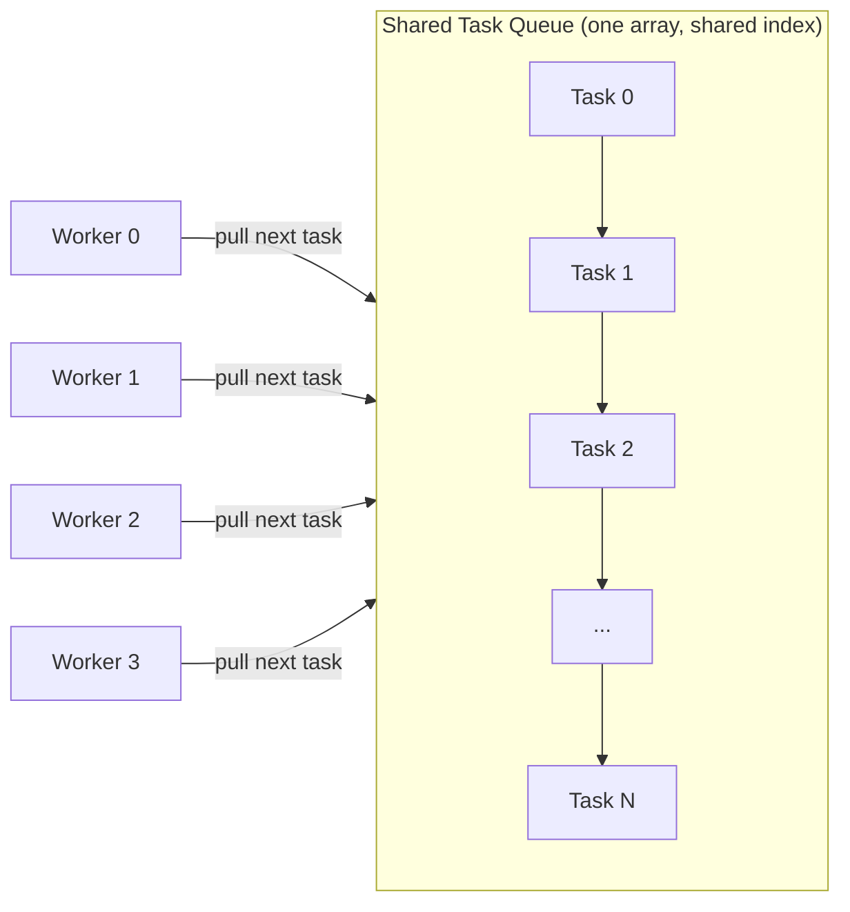
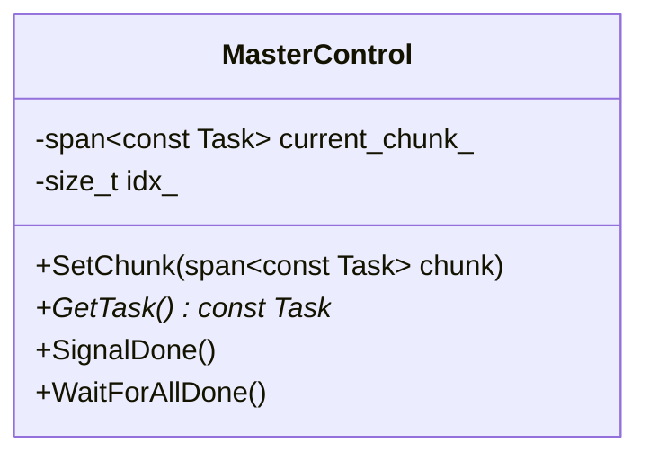
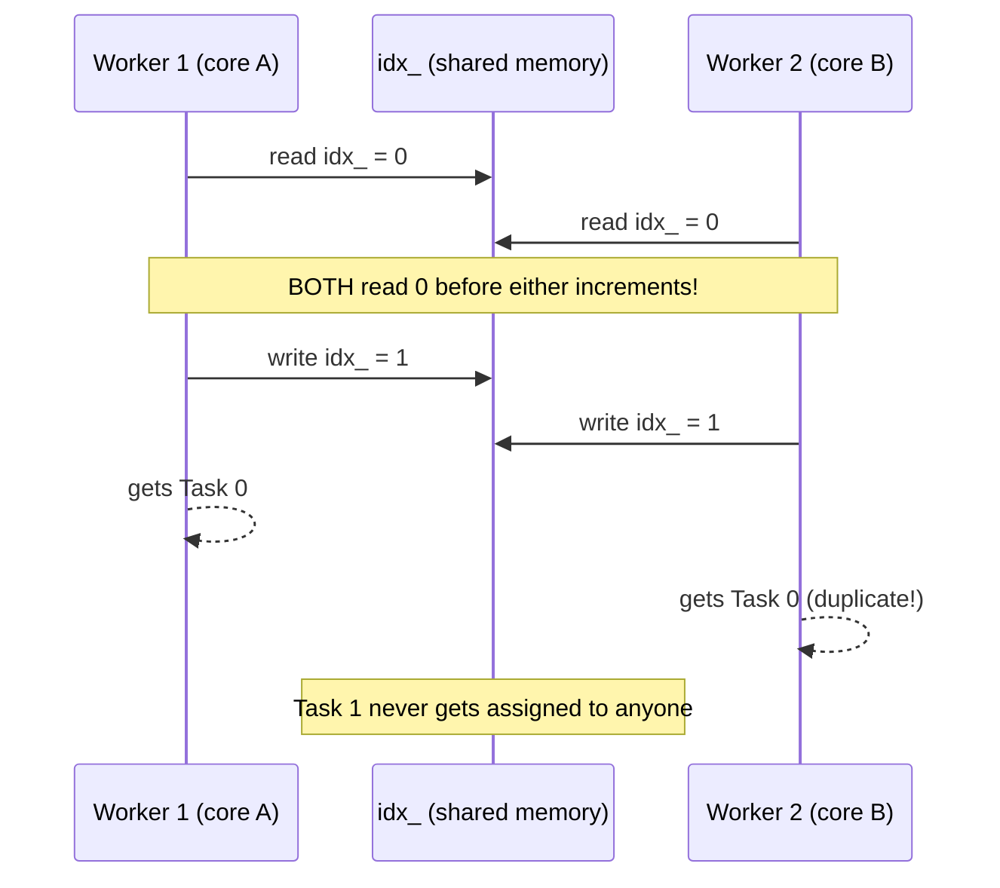

# C++ Multithreading Notes — Part 4: Fixing Uneven Workloads with a Work Queue

Continuation of the notes series. Part 3 identified the problem: static,
equal-sized chunks per worker fall apart when work is unevenly "heavy." This
part covers the **fix** — a shared work queue — and along the way, a real
race condition, a real bug, mutexes vs atomics, and a look at the actual
assembly instruction that makes atomics work.

---

## Step 1 — Recap: why static splitting fails

In Part 3's "stacked" scenario, each worker got a fixed, pre-assigned slice
of the chunk. If all the slow ("heavy") tasks land in one slice, that one
worker becomes the bottleneck while the others finish early and sit idle.

**The core insight for today:** the fix isn't to guess a better split ahead
of time (we usually can't know which tasks are heavy in advance) — it's to
stop pre-assigning work at all, and instead let every worker **pull** the
next available task whenever it's free.

---

## Step 2 — The queue idea



Instead of dividing the chunk into 4 fixed pieces upfront, **all workers
share the same array of tasks and a single shared index**. Whenever a worker
finishes a task, it goes back and asks for the next one. As long as tasks
remain, no worker sits idle for long — a slow worker just processes fewer
tasks overall, while faster ones naturally pick up the slack by pulling more.
This is the classic **producer/consumer queue** pattern, one of the most
fundamental concepts in multithreading.

**Important:** this changes what "unbalanced" means. It's no longer about
*which* tasks a worker was assigned — it's just about *how many* tasks each
worker manages to pull before the chunk's tasks run out. Fast workers
naturally do more; slow ones do less. Nobody is ever stuck being "the one
with all the heavy tasks."

---

## Step 3 — Redesigning `MasterControl` and `Worker`

Compared to Part 2/3's design, several things change:

| Old design (static split) | New design (queue) |
|---|---|
| Each `Worker` gets its own `std::span<Task>` via `SetJob()` | All workers share one `std::span<const Task> current_chunk_` living in `MasterControl` |
| Worker processes its whole span, then reports done | Worker calls `MasterControl::GetTask()` in a loop, processing one task at a time, until it gets `nullptr` |
| `bool dying` was the only flag | Now also needs a `working` flag, since a worker can be "awake but out of tasks" |

### `MasterControl` additions



- `SetChunk(chunk)` — called once per chunk by the main thread, stores the
  chunk and resets `idx_` back to `0`.
- `GetTask()` — called repeatedly by every worker. Returns a pointer to the
  next task and advances the index, or returns `nullptr` once the chunk is
  exhausted.

### `Worker` additions

- `StartWork()` — replaces `SetJob()`. Sets `working = true` and notifies —
  there's no data to hand over anymore, just a "go" signal.
- The main work loop (`Run_`) now looks like:

```cpp
while (working_ || dying_)   // wake up only if there's work to do, or dying
{
    if (dying_) break;

    while (const Task* p_task = p_master_->GetTask())
    {
        accumulation_ += p_task->Process();
        if (p_task->heavy) ++num_heavy_processed_;
    }

    working_ = false;   // ran out of tasks, go back to sleep
    p_master_->SignalDone();
}
```

Each worker just keeps pulling and processing tasks until `GetTask()` returns
`nullptr`, then reports itself done and goes back to sleep.

---

## Step 4 — The first (broken) version: no synchronization

The very first version of `GetTask()` looked like this — deliberately left
**unsynchronized** to demonstrate a real race condition:

```cpp
const Task* GetTask()
{
    if (idx_ >= current_chunk_.size()) return nullptr;
    return &current_chunk_[idx_++];   // <-- read AND increment, not atomic!
}
```

**Symptom:** running the program multiple times gave a **different final
result every time** — a dead giveaway that something is racing.

### Why this breaks — step by step

`return &current_chunk_[idx_++]` is really two separate operations:
1. Read `idx_`, use it to compute an address.
2. Increment `idx_`.

If two worker threads call `GetTask()` at nearly the same time, their two
operations can interleave badly:



**The damage, concretely:**
- Task 0 gets processed **twice** (wasted work, and its contribution gets
  double-counted in the sum — wrong final answer).
- Task 1 gets processed **zero** times (its contribution is missing —
  also a wrong final answer).
- `idx_` still ends up at the "correct" final count, so nothing *looks*
  broken from the index's perspective — but the actual results are corrupted.

This is precisely the kind of subtle bug the "chaotic math" choice (Part 3)
is designed to help expose — a duplicated/missing task visibly changes the
final sum instead of quietly averaging out.

---

## Step 5 — Fix #1: wrap it in a mutex

The simplest fix: make the read-and-increment **atomic** by protecting it
with a `std::mutex` and `std::lock_guard`, so no other thread can interleave
in the middle:

```cpp
const Task* GetTask()
{
    std::lock_guard<std::mutex> lock(mtx_);   // whole operation now indivisible
    if (idx_ >= current_chunk_.size()) return nullptr;
    return &current_chunk_[idx_++];
}
```

Now every run gives the **same, correct result** — no duplicated or skipped
tasks.

---

## Step 6 — Does the mutex slow things down? (measure, don't assume)

A common myth: "never use a mutex, it'll always tank performance." The
video actually measures this instead of guessing:

| Task size (iterations per task) | No sync (buggy) | With mutex |
|---|---|---|
| Large (light=100, heavy=1000) | ~1.1 s | ~1.09–1.1 s — **no meaningful difference** |
| Medium (light=2, heavy=30, more chunks) | ~8–9 ms | ~10 ms — mild ~20–25% overhead |
| (bug found — see Step 7) after fixing, large tasks again | ~1.1 s (unsynced) | ~1.0–1.09 s — **mutex version was actually about as fast, sometimes faster** |

**Key finding:** when individual tasks are reasonably large (which is the
realistic/common case — most real work items aren't tiny), the cost of
locking a mutex is *insignificant* compared to the actual work being done.
The mutex only becomes noticeably expensive when tasks are made artificially
tiny, so that grabbing the lock itself takes a comparable amount of time to
doing the actual work.

**Bonus finding:** the mutex version was sometimes *faster* than the
unsynchronized (buggy) version — because without synchronization, duplicated
tasks mean wasted redundant work; the mutex actually reduces total work done
by eliminating duplicates, even though it adds locking overhead.

**Practical takeaway:** default to a mutex. Only consider more complex
lock-free approaches if you've actually measured a real bottleneck with
genuinely small work items — don't reach for "lock-free" out of unearned
fear of mutexes.

---

## Step 7 — A real bug found along the way: forgetting to reset the index

While comparing chunk counts, the results looked suspiciously insensitive to
how many chunks were processed. The cause: `SetChunk()` (or wherever `idx_`
lives) **never reset `idx_` back to 0** for each new chunk.

**Effect:** only the *first* chunk was ever actually processed. For every
chunk after that, `idx_` was already past the end, so `GetTask()` immediately
returned `nullptr` for everyone — the workers reported "done" instantly
without doing any work, silently.

**Lesson:** this is exactly the kind of bug that's easy to miss because
nothing crashes and the program still produces *a* number — it just quietly
does far less work than intended. Always double check that per-iteration
state (like a shared index) is properly reset when starting a new round.

---

## Step 8 — Fix #2: lock-free with `std::atomic`

Since the only shared state being protected is a single `size_t` counter,
and the operation needed is just "read the current value and increment it,"
this is a great candidate for `std::atomic` instead of a mutex — no locking,
just a hardware-guaranteed atomic instruction.

```cpp
std::atomic<size_t> idx_ = 0;
```

The key operation is **`fetch_add`** — atomically reads the current value
*and* adds to it, as one indivisible step (this is what `idx_++` was trying
and failing to do safely before):

```cpp
const Task* GetTask()
{
    size_t i = idx_.fetch_add(1);   // atomically: "give me the old value, then add 1"
    if (i >= current_chunk_.size()) return nullptr;
    return &current_chunk_[i];
}
```

### A subtle mistake to avoid

An early attempt used the atomic value in **two separate places**:

```cpp
// WRONG — reads idx_ atomically in the comparison, then AGAIN in the indexing.
// Between those two reads, another thread could have changed it!
if (idx_.fetch_add(1) >= current_chunk_.size()) return nullptr;
return &current_chunk_[idx_];   // <-- BUG: re-reads idx_, possibly stale/changed
```

**The fix:** capture the fetched value into a local variable **once**, and
use that local copy everywhere:

```cpp
const Task* GetTask()
{
    const size_t i = idx_.fetch_add(1);   // fetch ONCE, store locally
    if (i >= current_chunk_.size()) return nullptr;
    return &current_chunk_[i];            // use the LOCAL copy, not idx_ again
}
```

**Lesson:** atomics only guarantee that *individual* operations (like a
single `fetch_add`) are indivisible. They do **not** make your whole function
atomic. If you read the atomic variable more than once, another thread can
change it in between reads — you have to fetch once and reuse that value.

### Performance result

With the fix, the atomic version measured roughly **2x faster** than the
mutex version, while still producing the correct, stable result every time
— because there's no OS-level locking involved, just a hardware instruction.

---

## Step 9 — What's actually happening at the hardware level

Looking at the disassembly (with inlining disabled so the operation is
visible), the atomic `fetch_add` compiles down to a single instruction:

```
lock xadd
```

- `xadd` = "exchange and add": atomically swaps the memory location's current
  value into a register **and** adds a value into that memory location, in
  one indivisible step.
- The `lock` prefix is what tells the CPU that this instruction must be
  synchronized across all cores — no other core can touch that memory
  location in the middle of this operation.

By contrast, an unsynchronized plain `size_t idx_; idx_++;` compiles to
**separate** load and store instructions:

```
load  idx_          ; read current value
add   1
store idx_          ; write back
```

Between the `load` and the `store`, another core is free to also `load` the
same (still-old) value — that gap is exactly where the race condition lives.
The `lock xadd` instruction has no such gap.

---

## Step 10 — Important caveats about atomics (don't over-apply this lesson)

The video is careful to add nuance here:

- This example is about as simple as lock-free programming gets — a single
  counter with one operation (`fetch_add`). Real lock-free data structures
  are usually **much** harder to get right, and easy to get subtly wrong
  without realizing it (as the "read it twice" bug above shows, even in this
  simple case).
- `std::atomic` operations take a **memory order** parameter (not covered in
  depth here) which affects how operations are allowed to be reordered
  around them — a topic that deserves its own dedicated treatment.
- For realistically-sized tasks (most real-world work items), the difference
  between a mutex and an atomic is **irrelevant** — the synchronization cost
  is tiny next to the actual work being done. Atomics only start to matter
  when synchronization happens very frequently relative to the amount of
  work per synchronization (e.g., tiny tasks, tight loops).
- **Don't reach for lock-free/atomics by default.** Reach for a mutex first;
  it's simpler, harder to get wrong, and usually just as fast where it
  matters. Only consider atomics/lock-free after measuring a real bottleneck.

---

## Step 11 — Practice Code: Queue-Based Worker Pool (both versions)

Below is a self-contained reconstruction with **both** a mutex-protected
queue and an atomic-based queue, selectable at compile time, so you can
benchmark them yourself exactly like the video does.

```cpp
// queue_worker_pool_demo.cpp
// Compile (g++):  g++ -std=c++20 -O2 -pthread queue_worker_pool_demo.cpp -o queue_demo
//
// Usage:
//   ./queue_demo mutex     -> use std::mutex + lock_guard for the shared index
//   ./queue_demo atomic    -> use std::atomic<size_t>::fetch_add for the shared index
//   ./queue_demo racy      -> NO synchronization at all (reproduces the bug on purpose!)

#include <array>
#include <atomic>
#include <chrono>
#include <cmath>
#include <condition_variable>
#include <cstring>
#include <iostream>
#include <memory>
#include <mutex>
#include <random>
#include <span>
#include <vector>

// ---------------- Experiment settings ----------------
constexpr size_t worker_count = 4;
constexpr size_t chunk_size = 2000;
constexpr size_t chunk_count = 100;
constexpr size_t light_iterations = 100;
constexpr size_t heavy_iterations = 1000;
constexpr double probability_heavy = 0.02;

enum class SyncMode { Mutex, Atomic, Racy };

// ---------------- Task ----------------
struct Task
{
    double value = 0.0;
    bool heavy = false;

    double Process() const
    {
        const auto iterations = heavy ? heavy_iterations : light_iterations;
        double x = value;
        for (size_t i = 0; i < iterations; ++i)
        {
            x = std::sin(std::cos(x));
        }
        return x;
    }
};

using Chunk = std::array<Task, chunk_size>;

std::vector<Chunk> GenerateDataSet()
{
    std::vector<Chunk> chunks;
    chunks.reserve(chunk_count);
    std::mt19937 rng{ 1337 };
    std::uniform_real_distribution<double> v_dist{ 0.0, 3.14159265358979 };
    std::bernoulli_distribution h_dist{ probability_heavy };

    for (size_t c = 0; c < chunk_count; ++c)
    {
        Chunk chunk;
        for (auto& t : chunk)
        {
            t.value = v_dist(rng);
            t.heavy = h_dist(rng);
        }
        chunks.push_back(chunk);
    }
    return chunks;
}

class Timer
{
public:
    void Mark() { start_ = std::chrono::steady_clock::now(); }
    double Peek() const
    {
        return std::chrono::duration<double>(
                   std::chrono::steady_clock::now() - start_)
            .count();
    }
private:
    std::chrono::steady_clock::time_point start_ = std::chrono::steady_clock::now();
};

// ---------------- MasterControl (queue-based) ----------------
class MasterControl
{
public:
    explicit MasterControl(SyncMode mode) : mode_(mode) {}

    void SetChunk(std::span<const Task> chunk)
    {
        current_chunk_ = chunk;
        idx_ = 0; // CRITICAL: reset per chunk (Step 7's bug, fixed here!)
    }

    // Returns nullptr once the chunk is exhausted.
    const Task* GetTask()
    {
        switch (mode_)
        {
        case SyncMode::Mutex:
        {
            std::lock_guard<std::mutex> lock(idx_mtx_);
            if (idx_ >= current_chunk_.size()) return nullptr;
            return &current_chunk_[idx_++];
        }
        case SyncMode::Atomic:
        {
            const size_t i = atomic_idx_.fetch_add(1); // fetch ONCE, reuse locally
            if (i >= current_chunk_.size()) return nullptr;
            return &current_chunk_[i];
        }
        case SyncMode::Racy:
        default:
        {
            // Deliberately broken -- reproduces the race condition on purpose.
            if (idx_ >= current_chunk_.size()) return nullptr;
            return &current_chunk_[idx_++];
        }
        }
    }

    void SignalDone()
    {
        bool notify = false;
        {
            std::lock_guard<std::mutex> lg(done_mtx_);
            ++done_count_;
            notify = (done_count_ == worker_count);
        }
        if (notify) done_cv_.notify_one();
    }

    void WaitForAllDone()
    {
        done_cv_.wait(done_lock_, [this] { return done_count_ == worker_count; });
        done_count_ = 0;
    }

private:
    SyncMode mode_;

    std::span<const Task> current_chunk_;
    size_t idx_ = 0;                  // used by Mutex and Racy modes
    std::mutex idx_mtx_;
    std::atomic<size_t> atomic_idx_{0}; // used by Atomic mode

    std::condition_variable done_cv_;
    std::mutex done_mtx_;
    std::unique_lock<std::mutex> done_lock_{ done_mtx_ };
    size_t done_count_ = 0;
};

// ---------------- Worker ----------------
class Worker
{
public:
    explicit Worker(MasterControl* p_master)
        : p_master_(p_master), thread_(&Worker::Run_, this)
    {
    }

    void StartWork()
    {
        {
            std::lock_guard<std::mutex> lg(mtx_);
            working_ = true;
            num_heavy_processed_ = 0;
        }
        cv_.notify_one();
    }

    void Kill()
    {
        {
            std::lock_guard<std::mutex> lg(mtx_);
            dying_ = true;
        }
        cv_.notify_one();
    }

    double GetResult() const { return accumulation_; }
    size_t GetNumHeavyProcessed() const { return num_heavy_processed_; }

private:
    void Run_()
    {
        std::unique_lock<std::mutex> lock(mtx_);
        while (true)
        {
            cv_.wait(lock, [this] { return working_ || dying_; });
            if (dying_) break;

            // Pull tasks from the shared queue until it's exhausted.
            while (const Task* p_task = p_master_->GetTask())
            {
                accumulation_ += p_task->Process();
                if (p_task->heavy) ++num_heavy_processed_;
            }

            working_ = false;
            p_master_->SignalDone();
        }
    }

    MasterControl* p_master_;
    std::condition_variable cv_;
    std::mutex mtx_;
    double accumulation_ = 0.0;
    size_t num_heavy_processed_ = 0;
    bool working_ = false;
    bool dying_ = false;
    std::jthread thread_; // last, so mtx_/cv_ exist before thread starts
};

double RunExperiment(std::vector<Chunk>& chunks, SyncMode mode)
{
    MasterControl mctrl(mode);
    std::vector<std::unique_ptr<Worker>> workers;
    workers.reserve(worker_count);
    for (size_t i = 0; i < worker_count; ++i)
    {
        workers.push_back(std::make_unique<Worker>(&mctrl));
    }

    Timer timer;
    for (auto& chunk : chunks)
    {
        mctrl.SetChunk(std::span<const Task>(chunk));
        for (auto& w : workers) w->StartWork();
        mctrl.WaitForAllDone();
    }
    double elapsed = timer.Peek();

    double answer = 0.0;
    for (auto& w : workers) answer += w->GetResult();

    for (auto& w : workers) w->Kill();
    workers.clear();

    std::cout << "Elapsed: " << elapsed << "s  Result: " << answer << "\n";
    return elapsed;
}

int main(int argc, char** argv)
{
    using namespace std::string_literals;
    SyncMode mode = SyncMode::Mutex;
    if (argc > 1)
