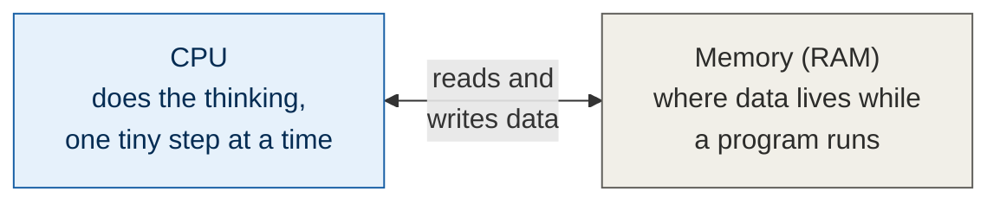
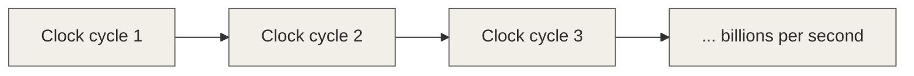
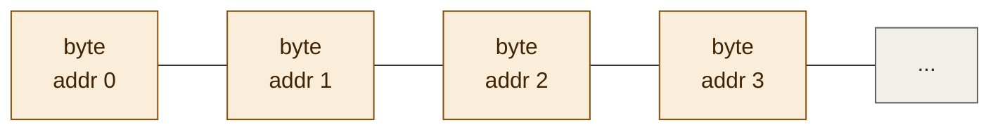
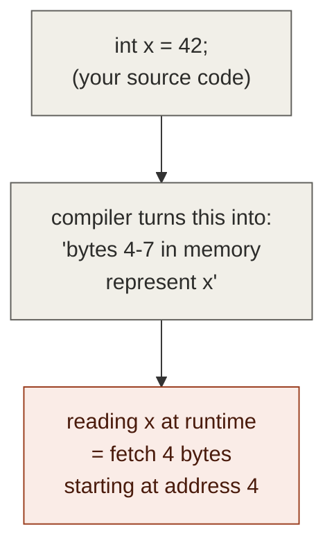
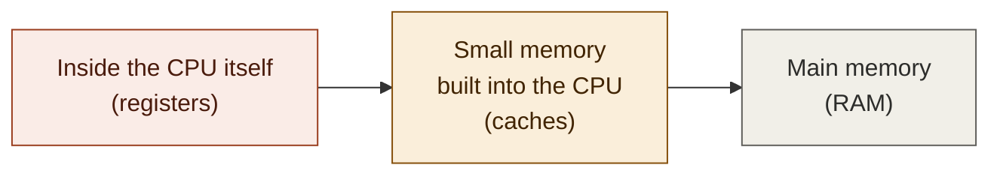
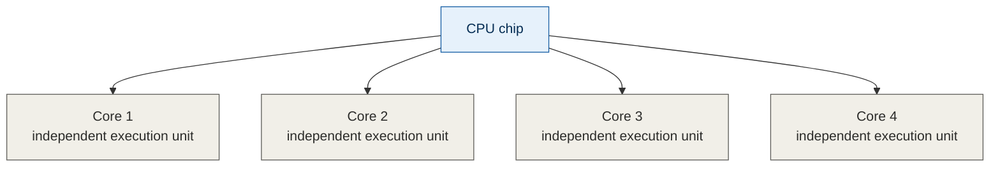

# Zero to pro: absolute basics — foundations notes (0 of 4)

**Series:** Computer architecture foundations, written to fully understand
false sharing (the topic of multithreading video 5). This part assumes
zero prior hardware knowledge and builds up just enough vocabulary that
parts 1-4 (which use real technical terms like "cycle," "cache line," and
"coherency protocol") make sense on first read.
**Status:** Conceptual, no code

---

## 1. What a computer actually is, physically

Strip away everything else and a computer doing work is really just two
things talking to each other, constantly:

- **The CPU (processor)** — the part that does the thinking. It can only
  do very small, very simple operations: add two numbers, compare two
  numbers, move a number from one place to another. That's basically it.
  Everything complex your code does is built out of millions of these
  tiny operations happening very fast, one after another.
- **Memory (RAM)** — the part that stores data while a program is
  running. The CPU itself can only hold a tiny amount of data internally
  at any moment (see "registers" below), so anything bigger — your
  variables, arrays, objects — lives out in memory, and the CPU has to
  go fetch it when it needs it and send it back when it's done.

That fetch-and-send-back relationship between CPU and memory is the
single most important thing to understand before any of the later parts
in this series. Almost everything about performance and multithreading
correctness comes back to "how fast can the CPU get data out of memory,
and what happens when more than one CPU core wants the same piece of
memory at the same time."

## 2. What a "cycle" is

A CPU doesn't do things continuously — it does things on a beat, like a
metronome. Each tick of that beat is called a **clock cycle**, or just a
**cycle**. On every tick, the CPU can advance its work by one small step
(this is a simplification — modern CPUs can actually do several small
things per tick, but "one step per tick" is the right mental model for
now).

A CPU's clock speed — the number you see in a spec sheet, like
"3.5 GHz" — is just *how many of these ticks happen per second*.
3.5 GHz means 3.5 billion ticks every second. So when you later see a
number like "this operation takes 200 cycles," that's not an abstract
unit — it's literally "the CPU had to wait through 200 of these ticks
before it could continue," and at billions of ticks per second, that's
still an almost unimaginably short slice of real time — but it's *200
times longer* than an operation that only takes 1 tick. The ratio between
numbers is what matters, more than the absolute time.

**Why this matters for what's coming:** in part 1, you'll see a table
where reading from a CPU register takes about 1 cycle, but reading from
main RAM takes about 200 cycles. That's not a rounding error — that's
the CPU sitting idle for 200 ticks of its own clock, doing nothing, just
waiting for data to arrive. That gap is the entire reason caches exist.

## 3. What a "byte" and an "address" are

Memory isn't one big undivided blob — it's organized as a long row of
small, individually-numbered storage slots.

- A **byte** is the smallest unit of memory that can be individually
  addressed. It holds 8 bits (a bit is a single 0-or-1 value). You don't
  need to think in bits for this series — just know that "byte" is the
  basic building block, and most things you care about (an integer, a
  character) are made of a small number of bytes glued together.
- An **address** is just the position number of a byte in memory — like
  a house number on a very long street. Address 0 is the first byte,
  address 1 is the next one, and so on. When the CPU wants to read or
  write some piece of data, it does so by address: "go to address 1000
  and give me what's there."

A variable in your source code — `int x = 42;` — is, underneath
everything, just a label your compiler uses for "start at this
particular address, and the value stored there is 4 bytes long" (an
`int` is commonly 4 bytes). When your code reads `x`, what actually
happens at the hardware level is: the CPU is told an address, and it
goes and fetches the bytes stored starting there.

This is the idea you'll need most going forward: **a variable is not a
special, protected thing — it's just a name for "some bytes at some
address."** That fact, that ordinary variables are literally just bytes
sitting at addresses next to other variables' bytes, is the seed of
*everything* in part 4 (false sharing) — two completely unrelated
variables can end up sitting at neighboring addresses, with
consequences neither programmer intended.

## 4. What "fast" and "slow" mean here

You don't need exact real-world time units (nanoseconds, etc.) to follow
this series — what matters is *relative* speed: how many times slower is
one thing than another. Keep this ordering in your head; it's the
skeleton that part 1's actual numbers will hang on:

Each step to the right is slower to access but holds more data — that's
the trade-off the rest of this series explores. Part 1 puts real cycle
counts on each of these steps and explains why the hierarchy is shaped
this way instead of being one single memory tier.

## 5. What "core" means, briefly

Modern CPUs usually contain more than one independent processing unit,
each able to execute instructions on its own — these are called **cores**.
A "4-core CPU" can, roughly, do four separate streams of work truly
simultaneously, rather than one stream at a time. This is what makes
multithreading (running several threads of your program at once) able to
provide a real speedup — each thread can run on its own core, genuinely
in parallel, not just taking turns.

This matters for the rest of the series because once you have *multiple*
cores, each potentially with its own small private memory (its own
cache), you get a new problem that doesn't exist with a single core: what
happens when two cores both want to read or write the *same* piece of
memory at the *same* time? That question is what part 3 (cache
coherency) and part 4 (false sharing) are entirely about.

## 6. Glossary so far

| Term | Plain-English meaning |
|---|---|
| CPU / processor | The chip that executes your program's instructions, one tiny step at a time |
| Core | An independent execution unit inside a CPU; multiple cores = multiple things can truly run at once |
| Memory / RAM | Where your program's data is stored while it runs, separate from the CPU itself |
| Cycle / clock cycle | One "tick" of the CPU's internal clock; the basic unit of time the CPU operates in |
| Clock speed | How many cycles happen per second (e.g. 3.5 GHz = 3.5 billion cycles/sec) |
| Byte | The smallest individually-addressable chunk of memory, 8 bits |
| Bit | A single 0-or-1 value; 8 bits make a byte |
| Address | The position number of a byte in memory, used to locate it |
| Variable (at the hardware level) | Just a compiler-assigned name for "some number of bytes starting at some address" |

## 7. What's next

With this vocabulary in place, **part 1** picks up the "fast vs. slow"
idea from section 4 and puts real numbers on it: actual cycle counts for
registers, L1/L2/L3 cache, and RAM, and an explanation for *why* the
hierarchy has multiple tiers instead of one big fast memory. From there,
**part 2** zooms into how data physically moves between RAM and cache
(the "cache line" concept), **part 3** covers what happens when multiple
cores access the same memory (cache coherency), and **part 4** uses all
of that to explain false sharing — the actual phenomenon from
multithreading video 4.
