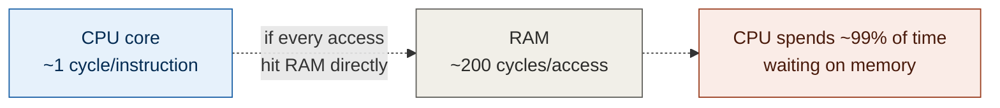
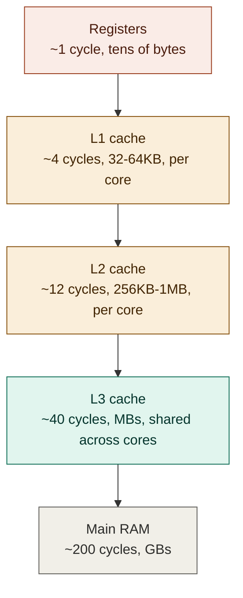
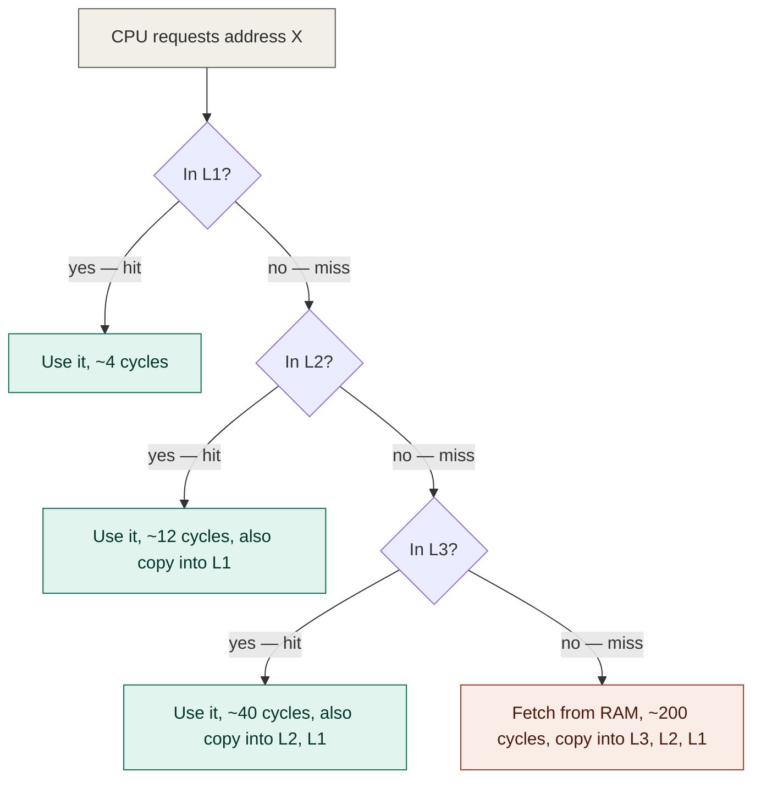
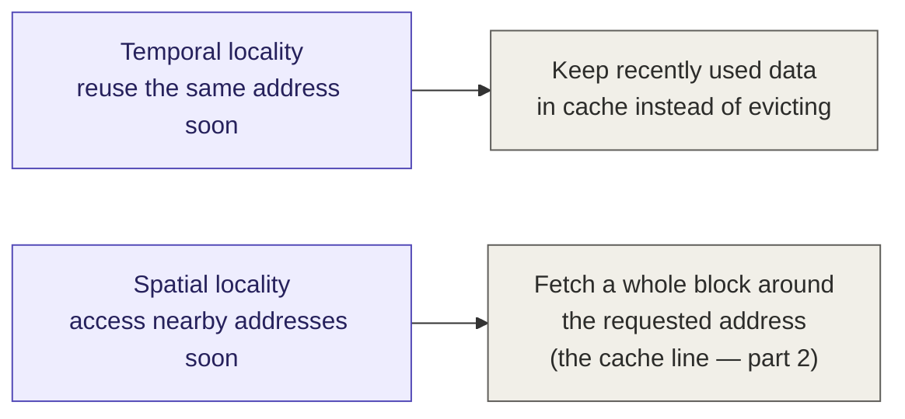

# Memory hierarchy: why caches exist — foundations notes (1 of 4)

**Series:** Computer architecture foundations, written to fully understand
false sharing (the topic of multithreading video 5). This part covers the
memory hierarchy in general — no threads yet.
**Status:** Conceptual, no code

---

## 1. The problem caches solve

A modern CPU core can execute an instruction in roughly **1 cycle**. A
single access to main RAM takes roughly **200 cycles**. If every memory
access actually went all the way to RAM, the CPU would spend the
overwhelming majority of its time just *waiting*, no matter how fast its
execution units are.

This gap is the entire reason caches exist. They are not an optimization
bolted on as an afterthought — they are load-bearing for a modern CPU to
be useful at all.

## 2. The hierarchy, level by level

| Level | Typical latency | Typical size | Scope |
|---|---|---|---|
| Registers | ~1 cycle | Tens of bytes | Per core, directly addressed by instructions |
| L1 cache | ~4 cycles | 32-64KB | Per core (often split: L1i for instructions, L1d for data) |
| L2 cache | ~12 cycles | 256KB-1MB | Per core (sometimes shared by a pair) |
| L3 cache | ~40 cycles | A few MB to tens of MB | Shared across all cores on the chip |
| Main RAM | ~200 cycles | GBs | Shared, off-chip |

**The pattern, every step down:** size goes up by roughly an order of
magnitude, latency goes up by roughly 3-5x, and what's visible to that
level shrinks from "this core only" (registers, L1, L2) to "every core on
the chip" (L3, RAM). That last shift — going from *private per-core*
storage to *shared* storage — is the seed of the whole cache-coherency
problem covered in part 3.

**Numbers vary by CPU generation/vendor** — treat the table as
order-of-magnitude intuition, not a spec sheet for any particular chip.

## 3. Why this hierarchy is shaped like a pyramid, not a single big fast memory

You might ask: why not just make all of RAM as fast as L1? Two physical
reasons:

1. **Speed and size trade off directly in SRAM/circuit design.** The
   circuitry that makes L1 fast (more transistors per bit, shorter wire
   distances to the core) is also what makes it expensive and physically
   large per byte stored. You cannot have multi-gigabyte capacity at L1
   speed with current technology economics — it would be enormous and
   extremely expensive.
2. **Physical distance costs time.** Even at the speed of light/signal
   propagation in copper, a memory bank physically farther from the core
   takes measurably longer to respond. L1 is built *into* the core. RAM
   sits on separate chips, connected over a bus. That physical distance
   alone adds latency, independent of the memory technology used.

So instead of one tier, you get a pyramid: a tiny amount of very fast
storage right next to the execution units, progressively larger and
slower tiers as you move away, with RAM as the big slow tier at the
bottom (and disk, further still, several orders of magnitude slower yet
— not pictured above since it's outside the scope of false sharing, but
worth knowing it's there).

## 4. How the hierarchy is actually used (the request path)

When the CPU needs to read a memory address, it doesn't go straight to
RAM. It checks the levels in order, fastest first:

A successful lookup at any level is called a **hit**; failing to find the
data and having to check the next level down is a **miss**. Every miss
that eventually resolves (even all the way from RAM) results in the data
being **copied upward** into the faster levels it passed through, on the
expectation you'll likely want it again soon.

## 5. Why caching works at all — locality

Caching is only worth doing because real programs exhibit **locality**:
predictable patterns in what memory they access.

- **Temporal locality** — if you accessed an address recently, you're
  likely to access it again soon. (Example: a loop counter, read and
  written every iteration.)
- **Spatial locality** — if you accessed an address, you're likely to
  soon access addresses *near* it. (Example: iterating over an array —
  element 5 is immediately followed by element 6.)

These two properties are *why* caching is a profitable strategy rather
than a coin flip. Temporal locality justifies keeping recently-used data
around instead of evicting it immediately. Spatial locality is the direct
motivation for the next part of this series: instead of fetching exactly
the one byte/int you asked for, the hardware fetches a whole contiguous
block around it — because spatial locality says you'll probably want the
neighbors too. That block is called a **cache line**, and it's the unit
this entire series is building toward (false sharing is, at its core, a
cache-line problem).

## 6. Glossary so far

| Term | Meaning |
|---|---|
| Cache hit | Requested data found at this cache level — fast path |
| Cache miss | Requested data not found at this level — must check the next, slower level |
| Latency | Time between requesting data and having it available to use |
| Temporal locality | Tendency to re-access the same address soon after accessing it |
| Spatial locality | Tendency to access nearby addresses soon after accessing one |
| SRAM | The faster, more expensive memory technology used for caches (vs. DRAM used for main RAM) |

## 7. What's next

This part covered the *vertical* axis — why there are multiple tiers
between the core and RAM at all. Part 2 zooms into **one tier** and asks:
when something does get fetched from RAM into cache, exactly how much
data moves, and why is it fetched in a fixed-size block called a "cache
line" rather than exactly the bytes requested? That's the direct setup
for understanding why two *unrelated* variables can end up fighting over
the same line of cache — which is the mechanism behind false sharing.
