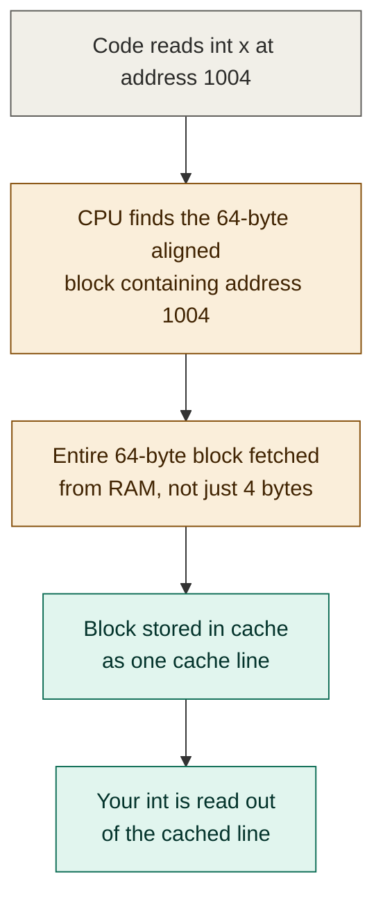
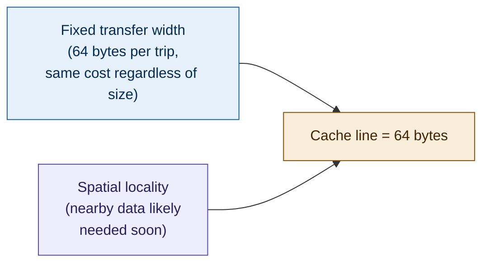
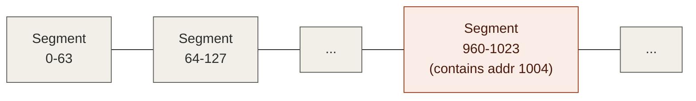
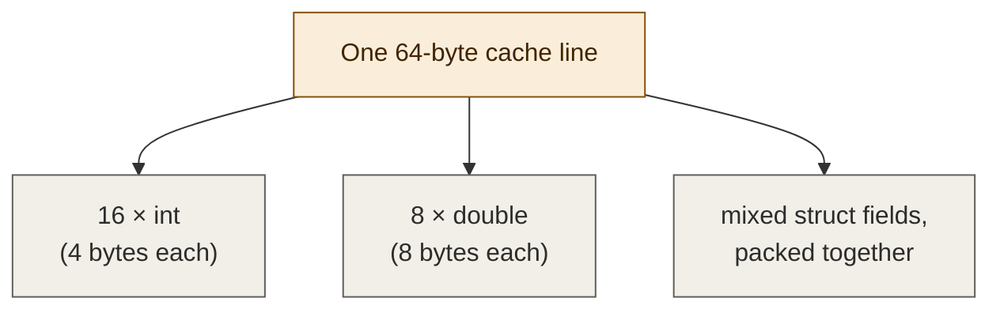

# Cache lines in detail — foundations notes (2 of 4)

**Series:** Computer architecture foundations, written to fully understand
false sharing (the topic of multithreading video 5).
**Builds on:** Part 0 (bytes, addresses, cycles), Part 1 (the memory
hierarchy, locality)
**Status:** Conceptual, no code

---

## 1. The question this part answers

Part 1 established that spatial locality — if you access one address,
you'll likely access nearby ones soon — is *why* caching prefetches more
than what was strictly asked for. This part answers the obvious follow-up:
**how much more, exactly, and why that specific amount?**

The answer is a fixed-size chunk called a **cache line** (sometimes
"cache block"). On most modern CPUs, that size is **64 bytes**. This
single fact — 64 bytes, always, no matter what you asked for — is the
fact that everything in part 4 (false sharing) hangs on.

## 2. What actually happens when you read one `int`

Say your code does `int x = data[3];` and that triggers a cache miss
(part 1's term — the data isn't in cache yet, so it has to come from
RAM). You might picture the hardware reaching into RAM and pulling out
exactly the 4 bytes that make up that one `int`. **That is not what
happens.**

Instead:
1. The CPU computes which 64-byte-aligned block of memory contains that
   `int`'s address.
2. The *entire* 64-byte block is transferred from RAM to cache — not
   just your 4 bytes.
3. The block, called a **cache line**, is stored as one unit in the
   cache.
4. Your `int` is read out of that cached line.

## 3. Why 64 bytes specifically — two independent reasons

### Reason 1: the physical width of the connection
The hardware path between RAM and the CPU (and between cache levels) is
physically built to move a fixed number of bytes per transfer — its
"width." On most modern CPUs that width is 64 bytes. Critically:
**transferring 4 bytes over this path takes the same amount of time as
transferring all 64**, because the limiting factor isn't the amount of
data, it's the fixed overhead of doing a transfer at all (think of it
like a delivery truck that costs the same to dispatch whether it's
carrying one box or a full load — you fill the truck because the trip
itself is the expensive part, not the cargo).

### Reason 2: spatial locality (from part 1) says it's worth it
Since nearby addresses are likely to be accessed soon anyway, fetching
the surrounding 60 bytes "for free" (same transfer cost as fetching just
4) is a good bet almost all the time. Iterate over an array, and this
pays off constantly — element 0 being fetched also fetches elements 1
through 15 (for 4-byte ints), so the next several loop iterations are
already cache hits before you even ask.

## 4. Cache lines are aligned, not arbitrary

A subtlety worth being precise about: the 64-byte chunk fetched isn't
"the 64 bytes starting at the address you asked for." It's the 64-byte
block that address *falls inside*, where blocks are laid out starting
from address 0 in fixed 64-byte segments (addresses 0-63, 64-127,
128-191, and so on). This is what "aligned" means here.

So if you ask for the `int` at address 1004, the CPU doesn't fetch bytes
1004-1067 — it fetches whichever fixed 64-byte segment contains address
1004 (in this example, that'd be addresses 960-1023, assuming segments
align on multiples of 64). Your requested bytes might be anywhere inside
that segment — start, middle, or end — not necessarily at its beginning.

**This is the detail that matters most for part 4.** Because lines are
fixed, aligned segments — not "64 bytes around whatever you asked for" —
*any two variables that happen to land inside the same aligned 64-byte
segment* get fetched and cached together as a single unit, completely
regardless of whether your program treats them as related. The hardware
has no concept of "these are two different variables." It only knows
about lines.

## 5. How much fits in one line

64 bytes holds, for example:
- 16 `int`s (4 bytes each)
- 8 `double`s (8 bytes each)
- A handful of small struct fields, packed together

So in practice, several "neighboring" variables in your program — array
elements, adjacent struct fields, even separate global/static variables
that happen to be laid out near each other by the compiler — very
commonly share a single cache line without you ever writing code that
groups them together.

## 6. Why this matters going forward

Part 1 covered the *vertical* dimension: data moves down toward the CPU
through several tiers, each faster and smaller than the last. This part
covered the *horizontal* dimension: at every tier, data doesn't move one
variable at a time — it moves in fixed 64-byte aligned chunks, regardless
of how your program's variables are logically grouped.

Both of these facts are still about a **single core** working with cache
on its own. Neither one yet explains why *multiple* cores sharing memory
causes problems — that's the missing piece, and it's exactly what part 3
covers: once more than one core can have its own cached copy of the same
line, what keeps those copies honest with each other?

## 7. Glossary added this part

| Term | Plain-English meaning |
|---|---|
| Cache line / cache block | The fixed-size chunk (typically 64 bytes) that's transferred and cached as one unit, every time |
| Bus width | The fixed amount of data a hardware connection moves per transfer, regardless of how much was actually requested |
| Aligned | Cache lines are laid out in fixed positions starting from address 0 (0-63, 64-127, ...) — not "centered" on whatever address you asked for |

## 8. What's next

Part 3 introduces multiple cores into the picture and covers **cache
coherency**: the hardware-level mechanism that keeps each core's private
cached copy of a line consistent with what every other core sees, even
when one of them writes to it. That mechanism — and what triggers it —
is the direct cause of the slowdown observed in multithreading video 4,
and is the last piece needed before part 4 can fully explain false
sharing.
