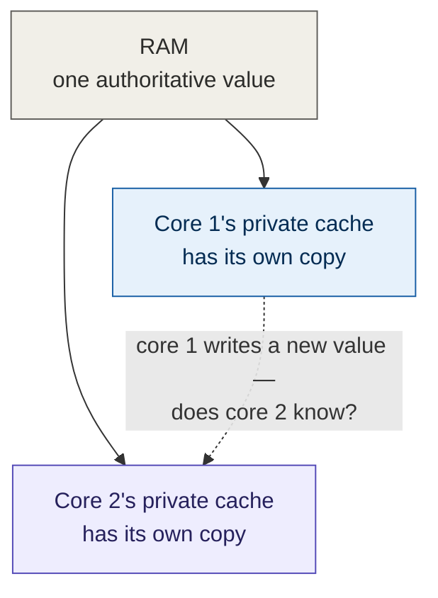
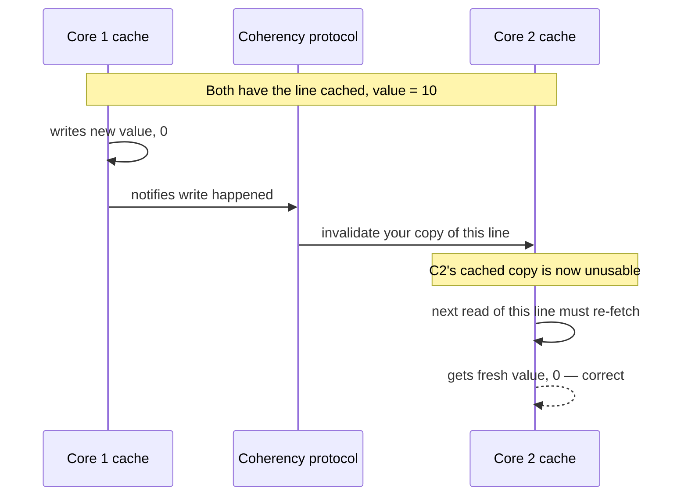
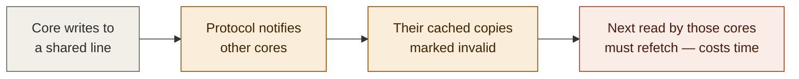
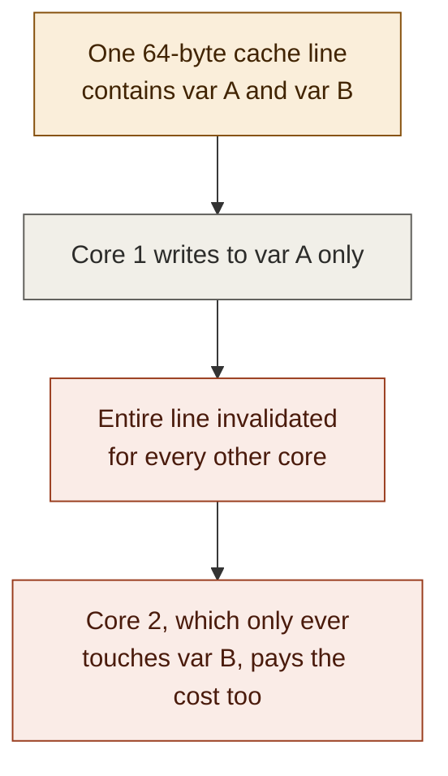

# Multi-core cache coherency — foundations notes (3 of 4)

**Series:** Computer architecture foundations, written to fully understand
false sharing (the topic of multithreading video 5).
**Builds on:** Part 0 (basics), Part 1 (memory hierarchy), Part 2 (cache
lines, 64-byte aligned blocks)
**Status:** Conceptual, no code

---

## 1. The new problem this part introduces

Parts 1 and 2 described caching as if there were only one core involved.
But a real CPU has multiple cores (part 0, section 5), and — important
detail — **each core typically has its own private L1 and L2 cache** (part
1's table). Only L3 is shared across all cores.

That means the same 64-byte cache line (part 2) can end up **copied into
more than one core's private cache at the same time.** And that creates a
real question: if core 1 writes a new value into its copy, but core 2
still has the *old* value sitting in its own private cache, what stops
core 2 from reading stale data?

If nothing handled this, you'd get genuinely broken behavior: one core
writes a value, another core reads the same memory location moments
later and gets a value that's already out of date — not because of any
bug in your code, but purely because of *where the data happened to be
cached*. That would make multi-core CPUs unusable for anything
correctness-sensitive. So hardware has to solve this, and it does, fully
automatically, with no code from you required.

## 2. The guarantee: cache coherency

CPU designers guarantee something called **cache coherency**: if one
core writes to a memory location, that write becomes visible to every
other core that subsequently reads that location — even if other cores
have their own private cached copies. From software's point of view, it
*must* look as if there's exactly one copy of memory, even though
physically there are several cached copies scattered across cores.

This guarantee is enforced by a **coherency protocol** running
permanently in hardware, watching every core's cache traffic.

## 3. How it actually works — invalidation

The mechanism most modern CPUs use, in simplified form:

1. Multiple cores can each hold their own cached copy of the same line,
   as long as none of them is writing to it (just reading is safe — a
   stale read of an unchanged value isn't actually stale).
2. The moment **any core writes** to that line, the coherency protocol
   sends a signal to every other core that also has that line cached:
   "your copy is now invalid, throw it away."
3. If one of those other cores tries to read that location again, its
   cache no longer has a valid copy — so it has to fetch the fresh value
   again (potentially from the writing core's cache, or from a shared
   level like L3, or from RAM, depending on the exact protocol and
   situation).

This is exactly the behavior Chili described as "a kind of lock that is
happening at the hardware side" and "synchronization that you don't
write in your code." It's a real, literal protocol — commonly called
**MESI** (Modified / Exclusive / Shared / Invalid — the names of the
states a cached line can be in) or a variant of it — running
automatically on essentially every modern multi-core CPU. You don't
configure it, disable it, or even see it directly; it's just always
there, keeping cores honest with each other.

## 4. The cost: this protocol is not free

Here's the part that connects directly to performance. Every time this
invalidate-and-refetch sequence happens, it costs real time — comparable
to or worse than a normal cache miss (part 1, part 2), because it
involves cross-core communication, not just a local cache lookup.

**The key insight, and the one that sets up part 4:** this invalidation
happens at the **granularity of an entire cache line**, not at the
granularity of an individual variable. The protocol doesn't know or care
that the line contains "your variable A" and "my unrelated variable B."
It only knows "this 64-byte line was written to" — so it invalidates the
*whole line* for every other core that has it cached, even if those
other cores only ever touch a completely different variable that just
happens to live in the same line.

This is the precise mechanism behind one of the two "elephants in the
room" from multithreading video 3, and it's why, in video 4, even the
version with **no mutex at all** — four threads, four completely separate
sum variables, no synchronization in the code whatsoever — was still
unexpectedly slow. The variables were unrelated in the program's logic,
but if they were laid out close enough together in memory to land on the
same cache line, the *hardware* treated writes to any one of them as a
reason to invalidate the whole line for every core holding it. That's
**false sharing**, and part 4 covers it directly, in full, using
everything built up across parts 0-3.

## 5. Why this is invisible in your source code

Nothing about this appears anywhere in C++ (or any language) syntax.
There's no keyword for "this line is being invalidated." The entire
mechanism lives below the level your program can see or control — it's
a property of the physical hardware your compiled code happens to run
on. This is exactly why it's so easy to miss as a programmer: your code
can look completely correct and completely free of explicit
synchronization, and still be slow for reasons that only make sense once
you know this protocol exists.

## 6. Glossary added this part

| Term | Plain-English meaning |
|---|---|
| Cache coherency | The guarantee that all cores see a consistent, up-to-date view of memory, even though each may have its own cached copy |
| Coherency protocol | The hardware mechanism (e.g. MESI) that enforces coherency by tracking and invalidating stale cached copies automatically |
| Invalidation | Marking a cached copy of a line as unusable because another core wrote to that line, forcing a refetch on next access |
| MESI | A common name for one family of coherency protocols; the letters name the states a cached line can be in (Modified, Exclusive, Shared, Invalid) |

## 7. What's next

Part 4 puts all four pieces together: bytes and addresses (part 0), the
memory hierarchy (part 1), fixed-size 64-byte aligned cache lines (part
2), and the per-line invalidation cost of cache coherency (part 3) — to
fully explain **false sharing**: how two threads writing to two
*completely unrelated* variables can still slow each other down, purely
because of where those variables happened to land in memory, and how
padding the data structure (as shown in the actual video) fixes it by
forcing each variable onto its own cache line.
