# Chapter 1 — Hardware Foundations & Cache Coherency

## code - https://github.com/a-ZINC/MultiThread/commit/10636aee951da2bdc8e51b8048e4929e5c337cf7

**Goal of this chapter:** before you write a single `std::atomic`, you need a picture in
your head of the actual physical machine your code runs on, deep enough that later,
when you read a line of atomic C++, you can trace it all the way down to bus traffic
between cores without me holding your hand. This chapter goes further than "here are
four cache levels" — by the end you should be able to look at a `fetch_add` call, know
which x86 instruction it becomes, and know exactly what that instruction forces the
hardware interconnect to do.

Every mermaid diagram in this file renders on GitHub, in VS Code, in Obsidian, and in
most markdown viewers — so this file stays useful as a permanent reference outside this
chat too.

---

## 1.1 The machine is not "a CPU and some RAM"

Textbooks draw this:

```
CPU  <---->  Memory
```

That picture actively misleads you about concurrency. The real machine has many
independent execution engines, each with its own private, fast scratchpad, all
funneling down to one shared, slow pool of memory:

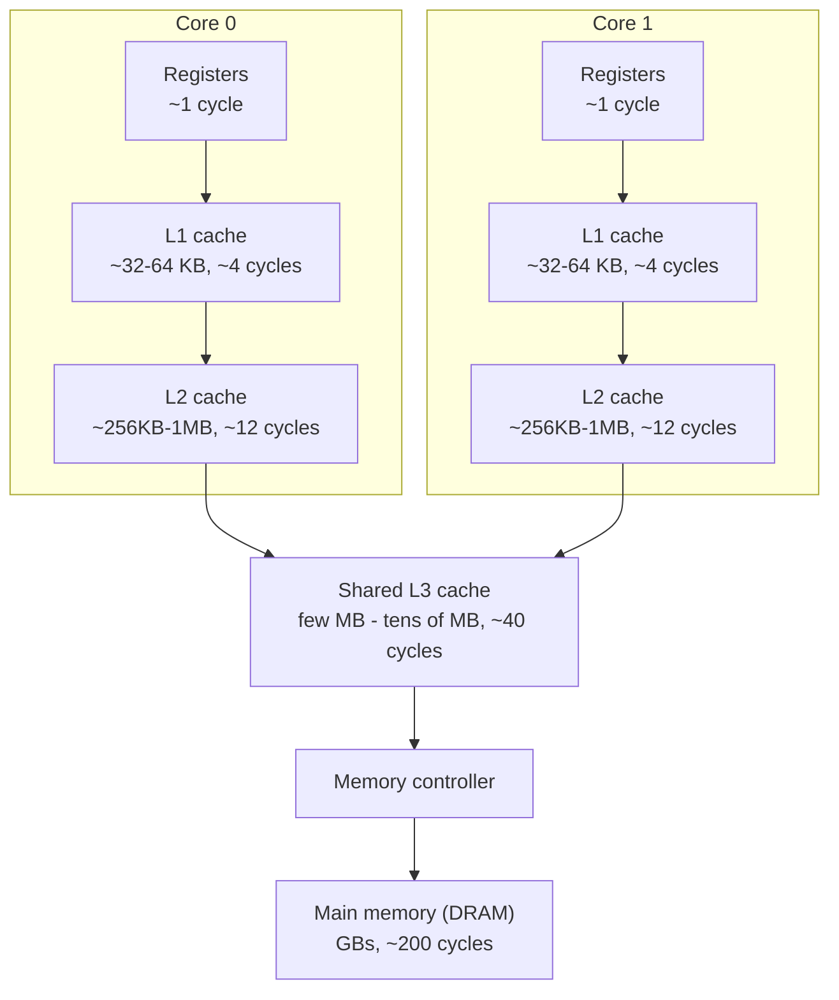

Numbers worth memorizing — not the exact cycle counts (they vary by CPU generation),
but the **ratios**, because the ratios are what drive every design decision in this
course:

| Level | Latency | Shared by | Rough size |
|---|---|---|---|
| Register | ~1 cycle | nobody, it's yours | a handful of values |
| L1 | ~4 cycles | one core | 32-64 KB |
| L2 | ~12 cycles | one core (sometimes 2) | 256 KB - 1 MB |
| L3 | ~40 cycles | all cores on the chip | few MB - tens of MB |
| DRAM | ~200 cycles | everyone, incl. other sockets | GBs |

L1 to DRAM is roughly a **50x** latency gap. That number alone explains why hardware
goes to enormous lengths (write buffers, speculation, out-of-order execution — all
covered in Chapter 6) to avoid ever touching DRAM if it can help it, and why cache
*coherency* — keeping all those private L1/L2 copies honest with each other — turns out
to be one of the hardest problems in computer architecture.

**The one-sentence version:** a core almost never talks to memory. It talks to its own
private cache, and only pays the long trip to memory, or to another core's cache, when
it absolutely has to.

---

## 1.2 The cache line: the real unit of memory

This is the detail that trips up nearly everyone the first time, so read it twice: **the
cache does not move individual bytes, or even individual variables. It moves fixed-size,
aligned chunks called cache lines — 64 bytes on essentially every x86 and ARM chip you
will ever touch.**

When your core wants to read one `int` (4 bytes) not yet in its cache, it doesn't fetch
4 bytes. The hardware computes the 64-byte-aligned address range containing those 4
bytes (`address & ~63`), and fetches the **entire 64-byte block**. That whole block now
lives in your L1 as one unit. If you have two unrelated `int`s sitting 8 bytes apart in
memory, they are almost certainly in the *same* 64-byte block — and as far as the cache
coherency hardware is concerned, from this point on, **they are the same object.** The
hardware has no concept of "your variable" vs "my variable" inside a line — it only
tracks ownership at line granularity.

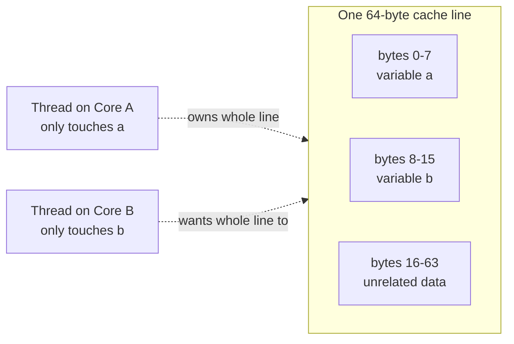

This single fact — 64 bytes is the *real* atomic unit of ownership, not your variable —
is the root cause of **false sharing**, which you already benchmarked in section 1.5. It
will also come back, unmodified, when we get to lock-free queues in Chapter 9: the
entire reason those designs pad `head` and `tail` apart is exactly this picture.

---

## 1.3 Cache coherency: the actual protocol, not just the states

If nothing coordinated the private caches, core A could write `x = 1` into its own L1
and core B could read `x = 0` out of *its* L1 forever, because main memory might never
even get updated. So hardware runs a **cache coherency protocol**: a fixed set of rules,
enforced entirely in silicon, that make N private caches *behave* as if there were one
shared memory.

### The four states (MESI)

Every cache line, in every private cache, is tagged with one of four states:

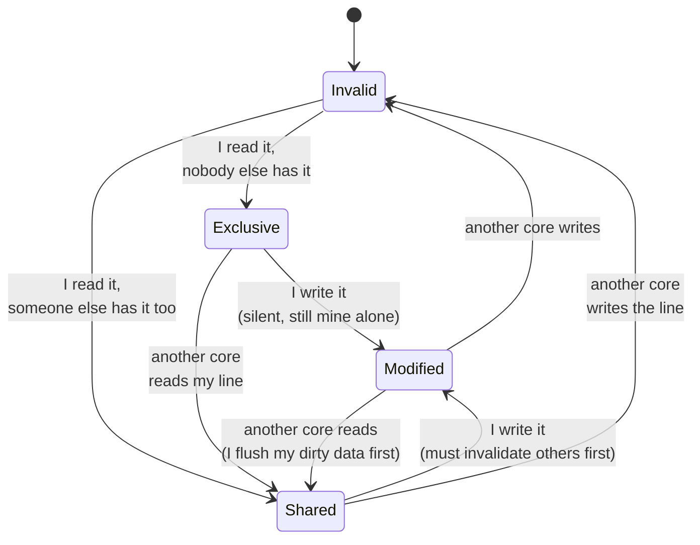

- **M — Modified.** Only you have it, it's dirty (differs from memory). Free to
  read/write. Nobody else has a copy.
- **E — Exclusive.** Only you have it, it's clean (matches memory). Free to read;
  writing silently flips it to M with zero bus traffic, because nobody else needs
  telling.
- **S — Shared.** You and at least one other core have clean copies. Free to read.
  **Cannot write without first evicting everyone else's copy** — this is the expensive
  transition, and it's the one false sharing hammers over and over.
- **I — Invalid.** You don't have a usable copy. Next access is a miss.

### What actually crosses the wires: bus transactions

The state diagram tells you the *outcome*. What actually happens *physically* on the
interconnect between cores is a small set of message types, sometimes called a
"snooping" protocol because every cache watches (snoops) the traffic to see if it needs
to react:

| Transaction | Sent when... | Effect on other cores |
|---|---|---|
| **BusRd** (Read) | I want to read a line I don't have | others with it downgrade M/E → S, and if one had it Modified, it flushes the dirty data first |
| **BusRdX** (Read-For-Ownership / RFO) | I want to **write** a line I don't have | every other copy anywhere is invalidated (→ I) |
| **BusUpgr** (Upgrade) | I already have it Shared, now I want to write | every other copy is invalidated, I don't need the data again, just permission |
| **Flush** | I had it Modified and someone else needs it | I write my dirty data back (to the requester and/or memory) before giving up ownership |

Here's the sequence your false-sharing benchmark actually generates, transaction by
transaction, every single time ownership bounces from Core A to Core B:

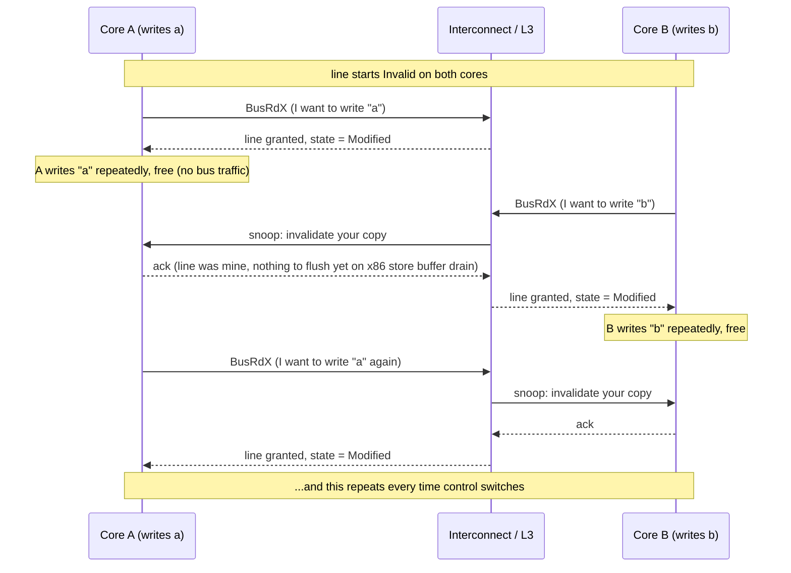

Every one of those `BusRdX` round trips costs on the order of the L3/interconnect
latency — tens of cycles — even though the actual arithmetic (`+1`) is a single cycle.
**The false-sharing benchmark isn't measuring addition. It's measuring how many times
this handshake happens.**

### The complete catalogue of core-to-core scenarios

The diagram earlier was one specific case (both cores fighting to write). That's the
expensive end of a spectrum — but it's not the only shape of interaction two cores can
have over a shared line. Below is **every scenario** that can happen between Core A and
Core B sharing an L3/interconnect, cheapest to most expensive, each with the diagram
*and* a plain-English numbered walkthrough of what's physically happening at each
arrow. Once you can recognize which of these 8 shapes your algorithm produces, you can
predict its coherency cost before you ever run a benchmark.

---

**Scenario 1 — Cold read, line held by nobody (I → E).**

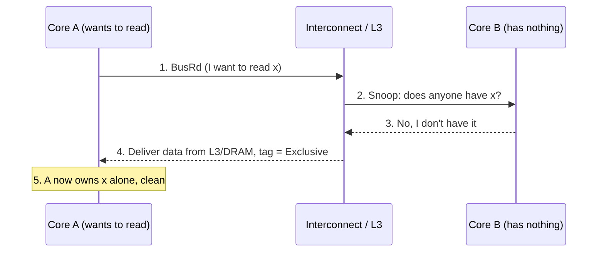

1. **The demand:** Core A hit a load instruction for `x`, missed in its own cache, and
   issues a `BusRd` onto the interconnect.
2. **The snoop check:** every other cache, including B's, is asked "does anyone have
   this line?"
3. **The answer:** nobody does — this is a true cold miss.
4. **The fetch:** since no cache can supply it faster, the data comes from L3 or DRAM.
5. **The grant:** A tags the line Exclusive — meaning clean, and A is the sole owner.
   This is the cheapest kind of miss there is, and it sets A up for a **free** future
   write: E → M requires no further bus traffic at all.

---

**Scenario 2 — Read, another core already has it clean (I → S, E/S → S).**

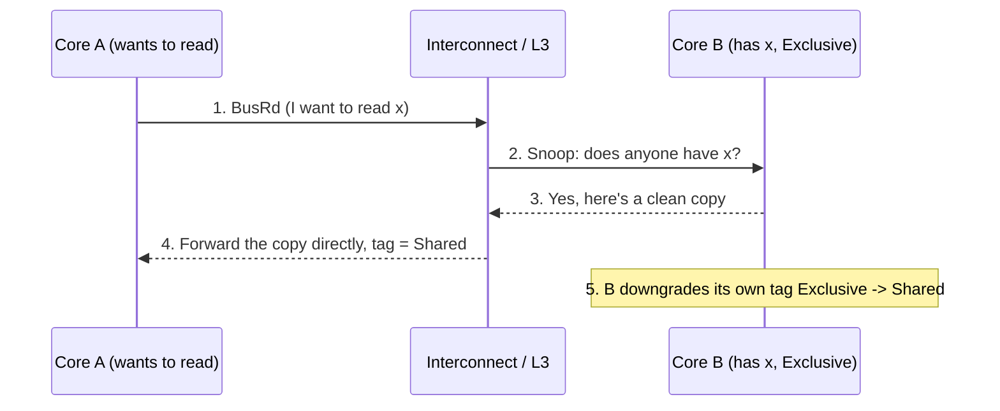

1. **The demand:** A misses on `x` and issues `BusRd`.
2. **The snoop check:** B is found holding it.
3. **The answer:** B's copy is clean (matches memory), so it can just hand it over —
   no writeback needed.
4. **The transfer:** the data goes cache-to-cache (B → A), which is faster than a trip
   to DRAM.
5. **The settle:** both cores now agree the line is Shared. Cheap: one hop, no flush,
   no invalidation of anybody.

---

**Scenario 3 — Read, another core has it dirty (I → S, M → S with flush).**

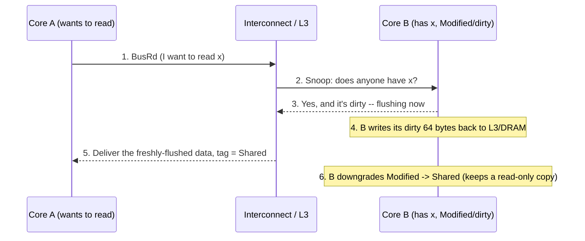

1. **The demand:** A issues `BusRd` for `x`.
2. **The snoop check:** B is found holding it.
3. **The catch:** B's copy is Modified — meaning main memory's copy is stale and
   *cannot* be handed to A as-is without first being written back.
4. **The flush:** B pushes the full 64-byte dirty line back out, so both A and
   memory get the true current value.
5. **The grant:** A receives the just-flushed data, tags it Shared.
6. **The settle:** B doesn't lose its copy entirely — it downgrades to Shared rather
   than Invalid, since the data is now clean and safe for both to hold read-only.

---

**Scenario 4 — Cold write, line held by nobody (I → M directly).**

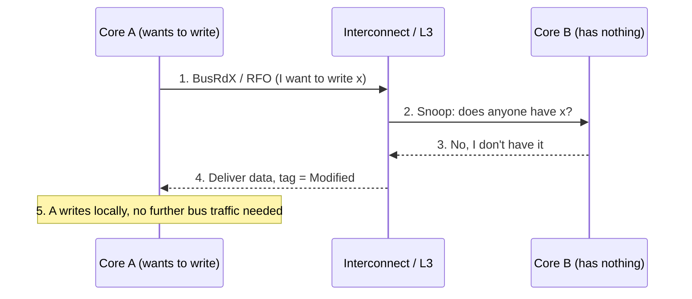

1. **The demand:** A hits a *store* instruction for `x` it doesn't have, so it issues
   `BusRdX` (Read-For-Ownership) instead of a plain `BusRd` — it needs write
   permission, not just a read copy.
2. **The snoop check:** nobody else is asked to give anything up, because nobody has it.
3. **The answer:** confirmed, cold miss.
4. **The grant:** data delivered straight to Modified — skipping the Exclusive stop
   entirely, since A is about to write anyway.
5. **The write:** happens purely in A's L1, no additional bus round trip.

---

**Scenario 5 — Write while another core holds it Shared, permission-only upgrade
(S → M for A, S → I for B).**

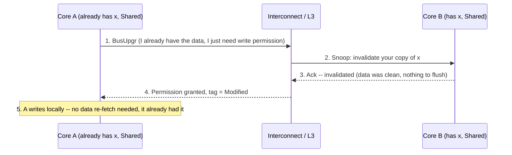

1. **The demand:** A already holds `x` Shared and now hits a store instruction. Since A
   already has the correct data, it doesn't need to *re-fetch* anything — it only needs
   everyone else's copy gone. It issues the lighter-weight `BusUpgr` instead of a full
   `BusRdX`.
2. **The snoop check:** B is found also holding it Shared.
3. **The invalidation:** B's copy is clean, so it just drops it — no flush required.
4. **The grant:** A is promoted straight from Shared to Modified.
5. **The write:** proceeds locally. This is cheaper than Scenario 6 or 7 specifically
   *because* A didn't need new data — only permission.

---

**Scenario 6 — Write while another core holds it Exclusive, clean (E → I for B,
→ M for A).**

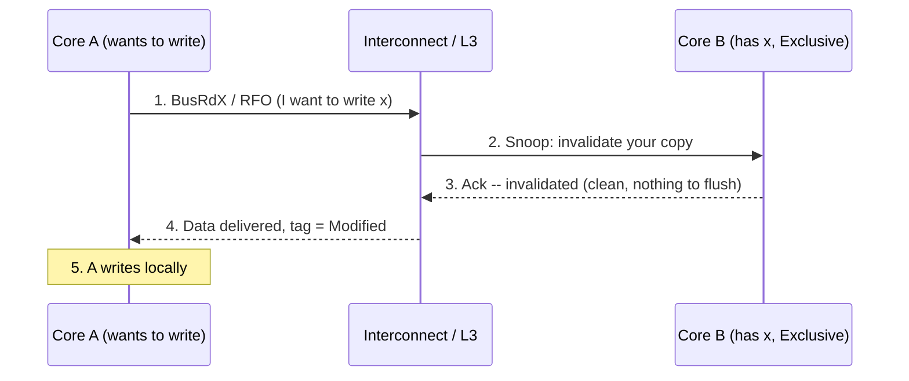

1. **The demand:** A doesn't have `x` and wants to write it, so it issues `BusRdX`.
2. **The snoop check:** B is found holding it Exclusive.
3. **The invalidation:** B's copy is clean (E, not M) — dropping it costs nothing, no
   writeback needed.
4. **The transfer:** data reaches A (from B's cache or L3, whichever the hardware
   decides is faster) and is tagged Modified.
5. **The write:** proceeds locally.

---

**Scenario 7 — Write while another core holds it Modified/dirty (M → I with flush,
→ M for A). This is the most expensive single transition in the entire protocol**, and
it's the one your false-sharing benchmark hits on *every single increment* once both
threads are actively contending — because after either core writes, the line is left
Modified right there, so the very next write from the other core always lands exactly
in this scenario.

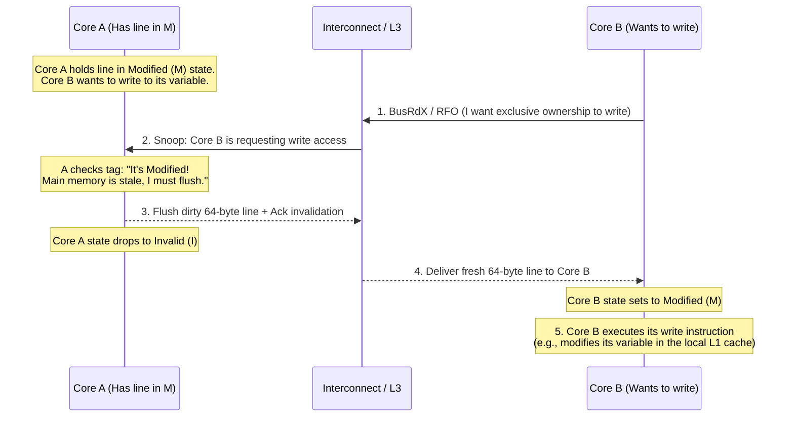

1. **The demand (`BusRdX`):** Core B hits a store instruction for `x` and issues a
   Read-For-Ownership request, because it needs exclusive, writable access.
2. **The snoop check:** the interconnect broadcasts the request. Core A's cache
   controller intercepts it and realizes it is the sole owner of a *dirty* (Modified)
   copy.
3. **The flush & invalidation:** A cannot simply drop the line — it has to push its
   latest value out first, since it's the only place in the whole system holding the
   true current value (memory itself is stale). It flushes the full 64-byte block
   across the interconnect and immediately transitions its own tag to Invalid.
4. **The transfer:** B receives that 64-byte payload straight off the bus, loads it
   into its own L1, and flips its local tag to Modified.
5. **The write execution:** only now, holding exclusive ownership, does B's core
   actually apply the write locally — with zero further interference.

**This exact 5-step handshake, repeating back and forth as ownership swings between
threads, is what false sharing physically *is*.** Every one of the 200 million
increments in the `SharedLine` half of your benchmark pays this full round trip.

---

**Scenario 8 — Local hit: line already Modified or Exclusive on the same core (the
fast path — no bus traffic at all).**

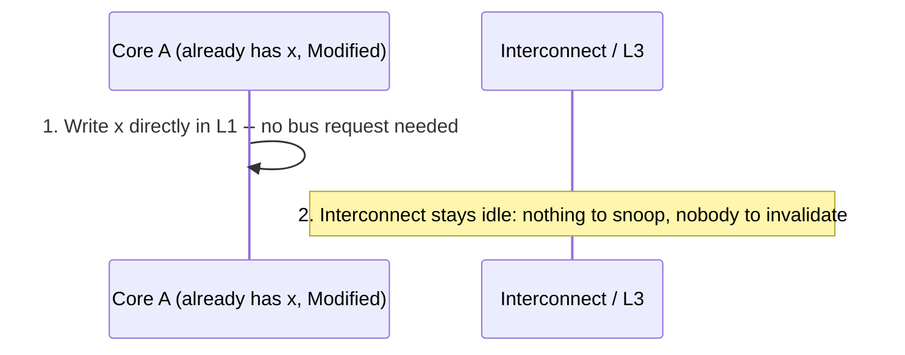

1. **No demand:** A already holds `x` Modified from a previous write — it's the sole,
   dirty owner.
2. **No snoop, no invalidation, no flush:** there is genuinely nothing for the
   interconnect to do. The write completes purely inside A's L1.

This is the baseline every other scenario is measured against, and it's what
`PaddedLine` in your benchmark achieves after its very first access: **all 200 million
subsequent increments land here, at zero interconnect cost.**

---

**Reading all eight as a cost ladder, cheapest to most expensive:**

| # | Scenario | Data movement | Invalidation | Relative cost |
|---|---|---|---|---|
| 8 | Local hit (already M/E, no contention) | none | none | free |
| 1 | Cold read, nobody has it | L3/DRAM → A | none | cheap |
| 4 | Cold write, nobody has it | L3/DRAM → A | none | cheap |
| 2 | Read, other core has it clean | cache-to-cache | none | moderate |
| 5 | Write, other core has it Shared (upgrade) | permission only | 1 core, no flush | moderate |
| 6 | Write, other core has it Exclusive/clean | cache-to-cache | 1 core, no flush | moderate |
| 3 | Read, other core has it dirty | flush + cache-to-cache | none (downgraded, kept) | expensive |
| 7 | Write, other core has it dirty | flush + cache-to-cache | 1 core, with flush | **most expensive** |

Scenario 7, repeating back and forth every time control of the line swaps threads, *is*
false sharing. Now you can see exactly why it sits at the top of the cost ladder: it's
the only scenario that pays for a full flush **and** a full invalidation **and** a full
cache-to-cache transfer, every single time.

### From C++ down to the actual instruction
**Scenario 8 — Local hit, line already Modified or Exclusive on the same core (no bus
traffic at all).** The baseline every other scenario is measured against: if Core A
already holds the line M or E and writes it again with no other core involved, there is
**zero interconnect traffic**. This is what `PaddedLine` in your benchmark achieves
after the very first access — every subsequent 200-million increments hit this case.

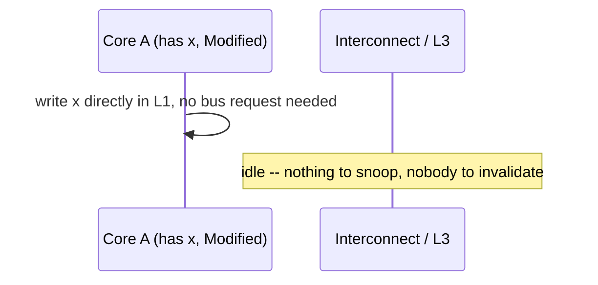

**Reading this table as a cost ladder, cheapest to most expensive:**

| # | Scenario | Data movement | Invalidation | Relative cost |
|---|---|---|---|---|
| 8 | Local hit (already M/E, no contention) | none | none | free |
| 1 | Cold read, nobody has it | L3/DRAM → A | none | cheap |
| 4 | Cold write, nobody has it | L3/DRAM → A | none | cheap |
| 2 | Read, other core has it clean | cache-to-cache | none | moderate |
| 5 | Write, other core has it Shared | permission only (or full RFO) | 1 core | moderate |
| 6 | Write, other core has it Exclusive/clean | cache-to-cache | 1 core, no flush | moderate |
| 3 | Read, other core has it dirty | flush + cache-to-cache | none (stays valid, downgraded) | expensive |
| 7 | Write, other core has it dirty | flush + cache-to-cache | 1 core, with flush | most expensive |

Scenario 7, repeating back and forth, **is** false sharing — it's exactly the loop the
earlier ping-pong diagram showed, just now you can see it's sitting at the top of the
cost ladder for a reason: every single transition does a full flush-and-invalidate
round trip across the interconnect.

### From C++ down to the actual instruction

This is the piece most courses skip, and it's exactly what you asked for — seeing code
and being able to picture hardware. Here's what `fetch_add` in your benchmark compiles
to on x86-64:

```cpp
data.a.fetch_add(1, std::memory_order_relaxed);
```

becomes, on x86-64 with `g++ -O2` (verified by actually compiling `false_sharing.cpp`
and reading the assembly — do this yourself, instructions below):

```asm
lock addq $1, (%rdx)
```

Not `lock xadd` — because the benchmark discards `fetch_add`'s return value, the
compiler knows nobody needs the *old* value, so it emits the cheaper `lock add` instead.
`xadd` (exchange-and-add, which does return the old value) only shows up when your code
actually uses the return value of `fetch_add`. Same underlying hardware mechanism
either way — this is a good first lesson that **the C++ standard specifies behavior,
not instructions**, and the compiler picks the cheapest instruction that satisfies it.

The `lock` prefix, on whichever instruction it's attached to, is not a software lock,
not a mutex, not anything you wrote — it's a literal instruction prefix that tells the
CPU: *"treat this read-modify-write as one indivisible hardware transaction against this
cache line."* Mechanically, a locked instruction forces the core to:

1. Issue a `BusRdX` (or `BusUpgr` if already Shared) for the line, if it isn't already
   held Modified/Exclusive by this core.
2. Wait until it holds the line exclusively — meaning every other private cache holding
   this line has been invalidated.
3. Perform the read, the add, and the write, atomically from every other core's point
   of view — no other core's snoop request can be serviced mid-instruction.
4. Only then release the line back to the coherency protocol for the next requester.

So when two cores are doing `fetch_add` on variables sharing a line, step 1-2 is exactly
the `BusRdX` ping-pong in the sequence diagram above — every single increment on the
"losing" core has to first win back ownership of the line before it can even begin. That
is the entire mechanical reason `SharedLine` is slower than `PaddedLine`: **you're not
paying for atomicity, you're paying for cache-line ownership transfer.**

---

## 1.4 False sharing, precisely — and why it's not about atomics at all

Put 1.2 and 1.3 together:

> **False sharing** is when two cores contend for exclusive ownership (M/E state) of the
> *same 64-byte cache line*, even though they never touch the *same variable*. The
> contention is a side effect of memory layout, not of your algorithm, and — this is the
> subtle point — **it happens with plain non-atomic writes too**, not just atomics. An
> atomic instruction makes the ownership request explicit and immediate; a plain store
> still needs the line in M state before it can write, it just gets there through the
> normal (non-locked) write path. Either way, the `BusRdX` traffic is the same.

Rule of thumb to keep for the rest of this course: **any struct where field X is written
hot by thread 1 and field Y is written hot by thread 2, and X and Y are within 64 bytes
of each other, is a false-sharing candidate — regardless of whether X and Y are
atomic.** You will see this exact shape again in Chapter 9 (queue `head`/`tail`) and in
every lock-free data structure from your source talks.

---

## 1.5 Project: measure false sharing yourself

You already have `false_sharing.cpp`. What it does, restated with the mechanism now in
view:

- Two threads, each doing 200 million relaxed `fetch_add`s on **its own private
  counter**. No data race by construction.
- `SharedLine`: the counters are 8 bytes apart → same 64-byte line → every increment on
  one core forces a `BusRdX` that invalidates the other core's copy.
- `PaddedLine`: counters padded to separate 64-byte lines → each core holds its line in
  M state permanently → after the first access, **zero bus traffic** for the rest of
  the run.

**Build & run (your own multi-core machine, not this sandbox):**
```bash
g++ -O2 -std=c++20 -pthread false_sharing.cpp -o false_sharing
./false_sharing
```

**Expected result:** `SharedLine` noticeably slower — commonly 3-10x. (This sandbox has
1 core, so both threads time-share instead of running truly concurrently — there's no
cross-core bus traffic to measure at all, which is why it showed ~1.0x here. Run it on
real multi-core hardware to see the effect.)

**Extend it, now that you know the mechanism:**
1. Watch the assembly yourself: `g++ -O2 -S -std=c++20 false_sharing.cpp -o -` and grep
   for `lock`. You should find `lock addq $1, (...)` for each `fetch_add` call — one
   locked instruction, nothing else. Then edit the code to actually use the return
   value of `fetch_add` (e.g. sum it into a local) and recompile — watch it change to
   `lock xadd`.
2. Shrink `PaddedLine`'s padding below 64 bytes (try 16, 32) and watch the slowdown
   partially return — you're experimentally measuring your own L1 line size.
3. Extend to 4 threads / 4 counters: one version packed into a single line, one spread
   across 4 lines. Confirm the ping-pong scales with thread count, not just with 2.

---

## 1.6 Checkpoint — answer these before moving on

1. Why does a core "talk to its cache" instead of "talk to memory," and roughly how big
   is the latency gap between L1 and DRAM?
2. Two threads write to their own private, unrelated `int`s. Can that ever be slow
   because of the *other* thread — and if so, name the actual bus transaction
   responsible.
3. In MESI, what specifically makes writing a Shared-state line more expensive than
   writing a Modified or Exclusive-state line? Answer in terms of what message has to
   go out and who has to respond.
4. What does the `lock` prefix actually force the CPU to do, in terms of cache-line
   ownership — and is it a software-level lock like a mutex? Also: why did the compiler
   emit `lock add` instead of `lock xadd` for this specific benchmark?
5. Is false sharing an "atomics problem" or a "memory layout problem"? Would it still
   happen with two plain (non-atomic) `int`s under a hypothetical scenario where you
   somehow avoided undefined behavior another way? Why or why not.
6. Name one real data structure design (hint: the queue talk) where `head` and `tail`
   indices sitting adjacent in memory would cause exactly this bus-transaction ping-pong.
7. Walk through, from memory, what happens step-by-step when Core A reads a line Core B
   holds Modified (Scenario 3) — specifically, why can't B's data just be handed over
   as-is, and why does B end up Shared instead of Invalid afterward?
8. Scenario 5 (upgrade via `BusUpgr`) is cheaper than Scenario 7 even though both end
   with Core A holding the line Modified. Explain the specific difference in what has
   to travel across the interconnect in each case.

---

# Coherency vs. Races — Why `count++` Can Still Break

## The core confusion, stated plainly

> "If MESI keeps every core's cache in sync, how can there still be a race condition?"

Here's the one-sentence resolution:

**Cache coherency guarantees that everyone agrees on the value of a single, indivisible
memory access. It says nothing about a *sequence* of accesses — and `count++` is not
one access, it's three.**

Coherency is a **per-transaction** guarantee. A race condition is a **multi-transaction**
problem. MESI never promised to protect a *sequence* of reads and writes as a group —
only each individual read or write, on its own, is guaranteed to see a consistent value.

---

## `count++` is not one instruction — it's three

```cpp
count++;
```

At the hardware level, a plain (non-atomic) increment is really:

| Step | What happens | CPU stage |
|---|---|---|
| 1. **Load** | Read `count` from cache into a register | `mov eax, [count]` |
| 2. **Modify** | Add 1 to the register | `add eax, 1` |
| 3. **Store** | Write the register back to `count` | `mov [count], eax` |

Coherency protects **each of these three steps individually**:

- Step 1's `BusRd` correctly gets you *some* valid, coherent value of `count`.
- Step 3's write correctly gets propagated to every other cache (via invalidation).

What coherency **cannot** do is stop another core from sneaking its *own* Step 1 in
between *your* Step 1 and Step 3. There is no rule in MESI that says "once a core reads
a line intending to write it back, nobody else may touch that line until it does."
That's precisely the gap a race condition lives in.

---

## Full flow: the non-atomic race, hardware level

Two cores, `count = 10`, both doing `count++` at nearly the same moment:

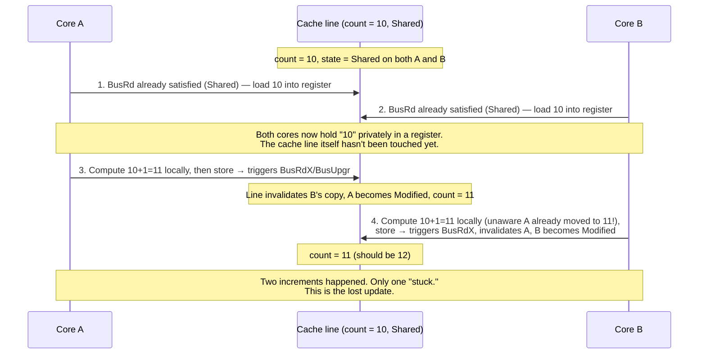

Notice: **every individual bus transaction here was coherent.** The line correctly
moved Shared → Modified → Invalid → Modified exactly as MESI dictates. Coherency did
its job perfectly at every step. The bug isn't in the cache protocol — it's in the
*gap between load and store*, a gap coherency was never designed to close.

This is the same "snoop slips through" idea from your reference chat — B's read in
step 2 slips in during the window that A's read-modify-write hasn't finished yet,
because nothing has claimed exclusive ownership *for the whole operation*, only for
the individual load and the individual store.

---

## Full flow: the atomic version (`lock addq`)

```cpp
count.fetch_add(1, std::memory_order_relaxed);
```

compiles to a single fused instruction:

```asm
lock addq $1, (%rdx)
```

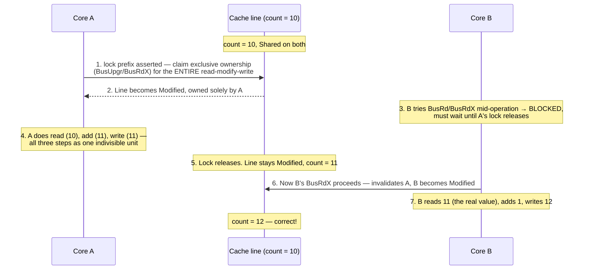

The critical difference vs. the race: in step 3, **B's request is not allowed to
interleave**. The `lock` prefix doesn't just do a normal write — it extends exclusive
ownership of the cache line to cover the *whole* load-modify-store sequence, and any
snoop request that arrives mid-sequence is stalled until the locked instruction retires.

---

## So what does "atomic" actually do, mechanically?

Three things, and it's worth separating them because people usually only remember #1:

1. **Extends line ownership across the whole operation.**
   A normal write only needs the line in M state for the single store. A locked
   instruction holds the line M for load *and* modify *and* store, and refuses to
   service any other core's snoop request in between. This is what closes the race.

2. **Drains the store buffer / forces immediate visibility.**
   Normal writes can sit in a private store buffer for a while before the rest of the
   world sees them (see your reference doc's point #2). A locked instruction forces
   that buffer to drain and the write to actually land in cache before the instruction
   is considered complete — so there's no window where the result is invisible to
   other cores.

3. **Acts as a memory fence (ordering guarantee).**
   Depending on the memory order requested, it can also stop the compiler/CPU from
   reordering surrounding instructions around it (your reference doc's point #1). This
   is a *separate* concern from the mutual-exclusion part — `memory_order_relaxed`
   still gives you #1 and #2, but skips the extra ordering guarantees of
   `acquire`/`release`/`seq_cst`.

**What atomic is *not* doing:** it's not "avoiding the cache" or "talking directly to
RAM." It's still going through the exact same MESI states and the exact same
`BusRdX`/snoop machinery as a normal write — it's just refusing to let go of exclusive
ownership until the whole logical operation is done, instead of letting go after each
individual micro-step.

---

## The one-line mental model to keep

| | Coherency (MESI) guarantees | Atomicity (`lock`) additionally guarantees |
|---|---|---|
| Scope | One single read *or* one single write | A whole read-modify-write sequence, as an indivisible block |
| What it stops | Two cores seeing genuinely different values for the *same* access | Another core's access from *interleaving inside* your multi-step operation |
| Enforced by | The cache controller's state machine (M/E/S/I) automatically | The `lock` prefix explicitly extending ownership + blocking snoops mid-sequence |

Coherency keeps the *cache line* honest. Atomicity keeps your *operation* honest.
`count++` needs both — and plain non-atomic code only ever gets the first one.

## What's next — Chapter 2

Chapter 1 was entirely about **why two cores can physically disagree about memory, and
what it costs to make them agree.** Chapter 2 moves to the C++ side: given that hardware
behaves this way, what does the C++ standard actually promise about plain `x++` on a
variable shared between threads — and why is the honest answer "nothing at all, this is
undefined behavior," down to the exact assembly-level reason two non-atomic
read-modify-writes can silently lose an update. We'll reproduce a real lost-update bug
on purpose, read its disassembly side by side with the atomic version, and connect it
straight back to the `BusRdX` picture you just built.
