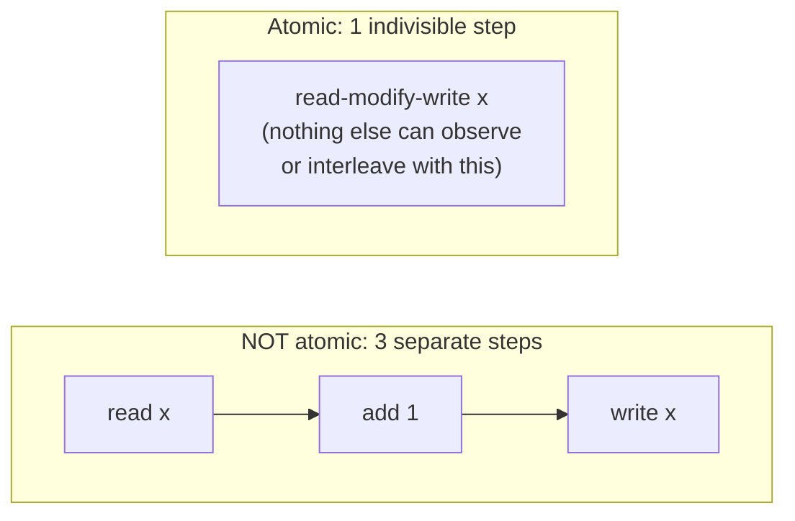
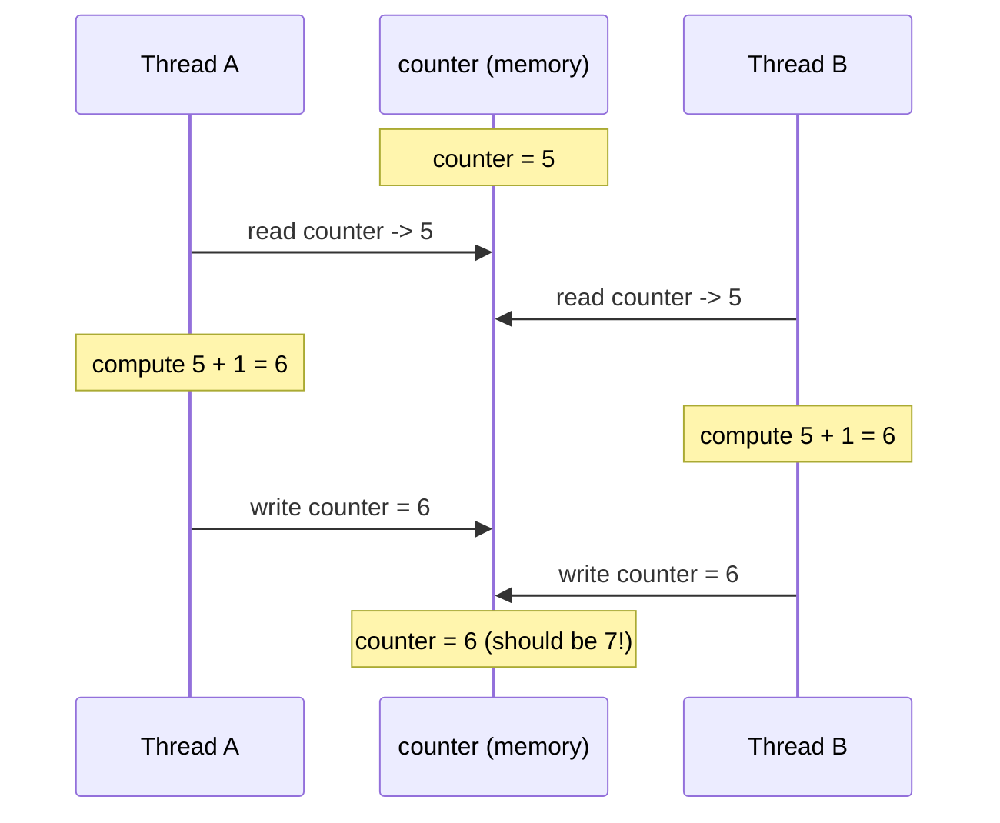

# Chapter 2 — Atomicity & Data Races

**Goal of this chapter:** Chapter 1 showed you *why* two cores can physically disagree
about memory. This chapter shows you what happens when your C++ code doesn't account
for that — and why the honest answer is "literally anything," not "you might get the
wrong number." Every claim below was compiled and run, not recalled from memory — you'll
see the real assembly and the real (sometimes uncomfortable) output.

---

## 2.1 What "atomic" actually means

Before we get to what goes wrong, pin down what "atomic" means in general, independent
of C++ or even of hardware. This is the database-transaction framing, and it's the
correct mental model:

> An operation is **atomic** if every other thread observes it as happening entirely
> before, or entirely after — never partway through. There is no intermediate state
> visible to anyone else, no matter how the operation is implemented internally.

This scales from a single CPU instruction all the way up to a multi-thousand-instruction
database transaction — a bank transfer either fully happened or fully didn't, from the
point of view of every other client, even though internally it took hundreds of steps.
"Atomic" is a promise about *visibility*, not about *speed* or *implementation size*.



`x++` on an `int` **looks like one step in your source code**. It is not one step at
runtime. That gap — one line of C++, three real operations — is the entire subject of
this chapter.

---

## 2.2 Increment is read-modify-write, and here's the proof

`plain_counter++` compiles, at `-O0` (no optimization, so nothing is hidden or fused),
to exactly this:

```asm
movl  plain_counter(%rip), %eax   ; READ:  eax = plain_counter
addl  $1, %eax                    ; MODIFY: eax = eax + 1
movl  %eax, plain_counter(%rip)   ; WRITE: plain_counter = eax
```

Three separate instructions. Three separate points in time where another thread's
instructions could interleave. Compare that to `atomic_counter.fetch_add(1, ...)`:

```asm
movl      $1, %edx
lock xaddl %edx, (%rax)           ; ONE indivisible hardware transaction
```

One instruction, wearing the `lock` prefix from Chapter 1 — the CPU guarantees no other
core's access to this cache line can interleave with it. That's the entire difference
between "atomic" and "not atomic" at the hardware level: **whether the read, modify, and
write happen as one transaction the coherency protocol protects, or as three separate,
individually-interruptible instructions.**

---

## 2.3 Watch a real update get lost

Here's the failure mode, step by step, for two threads both incrementing the same
non-atomic counter starting at 5:



Both threads read the same starting value before either one's write became visible to
the other. Both computed the same "next" value. One increment vanishes, silently — no
crash, no error, no warning. This is called a **lost update**, and it's the single most
common consequence of a data race on a shared counter.

**Formal definition**, straight from the C++ standard's intent: a **data race** occurs
when two threads perform *conflicting* accesses (at least one is a write) to the *same
memory location*, and at least one of those accesses is **not atomic** and there is no
**happens-before** relationship (covered properly in Chapter 5) ordering them. If your
program contains a data race, the behavior of the *entire program* is undefined — not
just that one variable.

---

## 2.4 "Undefined behavior" does not mean "wrong number sometimes"

This is the part that surprises people, and it's worth sitting with rather than
skimming. Read the project results below carefully — they're not what you'd naively
expect.

### Experiment 1: does it actually lose updates?

I compiled `data_race.cpp` (two threads, 5,000,000 increments each, one plain `int`
counter, one `std::atomic<int>` counter for comparison) and ran it 5 times in this
sandbox:

```
Plain int (data race):   got 10000000  (lost 0 updates)     <- every single run
std::atomic<int>:        got 10000000  (lost 0 updates)
```

**Every run came back correct.** If you stopped here, you'd conclude "eh, seems fine on
this machine." That conclusion is exactly the trap. This sandbox has 1 CPU core (from
Chapter 1), and this particular OS scheduler happened to run each thread's whole
5-million-iteration loop back-to-back rather than finely interleaving them — so the race
window never got exercised on *this specific run, on this specific machine, with this
specific scheduler*. None of that is a guarantee. On your own multi-core machine, or
under different system load, or with a different compiler version, this can and does
produce a visibly wrong final number. **"I tested it and the number was right" is not
evidence of correctness for a data race — it's evidence that you got lucky this time.**

This is why you don't debug data races by eyeballing output numbers. You use a tool that
checks the actual rule being violated, regardless of whether it happened to produce a
wrong number on this run:

### Experiment 2: ThreadSanitizer — checking the rule, not the number

```bash
g++ -O0 -std=c++20 -fsanitize=thread -pthread data_race.cpp -o data_race_tsan
./data_race_tsan
```

Real output from this exact sandbox — the same one where the plain numeric run above
looked perfectly correct:

```
WARNING: ThreadSanitizer: data race (pid=519)
  Read of size 4 at 0x560e4e9b101c by thread T2:
    #0 increment_plain() ...
  Previous write of size 4 at 0x560e4e9b101c by thread T1:
    #0 increment_plain() ...
  Location is global 'plain_counter' of size 4 ...
SUMMARY: ThreadSanitizer: data race ... in increment_plain()
```

ThreadSanitizer instruments every single memory access at compile time and tracks, at
runtime, whether any two threads touched the same location without a proven
happens-before relationship between them. It doesn't care whether the final number came
out right. It caught the exact race, named the exact variable, and named both threads —
on the same build, same machine, same run where the raw numeric output gave you zero
warning signs.

**Rule for the rest of this course:** any time you write concurrent code, you build and
run it under `-fsanitize=thread` before you trust it, regardless of what the output
numbers say. This is not optional paranoia — it's the only reliable way to check the
actual rule.

### Experiment 3: it's not just about lost counts — the compiler can hang your program

This is the one that really drives home why the standard says "undefined behavior" and
not "wrong arithmetic." Consider this (full code in `compiler_hazard.cpp`):

```cpp
bool ready = false;   // plain bool, no atomic, no volatile

void waiter() {
    while (!ready) { }              // busy-wait for another thread to set it
}
void setter() {
    sleep_for(500ms);
    ready = true;                   // set from a different thread
}
```

This looks completely reasonable — spin until a flag flips. I compiled it two ways and
ran both with a timeout:

```
=== -O0 ===
waiter: saw ready become true after 246077850 spins
main: both threads finished cleanly     (exit code: 0)

=== -O2 ===
waiter: spinning until ready becomes true...
(nothing else printed)                  (exit code: 124 -- killed by timeout, hung forever)
```

**The `-O2` build never sees `ready` become `true` and spins forever.** Same source
code, same logic, same hardware — only the optimization level changed. Reading the
actual `-O2` assembly for the `waiter` loop proves exactly why:

```asm
cmpb  $0, ready(%rip)   ; check ready -- but only ONCE
jne   .L5               ; if it was already true, skip the loop entirely
.L6:
jmp   .L6                ; otherwise: infinite unconditional jump, no re-check, ever
```

The compiler is *allowed* to do this because a data race is undefined behavior, and the
compiler's optimizer takes "undefined behavior cannot happen in a correct program" as a
license to assume `ready` is never modified by anyone else during the loop — since a
plain, non-atomic, non-volatile variable being modified by another thread without
synchronization is exactly the undefined behavior we've been discussing. Given that
assumption, hoisting the read out of the loop and turning it into `while(true)` is a
100% legal, correct optimization, from the compiler's point of view. It's not a
compiler bug. **It's your program that has no defined meaning, and the compiler is
free to act on that.**

---

## 2.5 So what actually is the fix?

Two changes, and this chapter is deliberately not going deep on the second one yet
(that's Chapter 3 in full) — just enough to close the loop on both experiments above:

```cpp
std::atomic<int>  atomic_counter{0};   // fixes Experiment 1 & 2 (lost updates)
std::atomic<bool> ready{false};        // fixes Experiment 3 (compiler hoisting)
```

Wrapping a type in `std::atomic<T>` does two things simultaneously, both of which matter
here:
1. **Forces the hardware to use locked instructions** (Chapter 1's `lock` prefix) so the
   read-modify-write genuinely becomes one indivisible transaction — fixes lost updates.
2. **Forbids the compiler from assuming no other thread touches it** — every access
   becomes a real memory operation the optimizer cannot hoist, cache in a register
   across iterations, or reorder away — fixes the infinite-loop hang.

Both fixes come from the same underlying mechanism, and that's exactly why `std::atomic`
is the tool for both problems even though they look completely different on the
surface. Chapter 3 is entirely about `std::atomic<T>`'s actual API surface, what types
you're allowed to put in it, and the traps in its overloaded operators.

---

## 2.6 Project: reproduce both bugs yourself

```bash
cd ch02_project

# Bug 1: lost updates (may or may not show a wrong number on your machine --
# that's the point. Run it several times.)
g++ -O2 -std=c++20 -pthread data_race.cpp -o data_race
./data_race

# The rigorous way to catch it regardless of whether the number looked right:
g++ -O0 -std=c++20 -fsanitize=thread -pthread data_race.cpp -o data_race_tsan
./data_race_tsan

# Bug 2: compiler hoisting hangs the program at -O2 but not -O0
g++ -O0 -std=c++20 -pthread compiler_hazard.cpp -o hazard_O0
g++ -O2 -std=c++20 -pthread compiler_hazard.cpp -o hazard_O2
timeout 5 ./hazard_O0 ; echo "O0 exit code: $?"
timeout 5 ./hazard_O2 ; echo "O2 exit code: $?"
```

**Extend it:**
1. In `data_race.cpp`, bump `kIters` up by 10x and try more threads (4, 8). More
   threads and more iterations increase the odds of actually seeing a wrong number on
   the plain-int version, even on a machine where it "looked fine" before.
2. In `compiler_hazard.cpp`, change `bool ready = false;` to `std::atomic<bool>
   ready{false};` (keep using it as a plain bool otherwise — the atomic overloads still
   support `!ready` and `ready = true`), recompile at `-O2`, and confirm the hang is
   gone. Then read the new assembly for `waiter` and confirm the compiler now re-checks
   `ready` on every iteration instead of hoisting it.
3. Run `data_race.cpp` under TSan with 4 threads instead of 2 and read the full report —
   practice matching each "Read of size 4" / "Previous write of size 4" pair back to the
   actual source line.

---

## 2.7 Checkpoint — answer these before moving on

1. In your own words, what does "atomic" mean, independent of any programming language?
2. Why does `x++` compile to three separate instructions instead of one, and what
   specifically has to go wrong between those three instructions for an update to be
   lost?
3. Why is "I ran it and got the right number" not evidence that a data race is safe?
   What did this chapter's own experiment demonstrate about that?
4. Explain, mechanically, why `-O2` can turn `while (!ready) {}` into an infinite loop
   when `ready` is a plain `bool`, but not when it's `std::atomic<bool>`. Don't just say
   "undefined behavior" — explain what license that gives the compiler's optimizer.
5. Name the two distinct things wrapping a variable in `std::atomic<T>` does, and match
   each one to which of this chapter's two bugs it fixes.
6. Why do we build and run under `-fsanitize=thread` instead of trusting the plain
   `-O2` build's output numbers?

---

## Code 
 ***link***: https://github.com/a-ZINC/MultiThread/commit/02a2a9aec9d034d370c933f8ee7bc4716503a73c
 ### Summary
 What you just observed is a **textbook masterclass** in how compilers and Undefined Behavior (UB) destroy multithreaded code.

Here is exactly what happened under the hood at each optimization level:

---

### 1. `-O0` (No Optimizations): Both worked after 7 seconds

* **What happened:** The compiler translated your code literally, instruction-for-instruction, without trying to be "smart."
* **Why it worked:** The main thread actually went out to memory to check `data.ready` on every loop iteration. After 7 seconds, the worker thread woke up, wrote `true`, and because you are on an **x86 processor** (which has very strong hardware cache coherency), the main thread instantly saw the update and broke out of the loop.

---

### 2. `-O1` (Basic Optimizations): `atomic` worked, `nonAtomic` hung

* **What happened:** The compiler started optimizing.
* **Why `nonAtomic` hung:** The compiler looked at `while(!data.ready)` and thought: *"This variable never changes inside this loop, so I will read it once, store it in a CPU register, and check that register forever."* It completely optimized away the memory read. Even though the worker thread changed `ready = true` in memory 7 seconds later, the main thread was trapped in an **infinite loop** staring at its own register.
* **Why `atomic` worked:** The `std::atomic` keyword acts as a legal shield, telling the compiler: *"Do not cache this in a register; another thread can modify this at any time."* So the loop stayed intact and successfully caught the 7-second update.

---

### 3. `-O2` (Aggressive Optimizations): `nonAtomic` was *instant*?!

* **What happened:** This is the most shocking result, but it is the ultimate proof of **Undefined Behavior (UB)**.
* **Why `nonAtomic` skipped instantly:** In C++, accessing a non-atomic variable across multiple threads without synchronization is a **Data Race**, which is officially classified as Undefined Behavior.
* When the compiler hits `-O2`, it is legally allowed to assume that **Undefined Behavior never happens in valid code**.
* Because a single-threaded compiler analysis sees a loop that reads a variable that *shouldn't* be changed by anyone else, the compiler can completely optimize the loop out of existence, treat it as dead code, or assume the condition is already met and **fall straight through instantly**.
* **The Lesson:** Undefined behavior doesn't always mean your program crashes or hangs. Sometimes, the compiler optimizes so aggressively that it completely rewrites your logic into nonsense, causing it to skip past checks entirely!


## Atomic usage(short notes)
 1. ***It help in making Read-modify-write atomic for whole period in cache***
 2. ***Disable compiler or cpu register cache behaviour(reason of compiler hazard)***

## What's next — Chapter 3

Chapter 2 established the problem: unsynchronized shared access is undefined behavior,
full stop, and `std::atomic` is the fix. Chapter 3 goes deep on `std::atomic<T>` itself:
which types you're actually allowed to put in it (`is_lock_free` isn't always true, and
we'll prove it with a struct that fails), the full set of member functions (`load`,
`store`, `exchange`, `fetch_add`, and friends), and — importantly — the trap in the
overloaded operators (`x++`, `x += 1`, `x = x + 1`) where some of those look atomic and
are, and others look atomic and are absolutely not, and the compiler will let all of
them compile without a single warning.
