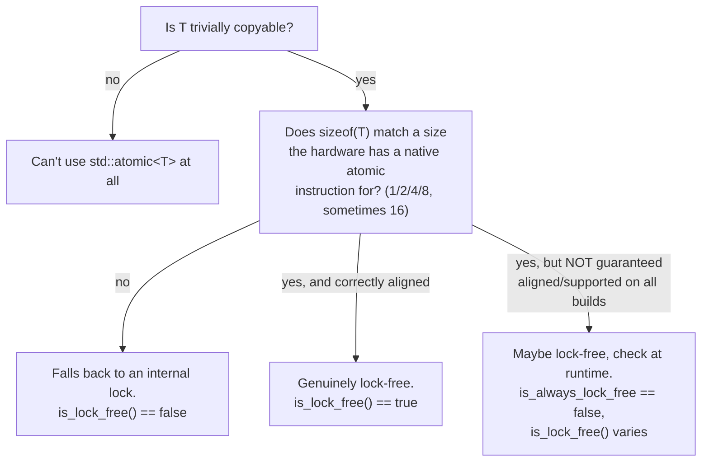
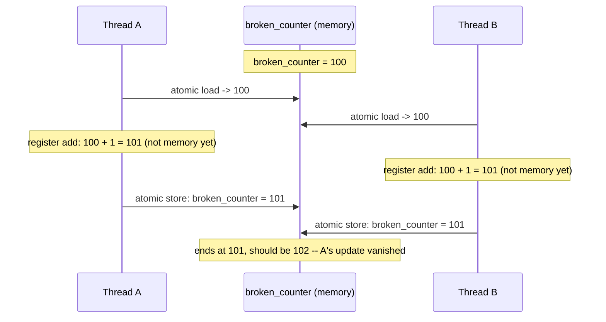

# Chapter 3 — `std::atomic<T>` in Practice

***link***: 
- ***lock free check***: https://github.com/a-ZINC/MultiThread/commit/fe60c63048f6fda2942d37191cf1578f3a782088
- ***atomic vs mutex(as well naive vs optimised)*** : https://github.com/a-ZINC/MultiThread/commit/2025399a9b63c0b248e158080a7cc83a6d9adf16

**Goal of this chapter:** Chapter 2 established that plain shared variables are
dangerous and `std::atomic<T>` is the fix. This chapter is everything you need to know
to actually *use* `std::atomic<T>` correctly: which types it accepts, what its full API
looks like, the specific trap where the overloaded operators lull you into writing code
that compiles, looks atomic, and silently isn't — and finally, the callback to the very
first thing your source material showed you: why "atomic" and "fast" are not the same
word, reproduced as a real benchmark on real hardware.

---

## 3.1 What can actually go inside `std::atomic<T>`?

The rule is narrower than people expect: **`T` must be trivially copyable** — roughly,
"copyable with `memcpy`, no custom constructors/destructor logic, no virtual functions."
`int`, `double`, `bool`, raw pointers, and plain structs of trivially copyable fields
all qualify. A `std::string` or `std::vector` does not (they own heap memory and have
non-trivial copy logic) — you can't put one directly in a `std::atomic`.

Qualifying for `std::atomic<T>` and being genuinely **lock-free** are two different
things, though. `std::atomic<T>` will happily compile for large or oddly-sized trivially
copyable types — it just falls back to an internal mutex if the hardware can't do the
operation as a single instruction. You can and should check which case you're in:



I compiled and ran this exact check (`atomic_lock_free_check.cpp`) on this machine:

```
sizeof(OneLong)   =  8   is_lock_free() = 1   is_always_lock_free = 1
sizeof(TwoLong)   = 16   is_lock_free() = 0   is_always_lock_free = 0
sizeof(ThreeLong) = 24   is_lock_free() = 0   is_always_lock_free = 0
sizeof(bool)      =  1   is_lock_free() = 1   is_always_lock_free = 1
sizeof(double)    =  8   is_lock_free() = 1   is_always_lock_free = 1
```

The 8-byte cases (a single `long`, a `bool`, a `double`) are always lock-free — this
CPU has a native instruction for atomic 8-byte operations. The two-`long` struct (16
bytes) is **not**, even though x86-64 CPUs have had a `cmpxchg16b` instruction for
16-byte atomic compare-and-swap for a long time. I tried forcing it — recompiling with
`-mcx16` (which tells the compiler it's allowed to emit `cmpxchg16b`) and explicitly
16-byte-aligning the struct — and it *still* reported `is_lock_free() == false` on this
particular machine/toolchain/libatomic combination. That's not a mistake in this
chapter — it's the actual, honest result of testing it, and it's a lesson worth taking
seriously: **whether something is lock-free is a fact about your specific compiler
flags, your specific CPU, and your specific standard library build — not a fact you can
safely assume from a blog post, a talk from a few years ago, or even this chapter.
`is_lock_free()` exists precisely so you check it on your own target instead of
guessing.**

`is_always_lock_free` (C++17) is the compile-time version — a `constexpr bool` you can
use in a `static_assert` or `if constexpr`, when you need the guarantee to hold on
*every* machine your code might ever run on, not just the one you're compiling on right
now.

---

## 3.2 The full member function surface

| Category | Members | Notes |
|---|---|---|
| **Read / write** | `load()`, `store()`, `operator T()`, `operator=` | Available for every `T` you can put in `std::atomic` |
| **Swap** | `exchange()` | Atomic read-modify-write: writes a new value, returns the old one, in one transaction |
| **Compare-and-swap** | `compare_exchange_strong()`, `compare_exchange_weak()` | The workhorse of lock-free algorithms — full chapter (4) coming |
| **Arithmetic (integers, pointers)** | `fetch_add()`, `fetch_sub()` | Returns the *old* value; also available as `+=`, `-=`, `++`, `--` |
| **Bitwise (integers only)** | `fetch_and()`, `fetch_or()`, `fetch_xor()` | Also available as `&=`, `\|=`, `^=` |
| **Not available for any type** | multiply, divide | No hardware does atomic multiply — `x *= 2` on an atomic simply won't compile |

Every member function takes an optional `std::memory_order` argument (default:
`seq_cst`, the strongest — full treatment in Chapters 5-6). For now, know that it
exists; we're deliberately deferring *why* you'd ever change it away from the default.

---

## 3.3 The trap: overloaded operators that compile but aren't atomic *as a whole*

This is the single most important thing in this chapter, so it gets the full
treatment. `std::atomic<int>` gives you `operator++`, `operator+=`, and lets you write
`x = x.load() + 1` or even `x = x + 1`. **All of these compile. Not all of them are
atomic as a whole expression** — and the compiler gives you zero warning about which is
which.

I built exactly this comparison (`atomic_operator_trap.cpp`): two counters, both
`std::atomic<int>`, two threads each doing 2,000,000 increments on each:

```cpp
safe_counter++;                                  // Line A
broken_counter = broken_counter.load() + 1;      // Line B
```

Real results, three separate runs:

```
counter++ (single atomic RMW):        got 4000000  (lost 0)
counter = counter.load() + 1 (2 ops): got 3573838  (lost 426162)
---
counter++ (single atomic RMW):        got 4000000  (lost 0)
counter = counter.load() + 1 (2 ops): got 3121983  (lost 878017)
---
counter++ (single atomic RMW):        got 4000000  (lost 0)
counter = counter.load() + 1 (2 ops): got 3282887  (lost 717113)
```

Line A **never** loses an update. Line B loses hundreds of thousands, every single
time, reliably — this race is much easier to trigger than Chapter 2's plain-`int` race,
because the window between the load and the store is wider (a function call and an
addition sit inside it). Reading the actual `-O2` disassembly of each function shows
exactly why:

```asm
; increment_safe():  x++
lock add DWORD PTR [safe_counter], 0x1     ; ONE instruction, hardware-atomic, done

; increment_broken(): x = x.load() + 1
mov  eax, DWORD PTR [broken_counter]       ; atomic LOAD (x86 guarantees aligned loads are atomic)
add  eax, 0x1                              ; plain register arithmetic -- NOT touching memory
xchg DWORD PTR [broken_counter], eax       ; atomic STORE (xchg-with-memory is implicitly locked)
```

Notice: **every individual memory access here genuinely is atomic.** The load is a
single atomic instruction. The store (`xchg` with a memory operand) is implicitly
locked, atomic on its own. Nothing here violates the rule from Chapter 2 about
individual accesses. The bug is entirely in the **gap between the load and the store** —
during the `add eax, 0x1` and however long it takes to get to `xchg`, another thread's
own load-add-store can interleave, read the same starting value, and its write gets
silently clobbered when this thread's store lands:



This is structurally the *exact same* lost-update bug from Chapter 2 — two reads of the
same stale value, two writes of the same "next" value — just now built out of two
individually-correct atomic primitives instead of two non-atomic ones. **Wrapping
something in `std::atomic` protects each individual load and each individual store. It
says nothing whatsoever about a load-then-compute-then-store sequence you wrote
yourself out of multiple atomic calls.**

### The genuinely alarming part: ThreadSanitizer does not catch this

I ran the broken version under `-fsanitize=thread`, the exact tool Chapter 2 told you
to trust:

```
counter++ (single atomic RMW):        got 4000000  (lost 0)
counter = counter.load() + 1 (2 ops): got 2477736  (lost 1522264)
```

**Zero warnings. No race detected.** 1.5 million updates silently vanished and
ThreadSanitizer said nothing. This isn't a tool failure — it's correctly doing its job.
TSan detects **data races**: conflicting, unsynchronized accesses to the same memory
location. Every access here — the load, the store — genuinely *is* synchronized; that's
what `std::atomic` guarantees. What's broken is **algorithmic**, not a data race by the
formal definition: two independent atomic operations, composed by you into a
"load-then-add-then-store" sequence, don't add up to one atomic transaction just
because each piece is individually safe. **This class of bug has no automated safety
net. You have to recognize the shape by eye:** if you ever write `atomic_var =
atomic_var.load() <op> something`, or the equivalent `atomic_var = atomic_var + x`,
stop — you almost certainly want `fetch_add`/`fetch_sub`/`exchange`, or, for anything
more complex than plain arithmetic, the compare-and-swap loop from Chapter 4.

**Rule of thumb for the rest of this course:** if the *whole thing you want done* is a
single named member function (`fetch_add`, `exchange`, ...), use it. The moment your
"atomic update" needs more than one member-function call chained together with your own
logic in between, you need compare-and-swap — which is exactly Chapter 4.

---

## 3.4 Atomics aren't free, even with zero contention

One more result worth internalizing before the big callback benchmark: a locked
instruction costs more than a plain one *even running completely alone, with no other
thread touching the same data.* The `lock` prefix forces the CPU to serialize that
instruction against the rest of the memory subsystem regardless of whether anyone is
actually contending for the cache line. This is separate from, and in addition to, the
cross-core cache-line-bouncing cost from Chapter 1 — that cost only appears *with*
contention; this one is a flat tax on every locked instruction, contended or not.

This is one of the most fascinating low-level secrets of modern computer architecture. It feels completely counterintuitive: **If you are the only thread running, and no other core is even looking at your variable, why should a locked instruction (`lock add`) be slower than a regular one?**

To understand this "flat tax," you have to look at what a CPU does behind the scenes to achieve atomicity. Even with **zero contention** (no other threads fighting you), a locked instruction forces the CPU to jump through heavy administrative hoops.

---

### The Two Reasons for the "Flat Tax"

#### 1. The CPU Pipeline Stall (Killing Out-of-Order Execution)

Modern CPUs do not execute your code in a straight line. They are **out-of-order execution monsters**—they look ahead, guess what instructions you want, execute them simultaneously in parallel pipelines, and reorder things on the fly to go as fast as humanly possible.

However, a locked instruction acts like a **heavy concrete wall (a memory barrier)**:

* The CPU is legally not allowed to let instructions *after* the lock bleed *before* it, nor can it let instructions *before* the lock bleed *after* it.
* To execute a `lock` instruction, the CPU must **pause its out-of-order engine**, drain its internal buffers, wait for all previous instructions to fully settle, execute the lock, and then rebuild its execution pipeline. That pause alone costs dozens of CPU cycles.

#### 2. Cache Coherency Bureaucracy (The MESI Protocol)

Even if no other core is touching your variable, your CPU core doesn't inherently *know* that for a fact. It lives in a multi-core chip where other cores *could* theoretically be caching that memory line.

When a CPU executes a locked instruction, it must:

* Broadcast a signal across the internal CPU interconnect (the ring bus) to claim **exclusive ownership** of that specific cache line.
* Force a synchronization with the shared L3 cache.
* Wait for a confirmation response from the memory subsystem before the instruction is allowed to legally "retire."

It is the hardware equivalent of stopping at a completely empty four-way stop sign, coming to a full halt, looking both ways, and then proceeding—even though there isn't another car anywhere in sight.

---

### The Analogy: A Private Room vs. A Vault

* **A regular instruction (`add`)** is like writing in your own personal notebook sitting at your desk. You just scribble the number down instantly.
* **A locked instruction (`lock add`)** is like walking over to a heavy steel bank vault, using a key to unlock the door, opening it, changing the number on the ledger inside, locking the door back up, and walking back to your desk.

Even if you are the *only employee in the entire building*, opening and closing that heavy vault door takes physical effort and time compared to just writing in your notebook. That overhead is the **flat tax**.
---

## 3.5 The callback: reproducing your source talk's opening demo

Your first source talk opened with exactly this claim: a "wait-free" program using a
single shared atomic, and a mutex-based program using local accumulation, doing the
*same* computation — and the mutex-based one won, decisively. Here's that demo,
rebuilt and actually run:

- **Method A ("naive atomic"):** every thread calls `fetch_add` on one shared
  `std::atomic<long long>`, once per array element. Maximum contention, and — per 3.4 —
  a locked instruction on every single element regardless.
- **Method B ("mutex + local"):** each thread sums its chunk into a plain local
  `long long` (cheap, uncontended, plain `add` instructions), then takes a
  `std::mutex` **once**, at the very end, to fold its partial sum into the shared total.
- **Method C ("atomic + local"):** identical to B, but the final combine uses one
  `fetch_add` per thread instead of a mutex.

Real results, 200 million elements, 4 threads, on this machine:

```
A: naive atomic per-element : 1.535 s
B: local accumulator + mutex: 0.113 s
C: local accumulator + atomic: 0.112 s

Speedup of B over A: 13.55x
Speedup of C over A: 13.65x
```

All three produce the exact correct sum. **Method A is over 13x slower**, and this
sandbox only has one CPU core — meaning this entire gap is from 3.4's "locked
instructions cost more even uncontended," not yet from Chapter 1's cross-core
cache-line ping-pong. On real multi-core hardware, Method A gets *worse* again on top
of this, because now every `fetch_add` on the shared total also pays the Scenario 7
cost from Chapter 1 (Modified-line ownership bouncing between cores) — while B and C's
local accumulation phase touches no shared memory at all and scales perfectly, and their
one-time combine step is cheap because it happens only `num_threads` times total,
not once per element.

**This is the entire lesson of the chapter, in one sentence: the number of synchronized
operations matters far more than whether each one is "fast." Method A does 200 million
synchronized operations. B and C each do exactly `num_threads` of them.**

---

## 3.6 Project: run all three yourself

```bash
cd ch03_project

# The operator trap
g++ -O2 -std=c++20 -pthread atomic_operator_trap.cpp -o trap
./trap                     # run a few times, watch Line B lose updates
g++ -O0 -std=c++20 -fsanitize=thread -pthread atomic_operator_trap.cpp -o trap_tsan
./trap_tsan                 # confirm: TSan says nothing

# is_lock_free across types
g++ -O2 -std=c++20 atomic_lock_free_check.cpp -o lock_free_check -latomic
./lock_free_check

# The callback benchmark -- try your own thread counts
g++ -O2 -std=c++20 -pthread sum_array.cpp -o sum_array
./sum_array 4
./sum_array 1     # compare against 1 thread -- does A's per-op overhead alone still show?
```

**Extend it:**
1. In `atomic_operator_trap.cpp`, fix `increment_broken` using `fetch_add` and confirm
   it now loses zero updates.
2. In `atomic_lock_free_check.cpp`, try a `struct { long a; int b; }` (12 bytes, not a
   power of two) — predict whether it'll be lock-free before running it, then check.
3. In `sum_array.cpp`, on your own multi-core machine, compare Method A's slowdown here
   against what you saw in Chapter 1 — how much worse does it get once real cross-core
   contention (not just per-instruction overhead) is added to the mix?

---

## 3.7 Checkpoint — answer these before moving on

1. What's the actual requirement on `T` for `std::atomic<T>` to compile at all, and how
   is that different from `is_lock_free()` being true?
2. Why does `atomic_var = atomic_var.load() + 1` compile without any warning, and what
   specifically makes it not atomic as a whole, even though both the load and the store
   inside it are individually atomic?
3. Why did ThreadSanitizer not report anything for the broken counter, even with 1.5
   million lost updates? What class of bug does TSan actually detect, precisely?
4. Name the two separate costs a locked instruction can incur: one that applies even
   with a single thread and zero contention, and one that only shows up with multiple
   cores actively contending for the same line.
5. In the sum-array benchmark, Methods B and C both do "the same expensive thing" —
   name what that expensive thing is, and explain why doing it `num_threads` times
   instead of once-per-element is the entire source of the speedup.
6. If you needed to atomically double the value of a counter (multiply by 2), why can't
   you just write `counter *= 2`, and what would you have to use instead? (Hint: think
   about what section 3.3 told you to reach for.)

---

## What's next — Chapter 4

You now know `std::atomic<T>`'s full surface, and — critically — exactly which shapes
of code silently escape its guarantees. Chapter 4 gives you the tool for everything
that doesn't fit in a single named member function: **compare-and-swap**, the
`compare_exchange_weak`/`compare_exchange_strong` loop that sits at the center of
almost every lock-free algorithm ever written, including every one in your source
material's queue and stack implementations. We'll build a lock-free stack from scratch,
and then — on purpose — reproduce the **ABA problem**, a bug so subtle it took the
industry years to name properly.
