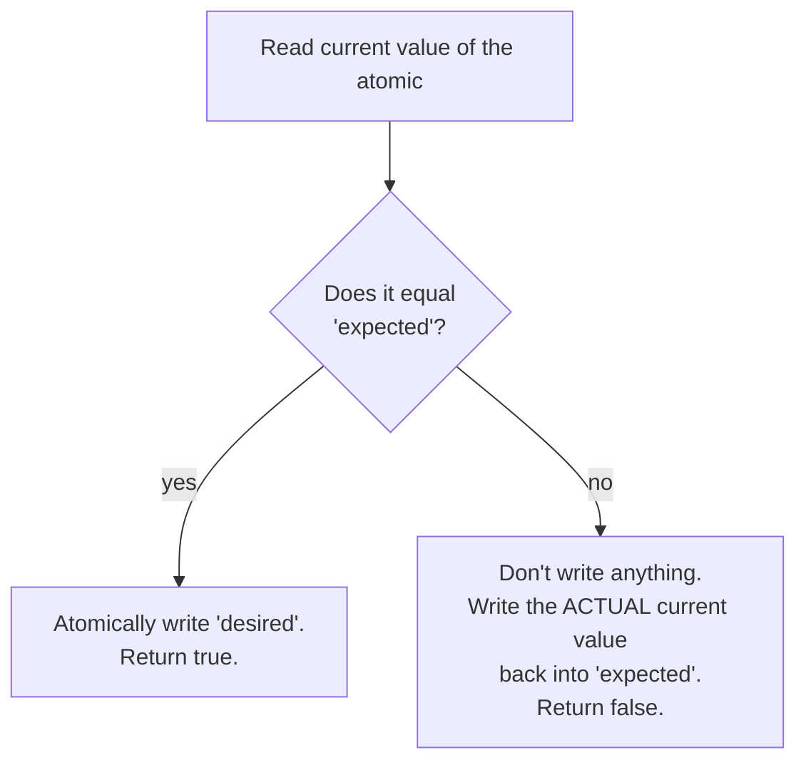
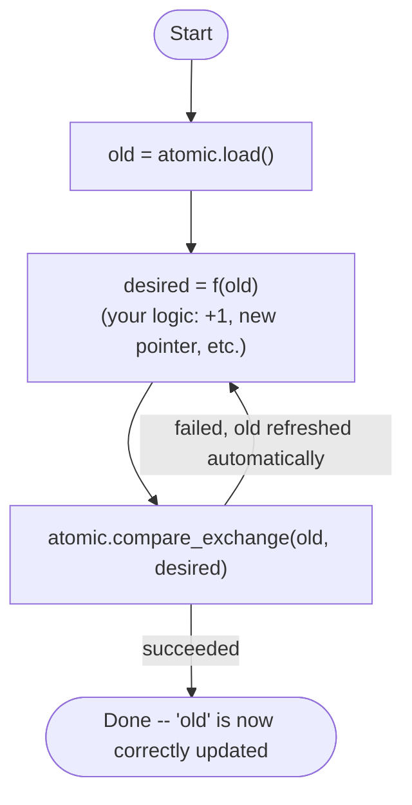
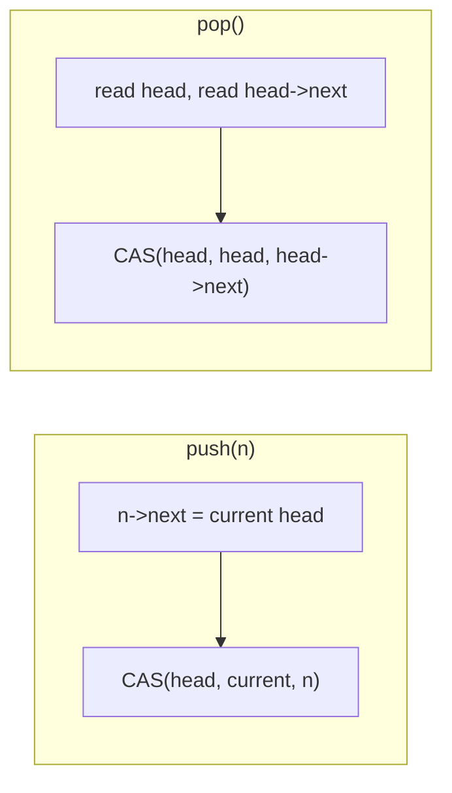
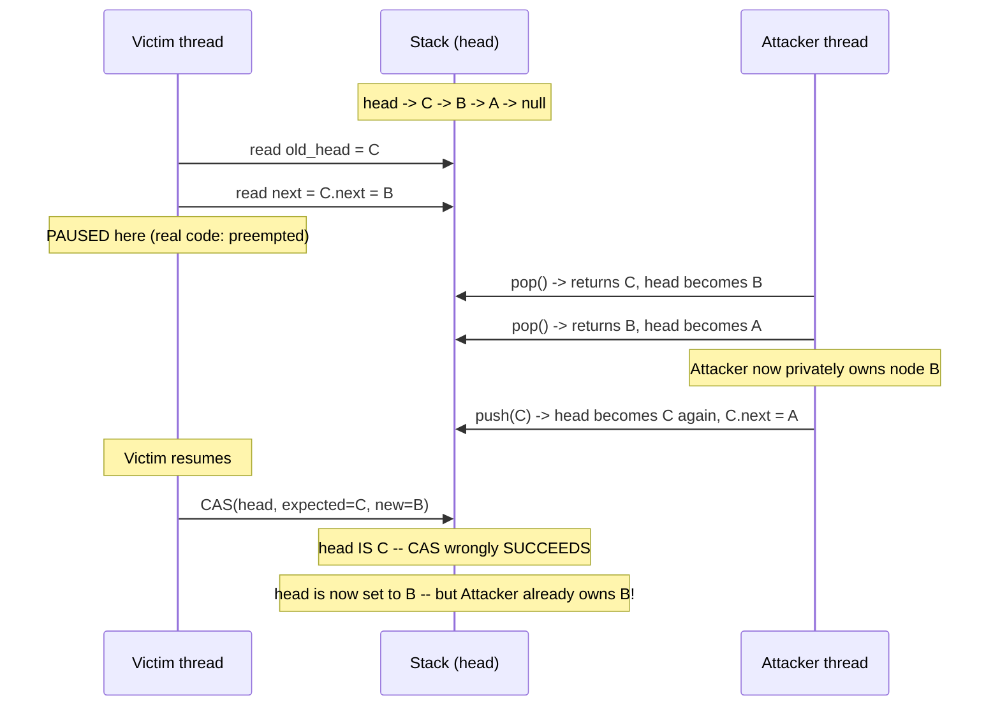

# Chapter 4 — Compare-And-Swap & the CAS Loop

**Goal of this chapter:** every lock-free data structure in your source material — the
lock-free list, the lock-free queue, tcmalloc's transfer cache, all of it — is built out
of one repeating shape: read some state, compute what you want the new state to be, and
try to atomically swap it in, retrying if someone beat you to it. That shape is the
**CAS loop**, and by the end of this chapter you'll have built a real lock-free stack
with it, and then deliberately broken it with the single most notorious bug in
lock-free programming — the **ABA problem** — reproduced 100% deterministically, not by
hoping a race window gets hit.

---

## 4.1 What compare-and-swap actually does

`compare_exchange` takes three things: the atomic variable, an **expected** value, and a
**desired** value. Mechanically:



The clever, easy-to-miss detail in the "no" branch: **a failed CAS doesn't just tell you
"it failed" — it hands you back the current value for free**, by overwriting your
`expected` argument. That's why `expected` is passed by reference. You never have to do
a separate read after a failed CAS; you already have the fresh value sitting right there
to try again with.

---

## 4.2 The CAS loop pattern

This is the one shape you'll now recognize in every lock-free algorithm from here on:



You saw this exact loop, unnamed, all the way back in Chapter 3's fix for the operator
trap (`fetch_add` is this loop, done for you, in hardware, for the one specific
operation "+"). The whole point of raw compare-and-swap is that `f(old)` can be
**anything** — a multiply, a linked-list insertion, a completely different pointer —
not just the handful of operations `std::atomic` gives you a named member function for.

---

## 4.3 `compare_exchange_weak` vs `compare_exchange_strong`, settled with real assembly

Your source material's own Q&A struggled with this, so let's settle it by compiling
both and reading the actual instructions:

```cpp
bool weak_version(std::atomic<int>& a, int expected, int desired) {
    return a.compare_exchange_weak(expected, desired);
}
bool strong_version(std::atomic<int>& a, int expected, int desired) {
    return a.compare_exchange_strong(expected, desired);
}
```

Compiled at `-O2` on this (x86-64) machine, both functions produce **byte-for-byte
identical** assembly:

```asm
movl   %esi, %eax
lock cmpxchgl %edx, (%rdi)
sete   %al
movzbl %al, %eax
ret
```

No difference at all. Here's why: `compare_exchange_weak` is allowed to fail
**spuriously** — return `false` even when the value in memory genuinely did match
`expected` — while `compare_exchange_strong` is not allowed to do that; internally, it's
specified as a retry loop around the weak version until a spurious failure stops
happening. On hardware that implements CAS as a true single atomic instruction, like
x86's `cmpxchg`, spurious failure can never happen in the first place, so `weak` and
`strong` collapse to the exact same instruction — the retry loop `strong` is
"specified" to have simply never has anything to retry.

The distinction earns its keep on hardware that implements CAS as **load-linked /
store-conditional (LL/SC)** — common on ARM — where the "store" step can fail for
reasons that have nothing to do with the value being wrong: another core's unrelated
activity on the same cache line, an interrupt, or the hardware simply timing out on
trying to get exclusive ownership. On those platforms, `compare_exchange_strong` has to
wrap the loop internally to paper over spurious failures; `compare_exchange_weak`
exposes them to you directly.

**The practical rule:** if you're already in a loop (which describes almost every use
of CAS), use `compare_exchange_weak` — you're retrying anyway, so let the hardware bail
out early when it's cheaper to. Use `compare_exchange_strong` for a genuine one-shot
check where you don't want to write your own retry loop around a spurious failure that
has nothing to do with your actual logic.

---

## 4.4 Building a lock-free stack (the Treiber stack)

This is the "hello world" of lock-free data structures, and it's a direct
implementation of the CAS loop from 4.2, applied to a linked list's head pointer:



- **push:** point the new node at whatever the top currently is, then try to swing
  `head` to the new node. If someone else pushed or popped in between, the CAS fails,
  `old_head` is automatically refreshed, and you retry with the new top.
- **pop:** read the top and what it points to, then try to swing `head` *past* the top,
  to whatever it was pointing at. Same retry-on-failure shape.

I built and ran exactly this (`treiber_stack.cpp`): 4 threads pushing 500,000 nodes each
concurrently, then 4 threads popping everything concurrently, checking that every value
comes back exactly once:

```
Expected: 2000000 nodes, sum = 1999999000000
Got:      2000000 nodes, sum = 1999999000000
CORRECT: no lost or duplicated nodes.
```

Correct, under real concurrent stress. But "correct under this test" and "actually
correct" are not the same claim — which is exactly the lesson of the next section.

---

## 4.5 The ABA problem, manufactured on purpose

Look again at `pop()`'s CAS: `compare_exchange(head, old_head, old_head->next)`. It
checks one thing — **is the pointer value of `head` still what I last saw?** It has no
way to ask "and is the *list behind that pointer* still what I last saw?" Those are
different questions, and the gap between them is the entire ABA problem:

> **ABA problem:** a thread reads a value **A**, gets interrupted, and while it's
> paused, some other thread(s) change the value to **B** and then change it *back* to
> **A** — a different **A** in substance (the structure behind it has changed), but
> identical in the one thing CAS actually checks: the value itself. The paused thread
> resumes, sees the value is still **A**, concludes nothing changed, and proceeds on a
> now-false assumption.

Rather than hope a real race window gets hit by chance (which Chapter 2 already taught
you not to trust), I forced this deterministically with an explicit two-thread
handshake — the **Victim** captures its CAS inputs and then genuinely pauses at a fixed
point; the **Attacker** runs a full pop-pop-push cycle to completion while it waits:



Real, unedited output from running this exact scenario (`aba_demo.cpp`) — reproduces
every time, no luck involved:

```
[Victim] captured old_head=C, next=B -- now pausing
[Attacker] popped C (head now points past it)
[Attacker] popped B (head now points past it) -- Attacker now OWNS this node
[Attacker] pushed C back onto the stack (same pointer, reused)
[Attacker] I now privately hold node 'B' at address 0x7ffe47c58060, believing
           it is mine alone -- it has been fully removed from the stack.
[Victim] resumed. compare_exchange_strong(head, C, B) succeeded = 1

--- Aftermath ---
Victim's pop() reported it removed: 'C'
Current head after everything: 'B' (address 0x7ffe47c58060)
Node B's address is 0x7ffe47c58060

CORRUPTION CONFIRMED: head points at node B (address 0x7ffe47c58060),
but the Attacker thread ALSO holds that exact node as its own
privately-popped value.
```

Two independent owners of the same node, simultaneously, and — this is the genuinely
dangerous part — **nothing crashed and nothing warned you.** The program's output looks
completely reasonable. This kind of corruption surfaces much later, and far away from
its cause: a crash when the Attacker frees or reuses node B while it's still linked
into the "live" stack, or silently wrong data if both sides write to it. This is
precisely why the last transcript in your source material called ABA "the illusion of
object permanence" — the pointer looked the same, so the code trusted it, but identity
is not the same thing as unchanged state.

---

## 4.6 The fix: a tagged pointer (generation counter)

The fix follows directly from naming the actual gap: CAS can only compare what you give
it, so **give it more than just the pointer.** Pack the pointer together with a counter
that increments on every single push or pop, and compare the whole pair atomically:

```cpp
struct TaggedPtr {
    Node* ptr;
    uint64_t tag;
    bool operator==(const TaggedPtr& o) const { return ptr == o.ptr && tag == o.tag; }
};
std::atomic<TaggedPtr> head;
```

Now even if the Attacker's pop-pop-push cycle leaves `ptr` looking identical (`C` again),
`tag` has moved on — every one of the Attacker's three operations bumped it. The
Victim's CAS, still holding the stale `tag` from before it paused, correctly fails, and
— this is the important part — **correctly retries with fresh data instead of
corrupting anything.** I ran the exact same manufactured interleaving against this fixed
version (`aba_fixed.cpp`):

```
[Victim] captured old_head={C, tag=0}, stale_next=B -- pausing
[Attacker] popped C
[Attacker] popped B -- Attacker now owns this node
[Attacker] pushed C back (same pointer, but tag has moved on)
[Victim] first CAS attempt with STALE tag succeeded = 0 (correctly rejected!)
[Victim] retried with FRESH data: old={C,tag=3} -> new={A,tag=4}, succeeded = 1

--- Aftermath ---
Victim needed a retry: yes (this is correct and expected)
Victim's pop() reported it removed: 'C'
Current head: 'A' (tag=4)

No node is owned by two threads at once.
```

Exactly the CAS-loop failure-and-retry behavior from 4.2 doing its job — the fresh
`old_head` handed back on failure meant the Victim didn't need any special-case code, it
just looped naturally onto correct, current data.

**One more thing worth noticing, and it's a direct callback to Chapter 3:**
`TaggedPtr` is 16 bytes. `head.is_lock_free()` printed `0` on this exact machine — same
result Chapter 3 found for any 16-byte type here, even with `-mcx16`. That's completely
fine. **Lock-free-ness is a performance property, not a correctness one.**
`std::atomic<TaggedPtr>` falls back to an internal lock on this machine and is *still
100% correct* — the program above ran flawlessly. Don't confuse "not lock-free" with
"not safe to use."

---

## 4.7 Project: build, break, and fix it yourself

```bash
cd ch04_project

# The correct stack under real concurrent stress
g++ -O2 -std=c++20 -pthread treiber_stack.cpp -o treiber_stack
./treiber_stack

# The ABA bug, manufactured deterministically -- reproduces every run
g++ -O2 -std=c++20 -pthread aba_demo.cpp -o aba_demo
./aba_demo

# The fix
g++ -O2 -std=c++20 -pthread aba_fixed.cpp -o aba_fixed -latomic
./aba_fixed
```

**Extend it:**
1. In `aba_demo.cpp`, change the Attacker to pop 3 times and push twice instead of
   2-and-1 — does the corruption still happen? Work out on paper first whether it
   should, then check.
2. In `treiber_stack.cpp`, deliberately reintroduce the ABA vulnerability by having
   `pop()` return freed nodes to a small fixed-size node pool (instead of `new`/`delete`
   per call) so pointer values actually get reused under real concurrent load, no
   manufactured pause needed. Run the correctness check from 4.4 many times — does it
   still always pass? (This is genuinely subtle — real Treiber stacks in production
   almost always pair with either tagged pointers, or a technique called hazard
   pointers that's out of scope for this course, specifically because of this.)
3. Confirm weak-vs-strong identical assembly yourself: compile `weak_vs_strong.cpp`
   (both functions shown in 4.3) and diff the output.

---

## 4.8 Checkpoint — answer these before moving on

1. What does a failed `compare_exchange` hand back to you, and why does that make CAS
   loops simpler to write than "read, then separately retry the read on failure" code?
2. Why are `compare_exchange_weak` and `compare_exchange_strong` identical on x86 but
   not on ARM? Name the hardware mechanism responsible.
3. State the ABA problem in one or two sentences, without using the words "A" or "B" as
   placeholders — use the actual concept.
4. In the manufactured demo, exactly which single fact does the Victim's CAS check, and
   exactly which fact does it fail to check, that lets the corruption through?
5. Why does tagging the pointer with a counter fix this, mechanically — what
   specifically differs between the Victim's stale CAS attempt and the current state of
   `head` after the fix, that didn't differ before?
6. Why is `is_lock_free() == false` on the tagged-pointer fix not a correctness problem?
   What did Chapter 3 already establish about this exact distinction?

---

## What's next — Chapter 5

You now have the mechanism (CAS) and the sharpest edge case (ABA) fully in hand. What
you don't have yet is a rigorous answer to a question this chapter quietly depended on
throughout: when the Attacker thread pushes and pops nodes, and the Victim thread reads
`head`, what actually guarantees the Victim sees the Attacker's writes *in any
particular order at all*? So far we've been relying on `memory_order_seq_cst` (the
default) without examining it. Chapter 5 opens memory ordering properly: relaxed,
acquire, release, and what each one actually promises — from the software side first,
building toward Chapter 6's hardware-level view of *why* those promises are needed at
all.
