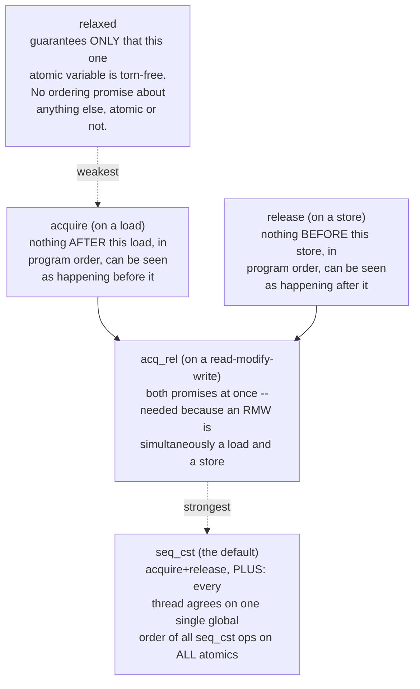
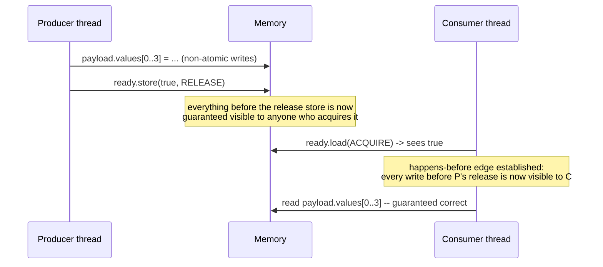

# Chapter 5 — Memory Ordering, Part 1 (The Software View)

**Goal of this chapter:** every atomic operation you've written so far in this course
used the default memory order, `seq_cst`, without examining it. That default is safe
but not free, and it's not even always necessary. This chapter opens up
`memory_order_relaxed`, `acquire`, `release`, and `seq_cst`: what each one actually
*promises*, proven with a genuine data race you'll watch ThreadSanitizer catch, a
correct fix using the cheapest order that's actually sufficient, and a real benchmark
of what the strongest order costs you when you don't need it. This chapter stays on the
*software* side — what the standard guarantees. Chapter 6 goes underneath and shows
*mechanically why* those guarantees cost what they cost, in terms of the store buffers
and reordering from your source material's hardware-level talk.

---

## 5.1 What atomicity alone does *not* give you

Here's the gap this whole chapter exists to close. Picture the simplest possible
handoff: one thread prepares some data, then sets a flag; another thread waits for the
flag, then reads the data.

```cpp
payload.values[0] = 10;               // non-atomic write
// ... more non-atomic writes ...
ready.store(true, ???);               // atomic write -- what order?
```
```cpp
while (!ready.load(???)) {}           // atomic read -- what order?
// ... read payload ...               // non-atomic read
```

`std::atomic<bool> ready` guarantees `ready` itself is never torn, never lost-update —
Chapter 2 and 3 already earned you that. **It says nothing whatsoever, by itself, about
`payload`.** Whether the consumer thread is guaranteed to see the producer's writes to
`payload` once it observes `ready == true` depends entirely on the memory order you
choose. Get it wrong, and you have a genuine data race on `payload` — not a benign one,
a real one, exactly as undefined as Chapter 2's plain `x++` race, just harder to spot
because the *atomic* part of the code looks perfectly correct.

---

## 5.2 The orders, at a glance



(`memory_order_consume` also technically exists in the standard, intended as a
lighter-weight version of acquire — but your own source material's hardware-level talk
flagged it accurately: the standard's specification of `consume` was found to be
unimplementable as written, every major compiler treats it identically to `acquire`,
and current guidance is simply not to use it. We won't use it in this course.)

---

## 5.3 `relaxed`: atomicity with zero ordering promise

You already used this correctly, without the formal justification, all the way back in
Chapter 3's `sum_array.cpp`: threads accumulated locally, then did one `fetch_add` each
with `memory_order_relaxed` into a shared total. That was correct **specifically
because nothing else depended on the ordering of those adds relative to anything else**
— the only thing anyone cared about was the final total, and addition is commutative,
so it genuinely does not matter what order the increments land in. That's the litmus
test for when `relaxed` is enough: **you're using the atomic purely as a counter or
statistic, and nothing else in your program's correctness depends on *when*, relative
to other memory operations, that value became visible.**

The moment an atomic is being used to *signal* something — "the data is ready", "the
lock is free", "the node is now part of the list" — relaxed is no longer enough, because
relaxed makes no promise that anything else you did before the atomic write is visible
to whoever observes it after.

---

## 5.4 `release` / `acquire`: the publish/consume pair

This pair is the direct fix for 5.1's handoff, and it's the cheapest correct fix — not
`seq_cst`, just these two words:

```cpp
ready.store(true, std::memory_order_release);
```
```cpp
while (!ready.load(std::memory_order_acquire)) {}
```

**Release**, on a store: nothing written *before* it, in this thread's program order,
can become visible to another thread *after* that other thread observes this store —
before this store's effects, the world sees your work as if it already all happened.

**Acquire**, on a load: nothing this thread does *after* it, in program order, can be
allowed to happen, from any observer's point of view, *before* this load actually
completed.

Put them together and you get exactly the guarantee 5.1 needed:



I built and ran exactly the broken and fixed versions to prove this isn't just theory.
**Version A**, using `memory_order_relaxed` on both sides — identical code to the
handoff above except for that one word:

```
$ g++ -O0 -std=c++20 -fsanitize=thread -pthread handoff_a_broken.cpp -o handoff_a_tsan
$ ./handoff_a_tsan
WARNING: ThreadSanitizer: data race (pid=511)
  Read of size 4 at 0x55f1c1bb403c by thread T2:
    #0 consumer() ...
  Previous write of size 4 at 0x55f1c1bb403c by thread T1:
    #0 producer() ...
  Location is global 'payload' of size 16 ...
```

**Every single run flags it** — unlike Chapter 2's plain-int race, which only sometimes
showed a wrong number, this is a structural violation TSan catches unconditionally,
because `relaxed` genuinely establishes no happens-before edge for TSan to verify
against. Note also the contrast with Chapter 3: there, TSan found *nothing* because
every access genuinely was synchronized and the bug was purely algorithmic. Here, TSan
finds a real, textbook data race, because relaxed access to `ready` provides no
synchronization at all for `payload`.

**Version B**, changing only `relaxed` → `release` on the store and `relaxed` →
`acquire` on the load — nothing else touched:

```
$ ./handoff_b_tsan     # run 5 times
consumer saw: 10 20 30 40
consumer saw: 10 20 30 40
consumer saw: 10 20 30 40
consumer saw: 10 20 30 40
consumer saw: 10 20 30 40
```

Zero warnings, every time. Two words fixed a genuine, TSan-confirmed data race.

---

## 5.5 `acq_rel`: for operations that are both a read and a write

`fetch_add`, `exchange`, and `compare_exchange` are all **read-modify-write**
operations — they read the current value *and* write a new one, in one atomic
transaction. That means they can need *both* directions of promise simultaneously: the
release half (protect writes that happened before, so a later acquirer sees them) and
the acquire half (see writes some earlier releaser already published, before proceeding).
`memory_order_acq_rel` gives you both. A common real example: decrementing a shared
reference count needs release semantics on every decrement (so an object's writes are
visible to whoever ends up freeing it) and acquire semantics specifically on the
decrement that brings the count to zero (so the freeing thread sees every other
thread's writes before it deletes anything) — this exact pattern is the whole reason
`acq_rel` exists as a distinct order rather than always defaulting to `seq_cst`.

---

## 5.6 `seq_cst`: what the extra strength actually buys you

Release/acquire's guarantee is **pairwise, and specific to one variable**: it only
promises ordering between a release-store and an acquire-load *of that same atomic*.
`seq_cst` promises something strictly stronger: **every thread in the program agrees on
one single global interleaving order of every `seq_cst` operation on every atomic
variable**, not just the one you're currently looking at. If you have two unrelated
atomics `x` and `y`, and two threads doing `seq_cst` operations on each, `seq_cst`
guarantees all threads see those four operations happen in some *one* consistent order
— release/acquire alone gives you no such promise the moment more than one atomic
variable is involved. This is the guarantee Chapter 7 formalizes properly (it's exactly
Lamport's definition from the MIT lecture in your source material); for now, know that
it's genuinely a stronger, more expensive promise, and that it's the default specifically
so that reaching for a weaker one is always an explicit, deliberate choice.

**What that extra strength costs, measured, not assumed:** I benchmarked 500 million
stores to the same `std::atomic<int>`, three ways. (First attempt at this benchmark had
a bug worth mentioning: I originally passed `memory_order` as a runtime function
argument to a shared lambda — which silently defeats the entire point, because the
compiler can no longer prove at compile time which order it'll be, so it conservatively
emits the safe, expensive instruction for *all* of them, making all three look
identical. Fixed by writing three separate loops with the order as a literal constant
in each — the compiler needs to actually *know* the order at compile time to pick the
cheap instruction.) Real, corrected results:

```
relaxed     : 0.153 s  (0.31 ns/store)
release     : 0.153 s  (0.31 ns/store)
seq_cst     : 2.803 s  (5.61 ns/store)

seq_cst vs relaxed: 18.4x slower
seq_cst vs release: 18.3x slower
```

Reading the actual instructions confirms exactly why: `relaxed` and `release` both
compile to a single plain `mov` — on x86, ordinary stores are already release-ordered
by the hardware itself (more on this mechanically in Chapter 6), so `release` needs no
extra instruction beyond what `relaxed` already gets. `seq_cst`, though, compiles to
`xchg` — an implicitly locked instruction, the same family of instruction from Chapter
1's `lock` prefix discussion — because `seq_cst` forbids a specific hardware reordering
(a store followed by a later load swapping order) that x86 otherwise permits by default.
That single extra locked instruction, applied to every store, is an 18x difference in
this benchmark — in the same ballpark as the ~15x your source talk measured on its own
hardware. **This is the exact reason 5.4's fix used `release`/`acquire` instead of
reaching for the always-safe default: it's not just "also correct," it's correct at a
fraction of the cost, because it doesn't ask for a promise (global total order across
unrelated atomics) that this particular handoff never needed.**

---

## 5.7 Project: build all three yourself

```bash
cd ch05_project

# Version A: broken, relaxed -- confirm TSan flags a real race every run
g++ -O0 -std=c++20 -fsanitize=thread -pthread handoff_a_broken.cpp -o handoff_a_tsan
for i in 1 2 3; do ./handoff_a_tsan; done

# Version B: fixed, release/acquire -- confirm TSan is silent
g++ -O0 -std=c++20 -fsanitize=thread -pthread handoff_b_release_acquire.cpp -o handoff_b_tsan
for i in 1 2 3; do ./handoff_b_tsan; done

# The cost of seq_cst vs relaxed/release
g++ -O2 -std=c++20 -pthread store_cost.cpp -o store_cost
./store_cost
```

**Extend it:**
1. Make a Version C that uses `seq_cst` on both sides (the default — just call `.store(true)`
   and `.load()` with no explicit order). Confirm under TSan it's also race-free, and
   note that it's the "safe but potentially paying for more than you need" option.
2. In `store_cost.cpp`, add a fourth loop using `memory_order_acq_rel` via `fetch_add`
   instead of `store` (note: `acq_rel` isn't valid on a plain `store` — you'll need to
   look up why and pick a valid RMW operation instead). Compare its cost to `seq_cst`.
3. Deliberately break Version B by changing *only* the load back to `relaxed`, keeping
   the store as `release`. Predict whether TSan will catch it before you run it — a
   mismatched pair is a common real-world mistake.

---

## 5.8 Checkpoint — answer these before moving on

1. Why does `std::atomic<bool>` guarantee `ready` itself is safe, but say nothing about
   `payload` in the handoff example — what specifically is missing?
2. State, in your own words and without notes, what `release` promises and what
   `acquire` promises. Don't just say "ordering" — say ordering of *what*, relative to
   *what*.
3. Why did TSan flag every single run of the relaxed handoff, while in Chapter 3's
   operator-trap bug it flagged nothing at all? What's the precise difference between
   those two bugs?
4. What extra guarantee does `seq_cst` give you beyond `acquire`/`release`, specifically
   involving *more than one* atomic variable?
5. Explain, from the actual assembly shown in this chapter, why `release` cost nothing
   extra over `relaxed` on x86, while `seq_cst` cost roughly 18x more.
6. What was wrong with the first version of the store-cost benchmark, and why did that
   specific mistake make all three memory orders look identical instead of just being
   "a bit off"?

---

### Q1: What is memory ordering, and why do we even need it if our code runs line-by-line?

**Answer:**
When you write code in C++, you write instructions in a specific sequence (e.g., writing data to a payload variable, then setting a flag to `true`). However, **source code order is not execution order or visibility order.**

Both the **compiler** (during optimization) and the **CPU hardware** (via out-of-order execution and store buffers) are legally allowed to shuffle instructions around or delay when they become visible to other CPU cores, as long as the single-threaded outcome looks correct.

Memory ordering tells the compiler and the CPU: *"Stop! Do not reorder instructions across this line, and make sure my cache/store buffer is flushed so other cores see the truth."*

---

### Q2: What does `memory_order_relaxed` actually do, and when is it safe to use?

**Answer:**
`memory_order_relaxed` provides **atomicity, but zero ordering promises.**

* It guarantees that reading or writing the atomic variable itself is never torn or corrupted.
* It makes **no promise** about what happens to any other variable around it. Instructions before a relaxed operation can be freely reordered after it, and vice-versa.

**When is it safe?**
It is only safe when you are using the atomic variable purely as an isolated counter or statistic (like a local thread summing up array elements), where nothing else in your program's correctness depends on when that value becomes visible relative to other memory.

---

### Q3: What is the classic producer-consumer handoff problem, and why does a `relaxed` flag fail ThreadSanitizer (TSan)?

**Answer:**
Imagine a producer thread writing non-atomic data to a `payload` array, and then setting an atomic flag: `ready.store(true, relaxed)`. A consumer thread waits in a loop: `while (!ready.load(relaxed)) {}` before reading the payload.

If you use `relaxed` on both sides, **TSan will unconditionally flag a data race.**

* **Why?** Because `relaxed` establishes no "happens-before" relationship. To the consumer's CPU, the `ready` flag becoming `true` is completely disconnected from the `payload` array.
* The consumer's CPU core might read stale values of `payload` sitting in its local cache, or read them out of order, leading to a genuine data race.

---

### Q4: How do `release` and `acquire` fix the handoff without paying a massive performance penalty?

**Answer:**
They form a two-way synchronization handshake:

1. **`release` (on the producer's store):** Acts as a physical barrier. It tells the CPU to completely flush its store buffer and ensures that all non-atomic writes to the `payload` made *before* this store are published and visible to the system.
2. **`acquire` (on the consumer's load):** Acts as a matching gate. When the consumer sees the flag turn `true` with an acquire load, its CPU is forced to invalidate its local cache and pull in fresh data, guaranteeing it sees everything the producer wrote *before* the release.

---

### Q5: What is `memory_order_acq_rel`, and why is it needed for Read-Modify-Write (RMW) operations like reference counting?

**Answer:**
Some atomic operations—like `fetch_add`, `exchange`, and `compare_exchange`—are **Read-Modify-Write (RMW)** operations. They simultaneously read a value and write a new one in a single step.

Because an RMW operation is a two-way street, it often needs **both** promises at the same time:

* The **release** half to publish its own updates to whoever comes next.
* The **acquire** half to synchronize with everything published by whoever came before.

`memory_order_acq_rel` bundles both requirements into a single instruction. A classic example is a smart pointer's reference count decrement (`ref_count.fetch_sub(1, acq_rel)`), where every thread hands off its work via release, and the final thread grabs the baton via acquire before deleting the object.

---

### Q6: What happens if you use a `relaxed` decrement on a shared reference count instead of `acq_rel`? (The Heap Corruption Mystery)

**Answer:**
If you use a relaxed decrement and the reference count hits `0`, the thread immediately calls `delete` to free the object's memory back to the system.

* **The Disaster:** Because it was a relaxed decrement, another CPU core's trailing writes to that object might still be sitting lazily in a **store buffer**.
* A nanosecond later, that store buffer flushes its old write straight into memory—**which has already been freed and repurposed by the Windows heap manager for internal bookkeeping**.
* Overwriting those heap metadata pointers shatters the heap manager's integrity, immediately crashing the program with exit code **`0xc0000374` (`STATUS_HEAP_CORRUPTION`)**.

---

### Q7: What is `std::memory_order_seq_cst`, why is it the default, and why does it cost 18x more?

**Answer:**

* **What it is:** Sequential Consistency (`seq_cst`) is stronger than release/acquire. While release/acquire is a pairwise agreement between two threads on one variable, `seq_cst` guarantees that **every thread in the program agrees on one single, absolute global timeline** of every `seq_cst` operation across *all* atomic variables.
* **Why it's the default:** It is the safest option because it completely prevents programmers from accidentally introducing complex cross-variable reordering bugs.
* **Why it costs ~18x more:** To enforce a strict global timeline across all CPU cores, the hardware and compiler cannot rely on lazy store buffers. They must emit locked instructions (like `xchg` on x86) that force CPU cores to pause, stall their pipelines, and synchronize their caches, creating a massive performance tax.

## What's next — Chapter 6

Chapter 5 told you *what* each memory order promises, verified against real races and
real timings. It deliberately didn't explain *why*, mechanically, `seq_cst` needs that
extra `xchg` while `release` doesn't, beyond a one-line pointer to "store buffers."
Chapter 6 opens the hardware up properly — store buffers, invalidate queues, and
out-of-order/speculative execution, straight from your source material's most detailed
hardware talk — and shows you exactly which physical reordering each memory order is
built to forbid, on both x86 (TSO) and ARM (properly relaxed), including the specific
example from that talk where a plain reordering-related bug appears on ARM and is
completely invisible on x86.
