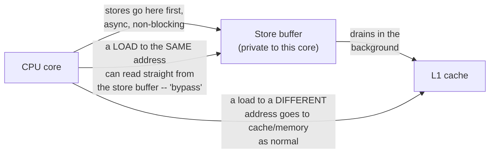
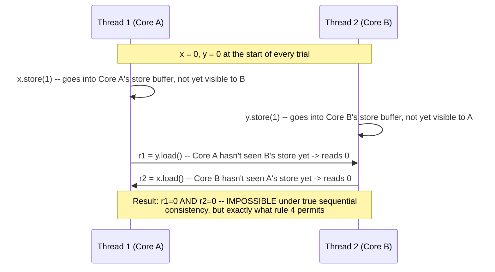

# Chapter 6 — Memory Ordering, Part 2 (The Hardware View)

**Goal of this chapter:** Chapter 5 told you what `relaxed`, `release`/`acquire`, and
`seq_cst` promise, and measured what `seq_cst` costs — an `xchg` instead of a plain
`mov`. This chapter opens the hardware underneath and shows you mechanically *why*:
store buffers, invalidate queues, and out-of-order/speculative execution, straight from
your source material's most detailed hardware talk, plus the litmus test researchers
actually use to catch these reorderings empirically on real silicon.

---

## 6.1 The store buffer: why stores need buffering at all

Chapter 1 established that writes go through the cache, not straight to memory — but
even writing to *cache* isn't instant. Getting exclusive ownership of a cache line
(Chapter 1's `BusRdX`/RFO) can take tens of cycles, and a core issuing stores back to
back would stall on every single one waiting for ownership if it had nowhere to put the
value in the meantime. The fix, present in essentially every modern CPU including
strict x86: a **store buffer**, a small private queue sitting between the core and its
cache.



A store is issued into the buffer and the core moves on immediately — it doesn't wait
for the value to actually land in cache. If the *same* core then wants to read that
address again, it can be satisfied straight out of its own store buffer (called a
**store-to-load forward**, or "bypass") — so a single-threaded program can never
observe its own store buffer's existence; it always sees its own writes immediately,
in order. **The store buffer only becomes visible from the outside — to another
core.** While your store sits in the buffer, not yet drained to cache, another core has
no way to see it yet, even though *your* core would swear the write already happened.

This is the mechanical root of every "surprising" reordering in this course so far, and
it's exactly what Chapter 2's `compiler_hazard.cpp` hinted at from the software side and
what your source material's hardware talk covers in full — this chapter is that talk,
verified.

---

## 6.2 x86's actual rule: Total Store Order (TSO)

x86 doesn't allow arbitrary reordering — it's one of the stricter architectures. The
precise rule, straight from your MIT source lecture:

1. **Loads are never reordered with loads.** Two loads on one core always appear, to
   every observer, in the order the program issued them.
2. **Stores are never reordered with stores.** Same guarantee for writes.
3. **A store is never reordered with an *earlier* load.** If your program does a load
   then a store, every observer sees the load happen first.
4. **A load *can* be reordered with an earlier store — but only to a different
   address.** This is the one gap TSO leaves open, and it's a direct consequence of the
   store buffer bypass in 6.1: your store sits in the buffer, your *next* instruction is
   a load to some unrelated address, and the CPU has no reason to make that load wait
   for the unrelated store to drain — so it doesn't.

Rule 4 is the whole story. It's precisely, exactly, the one reordering `seq_cst`'s extra
instruction exists to forbid — which is why Chapter 5 found `seq_cst` needed `xchg`
while `release`/`relaxed` didn't: **x86's default store behavior already satisfies
everything `release` needs (rules 1-3 cover it), but `seq_cst` additionally forbids
rule 4's store-then-load reordering, and that's not free — it requires draining the
store buffer before the load is allowed to proceed, which is exactly what a locked
instruction or `mfence` forces.**

---

## 6.3 Catching rule 4 in the act: the Store Buffering litmus test

This is the actual experiment memory-model researchers run (tools like `litmus7`/`herd7`
do exactly this, millions of times, across real CPU farms) to empirically detect rule
4's reordering:



Walk through every one of the 6 possible sequentially-consistent interleavings of these
4 operations by hand and **none of them produce (0,0)** — for both loads to see zero,
each core's own store must not yet have become globally visible when the *other* core's
load ran, which requires each store to still be sitting privately in its own buffer at
that exact moment. That's not a "some thread ran first" ordering question anymore —
it's a genuinely different category of behavior, one sequential consistency cannot
produce at all, and it's precisely what makes this litmus test diagnostic.

I built this exact test (`sb_litmus.cpp`) with a 3-party `std::barrier` reset/race/collect
cycle every trial, to keep the race window as tight as possible. **First build had the
exact same bug Chapter 5 caught**: I initially passed `memory_order` as a runtime
function parameter — verified by compiling a minimal repro and reading the assembly,
which showed the "relaxed" mode was silently compiling to `xchg` (full `seq_cst`
strength) the entire time, because the compiler can't specialize a runtime-chosen order.
Fixed with a `template <std::memory_order Order>` non-type template parameter, forcing
genuine compile-time specialization — confirmed by disassembling both instantiations
separately: the `seq_cst` instantiation's thread body contains `xchg DWORD PTR
[rax],ecx`; the `relaxed` instantiation's contains only plain `mov` instructions, with
no `lock` or `xchg` anywhere — exactly the bare, unfenced instructions rule 4's
reordering needs a chance to occur.

**Real results, run on this sandbox:**

```
Memory order: relaxed
Trials: 2000000
Reordered outcomes (r1==0 && r2==0): 0
Reorder rate: 0.000000%
```

Zero, for both `relaxed` and `seq_cst`. **This is expected, not a contradiction of
anything in this chapter** — recall from Chapter 1: this sandbox has exactly **1 CPU
core**. Rule 4's reordering is fundamentally a cross-core phenomenon — it requires two
physically independent store buffers on two physically independent cores racing each
other. With one core, the two threads never execute even a single instruction
truly simultaneously; the OS merely time-slices between them, so the race window this
test targets structurally cannot occur, for either memory order, regardless of how
correct the code is. **This is the same honest limitation Chapter 1's false-sharing
benchmark hit, for the same underlying reason.** Run `sb_litmus.cpp` on your own
multi-core x86 machine and you should see a small but genuinely nonzero reorder rate
for `relaxed` (often somewhere in the 1-in-thousands to 1-in-millions range — tight
alignment between the two threads' timing matters a lot, which is exactly what the
3-party barrier is for) and a mathematically guaranteed **exact zero** for `seq_cst`,
every single time, by definition of what that ordering promises.

---

## 6.4 Two more hardware mechanisms your source material covers

Store buffers explain rule 4. Two more mechanisms, covered in depth in your hardware
talk, explain why *other* architectures (ARM in particular) are permitted to reorder
far more than x86:

**Invalidate queues.** Chapter 1's MESI protocol requires a core to invalidate its copy
of a line when another core writes it. On stricter architectures this happens
immediately; on more relaxed ones, a core can *acknowledge* an invalidation request
right away (so the requester isn't blocked) while the actual invalidation of its local
cache is queued and processed slightly later. Between the acknowledgment and the actual
processing, that core can still read the now-supposedly-invalid stale value out of its
own cache. This is a second, independent source of "another core doesn't see my write
yet" beyond the store buffer, and it's part of why ARM's relaxed model needs its own
explicit acquire (`ldar`) and release (`stlr`) instructions — plain loads and stores
give you neither store-buffer nor invalidate-queue ordering guarantees on ARM the way
x86's plain loads and stores already happen to.

**Out-of-order and speculative execution.** A CPU's front-end can fetch and begin
executing instructions well before earlier ones (like a branch condition, or a slow
load) have actually resolved, using a reorder buffer to make sure results only become
externally visible in the original program order once everything is confirmed correct.
The hazard: on architectures that don't validate speculatively-executed memory accesses
against what actually happened, a speculatively-issued load can retire with a stale
value even after the branch that "shouldn't" have let it execute resolves as taken —
because the speculation guessed right about the *branch*, so the (technically
premature) load underneath it gets kept. x86 does not exhibit this specific reordering
for plain loads/stores; some ARM implementations, under certain conditions your source
material covers, do.

**The one-sentence summary tying 6.1-6.4 together:** every memory order from Chapter 5
exists to forbid one or more of these specific hardware behaviors, and which
instructions the compiler needs to emit to forbid them depends entirely on which of
these behaviors the target architecture actually exhibits in the first place.

---

## 6.5 Mapping Chapter 5's orders onto real instructions, precisely

| Order | x86-64 | ARM (from your source material) |
|---|---|---|
| `relaxed` | plain `mov` | plain `ldr` / `str` |
| `acquire` (load) | plain `mov` — free, because rules 1-3 already give you this | `ldar` (load-acquire) — a real, distinct instruction |
| `release` (store) | plain `mov` — free, same reason | `stlr` (store-release) — a real, distinct instruction |
| `seq_cst` | `xchg`, or `mov` + `mfence` | `ldar`/`stlr` plus additional fencing for the total-order guarantee |

The x86 column is short on purpose: x86's TSO is strict enough that `acquire` and
`release` are **architecturally free** — you get them from ordinary loads and stores,
which is exactly what Chapters 1-5's disassembly kept confirming. ARM's column is
longer because ARM's baseline is genuinely weaker (rules 1-3 are not automatic there the
way they are on x86), so acquire/release need to be real, separate instructions rather
than "the same `mov` you'd write anyway." **This is precisely why testing only on x86
is not sufficient evidence that your memory-ordering choices are correct** — a missing
`acquire`/`release` that happens to work by accident on x86 (because rules 1-3 quietly
cover for you) can fail for real on ARM, where nothing is covering for you by default.

---

## 6.6 Project: run the litmus test yourself

```bash
cd ch06_project
g++ -O2 -std=c++20 -pthread sb_litmus.cpp -o sb_litmus

# On a multi-core machine:
./sb_litmus 20000000 relaxed    # expect a small but nonzero reorder count
./sb_litmus 20000000 seqcst     # expect EXACTLY zero, always
```

**Extend it:**
1. If you have access to ARM hardware (a Raspberry Pi, an ARM cloud instance — not
   Apple Silicon under Rosetta, which doesn't count), run the same test there and
   compare the reorder rate against your x86 machine. Your source material predicts ARM
   should show a *higher* rate of reordering than x86 for the relaxed case — check it.
2. Reduce the trial batch size in `run_batch` and see whether tighter or looser
   alignment between the two threads' start times changes the observed reorder rate —
   this tells you empirically how sensitive this specific reordering is to timing.
3. Add a third variant using `memory_order_release` for the stores and
   `memory_order_acquire` for the loads. Work out on paper first whether you'd expect
   this to still permit (0,0) — release/acquire's guarantee is about ordering relative
   to a *specific* variable's release/acquire pair, and this litmus test's two variables
   are not paired with each other that way. Then check your prediction against the
   result.

---

## 6.7 Checkpoint — answer these before moving on

1. Why does a store buffer exist at all — what problem is it solving, and why can't a
   single-threaded program ever detect its own store buffer's existence?
2. State x86 TSO's 4 rules from memory, and identify which one is the *only* one that
   permits reordering, and under what specific condition.
3. Why does the SB litmus test's (0,0) outcome prove something stronger than "the
   threads ran in some order I didn't expect" — what makes it structurally impossible
   under sequential consistency specifically?
4. Why did this chapter's litmus test show zero reorderings for both relaxed and
   seq_cst on this sandbox, and why is that not evidence that relaxed is safe?
5. Explain, mechanically, why `acquire`/`release` are free on x86 but require real
   instructions (`ldar`/`stlr`) on ARM. Connect your answer to the specific TSO rules
   from section 6.2.
6. Why is testing memory-ordering correctness only on x86 insufficient, even if your
   program runs correctly there for months?

---

## What's next — Chapter 7

Chapters 5 and 6 gave you the practical toolkit: what each order promises, and
mechanically why. Chapter 7 steps back and formalizes the concept both chapters have
been using informally — **sequential consistency** itself, precisely, the way Leslie
Lamport originally defined it in your MIT source material, along with the
**happens-before** relation used to *prove* concurrent algorithms correct rather than
just testing them and hoping. We'll use it to give a rigorous, complete proof of
Peterson's algorithm's correctness — by hand, the way it's actually done — and then
break that exact same algorithm by introducing the hardware reordering this chapter
just taught you is real, on a relaxed architecture where the proof's assumptions no
longer hold.
