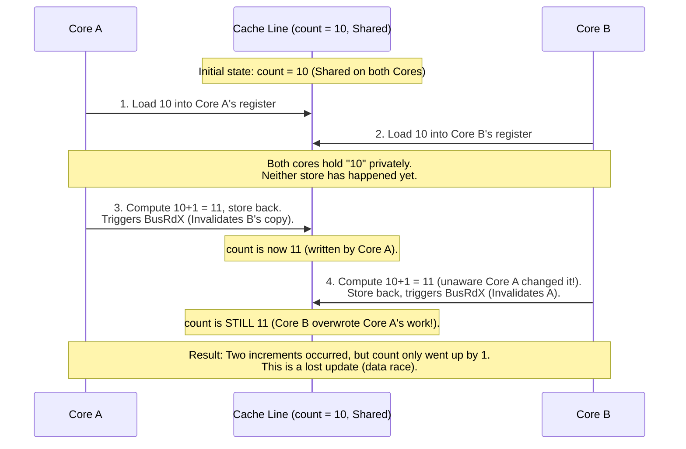
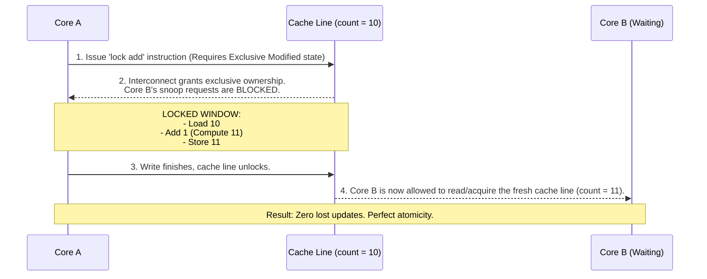

# Comprehensive Master Notes: Cache Coherency, Atomics, Store Buffers, and Race Conditions

---

## 1. The Core Misconception: What Cache Coherency Guarantees

Many developers assume that because modern CPUs have **cache coherency protocols** (like MESI) keeping all core caches synchronized, multi-threaded code is automatically safe.

**This is false.** Cache coherency is a **per-instruction, single-transaction guarantee**, not a multi-step protection mechanism.

### Single-Copy Atomicity (What Coherency *Does* Do)

For any **individual, isolated machine instruction** (such as a plain 32-bit integer load or store), cache coherency guarantees:

* **No Torn Reads/Writes:** A 4-byte integer is read or written all at once. Another core will never see a "torn" value (e.g., the upper 2 bytes from an old write and the lower 2 bytes from a new write).
* **Global Agreement:** Once a write lands in the cache line, the MESI protocol ensures that any core reading that line later will see the updated value.

**Verdict:** Individual instructions are **single-copy atomic**. But real-world programming rarely consists of isolated single instructions.

---

## 2. Where Coherency Fails: The Read-Modify-Write (RMW) Problem

Consider the simplest increment operation:

```cpp
count++; // Plain non-atomic variable

```

To the programmer, this looks like one action. To the CPU, it is a **three-step sequence**:

1. **Load:** Read the current value of `count` from cache into a CPU register (`mov`).
2. **Modify:** Add `1` to the value inside the register (`add`).
3. **Store:** Write the updated register value back out to `count` (`mov`).

### The Gap Where Races Live

Cache coherency protects **Step 1** individually and **Step 3** individually, but **it does not protect the gap between them**. Nothing in MESI prevents another core from sneaking its own read or write into that window.

### Flow Diagram: The Lost Update (Race Condition)



---

## 3. The Solution: How Atomics and Cache Coherency Team Up

To fix the RMW problem, we need to make the entire 3-step sequence **indivisible**. This is where `std::atomic` and assembly `lock` prefixes come in.

When you execute an atomic operation (such as `count.fetch_add(1, ...)`), the hardware merges **cache coherency mechanics** with a **locked transaction**:

1. **Exclusive Ownership (RFO):** The CPU issues a `BusRdX` (Read-For-Ownership) message to force the cache line into its **Modified (M)** state, immediately invalidating all other cores' copies.
2. **The `lock` Prefix:** The CPU core locks down the local cache pipeline, telling all other cores: *"Do not service any snoop requests for this cache line until my read, modification, and write are fully complete."*
3. **Atomic Completion:** The entire sequence executes as a single, unbroken block.

### Flow Diagram: The Protected Atomic RMW Transaction



---

## 4. Memory Orders and Store Buffers: Eliminating Cross-Core Handoff Races

Even with atomics, hardware store buffers can hide writes from other cores. **Memory orders** are the software-level commands that control hardware store buffers and caches to establish a strict **happens-before** relationship.

* **The Root Cause:** Data races and stale reads happen because hardware store buffers hide writes, and CPU/compiler reordering mixes up instruction sequences.
* **The Solution:**
* `std::memory_order_release` tells the writer core's **store buffer**: *"Drain and flush your pending writes right now so they become globally visible."*
* `std::memory_order_acquire` tells the reader core: *"Do not let any subsequent loads jump above this gate until you have synchronized with the writer's cache line."*


---

## 5. A Comprehensive Catalog: Every Place a Race Condition Can Occur

Race conditions and synchronization bugs manifest in several distinct ways across hardware and software boundaries. Here is every place a race condition can hide:

### 1. The Read-Modify-Write (RMW) Race (Lost Updates)

* **Where it happens:** When two or more threads concurrently perform operations like `count++`, `vec.push_back()`, or compound assignments (`x += 5`) on plain non-atomic variables.
* **The Mechanism:** The gap between the **Load**, **Modify**, and **Store** steps. Coherency ensures single instructions are safe, but allows snoop interleaving between steps.
* **The Fix:** Use `std::atomic` (e.g., `fetch_add`) or a `std::mutex`.

### 2. The Store Buffer / Stale Read Race (Publishing Failure)

* **Where it happens:** When a producer thread writes non-atomic payload data, then sets an atomic flag to `true` using `relaxed` or missing memory order, and a consumer thread checks that flag.
* **The Mechanism:** The producer's payload write is trapped inside its private **store buffer**. The consumer reads `flag == true`, but reads the payload before the store buffer has drained to cache/memory, getting stale garbage or zeros.
* **The Fix:** Use `std::memory_order_release` on the store and `std::memory_order_acquire` on the load.

### 3. The Cross-Variable Reordering Race (Divergent Timelines / IRIW)

* **Where it happens:** When multiple atomic variables (`x` and `y`) are updated across independent threads without sequential consistency.
* **The Mechanism:** CPU cores or compilers reorder independent memory operations, causing different cores to observe events in completely contradictory sequences (e.g., Core A sees `x` change before `y`, but Core B sees `y` change before `x`).
* **The Fix:** Use `std::memory_order_seq_cst` when an absolute global timeline across multiple variables is required.

### 4. The Multi-Producer Blind Spot (Broken Transitive Chains)

* **Where it happens:** When two separate producer threads write to independent variables, and a consumer thread synchronizes with only *one* producer's flag.
* **The Mechanism:** A release-acquire handoff is strictly pairwise. Synchronizing with Producer 1 guarantees visibility of Producer 1's writes, but offers **zero guarantees** about Producer 2's writes.
* **The Fix:** Form a transitive dependency chain (Producer 2 signals Producer 1, who signals the Consumer) or have the consumer acquire flags from all producers.

### 5. False Sharing (The Performance Contention "Race")

* **Where it happens:** When two threads write independently to two different variables (`a` and `b`) that happen to sit within the same **64-byte cache line**.
* **The Mechanism:** Even though there is no logical data race (they aren't touching the same variable), the hardware cache coherency protocol forces a continuous ping-pong of exclusive ownership (`BusRdX` / flush round trips). Each core constantly invalidates the other's cache line, destroying performance.
* **The Fix:** Pad data structures so that hot, concurrently written variables reside on separate 64-byte cache lines.

---

## 6. Deep Dive: Decoding Memory Orders (`relaxed`, `release`/`acquire`, `seq_cst`)

To master concurrency mechanics, we must understand how memory orders interact with hardware store buffers, propagation delays, and global timelines.

### A. Relaxed (`std::memory_order_relaxed`)

* **What it does:** Guarantees **single-copy atomicity** (no torn reads/writes for that individual variable), but provides **zero ordering or synchronization**.
* **Hardware behavior:** Compiles down to standard machine instructions (`mov`). The compiler and CPU are completely free to reorder instructions around it, and store buffers drain asynchronously whenever hardware feels like it.
* **When it fails:** Any scenario where other variables depend on the order of execution. It causes complete data chaos if used for cross-thread synchronization.

### B. Release / Acquire (`std::memory_order_release` & `std::memory_order_acquire`)

* **What it does:** Establishes a **pairwise handoff** between one writer and one reader on a specific variable.
* **The Store Buffer & Propagation Myth:**
* *Does a release store cause an instant, magical flush of the store buffer?* **No.** Propagation is asynchronous.
* What release *actually* does is enforce a structural rule: *Prior writes cannot leak past this release store.* It prevents the release flag from outrunning your payload data in the store buffer.


* **Why it fails in IRIW (Independent Reads of Independent Writes):**
* Release/acquire is strictly local and isolated to individual variables.
* If two independent threads update two different variables (`x` and `y`), an acquire load only synchronizes with a release store *if it actually reads the value written by that store*.
* It cannot prevent **divergent timelines** where Reader 1 sees $x$ before $y$, but Reader 2 sees $y$ before $x$.


### C. Sequential Consistency (`std::memory_order_seq_cst`)

* **What it does:** The strictest model. It enforces a **single, universal timeline ($S$) that every core on the chip is legally and physically forced to obey.**
* **How it solves IRIW:**
* It completely bans **store-load reordering** (TSO Rule 4).
* It uses heavy hardware primitives (`mfence` or locked instructions like `xchg`) to force store buffers to drain and synchronize globally.
* If the global timeline dictates $x$ happens before $y$, the hardware ensures that *every* core agrees on that exact sequence. Contradictory timelines are physically impossible.


---

## Summary Matrix

| Concept | What it protects | Can it prevent a race on `count++`? | Why? |
| --- | --- | --- | --- |
| **Cache Coherency (MESI)** | Single instructions (Loads/Stores) | ❌ **No** | It guarantees individual memory access consistency, but leaves the gap between Load, Modify, and Store completely unprotected. |
| **Atomics (`lock` prefix)** | Multi-step sequences (Read-Modify-Write) | ✅ **Yes** | It forces exclusive cache line ownership and stalls competing cores for the duration of the entire operation. |
| **Memory Orders (`release`/`acquire`)** | Cross-core data handoffs & store buffers | ❌ **No** (Doesn't protect RMW alone) | It aligns store buffers and establishes pairwise happens-before edges, but lacks a global timeline across multiple variables. |
| **Sequential Consistency (`seq_cst`)** | Global multi-variable ordering & timelines | ❌ **No** (Doesn't protect RMW alone) | It enforces a strict global total order across all cores, banning reordering and eliminating divergent timelines (IRIW). |
