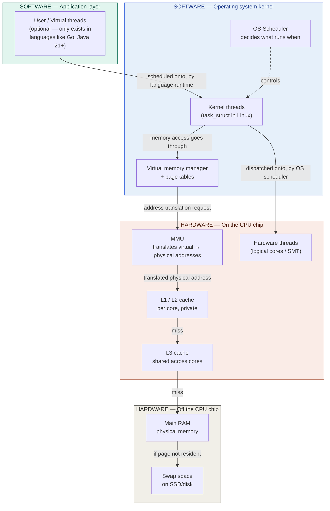
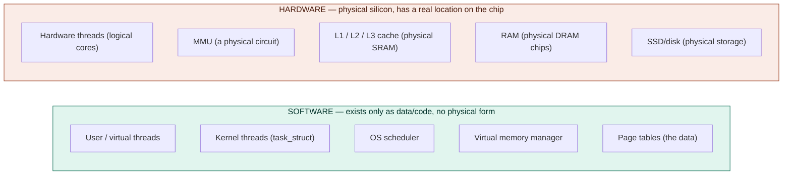
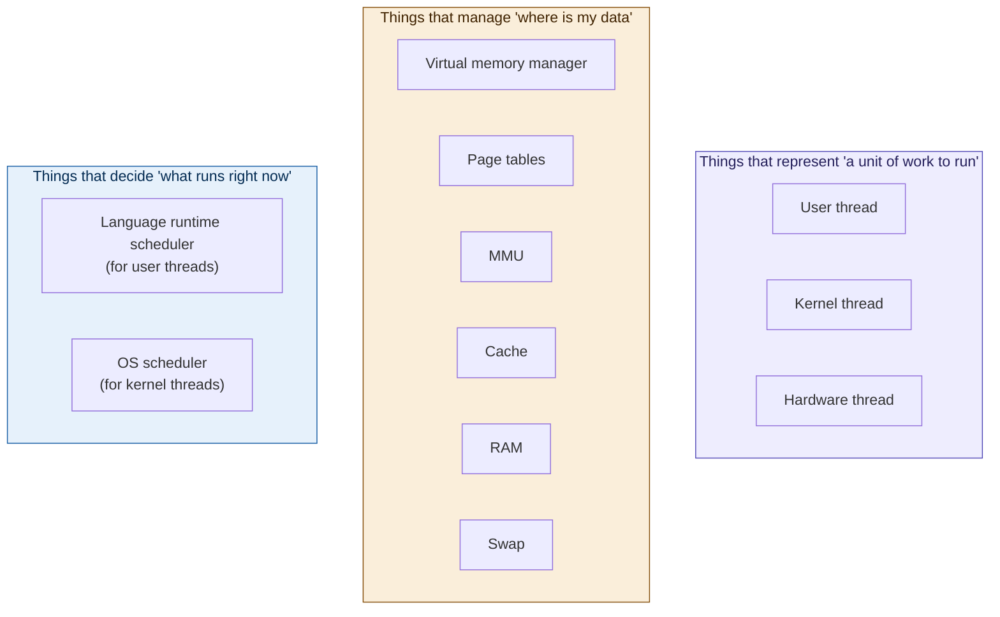

# OS & threading deep dive — Part 1: the full stack, software vs. hardware

**Series purpose:** fully demystify how user threads, kernel threads, and
hardware threads relate; how the kernel actually stores a thread; what
virtual memory and the MMU are and where they sit relative to cache and
RAM; how the OS scheduler dispatches threads onto cores; how to calculate
real thread limits; and how languages like Go/Java fake lightweight
threads on top of real OS threads.

**This part's job:** give you one map of the *entire* stack, top to
bottom, with every single layer explicitly labeled **software** or
**hardware**. Every later part will zoom into one box on this map. If you
ever get lost in a later part, come back here and find which box you're
in.

**Assumes:** nothing beyond basic familiarity with "a CPU runs code."
Builds on nothing else in this conversation — this is a fresh, self
contained anchor point.

---

## 1. Why a map first

The earlier discussion in this conversation correctly separated user
threads, kernel threads, and hardware threads — but jumped straight into
cache coherency without ever placing **virtual memory** or the **MMU**
(memory management unit) anywhere on the picture. That's the actual
source of confusion: there's a whole layer of address translation sitting
between "a thread wants some memory" and "here's the data from cache or
RAM," and nobody pointed at where it lives.

So before zooming into any one mechanism, here is the complete stack,
top to bottom, in the order a single memory access or a single thread's
existence actually passes through it.

## 2. The full stack, top to bottom

Read this diagram as the spine of the entire series. Every part from
here on is "zoom into one box, or one arrow, from this picture."

## 3. The software/hardware line, drawn explicitly

This is the single most important distinction to nail down before
anything else, because it's the thing that was implicit-but-unstated in
the earlier conversation.

A simple test you can apply to anything in this whole topic: **"if you
opened the computer with a screwdriver, could you point at it?"**

- Point at a CPU core → yes → hardware.
- Point at "kernel thread #4127" → no, it's a data structure sitting
  somewhere in RAM, written and interpreted by OS code → software.
- Point at the MMU → yes, it's a specific circuit block on the CPU die →
  hardware.
- Point at a "page table" → no, it's just data, laid out in a format the
  MMU knows how to read → software (but read by hardware — more on this
  distinction in part 3).

Some things are genuinely **both**, in the sense that software data
structures exist specifically to be consumed by a piece of hardware. Page
tables are the clearest example: the table itself is just software data
sitting in RAM, but the MMU (hardware) reads that exact data format
directly, with no OS code involved in the actual translation step. Keep
an eye out for this "software data, hardware consumer" pattern — it
shows up constantly once you start looking.

## 4. Why this map resolves the original confusion

Re-reading the earlier conversation with this map in hand:

- **"Hardware thread vs kernel thread vs user thread"** — these are
  three different boxes on three different rows of the diagram above.
  User threads are pure software (top row), kernel threads are pure
  software but live inside the OS kernel (second row), hardware threads
  are physical silicon (third row). None of them are "the same thing at
  different abstraction levels" — they're genuinely different entities
  that get mapped onto each other.
- **"Where does cache fit in, given virtual memory and the MMU exist?"**
  — the diagram shows the actual order: a kernel thread's memory access
  goes through the virtual memory manager, gets translated by the MMU
  (hardware), and only *after* translation does the resulting physical
  address get looked up in cache, then RAM, then swap if needed. Cache
  was never in competition with virtual memory — it sits **after** the
  MMU in the pipeline, operating purely on physical addresses. This
  exact pipeline is the entire subject of part 4.

## 5. A second view — grouped by "what is this thing, conceptually"

The top-to-bottom diagram shows physical/logical position. It's also
useful to group the same pieces by *role*, since that's often a more
intuitive way to remember what each thing is for:

This grouping previews the rest of the series:
- Parts 2 and 5 dig into the **Identity** and **Control** groups —
  what a kernel thread literally is, and how the scheduler dispatches
  it.
- Parts 3 and 4 dig into the **Memory** group — virtual memory, the
  MMU, page tables, and exactly where cache, RAM, and swap each sit in
  that pipeline.
- Part 6 uses the Memory group's numbers to calculate real thread
  limits.
- Part 7 closes the loop by explaining how the Identity group's "user
  thread" box gets handed over to a "kernel thread" box at the language
  runtime level.

## 6. Glossary so far

| Term | Software or hardware? | Plain-English meaning |
|---|---|---|
| User thread / virtual thread | Software | An application-level unit of concurrency, scheduled entirely by a language runtime, unknown to the OS |
| Kernel thread | Software | An OS-level data structure (e.g. Linux's `task_struct`) representing a schedulable unit of work; the OS's actual scheduling unit |
| Hardware thread | Hardware | A physical, duplicated set of registers on a CPU core that can independently execute instructions |
| OS scheduler | Software | The kernel code that decides which kernel thread runs on which hardware thread, and for how long |
| Virtual memory manager | Software | The OS subsystem that gives each process its own private view of memory ("virtual addresses") |
| Page table | Software (data), read by hardware | The data structure mapping virtual addresses to physical addresses, consumed directly by the MMU |
| MMU (Memory Management Unit) | Hardware | A physical circuit on the CPU that translates virtual addresses to physical addresses using the page tables |
| Cache (L1/L2/L3) | Hardware | Physical fast memory on/near the CPU, operating on physical addresses, sitting after the MMU in the access path |
| RAM | Hardware | Physical main memory, off-chip |
| Swap | Hardware (storage) + software (the OS logic deciding what to swap) | Disk/SSD space used as overflow when RAM is full |

## 7. What's next

**Part 2** zooms into the top software box on the "Identity" list: what a
kernel thread actually *is* as a data structure, exactly which fields it
contains, where in memory that data structure physically lives, and how
it moves through its run/block/runnable lifecycle. This sets up the
question "how many of these can I create" that part 6 will answer with
real numbers.
