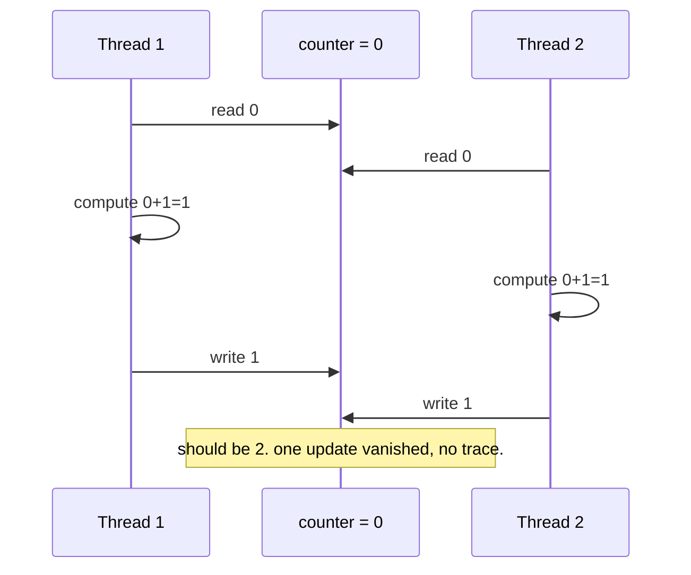

# Part 1 Notes — TAS Spinlock: The API Gateway Request Counter

## The Scenario

An API gateway tracks `active_requests` in a shared counter — incremented on
request-in, decremented on request-out. This number feeds two things
directly: **rate-limiting** decisions and **billing**.

**The incident:** under real concurrent load, billed concurrency numbers
don't reconcile with the load balancer's own logs — always *lower* than they
should be. No crash. No exception. No alert. Just numbers quietly wrong.

---

## The Core Bug (Part 0)

`active_requests++` looks like one line, but it's three separate memory
operations:

```
load counter into register
add 1 to register
store register back to counter
```

Any other thread can interleave *between* those steps and act on stale data.

**Lost-update trace, two threads, counter starts at 0:**



**The property that actually fixes it — and the key distinction:**
- **Visibility** (always see the freshest value) — necessary, not sufficient.
- **Atomicity** (the whole read-modify-write happens as one indivisible
  step nobody can interleave inside of) — this is the one that actually
  closes the bug.

Both guarantees matter, but this specific bug needed atomicity specifically.
(Visibility vs. atomicity comes back later — seqlocks live and die on this
exact distinction.)

**Hardware mechanism:** the `LOCK`-prefixed atomic RMW instruction doesn't
freeze the whole machine — it asserts **exclusive ownership of one cache
line** via the cache-coherence protocol. Everything else in memory stays
free for other cores to use. (This detail becomes the whole plot of Part 2.)

---

## Building `s_lock` — the real derivation, bugs included

**Attempt 1 — broken:**
```cpp
bool expected = lck.load();
while (!lck.compare_exchange_weak(expected, true)) { }
```
**Bug:** if the lock is already held (`lck == true`), `expected` is loaded
as `true`, which *matches* the atomic's actual value — so the CAS
"succeeds," and a second thread believes it holds the lock too. Two threads,
one critical section.

**Attempt 2 — closer, still broken:**
```cpp
bool expected = false;
while (!lck.compare_exchange_weak(expected, true)) {
    expected = false;   // must reset every retry
}
```
Correct in principle, but reveals the real issue: on every failed CAS,
`expected` gets overwritten with the atomic's real value — you must reset it
every iteration or you're back to attempt 1's bug. This is a sign CAS is the
wrong tool here: **we never compute a new value based on the old one** — we
always want to unconditionally write `true`. CAS's whole design point (retry
with updated info after a failed conditional swap) doesn't apply.

**The right primitive — `exchange`:** unconditional swap, returns the old
value, no `expected` variable needed at all.

**Attempt 3 — `exchange`, but no loop (broken):**
```cpp
bool lock() { return !lck.exchange(true); }
```
Runs once and returns immediately regardless of outcome — violates the
entire contract of a lock: *`lock()` must not return until the lock is
acquired.* Waiting is the lock's job, not the caller's.

**Final, correct `s_lock`:**
```cpp
class s_lock {
    std::atomic<bool> lck{false};
public:
    void lock() {
        while (lck.exchange(true, std::memory_order_acquire)) { }
    }
    bool unlock() {
        return lck.exchange(false, std::memory_order_release);
    }
};
```
- `lock()`: loop on `exchange(true)` — old value `true` means still
  contended, keep spinning; old value `false` means we just claimed it.
- `unlock()`: single unconditional `exchange(false)`, **no loop** — unlike
  `lock()`, this operation can never "fail" to do its job, so nothing to
  retry. The returned bool is only useful as a debug/assert hook (did I
  just unlock something that was actually locked?) — it can't let the
  caller *fix* anything, since a double-unlock mistake already happened
  upstream by the time this runs.

**Known, permanent limitation — not a bug we patch here:** nothing tracks
*which thread* holds the lock. Thread B can call `unlock()` on a lock it
never acquired, and the raw `bool` has no way to detect or prevent that.
This is true of `std::mutex` too (unlocking from a non-owning thread is UB
by the C++ standard) — the real-world fix is structural, not internal to
the lock: RAII wrappers (`std::lock_guard`-style) that scope `lock()`/
`unlock()` to a block so there's no manual call site to get wrong. Building
our own generic version of that comes once the library has more than one
lock type.

---

## Verifying Correctness — the oracle, and a real false negative

**The oracle:** N threads × K increments each on a **plain, non-atomic**
shared counter (not `std::atomic<int>` — that would protect itself
independently of whatever lock is under test, making the test unable to
ever fail). Expected result: exactly `N × K`.

**Two-part test:**
1. **Positive:** plain `int`, guarded by `s_lock` → must equal `N×K` every run.
2. **Negative/control:** same plain `int`, *no* locking at all → should show
   lost updates. This half is what proves the test could have failed and
   didn't — without it, a passing positive test proves nothing.

**The false negative we actually hit:** at `-O2`, the negative/control test
came back `4,000,000` — no lost updates — even with zero locking. Not
because the race doesn't exist, but because:
- Unsynchronized concurrent access to a non-atomic variable is **undefined
  behavior** in C++, so the compiler is legally free to assume no other
  thread touches it — and it collapsed the entire million-iteration loop
  into a single `addq $1000000, (%rax)` instruction (confirmed by reading
  the generated assembly).
- Combined with a **1-core sandbox** (instructions aren't preemptible
  mid-execution), 4 total memory touches instead of 4,000,000 made the race
  window close to zero.

**At `-O0`** (loop can't be collapsed), the same negative test reliably lost
25–75% of updates, non-deterministically, run to run — real proof of the
race, and real proof `s_lock` (which held at exactly `4,000,000` on every
run, both `-O0` and `-O2`) is what's actually doing the protecting.

**Permanent lesson:** *"the test passed" is not the same claim as "the bug
doesn't exist."* A correctness harness for concurrency code needs to
actively defend against being accidentally optimized (or under-scheduled)
into a false sense of safety.

---

## Benchmarking the Cost

**Two independent measurements, same conclusion:**

**1. Instrumented from inside the lock** — per-thread wall-clock time spent
inside `lock()` (spinning) vs. time spent actually holding it:
```
waste % = time_spent_in_lock() / (time_spent_in_lock() + time_doing_work)
```
Result under contention (4 threads, 1M iterations each): **~73–75% of every
thread's time was spent spinning, not working** — evenly across all four
threads, despite TAS giving no fairness guarantee at all.

*Caveat noted:* this is **wall-clock** time. On a preemptible scheduler, a
"spinning" thread can also be parked doing nothing for part of that window —
so this number is real *latency*, but not purely *CPU cycles burned*.

**2. From outside the program** — `real` vs `user` vs `sys` time
(`time ./binary`):
```
real   0m0.162s
user   0m0.161s
sys    0m0.000s
```
`real ≈ user`, `sys = 0` → the CPU was continuously busy the *entire*
wall-clock duration, and none of it was kernel time (no syscalls, no
blocking/sleeping). That's the hard proof of pure user-space spinning.

**Why this pairing matters going forward:** this exact real/user/sys
signature is what will look completely different once we reach Part 5's
futex-based mutex — `sys` time will appear (syscall cost of sleep/wake),
and under long critical sections `real` can exceed `user` because threads
are genuinely idle rather than burning cycles. Same three numbers, opposite
story — and now there's a way to read both.

---

## Part 1 Close — the four questions

- **What broke:** `active_requests++` under concurrency — silent lost
  updates; wrong billing and rate-limiting numbers, no crash, no alert.
- **What fixed it:** TAS spinlock — one atomic `exchange` in a loop,
  correctness proven with a real oracle (including a genuine false-negative
  caught and explained, not just asserted away).
- **What it costs:** ~74% of thread CPU time spent spinning under
  contention, confirmed two independent ways (internal timing instrumentation,
  and external `real`/`user`/`sys` accounting).
- **Who uses it:** almost nobody as-is in production — it's the baseline
  every real spinlock (starting with TTAS, next) gets measured against.

---

## Bridge to Part 2

Production symptom that motivates the next step: on real multi-core
hardware, the flash-sale service reusing `s_lock` doesn't just burn CPU —
it saturates the **cache-coherence bus**, because every *failed* `exchange`
attempt is still an atomic **write** to the shared cache line, forcing
every other spinning core to invalidate and refetch it — even though only
one core can ever actually win. TTAS's fix: spin on a cheap **read** first,
only attempt the expensive atomic write once the lock looks free.
