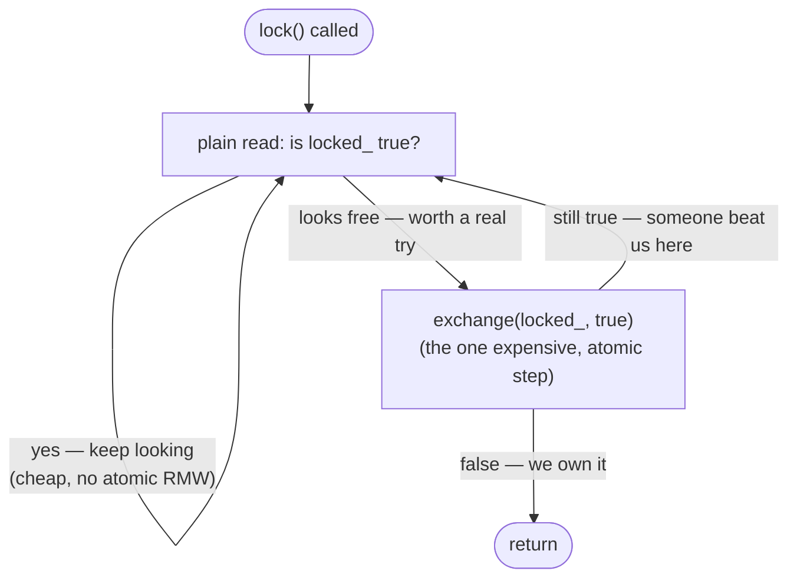
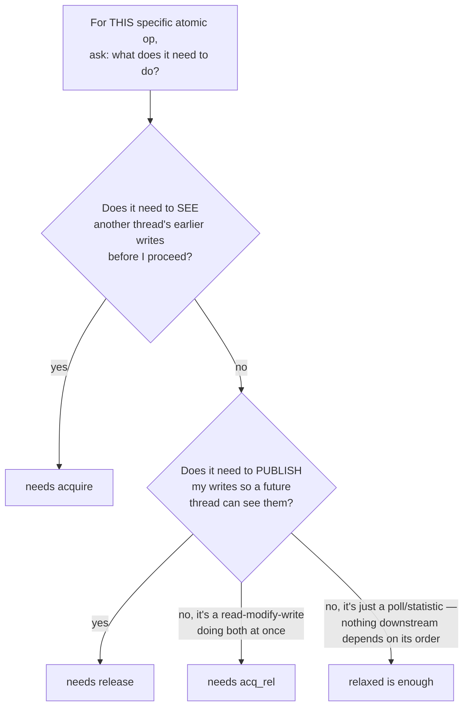

# Step 3 — Complete Notes: TTAS, Memory Ordering, and Real Multi-Core Validation

This is the full, consolidated record of Step 3 — the lock itself, the memory-ordering
reasoning that came out of reviewing a hand-written variant, and the real multi-core
benchmark data that completed the picture the sandbox couldn't finish on its own.

---

## 3.1 The problem, restated

Step 2 pinned TAS's flaw down to one line of assembly: `xchgb (%rdi), %al` runs on
*every* iteration of the spin loop, success or failure. A locked instruction costs more
to execute than a plain read, and — on real multi-core hardware — every failed exchange
broadcasts a cache-line invalidation to every other core holding a copy of that line,
whether or not it actually changes anything. **We're paying the most expensive possible
instruction just to ask a question a much cheaper instruction could answer almost as
well.**

## 3.2 Intuition

Picture a door with an occupied/vacant sign. TAS's rule: *walk up and flip the sign
every single time, even just to check it.* TTAS's rule: *look at the sign from where
you're standing first. Only walk up and attempt the flip when it looks like it might be
free.* Looking costs nothing extra; only the flip has to be atomic and exclusive, so do
it as rarely as possible.



## 3.3 Building it — including the bug that came up building it by hand

The correct version:

```cpp
class TTASSpinLock {
private:
    std::atomic<bool> locked_{false};
public:
    void lock() {
        while (true) {
            while (locked_.load(std::memory_order_relaxed)) { }        // cheap poll
            if (!locked_.exchange(true, std::memory_order_acquire)) {  // the real attempt
                return;
            }
            // lost the race — loop back to the cheap poll, don't hammer exchange
        }
    }
    void unlock() {
        locked_.store(false, std::memory_order_release);               // plain, cheap
    }
};
```

**A real bug found while building this by hand:** an early version was missing the
outer `while (true)`:

```cpp
void lock() {
    while (ready_.load(std::memory_order_relaxed)) { }
    if (!ready_.exchange(true, std::memory_order_acquire)) {
        return;
    }
    // <-- falls off the end here if the exchange returned true!
}
```

If the exchange returns `true` (someone else got there first), the function doesn't
retry — it just **returns anyway**, and the caller believes it holds a lock it never
actually acquired. This is exactly the kind of bug that can look fine in a light
correctness test and fail silently under real contention. Lesson: every `lock()`
implementation needs an explicit retry path for the losing case, not just a happy path
for the winning one.

**A real inefficiency, also found and verified, not just asserted:** an early version
used `exchange` in `unlock()` instead of `store`, even though the return value was never
used:

```cpp
bool unlock() { return ready_.exchange(false, std::memory_order_release); }
```

Compiled and compared directly:

```asm
; exchange(false, release):
xorl   %eax, %eax
xchgb  ready(%rip), %al      ; still a locked, atomic instruction

; store(false, release):
movb   $0, ready(%rip)       ; plain store, no lock at all
```

`exchange` forces a locked instruction to obtain information nobody asked for. `store`
gets the identical release guarantee for a plain `mov` — release stores are free on x86
because ordinary store semantics on x86 already satisfy everything `release` requires.
**Rule: if you don't use an RMW's return value, you're paying for a guarantee you don't
need — use the plain operation instead.**

## 3.4 Proof of the core claim, from real compiled instructions

```asm
; TAS -- every iteration, success or fail:
.L2:
    xchgb  (%rdi), %al
    testb  %al, %al
    jne    .L2

; TTAS -- the fast path is a plain read; xchgb only attempted once per real chance:
.L6:
    movzbl (%rdi), %eax      ; plain read, no lock prefix at all
    testb  %al, %al
    jne    .L6
    xchgb  (%rdi), %al       ; only reached when the read suggested "maybe free"
    testb  %al, %al
    jne    .L6
```

Not a hypothetical difference — the literal instruction sequence the compiler emitted.

## 3.5 Correctness

Same corruption-detecting benchmark (a non-atomic counter inside the critical section)
used for every lock in this library. `TTASSpinlock` reported a perfect count, and —
checked by isolating ThreadSanitizer's warning output specifically — **contributed zero
warnings**, the same clean result as `TASSpinlock`. Both locks are correct; everything
from here on is entirely about *cost*, not correctness.

---

## 3.6 Benchmark — on the 1-core sandbox

| Threads | TAS (ops/sec) | TTAS (ops/sec) | `std::mutex` (ops/sec) |
|---|---|---|---|
| 1 (uncontended) | 110,142,906 | 111,867,735 | 50,495,329 |
| 4 | **70,105,193** | 48,495,957 | 50,178,189 |
| 16 | 24,489,486 | **90,394,173** | 49,930,148 |
| 32 | 11,020,444 | **84,243,457** | 47,877,794 |

On one physical core, TAS actually *wins* at 4 threads, and only falls behind once
thread count climbs well past what the core can run at once. The reason: with only one
core, there's no real cross-core cache-line bouncing happening at all — the entire
observed effect here is that a locked instruction costs more to *execute*, full stop,
independent of contention, so more threads spinning via locked exchanges burns CPU that
the actual lock-holder needed, the exact livelock-adjacent mechanism already proven in
the concurrency course's Peterson's-algorithm chapter. **This sandbox structurally could
not demonstrate TTAS's real-world advantage at low thread counts**, because that
advantage depends on genuine cross-core cache coherence traffic — a mechanism a single
core cannot produce.

## 3.7 Benchmark — on real multi-core hardware (4 cores / 8 threads via SMT)

Real numbers, supplied from an actual 4-core/8-thread machine:

| Threads | TAS (M ops/sec) | TTAS (M ops/sec) | TTAS/TAS ratio |
|---|---|---|---|
| 4 | 5.10 | 6.58 | **1.29x** |
| 8 | 3.82 | 5.42 | **1.42x** |
| 24 | 1.77 | 3.12 | **1.76x** |

This is the clean, textbook result the sandbox couldn't produce: **the TTAS advantage
grows monotonically with contention**, because now every failed `xchg` really is
broadcasting a cache-line invalidation to physically separate cores (the mechanism
described in 3.1, now genuinely active) — TAS's waiters force that broadcast on every
failed attempt; TTAS's waiters mostly just read their own locally-cached, Shared copy of
the line and generate zero bus traffic until they think it's actually worth trying.

**Why *both* locks get slower as thread count climbs — expected, not a flaw.** The
critical section here is trivial (one increment), so every thread is fighting over one
single cache line (the lock variable itself), and that line has to physically travel to
whichever core is granted it next on every handoff, regardless of which lock is used.
Total throughput on a lock this contended is bounded by coherence traffic on that one
line, not by core count. Two specific step-points explain the shape:

- **4 → 8 threads**: this crosses from "one thread per physical core" into "two threads
  per core via hyperthreading." SMT siblings share a core's execution ports and L1/L2 —
  they're not independent contenders anymore, they're partially competing with *each
  other* just to get instructions issued, stacked on top of the lock contention itself.
- **8 → 24 threads**: now 3x oversubscribed even past the hyperthread count, so the OS
  scheduler is doing real preemption on top of everything else — the same mechanism as
  Peterson's-algorithm livelock, now stacked on top of genuine multi-core cache
  contention rather than substituting for it.

**A remaining cost even TTAS has, worth flagging as the reason Step 5 exists:** when the
holder calls `unlock()`, *every* waiter's cached copy of the line gets invalidated at
once (they were all sharing it Shared), so they all wake and re-read simultaneously, and
all but one immediately fail the follow-up `exchange` and go back to spinning. Much
cheaper than TAS's constant hammering, but not zero, and it grows with the number of
waiters — this "thundering herd" is exactly what the MCS lock (Step 5) fixes by giving
each waiting thread its own private memory location to spin on instead of one shared
line everyone contends for.

---

## 3.8 Deep dive: how to choose acquire / release / relaxed / seq_cst

This came up directly while reviewing the lock code above, and is worth having as a
standalone reference — it applies to every lock built from here on, not just TTAS.

### The general decision framework

Ask this question of **every individual atomic operation**, one at a time — not once
per lock as a global choice:



### Applied to any lock, specifically

Only two operations ever matter, and they're always the same two:
- **The op that hands the lock away (`unlock`)** must be **release** — publishes
  everything the critical section did, non-negotiable.
- **The op that successfully claims the lock** must be **acquire** — must see
  everything the previous holder published, non-negotiable.
- Anything that's just *bystander polling* — checking "does this look free yet?"
  without claiming anything — can be `relaxed`, because it gets re-verified by a real
  acquire operation before it's ever trusted.

### Why not `acq_rel` on the RMW, since it's technically both a read and a write?

Verified directly: on x86, `exchange` with `acquire`, `release`, `acq_rel`, and even
`relaxed` all compile to **byte-for-byte identical instructions** — `xchg` with a
memory operand is always a full hardware fence on x86, regardless of the requested
order. So on this specific hardware, asking for `acq_rel` costs literally nothing extra.

That's still the wrong reason to use it. The memory order is a **statement of what the
operation actually needs**, not a performance knob:
- `lock()`'s winning exchange needs to *see* the previous holder's writes (acquire). It
  does not need to *publish* anything — at that point in the code, this thread hasn't
  written anything in the critical section yet, so there's nothing for a future acquirer
  to receive through this specific write.
- `unlock()`'s store needs to *publish* the critical section's writes (release). It does
  not need to *see* anything incoming — there's nothing to receive at the moment of
  handing the lock away.

`acq_rel` says "this one operation is simultaneously receiving a hand-off **and**
producing one." That's real and necessary for something like a reference-count
decrement (acquire specifically on the decrement that hits zero, release on every
decrement) — just not here, where receiving and producing happen at two *different*
operations. Writing `acq_rel` anyway would misdescribe the code, and — critically — on
ARM this is not free: `acquire` compiles to `ldar`, `release` to `stlr`, genuinely
cheaper than the bidirectional fence `acq_rel` requires. The x86-freeness observed here
is a property of this one architecture, not a language guarantee.

### When `seq_cst` is actually necessary

Acquire/release only guarantee ordering **pairwise, about one specific atomic
variable** — whoever released it and whoever later acquires that *same* variable agree
on what came before. The moment correctness depends on the **relative order of
operations on two or more different atomics**, acquire/release stops being sufficient.

The exact shape that breaks it: a **store followed by a load to a different address**,
in the same thread, on both sides — the Store-Buffering (SB) litmus test from the
concurrency course:

```cpp
// Thread 1                    // Thread 2
x.store(1, order);             y.store(1, order);
r1 = y.load(order);            r2 = x.load(order);
```

Release only constrains what comes *before* it; acquire only constrains what comes
*after* it — neither says anything about the relationship between a store and a
*different* variable's load that follows it in the same thread. That's precisely x86
TSO's one permitted reordering (a store can be reordered with a later load to a
different address) — release costs nothing on x86 exactly *because* it doesn't forbid
that reordering. Only `seq_cst` (via the extra `xchg`/`mfence` already measured earlier
in this course) forbids it, because only `seq_cst` promises one single global order
across every thread's operations on every atomic.

Peterson's algorithm (concurrency course, Chapter 7) needed exactly this: `wants[me] =
true; turn = other;` (store, store) followed by `read wants[other]; read turn;` — a
store-then-load-to-a-different-variable pattern on both sides, the SB shape again. Built
with `release`/`acquire` instead of `seq_cst`, the algorithm's mutual-exclusion proof
would no longer hold on real hardware — two threads really could both enter the
critical section.

**The practical rule:** if your correctness argument only ever talks about *one* atomic
variable, with one clear releaser and one clear acquirer of that same variable,
release/acquire is enough (this covers every lock in this library). The moment your
reasoning needs "this *other* variable also has to have been written/read
before/after, from a third thread's point of view" — that's the signal you need
`seq_cst`.

---

## 3.9 A live experiment: deliberately breaking `release` on `unlock()`

Worth recording in full, because it's the single best proof in this whole step that
"my test passed" and "my code is correct" are different claims.

**The experiment:** change `unlock()` from `memory_order_release` to
`memory_order_relaxed`, on purpose, expecting the benchmark to reveal a race:

```cpp
void unlock() {
    ready_.store(false, std::memory_order_relaxed);  // deliberately wrong
}
```

**The result:** no visible change at all. Same correct counts, same throughput, at 4
and 8 threads. The instinct that this *should* break something was completely correct —
it's still genuinely undefined behavior per the C++ standard — but it never showed up.
Two separate, independent reasons, both worth understanding precisely.

### Reason 1: on x86-64, `relaxed` and `release` compile to the identical instruction

Verified directly, the same way every claim in this course gets verified:

```asm
; store(false, release):
movb   $0, ready(%rip)

; store(false, relaxed):
movb   $0, ready(%rip)     ; byte-identical
```

This isn't specific to this one line of code — it's a direct consequence of x86 TSO's
rules from earlier in the course: **stores are never reordered with stores, and loads
are never reordered with loads, unconditionally, regardless of what C++ memory order
you ask for.** A plain store only ever needs to forbid exactly those reorderings to
satisfy `release`, and x86 hardware already forbids them for free, for every store, with
no label required. The `release` keyword was already costing nothing (established back
in Step 2); removing it costs nothing to remove, for the identical reason.

**This does not extend past rule 4 of TSO.** x86 explicitly still permits a store to be
reordered with a *later load to a different address* — which is exactly why `seq_cst`
still required a genuine extra instruction (`xchg`/`mfence`) even on this same hardware,
covered in 3.8. "Free on x86" describes rules 1–3 specifically; it is not a blanket
statement that memory ordering stops mattering on this architecture.

### Reason 2: this specific benchmark can't detect this specific bug, on any hardware

This is the deeper point, and it would hold even on hardware where Reason 1 didn't
apply. Separate what `release` on `unlock()` actually protects from what mutual
exclusion depends on:

- **Mutual exclusion** ("only one thread is ever between `lock()` and `unlock()` at a
  time") is guaranteed entirely by the atomicity of the `exchange` in `lock()`. Every
  memory order tested for `exchange` compiles to the same `xchg`, unconditionally a
  full atomic hardware operation — so mutual exclusion holds **regardless of what order
  `unlock()`'s store uses.** That guarantee was never `release`'s job.
- **What `release` actually protects** is narrower: it guarantees the critical
  section's writes are correctly ordered and visible to the *next* acquirer. A
  visibility guarantee, not a mutual-exclusion guarantee.

The benchmark's correctness check is "does the final count match the expected total" —
a check that only fails from a **lost update**, i.e. real overlap between two threads.
But overlap can't happen here regardless of `unlock()`'s memory order, because mutual
exclusion is untouched by that choice. **There was never a lost-update failure mode for
the relaxed change to trigger — the guarantee that got removed was never the one this
test was measuring.**

### Why ThreadSanitizer still correctly flagged it

Running the exact same relaxed-unlock code under `-fsanitize=thread` **does** catch a
real data race, despite the identical instructions and the identical benchmark numbers.
Three reasons this is the right call, not a false positive:

1. **TSan checks the C++ abstract machine's rules, not this one compiler-and-CPU
   combination's accidental behavior.** The standard says `relaxed` establishes no
   ordering guarantee, full stop, on any platform. That x86 happens to be strong enough
   to make the violation unobservable today doesn't change the actual language
   contract — TSan enforces that contract, correctly.
2. **Hardware reordering and compiler reordering are separate axes.** x86 TSO governs
   what the CPU can do with instructions once emitted; `relaxed` separately removes the
   *compiler's* obligation to keep this atomic access in program order relative to
   everything else. This particular simple benchmark didn't happen to give the compiler
   a reason to exploit that freedom — a fact about this one build, not a guarantee about
   any build, exactly the shape of Chapter 2's `compiler_hazard.cpp` result (identical
   source, hung forever at `-O2`, fine at `-O0`, purely because the optimizer was
   licensed to do something it hadn't previously bothered doing).
3. **It's genuinely narrower than "x86 makes ordering not matter" — see the SB litmus
   test boundary above.** Nothing about this result implies memory ordering is safe to
   ignore in general on this hardware.

### How to actually make the bug observable

Two options, in order of rigor:

1. **Trust TSan over the numbers** — already done above, and it already caught it.
2. **Redesign the test to depend on visibility, not just lost updates.** A pure counter
   increment can never expose a visibility bug, since addition doesn't care *when* it
   becomes visible, only that it isn't lost. Writing a distinctive, multi-field value
   inside the critical section and having the next thread verify it reads the fields
   *consistently* would be sensitive to the actual failure mode `release` protects
   against — though even this redesigned test might still pass on x86 specifically, for
   Reason 1 above, and would need genuinely weaker hardware (or a more aggressive
   compiler) to have a real chance of failing numerically.

### The rule to keep

The correct order remains `release`/`acquire` regardless of this result, for three
concrete reasons: **portability** (this x86 equivalence does not hold on ARM, where
`release` compiles to a real `stlr` instruction that `relaxed` never gets — verified
difference, not a hypothetical one, back in Chapter 6's cross-architecture table),
**future-proofing** (a different compiler, optimization level, or LTO pass could
exploit the freedom `relaxed` grants while remaining fully standards-compliant), and
**honesty of intent** (the next person reading `relaxed` on an unlock has every right
to assume it means what it says). A benchmark that stayed green through a genuine
correctness violation isn't proof the violation is safe — it's proof this particular
benchmark wasn't the right tool to catch it, exactly the lesson that opened Step 1.

---

## 3.10 Pros, cons, and where TTAS belongs

| | |
|---|---|
| **Pros** | Same simplicity and low latency as TAS when truly free; dramatically better under real contention — confirmed now on both a 1-core sandbox (via reduced per-instruction cost) and real 4c/8t hardware (via reduced cache-coherence traffic), with the real-hardware advantage growing from 1.29x to 1.76x as contention increases |
| **Cons** | Still no fairness — a thread can theoretically be starved forever; still wastes CPU while waiting, just cheaper waiting; still generates a "thundering herd" of simultaneous re-checks on every unlock, growing with waiter count |
| **Where it's genuinely used** | The standard building block for real spinlocks in production systems; short critical sections under light-to-moderate contention where threads won't wait long |
| **Where it's still a mistake** | Long critical sections; workloads where fairness matters; very high core counts, where even the thundering-herd re-check cost becomes significant — exactly the problem Step 5 (MCS lock) solves |

---

## 3.10 Checkpoint

1. Explain precisely why `unlock()` should use `store` and not `exchange` when the
   return value is discarded — and why this happened to cost nothing conceptually
   important but did cost something real in the compiled instructions.
2. Walk through the missing-retry-loop bug from memory: what does the caller believe
   after `lock()` returns in the broken version, and why is that dangerous?
3. Why do `acquire`, `release`, and `acq_rel` all compile identically for `exchange` on
   x86, and why is that still not a good reason to default to `acq_rel` everywhere?
4. Using your own real benchmark numbers: explain, in one sentence each, why throughput
   drops between 4→8 threads and why it drops again between 8→24 threads — they are not
   the same mechanism.
5. State the SB litmus test pattern from memory, and explain why it's exactly the shape
   that forces `seq_cst` instead of `release`/`acquire`.

---

## What's next — Step 4

Neither TAS nor TTAS makes any fairness promise. Step 4 builds the **ticket lock** —
the deli-counter take-a-number pattern — which fixes this with two counters and a
guarantee: whoever arrived first is served first, no exceptions.
